# 医学监查子系统说明书

**文档性质：** 产品、医学规则、工作流与工程实施规范  
**适用系统：** 人工智能（Artificial Intelligence，AI）全流程医学经理工作台  
**文档版本：** V1.1  
**编制日期：** 2026年7月28日  
**适用读者：** 医学监察员、医学经理、医学总监、临床运营、数据管理、药物警戒（Pharmacovigilance，PV）、统计编程、产品经理、架构师、前端开发、后端开发、测试工程师、计算机化系统验证及项目管理人员

> 本说明书描述医学监查子系统的目标能力、科学判断框架、运行流程、数据模型、接口约定、前端交互和实施规范。人工智能（Artificial Intelligence，AI）产生的是待医学复核的风险提示、证据摘要和处置建议，不替代医学判断，不自动形成不良事件（Adverse Event，AE）、病史（Medical History，MH）、方案偏离（Protocol Deviation，PD）或监管结论。所有阈值和时间容差均须区分方案明确要求、项目批准参数和说明性示例，不得把某一项目的数值直接用于其他项目。

---

## 目录

1. [编制说明与文档控制](#1-编制说明与文档控制)
2. [术语、缩略语与使用规范](#2-术语缩略语与使用规范)
3. [系统定位、目标与适用范围](#3-系统定位目标与适用范围)
4. [法规、指南与科学原则](#4-法规指南与科学原则)
5. [角色、职责与治理边界](#5-角色职责与治理边界)
6. [总体业务架构与核心数据](#6-总体业务架构与核心数据)
7. [数据输入、项目配置与内容校验](#7-数据输入项目配置与内容校验)
8. [方案解构与规则配置](#8-方案解构与规则配置)
9. [日常医学监查全流程](#9-日常医学监查全流程)
10. [增量更新与差异分析机制](#10-增量更新与差异分析机制)
11. [锁库前整体医学监查](#11-锁库前整体医学监查)
12. [核查前总结性风险预警](#12-核查前总结性风险预警)
13. [统一医学风险分级与处置](#13-统一医学风险分级与处置)
14. [AE/MH 漏报与检验检查风险规则](#14-aemh-漏报与检验检查风险规则)
15. [试验药物变更、剂量调整与依从性规则](#15-试验药物变更剂量调整与依从性规则)
16. [合并用药、禁限用药与洗脱规则](#16-合并用药禁限用药与洗脱规则)
17. [访视、时间窗与方案执行规则](#17-访视时间窗与方案执行规则)
18. [入排与持续合格性规则](#18-入排与持续合格性规则)
19. [AE/SAE/AESI 记录一致性与安全性规则](#19-aesaesaesi-记录一致性与安全性规则)
20. [疗效、量表与关键终点规则](#20-疗效量表与关键终点规则)
21. [数据质量与跨表逻辑规则](#21-数据质量与跨表逻辑规则)
22. [受试者时间线（Subject Timeline）](#22-受试者时间线subject-timeline)
23. [患者概览（Patient Profile）](#23-患者概览patient-profile)
24. [项目医学风险清单与三级汇总](#24-项目医学风险清单与三级汇总)
25. [来源证据、可解释性与版本追溯](#25-来源证据可解释性与版本追溯)
26. [AI 交互、医学审阅与处置](#26-ai-交互医学审阅与处置)
27. [前端信息架构与关键交互](#27-前端信息架构与关键交互)
28. [后端服务、数据模型与接口](#28-后端服务数据模型与接口)
29. [权限、审计、部署与性能](#29-权限审计部署与性能)
30. [测试、验证与项目验收](#30-测试验证与项目验收)
31. [运行维护、规则变更与持续改进](#31-运行维护规则变更与持续改进)
32. [综合案例](#32-综合案例)
33. [附录A：风险规则模板](#33-附录a风险规则模板)
34. [附录B：状态流转与最小审计信息](#34-附录b状态流转与最小审计信息)
35. [附录C：缩略语表](#35-附录c缩略语表)
36. [附录D：验收清单](#36-附录d验收清单)
37. [附录E：数据域字段字典](#37-附录e数据域字段字典)
38. [当前实现真值与剩余缺口](#38-当前实现真值与剩余缺口)
39. [总系统集成与并行开发契约](#39-总系统集成与并行开发契约)
40. [生产发布门与需求追溯](#40-生产发布门与需求追溯)
41. [参考资料](#41-参考资料)

---

## 1. 编制说明与文档控制

### 1.1 编制目的

医学监查的本质，是在持续变化的临床试验数据中识别可能影响受试者权益与安全、试验方案遵循和研究结果可靠性的医学问题，确保问题在数据库锁定（Database Lock，DBL）或监管核查前获得解释、纠正并留痕。本说明书把这一工作拆解为可执行、可配置、可审计的业务流程和系统规则，作为产品设计、研发、验证、上线及持续改进的共同依据。

### 1.2 文档边界

本说明书不是软件安装手册，也不是某一具体研究的风险报告。项目方案、数据采集设计、医学监查计划（Medical Monitoring Plan，MMP）、方案偏离管理计划、安全性管理计划及适用法规仍是具体项目的直接依据。系统必须根据当前有效版本进行配置。示例阈值和既往项目经验均不得直接作为其他项目的医学判断标准。

### 1.3 内容层次：目标要求、系统能力、项目参数与风险提示

| 层次 | 含义 | 使用原则 |
|---|---|---|
| **目标规范** | 本说明书定义的完整生产能力 | 用于架构、接口、研发和验收，不等同于已经全部上线 |
| **系统能力** | 产品版本实际提供的功能 | 以正式发布说明和验收记录为准 |
| **项目配置** | 方案版本、字典、阈值、映射和医学口径 | 必须由项目医学负责人批准 |
| **风险提示** | 规则或人工智能生成、尚待医学复核的提示 | 未经医学人员确认不得转化为正式处置结论 |
| **待验证能力** | 已列入目标要求但尚未完成正式验收的功能 | 应明确标注“待验证”，不得作为已上线能力对外承诺 |

### 1.4 文档版本与变更记录

| 版本 | 日期 | 变更内容 |
|---|---|---|
| V1.0 | 2026-07-16 | 首次正式编制，覆盖业务、医学规则、产品、工程、验证与治理 |
| V1.1 | 2026-07-28 | 区分目标态与当前实现；修订医学确认/组织审批语义；补充独立 AI、真实批次差异、风险身份、总系统集成、并行开发和生产发布门 |

### 1.5 正文示例的使用说明

正文以斜体“*示例：*”标记说明性场景。示例中的项目名称、受试者编号、日期和数值均为虚构或经过组合处理，仅用于解释规则计算、医学复核和系统交互，不代表任何特定研究的实际结果，也不能替代项目当前有效方案、原始数据和医学批准要求。

---

## 2. 术语、缩略语与使用规范

### 2.1 核心术语定义

首次出现的核心术语定义如下。全文中首次出现时使用"中文全称（English Full Name，ABBR）"格式，后续使用 ABBR。

- **不良事件（Adverse Event，AE）：** 受试者接受试验干预后出现的任何不利医学事件，不一定与试验干预存在因果关系。系统只能提示"疑似 AE 漏报/需核对"，不能自动确认 AE。
- **严重不良事件（Serious Adverse Event，SAE）：** 满足死亡、危及生命、住院或延长住院、导致持续或显著残疾/功能丧失、先天畸形/出生缺陷或其他重要医学事件等严重性标准的 AE。
- **特别关注不良事件（Adverse Event of Special Interest，AESI）：** 基于药物、靶点、机制或方案预先定义，需要特别监测和报告的事件。AESI 以项目安全性管理计划和方案 AESI 清单为准。
- **病史（Medical History，MH）：** 基线前已经存在、或按项目约定应作为既往史（Past Medical History）或现病史（Current Medical Condition）记录的医学状况。系统只能提示"疑似 MH 漏报/需核对"。
- **合并用药或治疗（Concomitant Medication/Therapy，CM）：** 非试验用药或非试验治疗。CM 不包括试验药物（Investigational Product，IP）。既往用药不属于 CM，应按 MH 时间逻辑关联。
- **试验用药品（Investigational Product，IP）：** 研究中接受试验评价或作为对照（含安慰剂）的药品。暂停、减量、加量、漏服、多服、停药、重启及其他剂量调整必须进入独立数据域，不得归入 CM。
- **方案偏离（Protocol Deviation，PD）：** 试验实施偏离当前适用方案、程序或相关要求的情形。是否构成 PD 必须以当前有效方案、修正案、实施日期、受试者事件日期和项目 PD 分级口径为准。系统只能提示"疑似 PD"。
- **有临床意义（Clinically Significant，CS）与无临床意义（Not Clinically Significant，NCS）：** 研究者对异常检验或检查结果的医学评价。系统解析时必须优先识别 NCS 完整词组，避免因中文子串（如 NCS 中的"无"先匹配 CS 中的"有"）造成误判。
- **通用不良事件术语标准（Common Terminology Criteria for Adverse Events，CTCAE）：** 用于部分异常和不良事件严重程度分级的标准。版本（如 CTCAE v5.0、v4.03）、条目、单位和适用范围必须项目化管理，不可在系统中硬编码某一版本的特定阈值。
- **电子数据采集系统（Electronic Data Capture，EDC）：** 临床试验数据录入和管理系统。日常监查的主要输入为用户定期从 EDC 导出的最新全量数据列表（data listing）。
- **药物警戒（Pharmacovigilance，PV）：** 与不良反应和其他药物相关问题的发现、评价、理解和预防有关的活动。安全性或 PV 相关事项在本系统中作为统一医学风险记录的附加标记，不另行建立重复台账。
- **数据质疑（data query，Query）：** 针对数据缺失、矛盾或需确认内容发出的数据问题。Query 是工作术语而非缩写，是否正式发出由授权人员决定。系统生成的是"数据质疑候选"。
- **检查发现项（inspection or monitoring finding，Finding）：** 监查、自查或核查中形成的可跟踪问题记录。Finding 是工作术语而非缩写。
- **国家药品监督管理局（National Medical Products Administration，NMPA）：** 负责药品监督管理的国务院直属机构。
- **国家药品监督管理局食品药品审核查验中心（Center for Food and Drug Inspection of NMPA，CFDI）：** 承担药物临床试验现场核查等工作的国家机构。
- **标准数据表格模型（Study Data Tabulation Model，SDTM）：** 临床数据交换标准协会（Clinical Data Interchange Standards Consortium，CDISC）制定的临床数据标准化模型。数据库锁定后才可能使用 SDTM 或分析数据模型（Analysis Data Model，ADaM）作为输入。
- **研究者手册（Investigator's Brochure，IB）：** 汇总试验药物非临床和临床资料、用于支持人体研究的重要文件。
- **国际医学用语词典（Medical Dictionary for Regulatory Activities，MedDRA）：** 用于不良事件和相关医学信息编码的标准术语体系；版本必须项目化管理。
- **世界卫生组织药物词典（World Health Organization Drug Dictionary，WHO Drug）：** 用于药物名称和成分标准化的词典；实际授权版本由项目确认。
- **实验室检查域（Laboratory Test Results，LB）：** 本系统用于承载实验室结果的规范化数据域标识。
- **心电图（Electrocardiogram，ECG）：** 心脏电活动检查及其参数和整体评价。
- **逗号分隔值文件（Comma-Separated Values，CSV）：** listing 可采用的表格文本文件格式；与计算机化系统验证不是同一概念。
- **应用程序编程接口（Application Programming Interface，API）：** 前端、后端及模块间交换结构化数据的接口。
- **表述性状态转移接口（Representational State Transfer API，REST API）：** 本系统接口的一种实现风格。
- **超文本传输协议（Hypertext Transfer Protocol，HTTP）：** 接口通信协议；状态码 409 用于表示版本冲突等资源状态冲突。
- **比较并交换（Compare-And-Swap，CAS）：** 写操作携带预期修订号并仅在版本一致时提交的并发控制方法。
- **JavaScript 对象表示法（JavaScript Object Notation，JSON）：** 接口与审计快照使用的结构化数据格式。
- **通用唯一标识符（Universally Unique Identifier，UUID）：** 风险、批次和审计对象使用的稳定标识格式。
- **内容修订号（Content Revision）：** 由来源文件内容及稳定规范化元数据计算的唯一标识符。方案、规则和引擎分别使用独立修订号。
- **业务批次（Business Batch）：** 用户上传一次 listing 对应一个业务批次。同一文件重传（幂等）保持同一内容修订号；文件内容变化则生成新修订号。

### 2.2 术语使用边界

| 术语 | 正确使用 | 禁止使用 |
|---|---|---|
| CM | 仅指非试验用药/治疗 | 不得包含 IP 变更 |
| IP 变更 | 独立泳道，含暂停、减量、加量、停药、重启、依从性 | 不得混入 CM 风险类 |
| PD | 以当前有效方案和项目口径为准 | 不得自动判定；不得仅凭一条相似 PD 推断其他事件 |
| AE/MH | AI 产生候选，医学确认 | 不得自动确认 |
| CS/NCS | 先匹配 NCS，再匹配 CS | 不得因子串误判 |
| 阈值/窗口 | 区分方案明确值、项目批准参数和说明性示例 | 不得把某一项目的阈值直接套用于其他项目 |

---

## 3. 系统定位、目标与适用范围

### 3.1 系统目标

系统服务于创新药临床试验的医学监查工作，建立从原始数据导入、方案结构化、确定性规则计算、AI 辅助分析、医学复核、处置协作到版本审计的闭环。具体目标：

1. **提前发现受试者安全和关键医学数据风险：** 在新数据到达后尽可能短的周期内提示需要关注的实验室异常、AE/MH 漏报嫌疑、治疗执行偏差和安全性信号。
2. **识别方案执行、记录完整性和跨表逻辑问题：** 包括访视超窗、关键评估错序、禁限用药时间窗口违背、AE 与实验室/合并用药/试验药物变更之间的日期和语义不一致。
3. **用同一规范化数据层支持三类任务：** 日常增量监查（增量差异、未读与新近变化）、锁库前全量监查（全量重算、覆盖完整性和证据材料）、核查前自查（三级汇总和整改证据）。
4. **在医学风险清单（Checklist）、受试者时间线（Subject Timeline）和患者概览（Patient Profile）之间保持同一事实、同一版本和同一处置状态：** 使用统一风险标识（risk_instance_id）贯穿所有视图。
5. **使所有判断能够回到原始数据正文、方案依据原文、规则版本和医学处置记录：** 每条风险至少包含三类可读证据（原始数据正文、方案依据原文、系统规则说明）和可审计的定位符（source_locator）。

### 3.2 适用研究与输入阶段

系统面向不同适应症、分期（I-IV 期）、干预方式（单药、联合、序贯）、盲法（开放、单盲、双盲）和对照设计（安慰剂、阳性对照、剂量对比）。日常监查的主要输入为用户定期从 EDC 导出的最新全量 data listing（Excel/CSV 格式）。数据库锁定后才可能使用 SDTM 或 ADaM 数据集。系统不得把日常 listing 默认等同于标准化数据集。

### 3.3 不在本系统内自动完成的事项

系统**不**执行以下操作：
- 不自动诊断疾病或做出医学诊断；
- 不自动确认 AE/MH 漏报（仅生成"疑似 AE 漏报"或"疑似 MH 漏报"候选风险）；
- 不自动判定 PD（仅生成"潜在 PD"候选风险，需医学人员根据方案口径确认）；
- 不自动向 EDC 发出数据质疑（仅生成数据质疑候选草稿；医学人员采纳候选后，是否正式发送仍按项目组织流程执行）；
- 不自动修改 EDC 数据；
- 不自动关闭医学风险（需授权人员基于完整证据做出处置决定）；
- 不替代研究者、医学负责人、数据管理或 PV 的法定职责。

### 3.4 系统总体架构

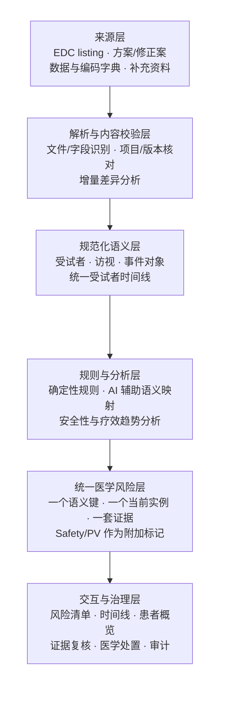
```mermaid
flowchart TB
    subgraph ROW1[" "]
        direction LR
        SOURCE["来源层<br/>EDC listing · 方案/修正案<br/>数据与编码字典 · 补充资料"]
        INGEST["解析与内容校验层<br/>文件/字段识别 · 项目/版本核对<br/>增量差异分析"]
        SEMANTIC["规范化语义层<br/>受试者 · 访视 · 事件对象<br/>统一受试者时间线"]
        SOURCE --> INGEST --> SEMANTIC
    end
    subgraph ROW2[" "]
        direction LR
        ANALYTICS["规则与分析层<br/>确定性规则 · AI 辅助语义映射<br/>安全性与疗效趋势分析"]
        RISK["统一医学风险层<br/>一个语义键 · 一个当前实例 · 一套证据<br/>Safety/PV 作为附加标记"]
        GOVERNANCE["交互与治理层<br/>风险清单 · 时间线 · 患者概览<br/>证据复核 · 医学处置 · 审计"]
        ANALYTICS --> RISK --> GOVERNANCE
    end
    SEMANTIC --> ANALYTICS
    style ROW1 fill:none,stroke:none
    style ROW2 fill:none,stroke:none
```

**图3-1：系统六层架构。** 数据从来源层经过解析校验、字段含义映射和规则分析，形成统一医学风险记录，再通过交互与治理层呈现给医学人员复核和处置。各层分别进行版本管理。

---

## 4. 法规、指南与科学原则

### 4.1 核心法规与指南依据

系统设计遵循以下法规与指南框架：

| 依据 | 版本/日期 | 关键原则 | 系统对应 |
|---|---|---|---|
| 中国《药物临床试验质量管理规范（2026年修订）》 | 2026年第50号公告，2026-09-01施行 | 受试者保护、数据完整性、风险相称监查 | 全文合规基准 |
| 中国 GCP（2020版） | 2020年第57号公告，2020-07-01施行 | 过渡期适用版本 | 过渡期合规基准 |
| ICH E6(R3) GCP | Step 4, 2025-01-06 | 风险识别→评价→控制→沟通→复核→报告闭环 | 风险管理架构 |
| FDA Risk-Based Monitoring Guidance | Final, 2023 | 风险导向和集中监查方法 | 风险分层设计参考 |
| CTCAE | 项目确认版本 | AE/实验室分级标准 | 规则引擎阈值（版本化） |
| 美国联邦法规第21篇第11部分（21 CFR Part 11）及中国适用的电子记录要求 | 按项目申报区域与系统用途确认 | 电子记录、电子签名与审计追踪 | 仅在适用范围内形成验证与审计设计，不将美国法规直接泛化为所有中国项目的强制要求 |

### 4.2 系统设计的科学原则

1. **受试者权益、安全和福祉优先：** 任何自动化判断不得绕过医学人员对受试者安全的最终评估。
2. **试验结果可靠性：** 关键质量因素（Critical-to-Quality Factors）优先于非关键数据的形式审查。
3. **监查强度与风险相称：** 高风险中心/受试者/事件获得更高密度的规则覆盖和更短的复核周期。
4. **数据完整性（ALCOA+）：** 可归因（Attributable）、清晰（Legible）、同步（Contemporaneous）、原始（Original）、准确（Accurate）、完整（Complete）、一致（Consistent）、持久（Enduring）、可获得（Available）。
5. **可解释性（Explainability）：** 每条风险判断可通过原始数据原文、方案依据原文和规则逻辑三段式溯源。
6. **人机协作（Human-in-the-Loop）：** AI 负责候选生成、证据摘要和草拟建议；确定性规则引擎负责可计算逻辑；医学人员拥有最终判断权和处置决定权。

### 4.3 法规层次与系统层次对照

| 法规层次 | 系统层次 | 示例 |
|---|---|---|
| 法规强制要求 | 系统不可配置的刚性规则 | 知情同意日期必须早于筛选日期 |
| 方案明确要求 | 项目配置参数 | 某方案 V4 时间窗 ±3天 |
| 项目约定口径 | 项目批准的可配置参数 | 某项目 PD 分级"重要"阈值定义 |
| 通用医学实践 | 待医学确认的筛查参数模板 | 可预置相对变化、绝对变化等候选参数；医学经理选择或修改并确认后，作为当前项目配置启用 |
| 系统设计决策 | 架构层面不可配置 | CM 与 IP 严格分域 |

### 4.4 成熟数据审阅平台的批判性借鉴

结合国内外成熟临床数据审阅、集中监查和医学监查产品的公开能力，本系统采用以下通用模式：

- 用项目、批次和来源修订管理每次数据审阅，而不是把文件上传视为一次性动作；
- 以变化为中心突出本批次新增、改值、重开和持续事项；
- 在受试者、中心和试验层级之间逐层下钻；
- 把风险清单、原始事实、Timeline 和 Patient Profile 放在同一上下文；
- 确定性规则和 AI 语义辅助并存，最终由医学人员确认；
- 内部医学观察、Query 候选、正式 Query、PD/Finding 和 Safety/PV 协作保持关联但不混为同一状态。

以下做法不作为本系统首版前提：

- 不采用云优先或移动端优先的产品假设；
- 不要求日常 listing 先转换为 SDTM；
- 不把中心统计偏离直接等同于不合规；
- 不把 AI 输出直接作为医学结论；
- 不用大量技术日志、数据管道状态或泛化警告占据医学主工作区。

---

## 5. 角色、职责与治理边界

### 5.1 角色定义

首版产品统一以“医学经理”身份开放，覆盖医学监察员、医学经理、医学总监和医学写作相关的医学工作视角。下表描述目标部署可支持的职责边界，用于数据模型、动作权限和未来私有化部署设计；首版不在界面中要求用户切换角色，也不因用户已经完成医学选择而重复增加“待医学批准”状态。

| 角色 | 核心职责 | 关键操作 |
|---|---|---|
| **医学监察员（Medical Monitor）** | 日常数据审阅、风险识别和初步处置 | 查看医学风险清单、处置低/中风险、请求补充资料 |
| **医学经理（Medical Manager）** | 项目层面的医学判断、风险分层复核 | 确认/驳回风险、调整严重度、形成数据质疑/PD 候选、分派任务 |
| **医学总监（Medical Director）** | 高风险争议裁决、规则口径批准 | 批准高风险关闭、规则变更审批、锁库前高风险确认 |
| **医学写作人员（Medical Writer）** | 安全性综述和 CSR 相关输出 | 导出风险汇总、查询证据以撰写安全性章节 |
| **临床运营（Clinical Operations）** | 中心执行背景和访视信息 | 提供中心执行偏差说明、访视延迟原因 |
| **数据管理（Data Management，DM）** | 数据字段、修订和数据质疑状态 | 确认字段口径、核实数据修订、正式发出数据质疑 |
| **药物警戒（PV）** | SAE/AESI 及安全性报告一致性 | 核对 SAE 报告一致性、标记 Safety 关注信号 |
| **统计与编程（Statistics & Programming）** | 派生变量和锁库数据口径 | 确认派生变量逻辑、锁库前数据版本确认 |
| **系统管理员** | 账号、部署和基础设施 | 用户管理、系统部署、备份恢复 |
| **产品经理/研发** | 产品能力和工程实现 | 功能设计、开发、测试；不得越权改变医学规则 |

### 5.2 治理边界

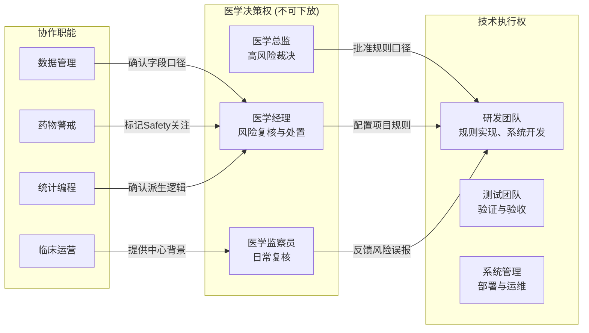
```mermaid
graph LR
    subgraph 医学决策权["医学决策权 (不可下放)"]
        MED_DIR["医学总监<br/>高风险裁决"]
        MED_MGR["医学经理<br/>风险复核与处置"]
        MED_MON["医学监察员<br/>日常复核"]
    end

    subgraph 技术执行权["技术执行权"]
        DEV["研发团队<br/>规则实现、系统开发"]
        TEST["测试团队<br/>验证与验收"]
        ADMIN["系统管理<br/>部署与运维"]
    end

    subgraph 协作职能["协作职能"]
        DM["数据管理"]
        PV["药物警戒"]
        OPS["临床运营"]
        STAT["统计编程"]
    end

    MED_DIR -->|批准规则口径| DEV
    MED_MGR -->|配置项目规则| DEV
    MED_MON -->|反馈风险误报| DEV
    DM -->|确认字段口径| MED_MGR
    PV -->|标记Safety关注| MED_MGR
    OPS -->|提供中心背景| MED_MON
    STAT -->|确认派生逻辑| MED_MGR
```

**图5-1：治理边界。** 医学决策权不可下放给技术执行团队；协作职能为医学判断提供输入但不替代医学决策。

### 5.3 AI 治理

- **确定性优先：** 可计算逻辑（阈值比较、日期先后、存在性检查）由规则引擎执行，不使用 AI。
- **AI 适用场景：** 字段语义映射、方案条款候选提取、跨表线索归纳（如"某受试者的 AE、实验室异常和 CM 是否指向同一临床事件"）、证据摘要、处置文本草拟。
- **AI 输出边界：** 模型、版本、提示词（prompt）版本、输入内容修订号、输出原文、人工修改内容和确认人均需留痕。模型不可把缺失证据补写成事实。AI 初始输出为“AI 候选/待医学复核”；医学经理采纳、修改或明确确认后，该内容即成为当前工作记录，不再重复标记“待医学批准”。系统仍不得据此自动确认 AE、MH、PD 或形成监管提交。
- **独立运行：** 产品内 AI 必须通过系统配置的独立模型能力完成任务。开发代理、会商模型或测试人员只能设计、评测和改进提示词，不能代替产品内 AI 生成生产结果，也不能把开发代理的成功当作产品能力验收。
- **来源约束：** 每次 AI 请求携带项目、任务、来源修订、允许引用范围和禁止推断边界。输出必须把“源事实”“分析推断”“建议动作”“证据缺口”分开，并返回引用到具体原始片段。
- **失效保护：** AI 超时、不可用、结构化输出无效或置信度不足时，系统显示可重试的明确状态；确定性规则、原始证据查看和人工处置仍可使用。不得用空结果、演示结果或静默跳过冒充成功。
- **模型路由：** 生产环境使用经过组织确认、可替换的模型服务；不得把项目数据发送至未获授权的外部服务。模型切换不改变医学风险和证据契约。

---

## 6. 总体业务架构与核心数据

### 6.1 六层架构详解

**第1层 — 来源层（Source Layer）：**
原始 listing（Excel/CSV 全量导出）、方案及修正案（DOCX/PDF 含表格与附录）、数据字典/编码字典（MedDRA、WHO Drug 版本）、监查计划、实验室参考范围、SAE/AESI 清单及既往已确认批次。

**第2层 — 解析与内容校验层（Ingest & Validation Layer）：**
文件基本信息提取（工作表数、行数、表头行识别）、项目/适应症/文档类型一致性校验、表头和字段识别、版本判定。用户可在充分提醒后覆盖校验，覆盖操作必须审计。

**第3层 — 规范化语义层（Semantic Layer）：**
将不同 EDC 系统的异构字段名映射为统一的受试者、中心、访视、事件、检验、用药、试验药物、疗效、PD、数据质疑和检查发现项记录。

**第4层 — 规则与分析层（Rule & Analytics Layer）：**
确定性规则（阈值比较、时序逻辑、跨表一致性）、趋势分析（实验室/疗效历时变化）、AI 辅助（语义映射、线索归纳）。规则按方案版本化，同一规则可被日常监查、锁库前监查和核查前自查三类任务共用。

**第5层 — 医学风险记录层（Unified Risk Layer）：**
同一项风险只保留一条权威记录。稳定语义键（risk_key）用于识别“同一类、同一对象、同一医学含义”的风险；风险实例标识（risk_instance_id）绑定具体批次、来源、方案、映射和规则修订。风险清单、受试者时间线、患者概览以及安全性/PV 协作视图均读取同一风险实例，不因展示入口不同而复制处置状态。

**第6层 — 交互与治理层（Interaction & Governance Layer）：**
医学风险清单（七列可筛选排序）、受试者时间线（泳道式事件展示）、患者概览（疗效与安全性趋势图）、证据工作区（原文片段与推导过程）、批次历史、医学确认与处置、按项目配置的外部审批协作和审计日志。

### 6.2 统一医学风险记录

统一医学风险记录是系统的核心数据约定。每项风险均有稳定的语义键（risk_key）和唯一的实例标识（risk_instance_id），所有视图读取同一实例。不得仅按标题、受试者编号或来源行号判定同一风险。

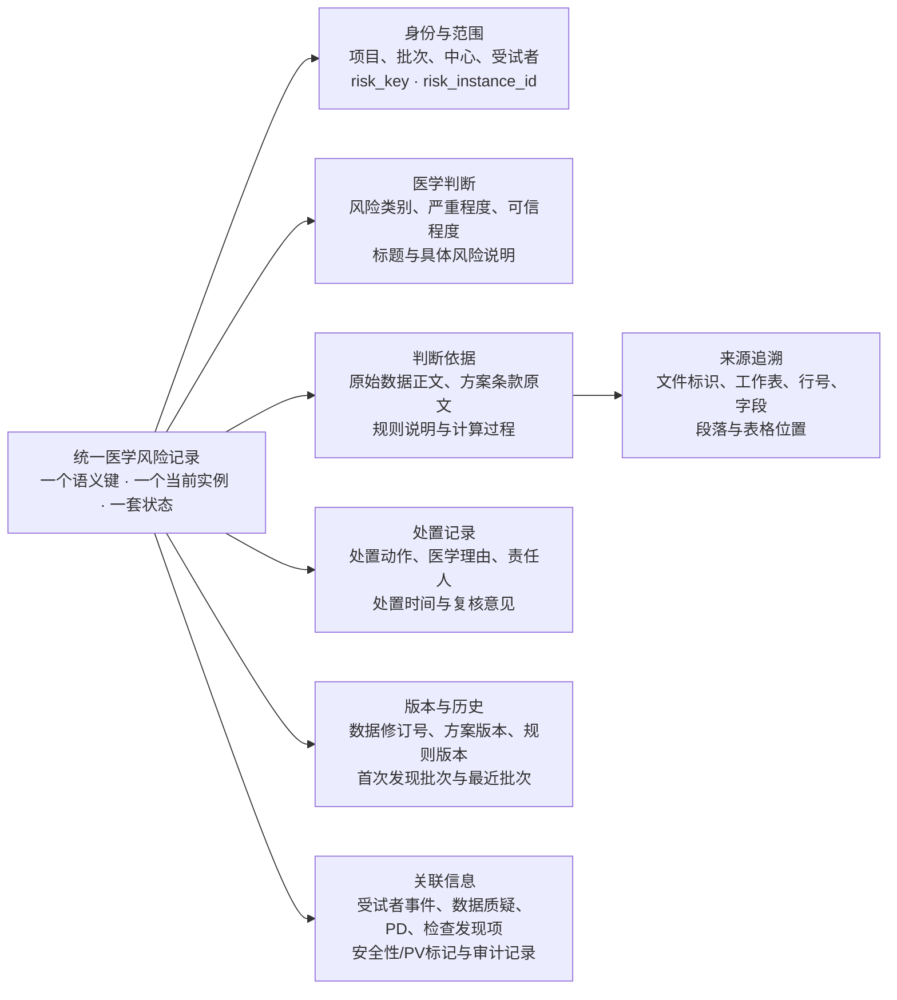
```mermaid
flowchart LR
    RISK["统一医学风险记录<br/>一个语义键 · 一个当前实例 · 一套状态"]

    ID["身份与范围<br/>项目、批次、中心、受试者<br/>risk_key · risk_instance_id"]
    JUDGE["医学判断<br/>风险类别、严重程度、可信程度<br/>标题与具体风险说明"]
    BASIS["判断依据<br/>原始数据正文、方案条款原文<br/>规则说明与计算过程"]
    TRACE["来源追溯<br/>文件标识、工作表、行号、字段<br/>段落与表格位置"]
    ACTION["处置记录<br/>处置动作、医学理由、责任人<br/>处置时间与复核意见"]
    VERSION["版本与历史<br/>数据修订号、方案版本、规则版本<br/>首次发现批次与最近批次"]
    LINK["关联信息<br/>受试者事件、数据质疑、PD、检查发现项<br/>安全性/PV标记与审计记录"]

    RISK --> ID
    RISK --> JUDGE
    RISK --> BASIS
    BASIS --> TRACE
    RISK --> ACTION
    RISK --> VERSION
    RISK --> LINK
```

**图6-1：统一医学风险记录的组成。** 一项风险集中保存身份范围、医学判断、判断依据、来源位置、处置过程、版本历史和关联信息，各页面不得分别维护相互冲突的副本。

#### 6.2.1 风险语义键与实例迁移

| 对象 | 作用 | 最小构成 | 使用边界 |
|---|---|---|---|
| **risk_key** | 跨批次识别同一医学风险语义 | project_id + scope + subject/site + rule_id + 稳定事件语义键 | 不直接承载处置；算法升级不得无记录地改变 |
| **risk_instance_id** | 标识一次可审计的风险事实实例 | risk_key + source_revision + protocol_revision + mapping_revision + rule_revision | 所有证据、处置和审计绑定此实例 |

风险实例按以下原则迁移：

1. 来源事实、方案依据、规则或映射均未发生实质变化时，风险继续（continue），保留处置。
2. 来源事实发生可解释的字段修订且医学语义仍为同一风险时，创建新实例并通过 `supersedes` 关联旧实例；旧处置仅作为历史参考，新实例根据影响进入“变化”或“需重新复核”。
3. 已关闭风险再次满足触发条件时，创建或激活新的当前实例并标记“重开”；不得静默恢复旧的关闭状态。
4. 无法证明为同一记录时，按“删除/撤回 + 新增”处理，交由医学人员复核，不得用模糊匹配自动继承处置。

### 6.3 风险处置状态流转

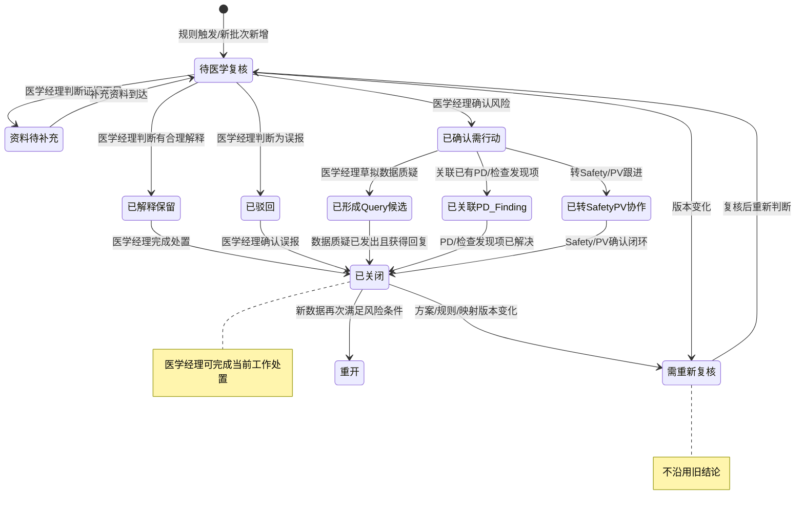
```mermaid
stateDiagram-v2
    [*] --> 待医学复核 : 规则触发/新批次新增
    待医学复核 --> 资料待补充 : 医学经理判断证据不足
    待医学复核 --> 已确认需行动 : 医学经理确认风险
    待医学复核 --> 已解释保留 : 医学经理判断有合理解释
    待医学复核 --> 已驳回 : 医学经理判断为误报

    资料待补充 --> 待医学复核 : 补充资料到达
    已确认需行动 --> 已形成Query候选 : 医学经理草拟数据质疑
    已确认需行动 --> 已关联PD_Finding : 关联已有PD/检查发现项
    已确认需行动 --> 已转SafetyPV协作 : 转Safety/PV跟进
    已解释保留 --> 已关闭 : 医学经理完成处置
    已驳回 --> 已关闭 : 医学经理确认误报

    已形成Query候选 --> 已关闭 : 数据质疑已发出且获得回复
    已关联PD_Finding --> 已关闭 : PD/检查发现项已解决
    已转SafetyPV协作 --> 已关闭 : Safety/PV确认闭环

    已关闭 --> 需重新复核 : 方案/规则/映射版本变化
    已关闭 --> 重开 : 新数据再次满足风险条件

    待医学复核 --> 需重新复核 : 版本变化
    需重新复核 --> 待医学复核 : 复核后重新判断

    note right of 需重新复核 : 不沿用旧结论
    note right of 已关闭 : 医学经理可完成当前工作处置
```

**图6-2：风险处置状态流转。** “已形成数据质疑候选”不等同于已正式发出数据质疑。医学经理对候选的确认不需要系统再次要求“医学批准”；只有正式发送 Query、高风险升级或其他组织动作在项目明确配置时进入额外流程。出现新证据、原始数据修改、规则更新或方案版本变化时，既有结论均可转回“需重新复核”。

---

## 7. 数据输入、项目配置与内容校验

### 7.1 最低输入集合

| 输入项 | 日常监查 | 锁库前监查 | 核查前自查 | 格式 |
|---|---|---|---|---|
| 当前有效方案（含修正案） | 必需 | 必需（冻结版本） | 必需（冻结版本） | DOCX/PDF |
| 全量 data listing | 必需 | 必需（候选锁库数据） | 必需（当前冻结版本） | Excel/CSV |
| 字段或表单说明/数据字典 | 必需 | 必需 | 必需 | 项目提供 |
| 访视设计（方案 Section 或附表） | 必需 | 必需 | 必需 | 方案内提取 |
| 既往已确认批次 | 必需（比较基线） | 必需（历史处置参考） | 必需（证据链） | 系统持久化 |
| 实验室参考范围 | 按规则需要 | 必需 | 必需 | 项目提供 |
| CTCAE 版本与适用条目 | 按规则需要 | 必需 | 必需 | 项目确认 |
| 医学编码字典（MedDRA/WHO Drug） | 按规则需要 | 必需 | 必需 | 项目确认 |
| 研究者手册（IB） | 按规则需要 | 按规则需要 | 按规则需要 | PDF |
| PD 管理口径 | 按规则需要 | 必需 | 必需 | 项目提供 |
| SAE/AESI 清单 | 按规则需要 | 必需 | 必需 | 项目提供 |

### 7.2 内容校验工作流

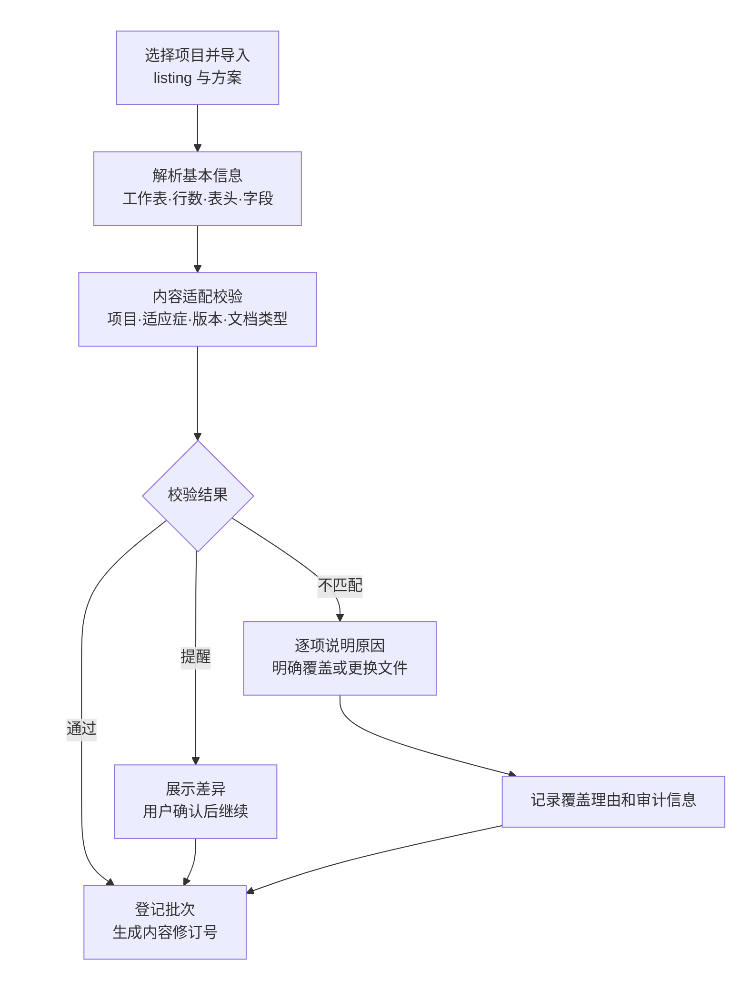
```mermaid
flowchart TB
    subgraph R1[" "]
        direction LR
        A["选择项目并导入<br/>listing 与方案"] --> B["解析基本信息<br/>工作表·行数·表头·字段"] --> C["内容适配校验<br/>项目·适应症·版本·文档类型"]
    end
    C --> D{"校验结果"}
    subgraph R2[" "]
        direction LR
        D -->|通过| E["登记批次<br/>生成内容修订号"]
        D -->|提醒| F["展示差异<br/>用户确认后继续"]
        D -->|不匹配| G["逐项说明原因<br/>明确覆盖或更换文件"]
    end
    F --> E
    G --> H["记录覆盖理由和审计信息"] --> E
    style R1 fill:none,stroke:none
    style R2 fill:none,stroke:none
```

**图7-1：内容校验工作流。** mismatch 返回结构化 409，用户必须逐项确认并提供理由。warning 可提示后继续。所有覆盖操作进入审计日志。

内容校验只解决“文件能否被可靠读取”和“内容是否适用于当前任务”两类问题，不在用户主流程中设置费时的重型文件安全扫描。校验边界如下：

- **技术可读性校验：** 文件存在、格式可解析、工作表或文档内容可读取、关键结构未损坏。技术失败不可覆盖。
- **内容适配校验：** 项目、适应症、文档类型、方案版本、数据日期、关键数据域和表头是否符合当前任务。可覆盖项必须展示具体差异，允许资深医学人员在充分提醒后说明理由并继续。
- **来源直接可用：** 通过或经确认覆盖后，文件直接进入来源登记与后续流程；不得再增加与医学任务无关的重复批准。

### 7.3 内容校验规则矩阵

| 校验编号 | 校验项 | 严重度 | 可覆盖 | 覆盖要求 |
|---|---|---|---|---|
| V-001 | 项目编号与文件名/内容不一致 | mismatch | 是 | 理由≥10字 |
| V-002 | 方案版本与上一批次不同 | warning | 是 | 自动登记新版本 |
| V-003 | 文档类型不匹配（如误传 publication） | mismatch | 是 | 理由≥10字 + 二次确认 |
| V-004 | 数据日期早于上一批次 | mismatch | 是 | 理由≥10字 |
| V-005 | 受试者数量与上一有效批次或项目预期的差异超过项目配置阈值 | warning | 是 | 展示分子、分母、差异原因并确认 |
| V-006 | 缺少关键工作表（如 AE、LB） | mismatch | 否 | 不可覆盖，需重新上传 |
| V-007 | 关键字段缺失（如 SUBJID、VISIT） | mismatch | 否 | 不可覆盖 |
| V-008 | 工作表数量或关键数据域发生超出项目配置范围的结构变化 | warning | 是 | 展示新增、缺失及改名清单并确认 |
| V-009 | 编码结构变化（如 MedDRA 版本不同） | warning | 是 | 登记新编码版本 |

### 7.4 版本优先级与绑定

规则运行必须同时绑定以下版本信息：

| 版本要素 | 来源 | 适用规则 |
|---|---|---|
| 方案版本 + 实施日期 | 方案文件元数据 | 受试者事件日期决定适用方案版本 |
| 数据内容修订号 | 文件内容哈希 | 读取、规则运行、审批和处置均绑定此号 |
| 规则包版本 | 系统管理 | 规则版本变化触发"需重新复核" |
| 医学字典版本 | 项目配置 | MedDRA、WHO Drug 版本绑定 |
| 模型/提示词版本 | 系统管理 | AI 辅助结论溯源 |
| CTCAE 版本 | 项目配置 | 规则阈值计算（v4.03 vs v5.0 条目不同） |

> **关键约束：** 受试者事件发生日期决定适用方案版本，不能用当前最新版本追溯性覆盖所有历史事件。例如，方案修正案 2.0 于 2025-03-01 生效，则 2025-02-20 发生的事件仍适用方案 1.0。

---

## 8. 方案解构与规则配置

### 8.1 方案解构输出

方案解构复用入排审核系统的条款结构化能力，但输出面向持续监查。需从当前有效方案及修正案中结构化提取：

| 解构域 | 提取内容 | 输出格式 |
|---|---|---|
| **访视与时间窗** | 计划访视名称、计划日/周、允许窗口（±天数）、关键评估节点 | 访视计划表 + 窗口配置 |
| **基线定义** | 筛选期/导入期/给药前/重复检测优先级、基线取值规则 | 基线规则配置 |
| **入排条款** | IN/EX 编号、条款原文、阈值/条件、实施日期 | 结构化条款（可计算条件） |
| **给药方案** | 药品、剂量、频次、途径、周期、给药日 | 给药计划表 |
| **剂量调整规则** | 暂停条件、减量/加量规则、永久停药和重启条件 | 剂量调整规则树 |
| **依从性** | 项目规定的计算公式、合格范围、观察周期和缺失处理 | 依从性规则 |
| **禁限用药** | 禁用药名/成分/类别、允许用药/条件、洗脱期、救援豁免 | 药物规则列表 |
| **疗效终点** | 主要/关键次要/其他疗效指标、评估时间点、响应定义 | 疗效规则配置 |
| **安全性检查** | 实验室、生命体征、心电图计划、AESI | 安全性检查计划 |
| **提前退出** | 退出条件、退出访视要求 | 退出规则 |
| **PD 条款** | PD 定义分级、报告时限 | PD 管理规则 |

### 8.2 规则配置标准模板

每条规则至少包含以下字段（详见附录 A）：

| 字段 | 类型 | 必填 | 说明 |
|---|---|---|---|
| rule_id | string | 是 | 稳定编号（如 RULE_AE_LB_001） |
| rule_name | string | 是 | 简短医学名称 |
| medical_purpose | text | 是 | 需要控制的受试者安全或数据可靠性风险 |
| scope | object | 是 | 适用研究类型、阶段、数据域、适用日期范围 |
| protocol_basis | text | 是 | 方案条款编号（如 Section 7.3.2.1）和原文 |
| input_domains | list | 是 | 输入表和字段（含单位、日期、受试者/事件键） |
| preconditions | list | 是 | 数据完整性、基线确认、版本、映射条件 |
| trigger_conditions | list | 是 | 可计算的候选风险逻辑（表达式或伪代码） |
| exclusion_conditions | list | 是 | 明确不应触发或应降级的情形 |
| severity_rules | object | 是 | 严重度分级依据（高/中/低） |
| confidence_rules | object | 是 | 置信度计算依据（高/中/低） |
| evidence_template | object | 是 | 原始信息正文模板、方案原文引用、推导过程和定位格式 |
| disposition_guidance | text | 是 | 建议处置路径、责任人和可验证关闭条件 |
| version_governance | object | 是 | 规则起草人、复核人、批准人、生效日期和回溯策略 |

### 8.3 共享规则、三种运行策略

同一条医学规则不得为日常监查、锁库前监查和核查前自查各复制一份。三类任务共用规则标识、输入定义、方案依据、计算函数和医学风险记录，仅在执行范围、比较基线、输出优先级和完成标准上不同。

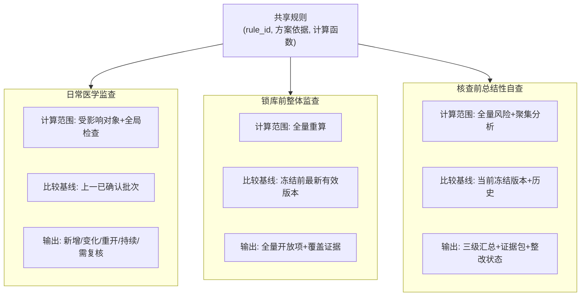
```mermaid
graph TD
    RULE["共享规则<br/>(rule_id, 方案依据, 计算函数)"]

    subgraph 日常模式["日常医学监查"]
        D_SCOPE["计算范围: 受影响对象+全局检查"]
        D_BASE["比较基线: 上一已确认批次"]
        D_OUT["输出: 新增/变化/重开/持续/需复核"]
    end

    subgraph 锁库前模式["锁库前整体监查"]
        L_SCOPE["计算范围: 全量重算"]
        L_BASE["比较基线: 冻结前最新有效版本"]
        L_OUT["输出: 全量开放项+覆盖证据"]
    end

    subgraph 核查前模式["核查前总结性自查"]
        I_SCOPE["计算范围: 全量风险+聚集分析"]
        I_BASE["比较基线: 当前冻结版本+历史"]
        I_OUT["输出: 三级汇总+证据包+整改状态"]
    end

    RULE --> 日常模式
    RULE --> 锁库前模式
    RULE --> 核查前模式
```

**图8-1：共享规则与三类执行策略。** 规则定义一次，执行范围、比较基线和输出要求由任务类型控制。

| 任务类型 | 计算范围 | 比较基线 | 主要输出 | 完成标准 |
|---|---|---|---|---|
| **日常医学监查** | 当前批次受影响对象 + 必要全局一致性检查 | 上一已确认批次 | 新增、变化、重开、持续及待复核风险 | 本批次差异已解释，新增高风险已分派 |
| **锁库前整体监查** | 冻结候选数据全量重算 | 冻结前最新有效数据与版本 | 全量开放项、关键域覆盖和关闭证据 | 关键域覆盖完整，未决项有责任人和锁库决定 |
| **核查前总结性自查** | 全量风险 + 中心/项目聚集分析 | 当前冻结版本及历史批次 | 三级汇总（受试者/中心/试验）、证据包、重复模式和整改状态 | 明细与汇总一致，证据可追溯，整改留痕完整 |

### 8.4 任务类型选择约束

- 任务类型由授权用户在创建任务时**明确选择**，系统不得仅凭文件名自动推断“日常”“锁库前”或“核查前”。
- 进入锁库前或核查前模式前，系统检查：
  - 批次是否已冻结；
  - 方案和字典版本是否已确认；
  - 是否仍有未映射关键域；
  - 受试者和中心覆盖是否完整。
- 前置条件不满足时允许保存任务草稿，但不得标记"全量复核完成"。

*示例：某特应性皮炎研究的方案表4规定，中性粒细胞绝对计数降低、丙氨酸氨基转移酶/天门冬氨酸氨基转移酶升高和严重感染分别触发不同的暂停、复查及重启要求。系统解构时不把整张表保存为一段文本，而是生成三组规则对象：每组分别保存适用指标、阈值表达式、基线条件、试验药物动作、复查频率、恢复条件、方案表格定位和待医学确认项。医学经理发现“其他≥3级实验室异常”属于兜底条款后，将其配置为人工复核分支，而非对所有检验项目直接自动停药。*

---

## 9. 日常医学监查全流程

### 9.1 端到端序列

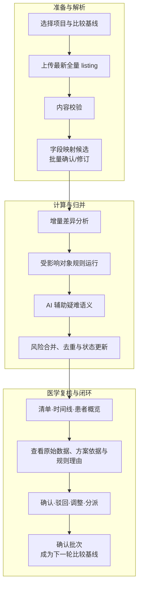
```mermaid
flowchart TB
    subgraph R1["准备与解析"]
        direction LR
        A["选择项目与比较基线"] --> B["上传最新全量 listing"] --> C["内容校验"] --> M["字段映射候选<br/>批量确认/修订"]
    end
    subgraph R2["计算与归并"]
        direction LR
        D["增量差异分析"] --> E["受影响对象规则运行"] --> F["AI 辅助疑难语义"] --> G["风险合并、去重与状态更新"]
    end
    subgraph R3["医学复核与闭环"]
        direction LR
        H["清单·时间线·患者概览"] --> I["查看原始数据、方案依据与规则理由"] --> J["确认·驳回·调整·分派"] --> K["确认批次<br/>成为下一轮比较基线"]
    end
    M --> D
    G --> H
```

**图9-1：日常医学监查全流程。** 从上传到批次确认的端到端序列，包含校验失败恢复路径。

### 9.2 流程节点详解

#### 步骤1：选择项目与基线

用户选择项目和上一已确认批次作为比较基线。系统展示当前基线的基本信息：批次号、上传时间、数据日期、受试者/中心数。如果是项目首个批次，基线为空（所有数据视为"新增"）。

#### 步骤2：上传与校验

上传最新全量 listing（不是增量数据）。系统执行 §7.2 的完整内容校验序列。校验结果有三类：
- **通过（pass）：** 自动进入下一步；
- **警告（warning）：** 弹出提示，用户确认后继续；
- **不匹配（mismatch）：** 返回结构化 409，列出差异项。用户必须逐项查看差异、确认已知悉并填写≥10字的理由，然后才能继续。

#### 步骤3：解析与映射

系统解析 Excel 表头和字段，生成字段语义映射候选。关键映射包括：
- 受试者标识 → subject_id
- 中心标识 → site_id
- 访视标识 → visit_name, visit_date
- AE 字段 → AE 对象
- CM 字段 → CM 对象
- LB 字段 → Lab 对象（含 test_name, result, unit, ref_range_low, ref_range_high, cs_ncs_flag）
- IP/给药字段 → IP 对象（独立于 CM）

系统按数据域和医学重要性汇总展示推荐映射、代表性原始值、置信度和依据。医学经理可以批量接受高置信度候选、逐项修订低置信度候选、标记“不适用”或保留“未映射”，无需编写代码或技术映射文件。确认后的映射形成项目配置，绑定当前来源修订并生成独立 `mapping_revision`。

未知字段保留在来源层，标注“未映射”但不进入规则投影。关键域映射候选必须经医学经理确认后方可进入依赖该域的差异与规则分析；未确认时系统显示“未映射关键域，相关规则已阻断”，不得用空风险清单表示分析成功。非关键未知字段可在保留原始来源和影响说明后继续。

#### 步骤4：差异分析（详见 §10）

系统以稳定业务键匹配记录，执行行级和单元格级比较。差异分类为：新增、数值更正、撤回/删除、业务键变化、结构变化、规则版本变化、方案版本变化。

#### 步骤5：增量规则运行

仅对受影响的受试者、中心、规则和关联事件增量运行。同时保留必要的全局一致性检查（如跨受试者的中心级别检查）。

#### 步骤6：风险状态生成

以规则运行结果为基础，比较上一批次状态，生成风险状态：
- **新增：** 本批次首次满足风险条件；
- **变化：** 风险事实、严重度或证据发生实质变化；
- **重开：** 已关闭风险再次满足条件；
- **需重新复核：** 数据未变但方案/规则/映射版本变化；
- **持续：** 事实和规则均无实质变化，保留既有处置；
- **条件不再满足：** 当前数据已经不再满足原触发条件，但仍须医学确认后才能关闭。

#### 步骤7：医学复核（详见 §13）

医学经理在医学风险清单中筛选风险，打开证据工作区查看原始数据原文、方案依据原文和规则解释。可在同一工作区切换受试者时间线和患者概览，以了解受试者完整临床背景。

#### 步骤8：处置操作

医学经理执行处置：确认、驳回、调整严重度、补充医学解释、请求补充资料、分派给其他角色、形成数据质疑候选草稿、关联已有 PD/检查发现项或转入 Safety/PV 协作。

#### 步骤9：批次确认

批次确认前，系统检查关键域映射、来源覆盖和“来源完整性待确认”事项。若无法证明当前上传是可比较的完整全量快照，本批次可保存为草稿或用于限定范围的人工查看，但不得成为下一次完整差异分析的比较基线；界面应提示重新上传完整 listing 或补充覆盖依据。不得让用户通过普通内容校验覆盖，把一个已知不完整的快照确认成全量基线。

通过完整性门后，批次经医学经理确认成为下一次比较基线。未解决风险不会因“已读”或“再次进入页面”而消失。

### 9.3 正文案例：日常批次改值导致风险变化

*示例：受试者 示例受试者11（女，42岁，试验组）在 V4D29（2026-04-12）的血常规检查中，批次 B003 记录血红蛋白（HGB）为 91 g/L，低于参考范围下限（115 g/L），触发"实验室异常—中度贫血"风险，严重度为中。医学经理复核后标记为"待补充资料"，请求核对是否有重复检测。*

*在下一批次 B004（数据日期 2026-04-26）中，该 HGB 值被更正为 101 g/L。系统在差异分析时识别该记录发生数值修改。规则引擎重算后，101 g/L 按 CTCAE v5.0 对应的贫血等级从 2 级（91 g/L）降至 1 级（101 g/L，100-<LLN）。系统将该风险标记为“变化”状态，严重度从中降为低，但不自动关闭风险。证据工作区同时展示旧值（B003：91 g/L）、新值（B004：101 g/L）、发生修改的字段（LBCHEM.HGB）和 CTCAE 重算过程。*

*医学经理查看后，评估 1 级贫血为轻度、无临床进展，填写医学判断“已说明，无需外部动作”，将风险处置为“已解释保留”并关闭。审计记录保存操作者角色、操作时间、前后状态和理由：“新批次更正后 HGB 101 g/L，符合 CTCAE 1 级，研究者评价为 NCS，与受试者整体状况一致。”*

---

## 10. 增量更新与差异分析机制

### 10.1 差异分析架构

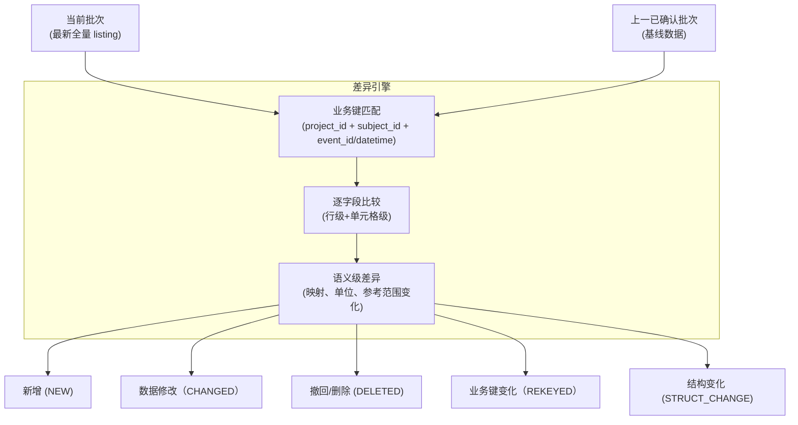
```mermaid
graph TD
    INPUT_CURR["当前批次<br/>(最新全量 listing)"]
    INPUT_PREV["上一已确认批次<br/>(基线数据)"]

    subgraph DiffEngine["差异引擎"]
        KEY["业务键匹配<br/>(project_id + subject_id + event_id/datetime)"]
        CELL["逐字段比较<br/>(行级+单元格级)"]
        SEMANTIC["语义级差异<br/>(映射、单位、参考范围变化)"]
    end

    INPUT_CURR --> KEY
    INPUT_PREV --> KEY

    KEY --> CELL
    CELL --> SEMANTIC

    SEMANTIC --> ADDED["新增 (NEW)"]
    SEMANTIC --> CHANGED["数据修改（CHANGED）"]
    SEMANTIC --> DELETED["撤回/删除 (DELETED)"]
    SEMANTIC --> REKEYED["业务键变化（REKEYED）"]
    SEMANTIC --> STRUCT["结构变化 (STRUCT_CHANGE)"]
```

**图10-1：差异分析架构。** 从业务键匹配到语义级差异的完整路径。

### 10.2 差异类型详解

| 差异类型 | 触发条件 | 对风险的影响 | 示例 |
|---|---|---|---|
| **新增（NEW）** | 当前批次存在、基线不存在的记录 | 如满足规则→新增风险 | 新录入的 AE 记录 |
| **数据修改（CHANGED）** | 同一业务键下至少一个字段值变化 | 触发规则重算，风险可能变化、重新打开或不再满足触发条件 | HGB 从 91→101 g/L |
| **撤回/删除（DELETED）** | 基线存在、当前批次不存在的记录 | 标记证据撤回→要求医学复核→不可自动关闭 | EDC 中撤回的错误 AE 录入 |
| **业务键变化（REKEYED）** | 业务键变化但内容特征相似 | 进入“可能为同一记录”的待核对项，由映射规则判断是记录迁移还是删除后新增 | 受试者重新筛选后编号变化 |
| **结构变化（STRUCT_CHANGE）** | 工作表或字段结构变化 | 标记"来源映射需复核" | EDC 升级后新增字段 |
| **规则版本变化** | 规则包版本更新 | 受影响的全部风险→"需重新复核" | CTCAE v5.0 升级到新版本 |
| **协议版本变化** | 方案修正案生效 | 按实施日期分界→适用新版本条款的风险→"需重新复核" | 方案增补新禁用药 |

### 10.3 差异处理状态流转

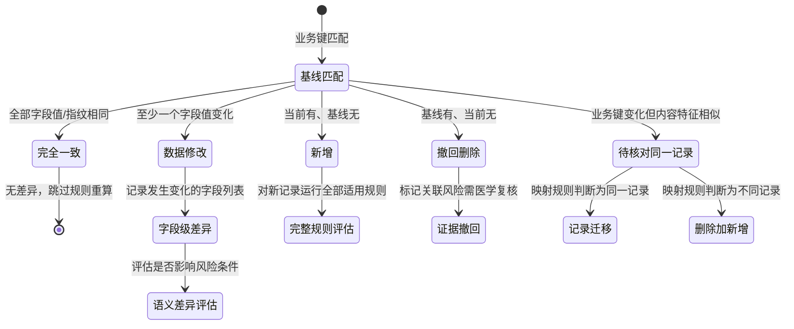
```mermaid
stateDiagram-v2
    [*] --> 基线匹配 : 业务键匹配
    基线匹配 --> 完全一致 : 全部字段值/指纹相同
    基线匹配 --> 数据修改 : 至少一个字段值变化
    基线匹配 --> 新增 : 当前有、基线无
    基线匹配 --> 撤回删除 : 基线有、当前无
    基线匹配 --> 待核对同一记录 : 业务键变化但内容特征相似

    完全一致 --> [*] : 无差异，跳过规则重算
    数据修改 --> 字段级差异 : 记录发生变化的字段列表
    字段级差异 --> 语义差异评估 : 评估是否影响风险条件

    新增 --> 完整规则评估 : 对新记录运行全部适用规则
    撤回删除 --> 证据撤回 : 标记关联风险需医学复核

    待核对同一记录 --> 记录迁移 : 映射规则判断为同一记录
    待核对同一记录 --> 删除加新增 : 映射规则判断为不同记录
```

**图10-2：差异处理状态流转。** 从基线匹配到医学语义差异评估的完整分支。

### 10.4 幂等与并发控制

- **完整快照前提：** 日常输入默认是最新全量 listing。差异由系统比较两个完整批次计算，不依赖来源文件提供 `CHANGE_FLAG`、颜色标记或“新增/修改”辅助列。
- **不可变批次：** 已登记批次的原始文件、内容修订号、解析结果和比较基线不可原位覆盖。内容改变必须形成新批次或新来源修订。
- **项目级业务键：** 每个数据域的业务键由项目字段映射确认。系统可提供候选，但不得硬编码某一 EDC 的表名、事件编号或访视字段。
- **结构漂移门：** 新增、缺失、改名、类型变化和关键字段空缺先进入结构差异评估；关键域映射未确认前，不得运行依赖该域的医学规则并宣称“无风险”。
- **删除完整性证明：** 只有当前文件被确认是完整全量快照、受试者/中心覆盖未被截断且业务键可比时，基线存在而当前不存在的记录才可标记为撤回/删除；否则标记为“来源完整性待确认”。
- **幂等性：** 同一内容修订号 + 同一语义请求重复提交（如同一次重试），应返回同一 batch_id 和结果。不会重复计费或生成重复风险。
- **内容修订号：** 由来源文件内容（文件哈希）及稳定规范化元数据（项目 ID、文件角色）计算。方案、规则和引擎分别使用独立修订号。规则升级不能误写为源文件改值。
- **乐观并发控制：** 所有写操作携带预期风险或内容修订号。服务端只接受与当前版本一致的操作。过期客户端提交返回 HTTP 409，并提示"数据已更新，请刷新后复核"。
- **来源中途变化保护：** 读取期间来源发生变化时必须终止本次处理并提示重新运行，禁止把旧证据写入新版本，也禁止把新证据混入旧版本计算。
- **部署验证要求：** 多进程任务领取、事务提交、租约过期、断点恢复和数据库备份恢复均须在目标部署环境中完成专项验证。

### 10.5 风险状态过渡规则

| 上一批次状态 | 当前批次差异类型 | 当前批次风险状态 | 说明 |
|---|---|---|---|
| 不存在 | 新增 | **新增** | 首次触发 |
| 待复核/已确认等 | 数据修改（影响风险条件） | **变化** | 事实或严重度变化 |
| 待复核/已确认等 | 无实质变化 | **持续** | 保留既有处置 |
| 已关闭 | 数据修改（再次满足条件） | **重新打开** | 需检查新事实或原关闭决定是否仍成立 |
| 任意 | 规则/协议版本变化 | **需重新复核** | 不沿用旧结论 |
| 任意 | 数据不再满足条件 | **条件不再满足** | 需医学确认后才能关闭 |

*示例：受试者 示例受试者11 在批次 B003 的血红蛋白为 91 g/L，B004 中同一业务键记录更正为 101 g/L。行级差异识别为同一记录改值，字段级差异展示“91→101”，医学语义差异重算后把风险从“中度贫血提示”改为“轻度异常提示”。原风险状态记为“变化”，不新增第二条记录；若已不满足项目筛查条件，则标记“条件不再满足，待医学确认”，并保留旧值、旧处置和改值原因。*

> **禁止捷径：** 演示数据中的预置变化标记、已计算差异文件或人工整理后的风险结果只能用于组件级测试，不能作为真实增量工作流的发布证据。

---

## 11. 锁库前整体医学监查

### 11.1 锁库前整体流程

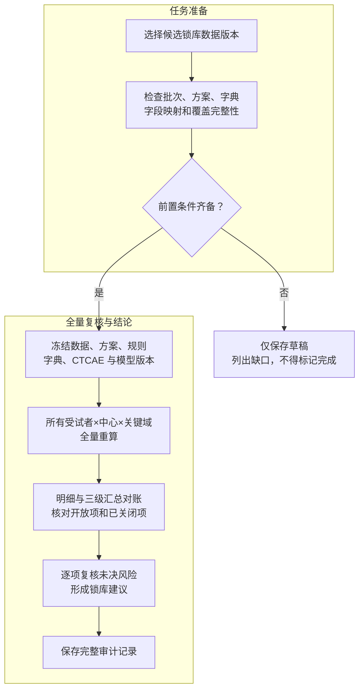
```mermaid
flowchart TB
    subgraph R1["任务准备"]
        direction LR
        A["选择候选锁库数据版本"] --> B["检查批次、方案、字典<br/>字段映射和覆盖完整性"] --> C{"前置条件齐备？"}
    end
    C -->|否| D["仅保存草稿<br/>列出缺口，不得标记完成"]
    C -->|是| E["冻结数据、方案、规则<br/>字典、CTCAE 与模型版本"]
    subgraph R2["全量复核与结论"]
        direction LR
        E --> F["所有受试者×中心×关键域<br/>全量重算"] --> G["明细与三级汇总对账<br/>核对开放项和已关闭项"] --> H["逐项复核未决风险<br/>形成锁库建议"] --> I["保存完整审计记录"]
    end
```

**图11-1：锁库前整体医学监查流程。** 全量重算不是日常增量结果的简单累加。

### 11.2 锁库前监查的关键特征

| 特征 | 说明 |
|---|---|
| **版本冻结** | 数据、方案、规则、字典、CTCAE 和模型版本一次性锁定，锁库前监查期间不接受版本变更 |
| **全量重算** | 对所有受试者 × 所有中心 × 所有关键数据域重新运行全部规则，不使用增量快捷方式 |
| **覆盖完整性核对** | 核对受试者数、中心数、关键域（AE/LB/CM/MH/IP/疗效）覆盖是否完整 |
| **计数一致性** | 风险明细数与受试者/中心/试验级汇总数必须一致 |
| **未决项汇总** | 按高/中/低严重度、风险类别、中心、受试者、负责人和状态汇总开放风险 |
| **Safety/PV 标记** | Safety/PV 相关项额外标记，确保 PV 团队已审核 |
| **证据完整性** | 每条风险能追溯到原始数据行或明确派生过程；证据缺口需显式记录 |

锁库前任务只有在保存**全量重算执行证明**后才能标记完成。执行证明至少记录：冻结的各修订号、计划与实际纳入的受试者数/中心数/关键域数/规则数、逐域处理行数、失败或跳过项、重试结果和明细—汇总对账。不得用“当前风险清单已有数据”或复用日常增量缓存代替全量重算证明。

### 11.3 锁库前重点核查清单

| 核查项 | 方法 | 不通过后果 |
|---|---|---|
| 全部受试者进入风险计算 | 受试者列表与 listing 交叉核对 | 标记为"覆盖不完整" |
| 全部中心进入风险计算 | 中心列表与 listing 交叉核对 | 标记为"覆盖不完整" |
| AE 域全覆盖 | AE 工作表行数与纳入风险计算行数核对 | 标记为"域覆盖不完整" |
| LB 域全覆盖 | LB 工作表行数与纳入风险计算行数核对 | 标记为"域覆盖不完整" |
| CM 域全覆盖 | CM 工作表行数与纳入风险计算行数核对 | 标记为"域覆盖不完整" |
| 所有高风险项有处置记录 | 遍历高风险列表，检查 closed/disposition | 逐项列出未处置高风险 |
| 已关闭风险的关闭条件可核验 | 抽样复核关闭理由和证据 | 标记为"关闭证据不足" |
| 无 IP 变更混入 CM 风险 | CM 风险自动交叉核查 IP 字段 | 标记为"域边界违规" |
| 日期逻辑无冲突 | 全量日期先后检查 | 标记为"时序矛盾" |
| 撤回/删除记录已复核 | 遍历 deleted 事件列表 | 标记为"撤回记录未复核" |

### 11.4 正文案例：锁库前开放项闭环

*示例：某 III 期特应性皮炎研究计划于 2026-06-30 锁库。医学经理于 2026-06-15 创建锁库前监查任务，冻结数据版本（2026-06-10 导出）、方案 V3.0、CTCAE v5.0 和 MedDRA v26.1。*

*示例：一次锁库前全量重算覆盖全部受试者、中心和已纳入映射的工作表。系统识别出多条尚待处置的医学风险，其中：*

*- **高风险示例：** 一名受试者的 ALT 两次超过 3×ULN（128 U/L 和 313 U/L，ULN=41 U/L），触发 CTCAE 3 级和方案中 ALT>3×ULN 的暂停给药条件。但试验药物给药记录显示仅在第29天暂停一次、第43天即恢复给药，与方案规定的“ALT>3×ULN 暂停给药直至恢复至≤1.5×ULN”不一致。此外，该受试者同日 AE 记录中缺少“ALT 升高”不良事件。系统分别生成疑似 AE 漏报、试验药物执行偏差和 CTCAE 3 级异常未充分解释三条关联风险。*

*- **中风险示例：** 涉及 IP 重启未记录原因、关键疗效访视缺失以及 SAE 起始日期与住院日期矛盾。*

*- **低风险示例：** 主要为数据质量问题，例如 NCS 评估习惯异常、参考范围缺失和访视轻微超窗。*

*锁库会议按责任职能逐项确认：医学总监对高风险事项作出最终判断，数据管理确认数据质疑已发出并获得回复，PV 确认 SAE 报告一致性。所有关闭决定均绑定冻结的数据、方案和规则版本，并保存完整审计记录。系统输出锁库前监查报告，明确关键数据域覆盖情况以及每项未决事项的处置结论。*

---

## 12. 核查前总结性风险预警

### 12.1 核查前三层汇总架构

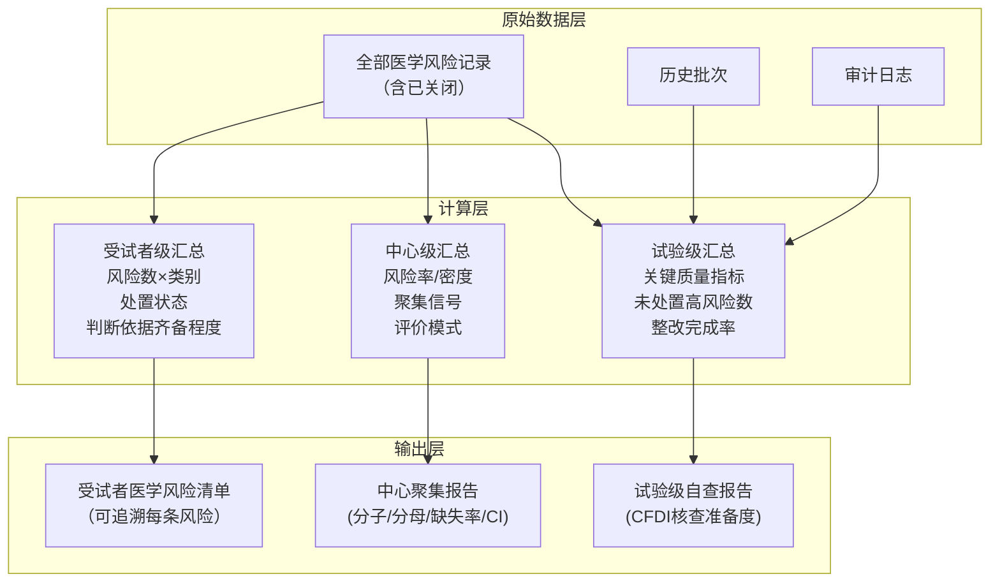
```mermaid
graph TD
    subgraph 原始数据["原始数据层"]
        RISKS["全部医学风险记录<br/>（含已关闭）"]
        BATCHES["历史批次"]
        AUDIT["审计日志"]
    end

    subgraph 计算层["计算层"]
        SUBJ_AGG["受试者级汇总<br/>风险数×类别<br/>处置状态<br/>判断依据齐备程度"]
        CENTER_AGG["中心级汇总<br/>风险率/密度<br/>聚集信号<br/>评价模式"]
        TRIAL_AGG["试验级汇总<br/>关键质量指标<br/>未处置高风险数<br/>整改完成率"]
    end

    subgraph 输出层["输出层"]
        SUBJ_CHECK["受试者医学风险清单<br/>（可追溯每条风险）"]
        CENTER_REPORT["中心聚集报告<br/>(分子/分母/缺失率/CI)"]
        TRIAL_REPORT["试验级自查报告<br/>(CFDI核查准备度)"]
    end

    RISKS --> SUBJ_AGG
    RISKS --> CENTER_AGG
    RISKS --> TRIAL_AGG
    BATCHES --> TRIAL_AGG
    AUDIT --> TRIAL_AGG

    SUBJ_AGG --> SUBJ_CHECK
    CENTER_AGG --> CENTER_REPORT
    TRIAL_AGG --> TRIAL_REPORT
```

**图12-1：核查前三层汇总。** 受试者级 → 中心级 → 试验级，每层可向下追溯。

### 12.2 核查前自查的核心输出

| 输出 | 内容 | 用途 |
|---|---|---|
| **受试者级风险清单** | 每例受试者的全部风险、处置状态和证据摘要 | CFDI 核查时逐例说明 |
| **中心级聚集分析** | 各中心的风险分布、评价模式（如 NCS 使用率）、分子/分母/缺失率/置信区间 | 识别中心级系统性问题 |
| **试验级自查报告** | 关键质量指标（未处置高风险数、整改完成率、判断依据齐备程度）、历史批次趋势 | 申办方内部自查和核查前准备 |
| **可筛选证据材料** | 按受试者、中心和风险类别汇集的证据原文、方案依据和处置记录 | 核查时快速出示证据 |
| **整改状态矩阵** | 每条高风险从发现、数据质疑/PD、整改到关闭的完整时间线和负责人 | 证明 CAPA 已完成 |
| **重复模式识别** | 跨受试者/中心的同类风险聚集（如同类实验室异常在某中心系统性标记 NCS） | 识别需要培训或流程改进的问题 |

核查前任务只有在三级数字逐层对账、中心聚集分析实际执行且所有达到项目复核条件的中心信号均有医学处置后才能标记完成。若样本量不足或无中心达到复核条件，系统保存“仅描述性分析/未发现达到复核条件的中心信号”及其分子、分母和方法依据，不以用户点击次数代替分析完成证据。

### 12.3 中心聚集信号方法

- 先报告分子、分母、缺失率和置信区间（Confidence Interval，CI），再根据项目批准的方法识别聚集信号。
- 可选方法包括：稳健四分位距（Robust Interquartile Range）、分层率差（Stratified Rate Difference）或基于项目分布的控制限（Control Limits）。
- 不得设置一个适用于所有指标和研究的通用离群阈值。
- 低于项目批准的最低样本量或最低有效观测数时，只展示描述性明细，不生成确定性“中心异常”结论；界面同时显示实际分子、分母与“样本量不足，无法评估聚集性”。最低样本量依据统计方法和项目数据分布确定，不预置跨项目通用数值。

*示例：核查前汇总发现示例中心A有 18/42 次明显异常实验室结果被标记 NCS，其他中心合计为 31/286。系统先展示两组分子、分母、指标构成、受试者明细和缺失率，再按项目批准方法提示“评估习惯可能存在聚集信号”。医学经理下钻后发现其中多数来自同一研究者对肌酸激酶运动后升高的统一解释，于是将部分病例记录为“已解释保留”，对其余无解释的肝酶和中性粒细胞异常形成中心培训及逐例数据质疑候选。系统不直接给出“中心不合规”结论。*

---

## 13. 统一医学风险分级与处置

### 13.1 严重度分级

| 严重度 | 定义 | 目标响应时限 | 说明性示例 |
|---|---|---|---|
| **高（High）** | 可能直接影响受试者安全或关键疗效/安全性数据可靠性的问题 | 按项目医学监查计划的高风险时限复核 | 达到项目高风险条件的异常未记录 AE、SAE 不一致、IP 严重偏离方案 |
| **中（Medium）** | 可能影响数据质量或方案依从性但不构成即时安全风险 | 按项目医学监查计划的中风险时限复核 | 达到项目中风险条件的异常、访视明显超窗、禁用药疑似违背 |
| **低（Low）** | 数据质量提示、轻微异常或需关注但不紧急的事项 | 按项目医学监查计划安排复核 | 参考范围缺失、NCS 标记模式偏差、轻微超窗 |

上述响应时限和示例用于说明分层方法。项目应结合药物风险、研究阶段、适应症、方案和医学监查计划批准具体映射，不得把某一 CTCAE 等级、天数或事件类型直接固定为所有项目的严重度。

### 13.2 置信度分级

置信度与严重度是两个独立维度。一条风险可以"高严重度 + 低置信度"（严重但证据不充分）或"低严重度 + 高置信度"（轻微但确定性高）。

| 置信度 | 定义 | 来源特征 |
|---|---|---|
| **高（High）** | 证据充分、规则确定性强 | 直接阈值比较、完整数据、无歧义 |
| **中（Medium）** | 证据基本可用但存在缺口 | 缺参考范围、缺访视日期、依赖单一数据点 |
| **低（Low）** | 证据片段或依赖 AI 推断 | 缺关键字段、需跨表推断、语义模糊 |

### 13.3 处置动作与分支

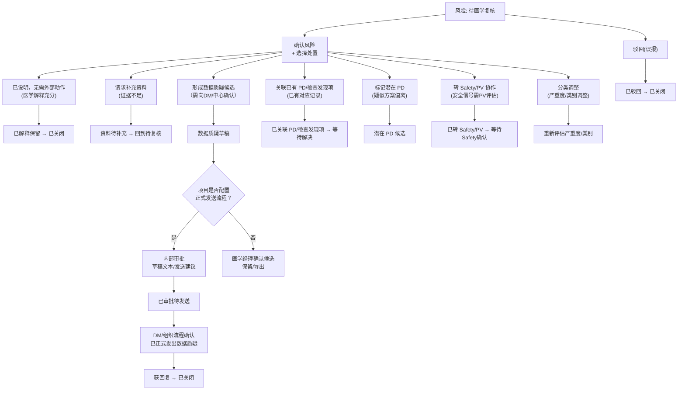
```mermaid
graph TD
    RISK["风险: 待医学复核"]
    RISK --> A["确认风险<br/>+ 选择处置"]

    A --> B1["已说明，无需外部动作<br/>(医学解释充分)"]
    A --> B2["请求补充资料<br/>(证据不足)"]
    A --> B3["形成数据质疑候选<br/>（需向DM/中心确认）"]
    A --> B4["关联已有 PD/检查发现项<br/>(已有对应记录)"]
    A --> B5["标记潜在 PD<br/>(疑似方案偏离)"]
    A --> B6["转 Safety/PV 协作<br/>(安全信号需PV评估)"]
    A --> B7["分类调整<br/>(严重度/类别调整)"]

    B1 --> CLOSE["已解释保留 → 已关闭"]
    B2 --> WAIT["资料待补充 → 回到待复核"]
    B3 --> DRAFT["数据质疑草稿"]
    DRAFT --> ROUTE{"项目是否配置<br/>正式发送流程？"}
    ROUTE -->|是| APPROVE["内部审批<br/>草稿文本/发送建议"]
    APPROVE --> READY["已审批待发送"]
    READY --> ISSUE["DM/组织流程确认<br/>已正式发出数据质疑"]
    ROUTE -->|否| KEEP["医学经理确认候选<br/>保留/导出"]
    ISSUE --> REPLY["获回复 → 已关闭"]

    B4 --> LINKED["已关联 PD/检查发现项 → 等待解决"]
    B5 --> PD_DRAFT["潜在 PD 候选"]

    B6 --> SAFETY["已转 Safety/PV → 等待Safety确认"]
    B7 --> RE_EVAL["重新评估严重度/类别"]

    RISK --> REJECT["驳回(误报)"]
    REJECT --> CLOSE2["已驳回 → 已关闭"]
```

**图13-1：处置分支决策树。** 无需发出数据质疑的分支，在医学确认后进入相应处置状态。数据质疑草稿是否进入内部审批和正式发送取决于项目配置：内部审批仅批准草稿文本和发送建议，不等于已经向 EDC、数据管理或研究中心正式发送，也不批准医学经理已经完成的医学判断。Checklist 的当前处置应区分“Query 候选”“待内部审批”“已审批待发送”和“已正式发出”。

### 13.4 四级医学判断

每次处置时，医学经理需完成四项结构化医学判断：

| 判断 | 选项 | 含义 |
|---|---|---|
| **患者安全** | 无即时安全风险 / 需关注 / 需紧急行动 | 从受试者安全角度评估 |
| **关键疗效/安全性数据** | 不受影响 / 可能受影响 / 确定受影响 | 评估对试验结论的影响程度 |
| **数据质疑需求** | 无需发出 / 建议发出 / 必须发出 | 是否需要向数据管理或研究中心发出数据质疑 |
| **锁库/导出影响** | 不阻塞 / 需在锁库前解决 / 阻塞锁库 | 对数据库锁定的影响 |

这四项判断随风险持久化。刷新页面或重新打开风险详情时，已完成判断保留。风险离开"待医学复核"状态后，判断锁定（不可修改），除非风险进入"需重新复核"状态。

### 13.5 正文案例：基于置信度差异的处置分化

*示例：两条同属"疑似 AE 漏报—实验室异常"的低风险，但因置信度不同而走向不同处置路径。*

*示例：风险 R-0012（示例受试者01，判断可信度高）：ALT 313 U/L（ULN=41 U/L），7.6×ULN，对应 CTCAE 3 级。参考范围完整，采样日期明确（V4D29），基线 ALT（筛选期 22 U/L，正常）。系统自动匹配的方案表4第4行显示“ALT>3×ULN 需评估因果关系并考虑暂停给药”。证据面板逐项显示原始值、参考范围、基线、日期、适用方案条款和 AE 检索结果均已取得。医学经理复核后确认：“ALT 升高达 CTCAE 3 级，但 AE 域无对应记录，需发出数据质疑。”随后形成数据质疑候选；若项目配置内部审批，则先审批草稿文本和发送建议，再由数据管理或配置的组织流程确认正式发送。*

*风险 R-0023（受试者 示例受试者02，低置信度）：瘙痒数字评分量表（Numerical Rating Scale，NRS）从基线 8 分升至 V2D15 的 9 分，但该指标无适用 CTCAE 条目，项目也未批准“有临床意义的变化阈值”。若旧版规则曾以“较基线上升≥1分”触发，该结果必须标记为配置缺陷，而非可处置医学风险。医学经理复核后判断：“单次1分变化缺少项目阈值和其他客观证据支持，不能据此推断疾病恶化或 AE。”→ 驳回候选，并将该规则退回配置治理流程；在阈值获得医学批准前停止继续触发。*

---

## 14. AE/MH 漏报与检验检查风险规则

### 14.1 规则族全景

AE/MH 漏报研判是医学监查中最复杂、最依赖医学判断的风险族。系统不自动确认 AE 或 MH，而是基于确定性规则 + AI 语义辅助，生成结构化的"疑似 AE 漏报"或"疑似 MH 漏报"候选风险。

#### 14.1.1 医学目的

在持续更新的实验室检查、生命体征、心电图（Electrocardiogram，ECG）和体格检查数据中，识别以下模式：
- 出现新的、或较基线加重的临床显著异常，但在 AE 域中无对应记录；
- 基线前已存在的异常/疾病，在 MH 域中无对应记录；
- 检验检查异常与已记录 AE/MH 之间的方向、严重度、时间不一致。

#### 14.1.2 数据域与最小字段

| 数据域 | 最小必需字段 | 理想字段 |
|---|---|---|
| **实验室检查（Laboratory，LB）** | test_name, result, unit, collection_date, visit_name, subject_id | ref_range_low, ref_range_high, cs_ncs_flag, baseline_value, baseline_date, method, fasting_status |
| **生命体征（Vital Signs，VS）** | test_name, result, unit, collection_date, visit_name, subject_id | ref_range_low, ref_range_high, cs_ncs_flag, position, baseline_value |
| **心电图（ECG）** | overall_assessment, assessment_date, visit_name, subject_id | hr, pr, qrs, qt, qtcf, findings_text, cs_ncs_flag |
| **体格检查（Physical Exam，PE）** | finding_text, exam_date, visit_name, subject_id | body_system, cs_ncs_flag, baseline_finding |
| **AE** | ae_term, ae_start_date, ae_end_date, severity_grade, seriousness, causality, subject_id | ae_action_taken, ip_action, outcome, aesci_flag, ae_end_ongoing_flag |
| **MH** | mh_term, mh_start_date, mh_end_date, ongoing_flag, subject_id | mh_severity, mh_related_to_study |

#### 14.1.3 方案依赖

- 基线定义：方案中基线访视（筛选期/导入期/给药前）的确定方式、多重检测的优先级（如筛选期 vs C1D1 预给药）和基线取值方法（最近一次/平均值/最小值）。
- AESI 清单：方案中需要特别关注的不良事件及其诊断标准。
- CTCAE 版本和适用条目：方案引用的具体 CTCAE 版本、适用条目列表和项目自定义的严重度调整。
- 异常变化阈值：方案中定义的"有临床意义的变化"，如体重变化 >5%、QTcF 延长 >60ms 等。

#### 14.1.4 基线定义的提取与确认

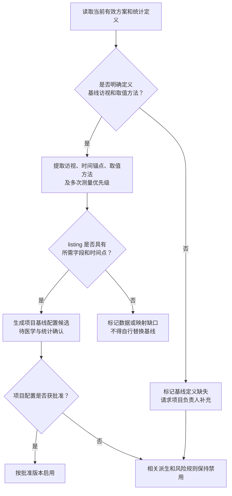
```mermaid
graph TD
    START["读取当前有效方案和统计定义"]
    START --> Q1{"是否明确定义<br/>基线访视和取值方法？"}
    Q1 -->|是| EXTRACT["提取访视、时间锚点、取值方法<br/>及多次测量优先级"]
    EXTRACT --> MAP{"listing 是否具有<br/>所需字段和时间点？"}
    MAP -->|是| APPLY["生成项目基线配置候选<br/>待医学与统计确认"]
    MAP -->|否| GAP["标记数据或映射缺口<br/>不得自行替换基线"]
    Q1 -->|否| UNDEFINED["标记基线定义缺失<br/>请求项目负责人补充"]
    UNDEFINED --> BLOCK["相关派生和风险规则保持禁用"]
    APPLY --> APPROVE{"项目配置是否获批准？"}
    APPROVE -->|是| ENABLE["按批准版本启用"]
    APPROVE -->|否| BLOCK
```

**图14-1：基线定义提取与确认流程。** 系统只能执行方案、统计分析计划或项目批准文件中明确的基线定义。定义缺失时不得自行选择筛选期、给药前或导入期数据替代。

#### 14.1.5 候选触发条件

| 触发条件编号 | 条件描述 | 输入需求 |
|---|---|---|
| T-AE-01 | 基线正常（在参考范围内），给药后异常（超出参考范围） | 参考范围 + 基线值 |
| T-AE-02 | 基线异常但给药后 CTCAE 等级上升 ≥1 级 | CTCAE 版本 + 条目 + 单位换算 |
| T-AE-03 | 无适用 CTCAE 条目，但达到项目确认的变化阈值 | 项目可配置阈值（如变化 >20%） |
| T-AE-04 | 同一检验项目的 CS/NCS 评价前后不一致（如前一次访视 CS、后一次 NCS 但数值更差） | CS/NCS 标记 + 历次数值 |
| T-AE-05 | 标记为 CS 但无对应的 AE 或解释说明 | CS 标记 + AE 域交叉检查 |
| T-AE-06 | 标记为 NCS 或“未评价”，且达到项目批准的 CTCAE 筛查等级 | NCS 标记 + CTCAE 等级 + 项目筛查配置 |
| T-AE-07 | 新发 ECG 异常（如新发房颤、显著 ST-T 改变） | ECG 整体评价 + 基线 ECG |
| T-AE-08 | 同一检验项目持续或反复异常，达到项目批准的次数或持续时间条件 | 历次访视数据 + 项目持续性配置 |
| T-AE-09 | 异常程度呈加重趋势，达到项目批准的等级变化条件 | 历次 CTCAE 等级 + 项目趋势配置 |
| T-AE-10 | 异常方向与所引 AE 术语或 MH 术语不一致 | AE/MH 术语语义 × 异常方向 |
| T-AE-11 | 同一受试者在项目批准的相近时间窗口内出现多系统实验室异常 | 跨系统多指标异常；窗口按疾病、访视密度和医学目的配置 |
| T-MH-01 | 基线时已存在的异常（筛选期超出参考范围），但在 MH 域中无对应记录 | 筛选期数据 + MH 域交叉检查 |
| T-MH-02 | 筛选期异常达到项目批准的 MH 复核条件且无对应 MH | CTCAE 或项目筛查参数 + MH 交叉检查 + 项目配置 |

#### 14.1.6 排除/降级条件

| 排除条件编号 | 条件描述 | 降级后操作 |
|---|---|---|
| E-01 | 仅一次轻微越界且后续访视恢复；“轻微”边界由项目批准 | 降为低严重度 + 标注“单次轻微越界，已恢复” |
| E-02 | 基线异常但给药后未升级且达到项目定义的稳定标准 | 降为低或排除 + 标注“基线异常已稳定” |
| E-03 | 已被同医学方向的 AE/MH 覆盖——且方向一致、时间区间重叠、严重度对应 | 排除 + 记录覆盖关系 |
| E-04 | 方案或实验室方法文件明确标注为"非临床异常"或"已知方法学偏差" | 排除 + 引用实验室方法说明 |
| E-05 | 异常可被受试者已知生理状态充分解释（如剧烈运动后 CK 升高、月经期 HGB 下降） | 降级 + 标注可能的生理原因（需医学确认） |
| E-06 | 生命体征单次测量异常但复查正常 | 排除 + 标注"复查正常" |
| E-07 | 心电图异常已被研究者明确评价为 NCS 且与既往一致 | 降级 + 标注"NCS、与既往一致" |

#### 14.1.7 CTCAE 版本化管理

- CTCAE 版本（如 v4.03、v5.0）必须在项目配置时选择，并应用于所有相关规则计算。
- 不同版本的条目名称、等级阈值、单位可能不同。例如 CTCAE v5.0 中"Anemia"的 HGB 阈值与 v4.03 不同。
- 若某检验项目无适用 CTCAE 条目（如 NRS 评分、某些新型生物标志物），规则引擎只能使用项目批准的可配置变化阈值进行筛查，并明确标注“无适用 CTCAE 条目，使用项目批准阈值”。
- 禁止使用"LDL"等术语泛化匹配所有含"LDL"的检验项——必须按精确 test_name 或项目配置的 test_code 映射。
- 单位换算（如 g/L ↔ g/dL、IU/L ↔ μkat/L）由规则引擎根据配置的单位换算表执行，换算错误时标记"单位换算失败"，不影响原始值展示。

#### 14.1.8 非 CTCAE 指标的项目筛查参数

对于无 CTCAE 条目的检验/检查指标（如瘙痒 NRS、疼痛视觉模拟量表或某些实验室新指标），系统提供禁用状态的参数模板。项目医学负责人必须结合量表测量学特征、适应症自然史、方案终点定义和检测误差，逐项批准后方可启用。模板值不是普适医学标准，也不得跨项目自动继承。

| 参数 | 可配置形式 | 批准时必须说明 |
|---|---|---|
| 数值型指标相对变化 | 相对基线变化百分比 | 基线选择、检测误差、临床意义与触发方向 |
| 数值型指标绝对变化 | 带单位的绝对差值 | 单位、检测方法、临床意义与复测条件 |
| 评分量表变化 | 分值差、响应分类或最小临床重要差异 | 量表范围、验证证据、评估时间点与缺失处理 |

*示例：某项目拟用“相对基线变化超过20%”筛查一个无 CTCAE 条目的探索性生物标志物。系统先将该数值显示为未启用候选参数，并要求医学负责人补充基线定义、分析单位、检测批间变异和20%的医学依据。若检测方法本身的变异可接近该幅度，参数不得批准；若最终批准，则规则对象保存批准人、批准日期、依据和适用方案版本，不能复制到其他项目。*

#### 14.1.9 语义覆盖判断（AI 辅助）

当系统需要通过语义判断"已有 AE/MH 是否覆盖当前异常"时，AI 服务可以辅助：
- 比较 AE 术语（如"ALT 升高"）与检验异常（ALT 313 U/L）的语义匹配度；
- 比较 MH 术语（如"高脂血症"）与筛选期异常（甘油三酯 3.2 mmol/L）的语义匹配度；
- 比较异常方向（如 HGB 下降 → 应匹配"贫血"而非"红细胞增多"）。

AI 语义匹配结果以“待确认匹配”形式返回，始终标注判断可信度和所用模型信息。医学经理需确认该匹配关系是否成立。

#### 14.1.10 严重度与判断可信度的项目配置

下表是**说明性配置示例**，用于展示异常程度与判断依据如何共同形成筛查优先级，不构成跨项目通用分级。实际严重度还需结合方案、AESI、受试者临床状态、研究药物已知风险和项目医学监查计划批准。

| 异常程度 | 判断依据齐备程度 | 严重度 | 判断可信度 |
|---|---|---|---|
| CTCAE ≥3 级 | 完整 | 高 | 高 |
| CTCAE ≥3 级 | 缺参考范围或基线 | 高 | 中 |
| CTCAE 2 级 | 完整 | 中 | 高 |
| CTCAE 2 级 | 缺部分证据 | 中 | 低-中 |
| CTCAE 1 级 | 完整 | 低 | 高 |
| CTCAE 1 级 | 缺部分证据 | 低 | 低-中 |
| 非 CTCAE 指标 | 完整 | 取决于项目阈值 | 中 |
| 非 CTCAE 指标 | 缺部分证据 | 低 | 低 |

#### 14.1.11 处置建议的说明性映射

下表仅示范规则结果如何进入处置队列。各项目应在医学监查计划中批准响应时限、责任人和升级路径。

| 风险类型 | 建议处置 |
|---|---|
| CTCAE ≥3 级 + 判断可信度高 + 无已知 AE | 立即复核 → 高风险分派 → 通常需要发出数据质疑 |
| CTCAE 2 级 + 中置信度 | 本批次内复核 → 如已有对应 AE 则关闭，如无则考虑补充资料 |
| CTCAE 1 级 + 高置信度 | 记录观察 → 可在下次监查累积复核 |
| 非 CTCAE 指标 + 低置信度 | 标记待更多数据后复核 → 建议调整筛查参数 |
| 疑似 MH 漏报 + 筛选期 | 对照既往病史记录 → 如已有对应 MH，关闭 |

#### 14.1.12 AE/MH 风险决策树

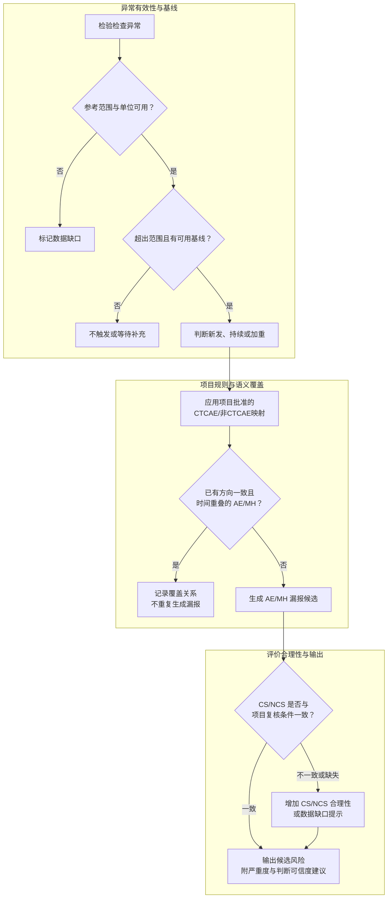
```mermaid
flowchart TB
    subgraph R1["异常有效性与基线"]
        direction LR
        A["检验检查异常"] --> B{"参考范围与单位可用？"} -->|否| GAP["标记数据缺口"]
        B -->|是| C{"超出范围且有可用基线？"}
        C -->|否| STOP["不触发或等待补充"]
        C -->|是| D["判断新发、持续或加重"]
    end
    subgraph R2["项目规则与语义覆盖"]
        direction LR
        D --> E["应用项目批准的<br/>CTCAE/非CTCAE映射"] --> F{"已有方向一致且<br/>时间重叠的 AE/MH？"}
        F -->|是| COVER["记录覆盖关系<br/>不重复生成漏报"]
        F -->|否| G["生成 AE/MH 漏报候选"]
    end
    subgraph R3["评价合理性与输出"]
        direction LR
        G --> H{"CS/NCS 是否与<br/>项目复核条件一致？"}
        H -->|一致| I["输出候选风险<br/>附严重度与判断可信度建议"]
        H -->|不一致或缺失| J["增加 CS/NCS 合理性<br/>或数据缺口提示"] --> I
    end
```

**图14-2：AE/MH 风险决策树。** 完整覆盖从异常检出到候选风险生成的逻辑路径。图中的严重度映射和复核条件均读取项目批准配置，不以固定 CTCAE 等级作为跨项目默认规则。

#### 14.1.13 规则运行返回的标准结构

规则引擎不直接写界面文案，而是返回标准化结果。以下为**说明性 JSON 示例**；其中检验项目、数值、日期、访视和模板编号均用于演示字段结构，不是系统固定值：

```json
{
  "rule_id": "RULE_AE_LB_001",
  "rule_version": "v2.1",
  "subject_id": "示例受试者01",
  "triggered": true,
  "trigger_conditions_met": ["T-AE-01", "T-AE-02"],
  "exclusion_conditions_met": [],
  "fact_fragments": [
    {
      "domain": "LB",
      "test_name": "ALT",
      "current_value": 313,
      "current_unit": "U/L",
      "ref_range_high": 41,
      "baseline_value": 22,
      "ctcae_grade": 3,
      "ctcae_version": "v5.0",
      "collection_date": "2026-04-12",
      "visit": "V4D29"
    }
  ],
  "severity_suggestion": "high",
  "confidence": "high",
  "data_gaps": [],
  "suggested_action": "confirm_ae_query",
  "evidence_template_ref": "TPL_AE_LB_ALT"
}
```

#### 14.1.14 正文案例：基线异常避免 MH 误报——语义覆盖降级

*示例：受试者 示例受试者03（男，56岁，既往病史含"2型糖尿病"和"高脂血症"），筛选期（2025-11-03）空腹甘油三酯（Triglyceride，TG）2.8 mmol/L（参考范围 <1.7 mmol/L）。基线后 V2D15（2025-12-01）、V4D29（2026-01-14）和 V6D57（2026-02-11）的 TG 分别为 2.6、2.9 和 2.7 mmol/L。*

*系统初次运算时，筛选期 TG 2.8 mmol/L 超出参考范围，触发 T-MH-01（筛选期异常无对应 MH）候选。但 AI 语义覆盖分析识别出 MH 域中的"高脂血症"（MH 记录：起始日期 2019-03，持续）与筛选期 TG 升高语义匹配（方向一致：TG 升高对应于高脂血症）。系统将风险标记为"已有 MH 覆盖"，严重度降为低，置信度标记为中（需医学经理确认覆盖关系）。*

*同时，系统检查基线后 TG 趋势：2.8→2.6→2.9→2.7 mmol/L，波动 <20% 且未升级（无 CTCAE 条目直接对应 TG 的具体阈值）。满足排除条件 E-02（基线异常但已稳定），系统将严重度进一步降至低，并在证据中说明"TG 持续轻度升高但无恶化趋势，基线异常，MH 已覆盖"。*

*医学经理复核后确认：高脂血症已知，TG 波动在稳定范围内，关闭风险（"已解释保留"）。*

---

## 15. 试验药物变更、剂量调整与依从性规则

### 15.1 医学目的

监测试验药物执行与方案给药方案的一致性，识别暂停、减量、加量、停药、重启、漏服、多服、给药延迟及其他剂量调整，评估其依据的合理性（特别是 AE 触发的调整是否与方案规定一致），计算依从性并标记超出方案阈值的受试者。

### 15.2 数据域与最小字段

| 字段 | 说明 | 来源语义（由项目映射配置） |
|---|---|---|
| subject_id | 受试者编号 | 所有试验药物相关数据表的受试者标识 |
| drug_name | 试验药物名称（含剂量规格） | 给药、发放或回收记录中的药物标识 |
| dose | 实际给药剂量 | 给药或用药日记记录 |
| dose_unit | 剂量单位 | 给药或用药日记记录 |
| frequency | 给药频次 | 给药计划与实际给药记录 |
| route | 给药途径 | 给药计划与实际给药记录 |
| administration_date | 给药日期 | 给药记录或用药日记 |
| administration_time | 给药时间（如有） | 给药记录或用药日记 |
| planned_dose | 计划剂量（按方案和随机分组） | 当前有效方案、治疗分组与剂量计算配置 |
| dose_change_reason | 剂量调整原因 | 给药变更或剂量调整记录 |
| ae_related_flag | 是否与 AE 相关 | 给药变更或剂量调整记录 |
| pause_start_date | 暂停起始日期 | 给药变更记录 |
| pause_end_date | 暂停结束日期 | 给药变更记录 |
| restart_date | 重启日期 | 给药变更记录 |
| discontinuation_date | 停药日期 | 给药变更或研究终止记录 |
| discontinuation_reason | 停药原因 | 给药变更或研究终止记录 |
| dispensed_qty | 发放数量 | 药物发放记录 |
| returned_qty | 回收数量 | 药物回收记录 |
| compliance_pct | 依从性百分比（计算或直接录入） | 按项目批准公式派生或读取项目记录 |

项目导出的表名可能使用任意编码或中文名称。系统先完成字段语义映射，再运行规则；不得把某个项目的 ECB、ECA、DA、EX 等表名写成跨项目固定依赖。

### 15.3 方案依赖

- 给药方案：从当前有效方案提取剂量、频次、途径、周期、给药日和给药时间窗；方案未定义时不得补入默认时间窗。
- 剂量调整规则：提取 AE 或检验检查触发的暂停、减量、加量、永久停药、重启条件及相应剂量；具体等级、数值和恢复条件均为项目配置。
- 依从性规则：提取方案规定的计算公式、合格范围、观察周期和缺失数据处理方法；不得内置跨项目通用的合格范围。

### 15.4 确定性规则

| 规则编号 | 规则名称 | 触发条件 |
|---|---|---|
| IP-R01 | 剂量与方案不一致 | 实际剂量 ≠ 按方案/随机分组/体重/BSA 计算的计划剂量 |
| IP-R02 | 频次与方案不一致 | 实际给药间隔 ≠ 方案规定（如 QD 变 BID） |
| IP-R03 | 无依据剂量调整 | 剂量发生变化但 DA/ECA 中无对应的调整原因记录 |
| IP-R04 | AE 触发处理与方案不一致 | AE 严重度满足方案规定的暂停/减量条件，但 IP 记录中无对应动作；或 IP 暂停/减量/停药，但 AE 记录中无对应严重度的 AE |
| IP-R05 | 停药后重启违反方案 | 停药原因未解决即重启、或重启剂量违反方案规定、或重启超出方案允许的时间窗 |
| IP-R06 | 依从性超出方案阈值 | 按项目批准公式计算依从性，结果低于或高于当前方案规定范围 |
| IP-R07 | IP 执行记录与 AE 时间不一致 | AE 起始日期与 IP 调整日期的先后关系矛盾 |
| IP-R08 | IP 执行记录与 CM 时间不一致 | 特定 CM（如禁用药）的使用时间与 IP 给药时间的先后关系 |
| IP-R09 | 漏服/多服记录 | 给药记录与方案规定次数不一致（日/周/周期累计） |
| IP-R10 | 停药但无终止记录 | 给药中断超过方案允许的最长间隔，但无正式停药记录 |

### 15.5 必须明确区分试验药物与合并用药

试验药物变更**必须**进入独立数据域和独立风险类别。以下为不可违反的边界：

| 事项 | 归属 | 错误归属 |
|---|---|---|
| 暂停给药 | IP 域—试验药物暂停 | 不得归入 CM |
| 减量 | IP 域—试验药物减量 | 不得归入 CM |
| 加量 | IP 域—试验药物加量 | 不得归入 CM |
| 永久停药 | IP 域—试验药物终止 | 不得归入 CM |
| 重启给药 | IP 域—试验药物重启 | 不得归入 CM |
| 漏服/多服 | IP 域—试验药物依从性 | 不得归入 CM |
| 给药延迟 | IP 域—试验药物时间窗 | 不得归入 CM |
| 剂量调整 | IP 域—试验药物剂量调整 | 不得归入 CM |
| 非试验用药（如合并降压药） | CM 域 | 正确归属 |

> **原因：** 试验药物执行偏差直接影响受试者安全性（剂量错误、漏服可能影响疗效评估）和试验结果可靠性。将 IP 变更混入 CM 会导致关键风险被淹没在大量合并用药记录中。

按方案正确执行的暂停、减量、停药或重启仍作为试验药物事件显示在 Subject Timeline 和 Patient Profile 中，但不生成“试验药物执行偏差”风险。只有动作缺失、延迟、剂量/条件错误、依据不一致或记录不完整时，才形成疑似执行偏差候选；系统不得把“发生过剂量调整”本身等同于 PD。

### 15.6 正文案例：AE 触发的 IP 暂停与重启不一致

*示例：受试者 示例受试者04（男，34岁，试验组）在一项免疫介导疾病研究中接受试验药物 X 150 mg QD。*

*2025-12-15（V2D15）血常规显示中性粒细胞绝对计数（Absolute Neutrophil Count，ANC）为 1.24 ×10⁹/L（参考范围 1.80-7.70 ×10⁹/L），对应 CTCAE v5.0 2 级（1.0-<1.5 ×10⁹/L）。按方案 Section 7.3.2.1："若 ANC <1.5×10⁹/L，暂停给药，每周监测血常规，待 ANC 恢复至 ≥1.5×10⁹/L 后以原剂量重启。"*

*给药记录（ECA）显示：*
- *2025-12-15：暂停给药（理由："中性粒细胞减少，按方案处理"）✓*
- *2025-12-22：复查 ANC=1.68 ×10⁹/L（已恢复至 ≥1.5 ×10⁹/L）✓*
- *2025-12-23：以原剂量 150 mg QD 重启给药 ✓*

*此例中各步骤与方案一致，系统不产生风险。*

**然而**，同一研究另一受试者 示例受试者05（女，41岁）：
- *2025-12-20（V2D20）：ANC=1.31 ×10⁹/L（CTCAE 2 级）*
- *ECA 记录：无暂停给药记录，AEDOSE 仍为 150 mg。*
- *直到 2026-01-17（V4D45）才出现暂停记录，暂停理由为"ANC 1.08"，但此前已有三次 ANC <1.5 的访视。*

*系统同时触发 IP-R04（AE 触发处理与方案不一致）和 IP-R01（剂量与方案不一致）。规则引擎交叉核查 AE 域→无中性粒细胞减少 AE 记录（另触发 AE 漏报风险）。*

*系统为该受试者生成两条风险：*
1. *试验药物执行偏差（高严重度、高置信度）："V2D20 起 ANC 持续 <1.5 ×10⁹/L 但给药未暂停，违反方案 Section 7.3.2.1"。证据：ECA 行 45-67、方案段落 1609、LBHEMA 行 231/312/398。*
2. *疑似 AE 漏报（中严重度、高置信度）："ANC 1.08-1.31 ×10⁹/L 达 CTCAE 2 级，AE 域无对应记录"。*

*医学经理复核后确认两条风险，形成复合数据质疑候选：“请确认示例受试者05于 2025-12-20 至 2026-01-17 期间的中性粒细胞减少是否已记录为 AE？为何给药未按方案暂停？”*

---

## 16. 合并用药、禁限用药与洗脱规则

### 16.1 医学目的

核查受试者在试验期间使用的非试验用药/治疗是否符合方案规定，识别禁用药（Prohibited Medication）使用、限制用药（Restricted Medication）条件违背、洗脱期不足和救援用药（Rescue Medication）使用，评估其对受试者安全性和疗效评估的影响。

### 16.2 CM 数据域与最小字段

| 字段 | 说明 |
|---|---|
| cm_term | 用药/治疗名称（原始录入） |
| cm_generic_name | 通用名（经编码字典映射） |
| cm_ingredient | 核心成分 |
| cm_class | 药物类别（ATC 分类或项目定义分类） |
| cm_route | 给药途径 |
| cm_dose | 剂量 |
| cm_frequency | 频次 |
| cm_start_date | 起始日期 |
| cm_end_date | 结束日期 |
| cm_ongoing | 是否持续 |
| cm_indication | 适应证/使用原因 |
| cm_ae_related | 是否与 AE 相关 |

### 16.3 方案解构要求与项目配置

系统不维护可跨项目直接套用的禁限用药清单。每个项目均须从当前有效方案、修正案及经批准的医学监查文件中重新提取规则，并形成带版本的项目配置。方案更新后，旧配置保留用于历史批次追溯，新配置经医学确认后才可用于后续批次。

| 规则元素 | 应提取的内容 | 结构化要求 | 缺失或冲突时的处理 |
|---|---|---|---|
| 受控对象 | 具体药物、通用名、活性成分、药物类别或非药物治疗 | 同时保留方案原文和标准化术语；注明匹配粒度 | 不得从其他项目复制清单；提交医学确认 |
| 管控类型 | 禁止、限制、必须使用、背景治疗、救援治疗或例外 | 使用枚举值，并允许保留项目自定义类型 | 无法明确分类时保持未启用 |
| 适用阶段 | 筛选期、洗脱期、导入期、治疗期、随访期或特定疗效评估窗 | 绑定开始锚点、结束锚点和开闭区间 | 时间锚点不清时不得计算违背 |
| 时间要求 | 固定时长、半衰期倍数、二者取较长者或特定访视前窗口 | 保存原始表达、标准化时长及计算公式 | 仅保存候选规则，等待医学确认 |
| 用药限制 | 途径、剂量、频次、疗程、适应证、使用部位或累计量 | 每个限制条件独立建模，并明确逻辑关系 | 不得将部分条件简化为全药物禁止 |
| 例外与救援 | 允许情形、救援条件、使用上限及是否影响疗效评估 | 与主规则关联，记录优先级和覆盖范围 | 例外不完整时不得自动判定为允许 |
| 溯源与版本 | 原文条款、章节/页码、方案版本、生效日期 | 每条规则必须可回到当前有效方案原文 | 来源失效或版本冲突时停用相关规则 |
| 审核状态 | 提取人、医学确认人、确认日期和适用批次 | 未确认、已确认、已停用三类状态 | 未确认规则仅可预览，不进入正式风险判定 |

*说明性项目配置示例：以下内容仅演示某一虚构免疫介导疾病研究如何把方案条款转为结构化配置，不构成任何其他项目的禁限用药规则，也不得作为系统默认值。*

| 示例受控对象 | 示例类别 | 示例途径 | 示例管控类型 | 示例时间要求 | 示例例外条件 | 示例救援设置 |
|---|---|---|---|---|---|---|
| 口服或注射糖皮质激素 | 全身糖皮质激素 | 口服/注射 | 禁止 | 随机前 4 周及治疗期 | 特定部位局部外用按方案另行判断 | 无 |
| 甲氨蝶呤 | 改善病情抗风湿药 | 口服/注射 | 禁止 | 4 周或 5 个半衰期，取较长者 | 无 | 无 |
| 对乙酰氨基酚 | 解热镇痛药 | 口服 | 限制使用 | 每日和每周使用上限按示例方案配置 | 指定适应证下允许 | 可作为救援药 |
| 强效 CYP3A4 抑制剂 | 药物相互作用相关类别 | 按实际记录 | 禁止 | 示例方案规定的给药前窗口 | 无 | 无 |

### 16.4 禁限用药匹配规则

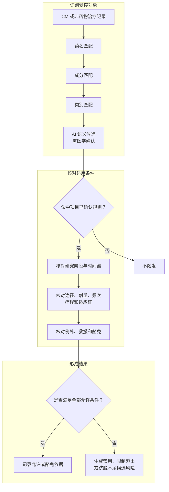
```mermaid
flowchart TB
    subgraph R1["识别受控对象"]
        direction LR
        A["CM 或非药物治疗记录"] --> B["药名匹配"] --> C["成分匹配"] --> D["类别匹配"] --> E["AI 语义候选<br/>需医学确认"]
    end
    E --> F{"命中项目已确认规则？"}
    F -->|否| PASS["不触发"]
    subgraph R2["核对适用条件"]
        direction LR
        F -->|是| G["核对研究阶段与时间窗"] --> H["核对途径、剂量、频次<br/>疗程和适应证"] --> I["核对例外、救援和豁免"]
    end
    subgraph R3["形成结果"]
        direction LR
        I --> J{"是否满足全部允许条件？"}
        J -->|是| ALLOW["记录允许或豁免依据"]
        J -->|否| RISK["生成禁用、限制超出<br/>或洗脱不足候选风险"]
    end
```

**图16-1：禁限用药匹配与决策树。** 四级匹配（药名→成分→类别→AI语义）× 禁止/限制/豁免/洗脱逻辑。

### 16.5 匹配层级

下表中的药物名称仅用于说明匹配方法，不构成固定字典或禁限用药判断。实际匹配对象、类别和结论均来自当前项目已确认配置。

| 匹配层级 | 方法 | 置信度 | 示例 |
|---|---|---|---|
| **1-药名级** | 原始 CM 药名与方案禁限用药清单精确/模糊匹配 | 高 | CM: "泼尼松" → 方案禁用药清单含"泼尼松" |
| **2-成分级** | CM 的通用名或核心成分与方案清单匹配 | 高 | CM: "美卓乐" → 通用名"甲泼尼龙" → 方案禁"全身糖皮质激素" |
| **3-类别级** | CM 的 ATC 分类或项目定义类别与方案匹配 | 中-高 | CM: "酮康唑" → ATC J02AB02 → 方案禁"CYP3A4 强抑制剂" |
| **4-AI 语义级** | AI 评估 CM 术语与方案禁限用药描述的语义相似度 | 中（需医学确认） | CM: "某某复方感冒灵" → AI 识别含"伪麻黄碱"成分 → 候选匹配 |

### 16.6 关键约束

- **日期窗口精确：** 仅当 CM 使用日期与试验给药日期存在重叠（或位于方案规定的洗脱期内）时才触发。既往用药（CM 结束日期早于首次给药前且超出洗脱期）不触发。
- **洗脱期计算：** 按方案规定的固定天数或药物半衰期倍数（取较长者）。例如某药物半衰期 40h，方案规定洗脱 5 个半衰期 = 200h ≈ 8.3 天，但若方案另有"至少 4 周"的规定，则以 28 天为准（取较长者）。
- **救援药豁免：** 方案明确允许的救援药在满足适应证、剂量、频次和时间窗等全部条件时，不触发禁用药候选风险；超出条件时仍需复核。救援药的频繁使用可按项目批准规则形成疗效或依从性关注项，但不能据此直接判定方案偏离。
- **PD/数据质疑候选≠PD 判定：** 系统生成的是"禁用药疑似 PD"候选风险。是否构成 PD 必须由医学经理根据方案 PD 分级口径和具体情况判断。
- **事件级匹配：** 禁用药 PD 匹配必须是事件级——不能因为同一受试者存在一条已登记的 PD 就把同一药物的其他使用自动视为"已登记"。

### 16.7 正文案例：禁限用药的时间窗口匹配

*示例：某 III 期中重度银屑病研究，方案 Section 5.8 规定："禁止在随机前 4 周内及试验期间使用全身性糖皮质激素。局部外用糖皮质激素允许用于非银屑病皮肤病变，但面积不得超过体表面积 10%。"*

*受试者 示例受试者06（女，38岁）的合并用药记录显示：*
- *CM 记录 1：甲泼尼龙片 4 mg QD，起始日期 2025-08-10，结束日期 2025-09-10，适应证"过敏性鼻炎"。*
- *随机日期：2025-09-01。*
- *系统计算：CM 结束日期（2025-09-10）晚于随机日期（2025-09-01），且甲泼尼龙为全身糖皮质激素（成分级匹配，置信度=高）。CM 起始日期（2025-08-10）早于随机日期，但洗脱期检查：随机前 4 周 = 2025-08-04 之前。2025-08-10 在 4 周洗脱期内，不足 4 周（仅 22 天）。*

*触发风险："禁用药疑似 PD——受试者 示例受试者06 在随机前 22 天开始使用甲泼尼龙（全身糖皮质激素），未满足方案要求的 4 周洗脱期。CM 使用跨随机日期（至 2025-09-10），在试验期间继续使用 10 天。"严重度=中（无即时安全风险但可能影响疗效评估），置信度=高。*

*医学经理复核后确认：该受试者过敏性鼻炎发作时间恰好在随机前22天，研究者未注意到洗脱期要求。医学经理将风险处置为“形成数据质疑候选”，草拟数据质疑：“请确认示例受试者06于 2025-08-10 至 2025-09-10 使用甲泼尼龙是否符合方案第5.8节要求？若不符合，请评估是否为方案偏离并记录。”*

---

## 17. 访视、时间窗与方案执行规则

### 17.1 医学目的

核查受试者的实际访视执行与方案规定的计划访视时间窗的一致性，识别超窗、漏访、关键评估错序、给药前后顺序错误、同日时间戳冲突和采样窗口偏离，评估其对数据质量和试验结论的影响。

### 17.2 访视数据域与最小字段

| 字段 | 说明 |
|---|---|
| visit_name | 实际访视名称（EDC 中记录） |
| planned_visit_name | 方案规定的计划访视名称 |
| actual_date | 实际访视日期 |
| planned_date | 按方案和随机日期计算的计划访视日期 |
| window_lower | 允许的最早日期（计划日期 - X 天） |
| window_upper | 允许的最晚日期（计划日期 + X 天） |
| visit_type | 计划访视 / 计划外访视（Unscheduled Visit）/ 提前退出（Early Termination，ET）/ 电话随访（Telephone Follow-up） |
| key_assessments | 该访视是否包含关键评估（如主要疗效评估） |

### 17.3 访视语义保留

| 访视类型 | 语义 | 处理方式 |
|---|---|---|
| **计划访视** | 方案规定的固定时间点访视 | 按方案窗口检查超窗 |
| **提前退出（ET）** | 受试者提前终止试验 | 独立标记，检查 ET 访视的完整性 |
| **计划外访视** | 因 AE、症状等进行的额外访视 | 按实际日期进入个例时间线；是否纳入中心/项目汇总由项目配置控制 |
| **电话随访** | 安全/生存随访 | 独立标记，不检查物理检查类评估 |
| **补访（Make-up Visit）** | 因故延迟的补访 | 按实际日期评估；如方案明确允许补访窗口，使用补访窗口 |

### 17.4 确定性规则

| 规则编号 | 规则名称 | 触发条件 |
|---|---|---|
| VIS-R01 | 超窗 | 实际访视日期超出方案规定的访视窗口（上限或下限） |
| VIS-R02 | 漏访 | 方案规定的计划访视在数据中无对应记录，且受试者未退出试验 |
| VIS-R03 | 关键评估错序 | 按照方案应"先评估 A 再评估 B"但实际执行顺序相反（如疗效评估在给药前进行而非给药后） |
| VIS-R04 | 给药前后顺序错误 | 给药时间戳与评估时间戳的顺序与方案不一致 |
| VIS-R05 | 同日时间戳冲突 | 同一天内多项操作的时间戳存在逻辑矛盾（如"给药后评估"时间早于"给药时间"） |
| VIS-R06 | 洗脱不足 | 随机/首次给药前的洗脱期检查：既往禁用药的结束日期到随机日期的间隔不足方案规定的洗脱期 |
| VIS-R07 | 疗效评估前限制用药窗口违背 | 关键疗效评估前的规定时间窗内使用了方案限制的伴随用药 |
| VIS-R08 | 采样窗口偏离 | 实验室采样时间与方案规定时间窗不一致（如 PK 采样时间窗 ±5 分钟） |
| VIS-R09 | 访视类型与数据不一致 | ET 访视缺少必要的终止评估数据；电话随访出现需要物理检查的数据 |

### 17.5 访视窗口配置

所有访视窗口阈值均分为以下三类，禁止把某一项目的阈值直接用于其他项目：

| 类型 | 示例 | 来源 |
|---|---|---|
| **方案明确值** | "V4 访视窗口为 D29 ±3 天" | 方案 Section 原文 |
| **项目批准配置** | 某项目医学负责人批准：计划外访视纳入汇总（是/否） | 项目配置文件 |
| **说明性示例** | "常见 III 期肿瘤研究的影像评估窗口为 ±7 天" | 仅用于说明，不直接套用 |

### 17.6 正文案例：疗效评估前限制用药时间窗口违背

*示例：某 III 期特应性皮炎研究，方案规定主要疗效终点为第 16 周的湿疹面积和严重程度指数（Eczema Area and Severity Index，EASI）较基线的改善率。方案 Section 7.4.2 规定："主要疗效评估前 2 周内禁止使用全身性糖皮质激素或免疫抑制剂。若受试者在此期间需使用救援治疗，应记录为方案偏离，且主要疗效数据应作为敏感性分析而非主要分析。"*

*受试者 示例受试者07（男，28岁）的主要疗效评估日期为 2026-03-10（V16W112）。合并用药记录显示：*
- *CM 记录：地塞米松注射液 5 mg，单次给药，2026-03-05，适应证"急性荨麻疹"。*

*系统计算：2026-03-05 距 2026-03-10 为 5 天，在 2 周（14 天）限制窗口内。地塞米松为全身性糖皮质激素（成分级匹配）。触发 VIS-R07（疗效评估前限制用药窗口违背），严重度=中（直接影响主要疗效数据的可解释性），置信度=高。*

*同时触发关联规则 IP-R08——CM 使用时间与 IP 给药时间的关系。系统通过同一时间线展示：2026-03-05 CM 使用 → 2026-03-10 主要疗效评估 → 2026-03-10 EASI 评分。*

*医学经理复核后确认：该受试者在疗效评估前 5 天接受了全身性糖皮质激素，构成方案偏离。处置：标记潜在 PD → 建议在统计分析时将主要疗效数据纳入敏感性分析。同时，在受试者时间线中高亮该事件链条。*

---

## 18. 入排与持续合格性规则

### 18.1 医学目的

在已入组受试者的持续监查中，识别迟发证据——入组后新发现的、在筛选期已存在但未被记录或未被识别的入排标准违背情形。关注改值（如筛选期实验室结果被更正）、遗漏病史/用药（如筛选期未记录的排标准疾病在试验期间暴露）、及随机前时间窗相关的合格性问题。

### 18.2 与入排审核系统的关系

方案解构和入排条款提取复用入排审核系统的能力，但监查场景的输入和处理链路不同：

| 维度 | 入排审核 | 持续合格性监查 |
|---|---|---|
| **输入** | 筛选期数据（静态） | 全试验期数据（动态） |
| **关注点** | 入组前是否符合 IN/EX | 入组后是否暴露了筛选期的 IN/EX 违背 |
| **触发** | 初始审查时一次性运行 | 每批次数据到达时检查新证据 |
| **风险类型** | 入排违背（确定/可能） | 迟发证据—疑似入排违背 |
| **处置** | 入组决策 | 评估对受试者权益和试验结论的影响 |

### 18.3 确定性规则

| 规则编号 | 规则名称 | 触发条件 |
|---|---|---|
| EL-R01 | 新发现的筛选期排标准疾病/用药 | MH/CM 记录显示某疾病/用药在筛选期已存在但未在入排审核时被识别 |
| EL-R02 | 筛选期数据改值导致不符合入排 | 筛选期实验室/检查数据被更正后，值超出方案入排阈值 |
| EL-R03 | 新发现的筛选期检查缺失 | 方案要求筛选期完成的检查在数据中无记录 |
| EL-R04 | 随机前时间窗问题 | 随机/首次给药前未满足方案规定的洗脱期或基线评估要求 |

### 18.4 规则绑定要求

规则必须绑定 IN/EX 条款编号、方案版本和实施日期。不能硬编码某一项目的具体阈值（如"ALT ≤ 2×ULN"）。具体阈值从方案解构的结构化条款中读取。

*示例：一名受试者随机后补录筛选期反复感染史，事件日期早于随机日期，且命中方案 EX-07“筛选期存在活动性感染”的语义候选。系统同时找到筛选期感染检查为阴性、首次给药后才出现发热的相反证据，因此不直接判定错误入组，而是展示 EX-07 原文、MH 原始记录、检查日期和首次给药日期，状态标记“迟发证据影响入组资格，证据冲突，待医学复核”。*

---

## 19. AE/SAE/AESI 记录一致性与安全性规则

### 19.1 医学目的

核查 AE 记录的完整性、内部一致性以及与关联域（实验室、生命体征、ECG、CM、IP 调整、住院、死亡、终止、SAE 报告、数据质疑/检查发现项）的外部一致性。

### 19.2 AE 记录完整性检查

| 检查项 | 触发条件 | 严重度 |
|---|---|---|
| AE 术语缺失或为占位符 | AE 域中 ae_term 为空、"TBD"、"待补充" | 中 |
| AE 起始日期缺失 | ae_start_date 为空 | 中（影响时间线） |
| AE 严重程度缺失 | severity_grade 为空 | 低（除非同时为 SAE，则中） |
| SAE 但严重性标准未勾选 | ae_serious=Y 但具体标准全部未勾选 | 中 |
| SAE 但因果关系缺失 | ae_serious=Y 且 causality 为空 | 中 |
| AE 结束日期缺失且非"持续" | ae_end_date 为空且 ae_end_ongoing_flag 不为 Y | 低 |
| AESI 标记与方案 AESI 清单不一致 | AE 术语命中方案 AESI 清单但 aesci_flag 不为 Y | 中 |
| SAE 但无 SAE 报告日期 | ae_serious=Y 但 sae_report_date 为空 | 中 |

### 19.3 AE 与关联域一致性检查

| 一致性规则编号 | 检查内容 | 方法 |
|---|---|---|
| CONS-AE-01 | AE 起始日期、结束日期与对应实验室异常日期的关系 | 交叉核查：AE 日期区间与异常检验的采样日期是否可重叠 |
| CONS-AE-02 | AE 严重度与 CTCAE 等级的一致性 | 交叉核查：AE severity_grade=3 但对应检验 CTCAE 为 1 级 → 提示"严重度评估可能不一致" |
| CONS-AE-03 | AE 处理措施与 IP 调整记录的一致性 | 交叉核查：AE action_taken="暂停给药" 但 ECA 无暂停记录 |
| CONS-AE-04 | AE 转归与检验趋势的一致性 | 交叉核查：AE outcome="已恢复" 但相关检验值持续异常 |
| CONS-AE-05 | AE 与 CM 的关系 | 交叉核查：CM ae_related=Y 但与 CM 适应证相关的 AE 不存在 |
| CONS-AE-06 | AE 与 SAE 报告的一致性 | 交叉核查：AE seriousness=死亡 但受试者状态未显示"死亡" |
| CONS-AE-07 | AE 与住院/延长住院的一致性 | 交叉核查：AE seriousness=住院 但无对应的住院记录 |
| CONS-AE-08 | 受试者终止试验但无明确的终止原因 AE | 交叉核查：受试者状态=终止 但 AE outcome 无一为"终止试验" |

### 19.4 相关性评估合理性提示

"相关性评估不合理"提示仅在以下条件满足时才生成：

1. 有 IB、说明书、方案、同靶点/同类药物证据或项目定义的安全性主题（Safety Topic）支持；
2. AE 与试验药物的时间关系、生物学合理性和去激发/再激发（dechallenge/rechallenge）信息可用。

该提示始终保留医学不确定性——相关性的最终判断属于研究者和申办方医学评估的职责。

*示例：受试者给药后中性粒细胞绝对计数降至 1.24×10^9/L，AE 表记录“中性粒细胞计数降低”，IP 表显示次日暂停并在恢复后重启。系统判定实验室异常已有 AE 语义覆盖，但继续核对 AE 措施与 IP 暂停/重启日期、恢复阈值和方案表4要求；若 AE 写“未采取措施”而 IP 实际暂停，则生成“AE 措施与试验药物记录不一致”候选，而不是重复生成 AE 漏报。*

---

## 20. 疗效、量表与关键终点规则

### 20.1 医学目的

在患者概览（Patient Profile）中展示方案驱动的主要、关键次要和其他疗效指标的历时变化，标识缺失评估、错误时间点、量表内部逻辑矛盾及响应定义触发。系统仅在方案明确响应规则且数据足以计算时才生成响应标签。

### 20.2 疗效数据域

下表展示系统能够承载的指标形态。列出的具体量表和指标仅为说明性示例，项目实际指标集必须从当前有效方案、疗效评估计划和已确认数据映射生成，系统不预置适用于所有适应症的默认指标集。

| 指标类型 | 示例 | 展示方式 |
|---|---|---|
| 连续型疗效指标 | 皮肤病严重程度评分、关节计数、肺功能参数等 | 折线图（实际日期 × 数值），按项目配置标注基线和响应阈值 |
| 二分类响应指标 | 达到/未达到方案定义的响应标准 | 响应标签，标注计算规则和目标时间点 |
| 患者报告结局（Patient-Reported Outcome，PRO） | 症状数字评分、生活质量量表等 | 折线图（与临床指标联动展示） |
| 复合量表 | 由多个条目或分量表构成的总分 | 按评估时间点展示，标注评分组成部分 |
| 实验室疗效指标 | 方案指定的生物标志物或实验室终点 | 折线图，并与相关安全性趋势区分或联动展示 |

### 20.3 确定性规则

| 规则编号 | 规则名称 | 触发条件 |
|---|---|---|
| EFF-R01 | 关键疗效评估缺失 | 方案规定的关键疗效评估时间点无对应数据 |
| EFF-R02 | 疗效评估时间点错误 | 实际评估访视与方案规定的评估时间窗不一致 |
| EFF-R03 | 量表内部逻辑矛盾 | 分量表得分之和 ≠ 总分（在可计算时） |
| EFF-R04 | 评分与原始条目不一致 | AI 分析发现量表评分与原始描述不匹配 |
| EFF-R05 | 疗效数据缺失但受试者未退出 | 连续 ≥2 个关键疗效评估缺失 |
| EFF-R06 | 疗效突然大幅变化 | 相邻访视间的变化超过项目批准的可疑波动阈值 |

### 20.4 约束

- 不能用后验疗效好坏替代数据质量判断。例如"EASI 评分在 V4 大幅下降"不自动触发风险（可能是真实疗效），但"EASI 评分从 28→5 再到 26"可提示数据质量关注。
- 响应标签仅当方案明确响应规则（如 EASI-75 = EASI 改善 ≥75% 较基线）且有完整基线和目标访视数据时才生成。不推定方案未定义的响应类别。

*示例：方案规定第16周湿疹面积和严重程度指数较基线改善75%为关键响应指标。受试者基线 EASI=28，第8周为12，第16周数据缺失，第18周计划外访视为5。患者概览如实绘制三个时间点并把第16周标为“关键终点评估缺失”；系统不使用第18周结果替代第16周，也不自动标记 EASI-75 达成。医学经理可查看计划外访视原始数据并决定是否形成数据质疑。*

---

## 21. 数据质量与跨表逻辑规则

### 21.1 跨表一致性检查

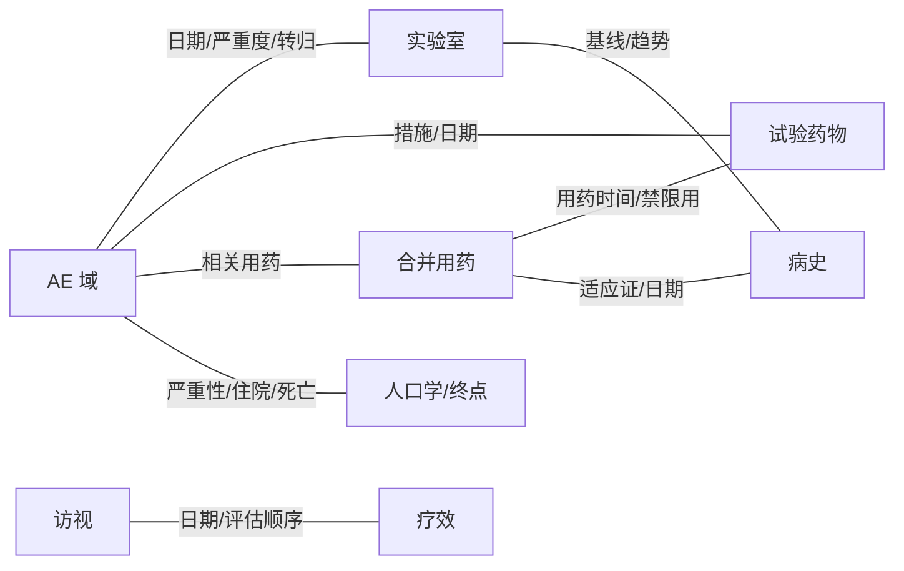
```mermaid
graph LR
    AE["AE 域"] --- |"日期/严重度/转归"| LB["实验室"]
    AE --- |"措施/日期"| IP["试验药物变更"]
    AE --- |"相关用药"| CM["合并用药"]
    AE --- |"严重性/住院/死亡"| DEMOG["人口学/终点"]
    CM --- |"用药时间/禁限用"| IP["试验药物"]
    CM --- |"适应证/日期"| MH["病史"]
    LB --- |"基线/趋势"| MH["病史"]
    VISIT_DOMAIN["访视"] --- |"日期/评估顺序"| EFFICACY["疗效"]
```

**图21-1：跨表一致性检查网络。** 每条边对应一组一致性规则。

### 21.2 常见跨表矛盾

| 矛盾类型 | 示例 | 规则编号 |
|---|---|---|
| AE 起始日期早于或远晚于相关实验室采样 | AE start_date 2026-04-20 但 ALT 升高最早见于 2026-04-12 | CONS-AE-01 |
| AE 已标记"恢复"但实验室仍持续异常 | AE outcome=恢复 + ALT 持续 >3×ULN | CONS-AE-04 |
| AE 处理措施标记"暂停给药"但 ECA 无对应记录 | AE action=暂停 + ECA 无 pause | CONS-AE-03 |
| SAE 标记"死亡"但终点记录为"完成试验" | AE outcome=死亡 + 受试者状态=完成 | CONS-AE-06 |
| CM 的适应证与 MH 记录不一致 | CM indication="高血压" + MH 无高血压 | 数据完整性 |
| 访视日期早于知情同意日期 | 任何 visit_date < icf_date | 时序违反（刚性规则） |

### 21.3 数据质量规则

| 规则 | 描述 |
|---|---|
| 重复记录 | 同一受试者 + 同一事件类型 + 同一日期 + 同一内容的重复行 |
| 撤回/删除 | EDC 中标记为删除的记录——对应风险需复核 |
| 迟发补录 | 事件录入日期远晚于事件发生日期（如 >30 天） |
| 单位漂移 | 同一检验项目的单位在不同访视中不一致 |
| 参考范围漂移 | 同一检验项目的参考范围在不同访视/批次中变化 |
| 空值关键字段 | subject_id、visit_date、event_date 等关键字段为空 |
| 孤立关联 | 引用不存在的外键（如 ae_link 指向不存在的 AE） |

*示例：同一受试者的丙氨酸氨基转移酶在三个访视分别记录为 42 U/L、0.85 μkat/L 和 96 U/L。系统识别单位漂移，若项目已批准换算关系则统一到展示单位并保留原值；若单位字段缺失或换算依据不明，则停止 CTCAE 趋势分级，生成“单位/映射待确认”资料缺口。系统不会把 0.85 与 42 直接比较后提示突增。*

---

## 22. 受试者时间线（Subject Timeline）

### 22.1 视觉规范

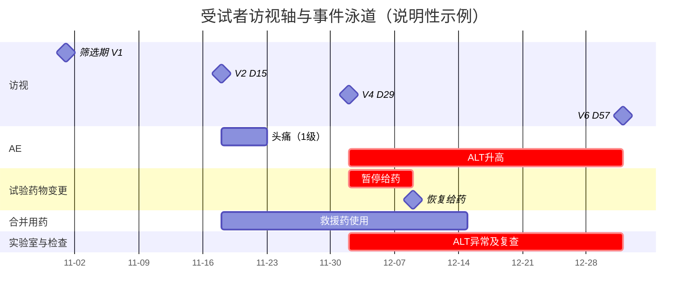
```mermaid
gantt
    title 受试者访视轴与事件泳道（说明性示例）
    dateFormat YYYY-MM-DD
    axisFormat %m-%d
    section 访视
    筛选期 V1 :milestone, v1, 2025-11-01, 0d
    V2 D15 :milestone, v2, 2025-11-18, 0d
    V4 D29 :milestone, v4, 2025-12-02, 0d
    V6 D57 :milestone, v6, 2026-01-01, 0d
    section AE
    头痛（1级） :ae1, 2025-11-18, 5d
    ALT升高 :crit, ae2, 2025-12-02, 30d
    section 试验药物变更
    暂停给药 :crit, ip1, 2025-12-02, 7d
    恢复给药 :milestone, ip2, 2025-12-09, 0d
    section 合并用药
    救援药使用 :cm1, 2025-11-18, 27d
    section 实验室与检查
    ALT异常及复查 :crit, lb1, 2025-12-02, 30d
```

**图22-1：受试者时间线逻辑示意。** 图中按事件类别分区列出实际日期；生产界面以统一访视轴对齐各泳道，并支持持续事件的起止区间、类别色彩和风险高亮。

### 22.2 详细视觉规范

| 规范项 | 要求 |
|---|---|
| **横轴** | 实际日期（非访视名称），从首次访视到末次访视 |
| **泳道（最少）** | AE、试验药物变更/剂量调整、CM/非药物治疗、MH、实验室/检查、疗效、PD/数据质疑/检查发现项 |
| **事件色彩** | 不同事件类别使用方案确定且可辨识的颜色（如 AE=红色系、IP=蓝色系、CM=绿色系） |
| **严重度强调** | 高风险事件通过边框加粗、警示图标或强调线表达，不与类别颜色混淆 |
| **信息密度** | 事件按真实持续时间或时间点定位；短事件允许堆叠、错层和聚合展开。不得把每个事件渲染为等宽大卡片，不得因标签长度拉伸时间比例 |
| **视觉碰撞** | 访视标签、事件标签、风险图标和悬浮信息具有确定的避让与截断策略；高密度区可缩放或展开，不得重叠遮挡 |
| **悬停信息** | 事件名称、日期、严重程度、关系/措施、转归、剂量/途径/频次、原因、来源定位 |
| **访视标签** | 计划访视名称标注在轴上，标签紧密时上下错位（不重叠） |
| **当前风险定位** | 当前选中风险在时间线中高亮，但完整上下文不被过滤——时间线仍展示该受试者的全部事件 |
| **交互** | 与医学风险清单和患者概览使用同一事件标识和风险标识。从风险详情打开时间线时保持当前受试者、时间窗和证据焦点 |

### 22.3 受试者时间线数据流

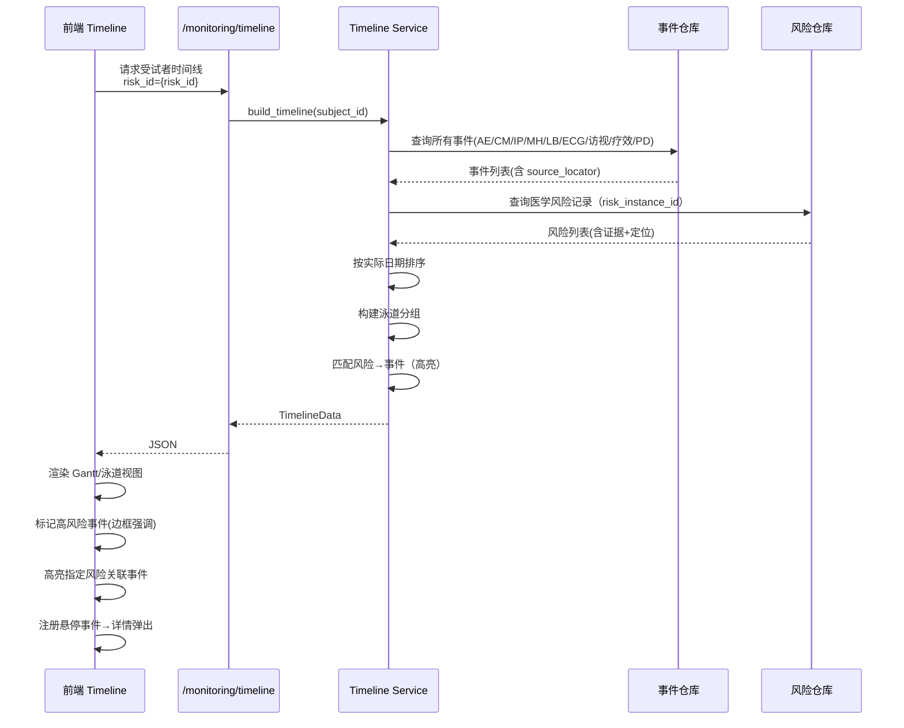
```mermaid
sequenceDiagram
    participant FE as 前端 Timeline
    participant API as /monitoring/timeline
    participant Service as Timeline Service
    participant EventStore as 事件仓库
    participant RiskStore as 风险仓库

    FE->>API: 请求受试者时间线<br/>risk_id={risk_id}
    API->>Service: build_timeline(subject_id)
    Service->>EventStore: 查询所有事件(AE/CM/IP/MH/LB/ECG/访视/疗效/PD)
    EventStore-->>Service: 事件列表(含 source_locator)
    Service->>RiskStore: 查询医学风险记录（risk_instance_id）
    RiskStore-->>Service: 风险列表(含证据+定位)
    Service->>Service: 按实际日期排序
    Service->>Service: 构建泳道分组
    Service->>Service: 匹配风险→事件（高亮）
    Service-->>API: TimelineData
    API-->>FE: JSON

    FE->>FE: 渲染 Gantt/泳道视图
    FE->>FE: 标记高风险事件(边框强调)
    FE->>FE: 高亮指定风险关联事件
    FE->>FE: 注册悬停事件→详情弹出
```

**图22-2：受试者时间线数据流。** 应用程序编程接口调用时间线服务；时间线服务读取事件库和医学风险库，再由前端完成渲染。

*示例：某虚构受试者在同一周出现 ALT 128 U/L 后升至 313 U/L，同时记录盐酸左西替利嗪片和一次试验药物暂停。时间线把两次 ALT 放入“实验室/检查”泳道，把左西替利嗪放入“CM/非试验用药”泳道，把暂停和重启放入“试验药物变更/剂量调整”泳道；三类事件使用不同颜色。用户从肝酶风险打开时间线时，两次 ALT 与暂停事件高亮，但 CM 事件仍作为上下文显示，不会被误归为试验药物动作。*

---

## 23. 患者概览（Patient Profile）

### 23.1 视觉内容规范

| 受试者级别 | 内容 | 展示方式 |
|---|---|---|
| **人口学与分组** | 年龄、性别、随机号、治疗组（如非盲）、关键基线特征 | 信息卡片 |
| **关键日期** | 知情同意日期、随机日期、首次给药、末次给药、末次访视、提前退出（如适用） | 时间轴摘要 |
| **疗效趋势** | 主要疗效指标 × 访视时间点（实际日期） | 折线图 + 基线参考线 + 响应阈值线 |
| **实验室趋势** | 项目指标集指定的关键实验室指标 × 时间 | 折线图 + 参考范围带状区域 + 适用的 CTCAE 分级色带 |
| **生命体征趋势** | 体重、血压、心率、体温 × 时间 | 子图面板（按指标分行） |
| **ECG 摘要** | 关键 ECG 参数（HR、QTcF、PR、QRS）× 时间 | 折线图或表格 |
| **AE 列表** | AE 术语、严重度、起止日期、转归、与 IP 关系 | 事件列表（按起始日期排序） |
| **数据完整性** | 各关键域的缺失率（如 LB 域计划采样点与实际采样点） | 进度条或百分比 |

### 23.2 患者概览数据流

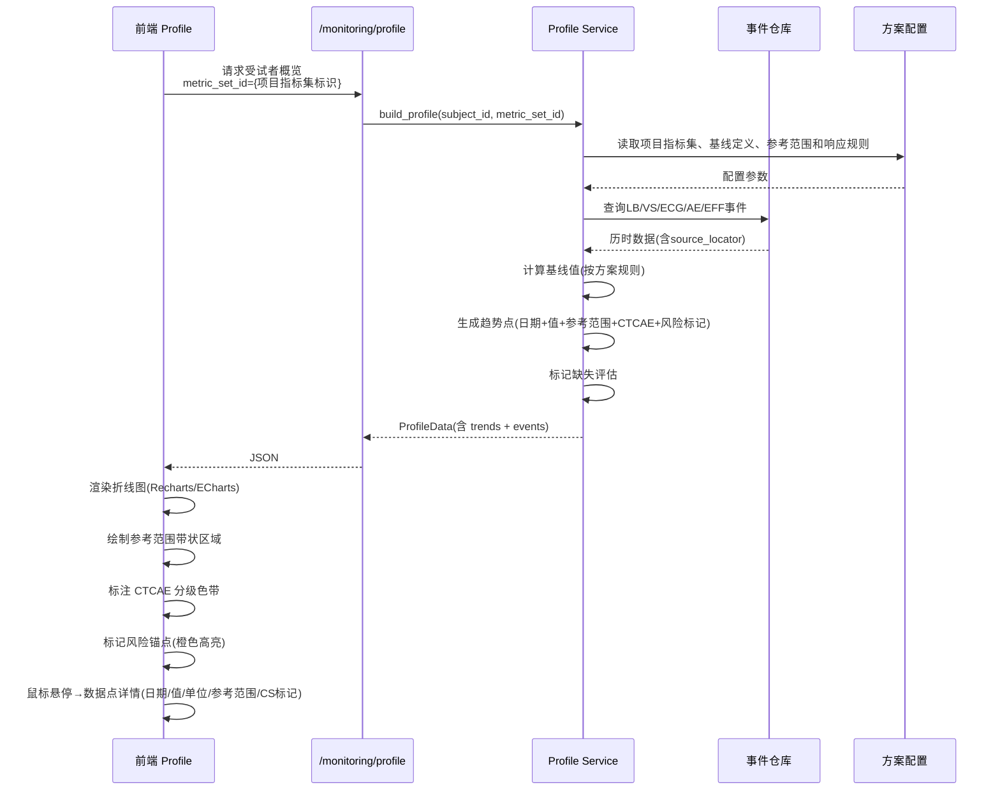
```mermaid
sequenceDiagram
    participant FE as 前端 Profile
    participant API as /monitoring/profile
    participant Service as Profile Service
    participant EventStore as 事件仓库
    participant Config as 方案配置

    FE->>API: 请求受试者概览<br/>metric_set_id={项目指标集标识}
    API->>Service: build_profile(subject_id, metric_set_id)
    Service->>Config: 读取项目指标集、基线定义、参考范围和响应规则
    Config-->>Service: 配置参数
    Service->>EventStore: 查询LB/VS/ECG/AE/EFF事件
    EventStore-->>Service: 历时数据(含source_locator)
    Service->>Service: 计算基线值(按方案规则)
    Service->>Service: 生成趋势点(日期+值+参考范围+CTCAE+风险标记)
    Service->>Service: 标记缺失评估
    Service-->>API: ProfileData(含 trends + events)
    API-->>FE: JSON

    FE->>FE: 渲染折线图(Recharts/ECharts)
    FE->>FE: 绘制参考范围带状区域
    FE->>FE: 标注 CTCAE 分级色带
    FE->>FE: 标记风险锚点(橙色高亮)
    FE->>FE: 鼠标悬停→数据点详情(日期/值/单位/参考范围/CS标记)
```

**图23-1：患者概览数据流。** 项目指标集由当前方案、医学监查计划和已确认字段映射共同确定；方案配置驱动基线计算和参考范围，医学风险库提供风险定位标记。接口不内置任何适应症特异指标。

### 23.3 约束

- 指标与响应规则从当前方案及 listing 映射生成，不复用旧项目别名。
- 计划外访视默认不进入中心/项目按访视聚合，除非医学人员明确配置。
- 图形需显示：实际日期/访视、参考范围（带状区域）、异常方向（超出上限/下限的颜色变化）、基线（虚线）、风险锚点（点或标记）和数据缺口（灰色标记）。
- 点击任一数据点优先显示可读原始事实，例如“2026-04-12，V4D29，ALT 313 U/L，参考范围 7–41 U/L，↑，研究者评价 CS”；来源文件、工作表、行号和字段放在次级定位区。
- 盲态研究不得由监查页面泄露治疗分组；治疗组字段按项目盲态配置显示为隐藏、编码或授权可见。
- 某个受试者缺少部分数据域时，接口返回稳定空集合和缺失原因；页面显示明确空态，其他已存在域仍正常渲染，不得白屏或用虚构点补齐。
- 中心级视图用于发现聚集模式而非贴标签。例如某中心 NCS 使用率明显高于其他中心时，系统展示分母、指标构成和病例明细，提示复核评价习惯；样本量过小时显示不稳定性。

*示例：受试者级患者概览同时展示体表受累面积、研究者总体评估、EASI 和 SCORAD 四条疗效曲线，以及中性粒细胞绝对计数、ALT、AST 三条安全性趋势。中性粒细胞参考范围以带状区表示，暂停给药日期以垂直标记叠加；用户点击低值点可直接看到“日期—访视—原始值—单位—参考范围—CS/NCS—来源行”。计划外复查点保留在个体曲线，但默认不进入中心按访视均值。*

---

## 24. 项目医学风险清单与三级汇总

### 24.1 医学风险清单默认列与筛选

默认七列（均支持排序和筛选）：

| 列 | 内容 | 筛选类型 |
|---|---|---|
| **受试者编号** | subject_id | 文本搜索/多选 |
| **中心编号** | site_id | 多选下拉 |
| **风险级别** | high/medium/low | 单选下拉 |
| **风险类别** | 如"疑似 AE 漏报""试验药物执行""禁用药疑似 PD"等 | 多选下拉 |
| **具体风险项** | 风险标题的简短描述（一行）；新增、变化、重开、需重新复核等本批次状态以紧凑行内标记显示 | 文本搜索 + 本批次状态筛选 |
| **当前处置** | 处置状态：待复核/已确认/已驳回等 | 多选下拉 |
| **更新时间** | YYYY-MM-DD HH:MM | 日期文本输入 |

额外可通过列选择器启用的列：批次、Safety/PV标记、责任人、置信度、首次出现批次。

本批次状态不得增加为第八个默认列。用户可从摘要栏的“本批次变化”进入预筛选视图，也可在“具体风险项”或“更新时间”单元格内看到紧凑标记；“持续”默认弱化显示，“新增”“变化”“重开”“需重新复核”重点突出。

### 24.2 风险类别标准化

风险类别采用简短且医学语义明确的标签：

| 类别标签 | 含义 |
|---|---|
| **疑似 AE 漏报** | 检验检查异常可能构成 AE 但 AE 域无对应记录 |
| **疑似 MH 漏报** | 筛选/基线期异常可能构成 MH 但 MH 域无对应记录 |
| **CS/NCS 评估不合理** | CS/NCS 标记与异常程度或变化趋势不一致 |
| **禁用药疑似 PD** | CM 域中命中了方案禁限用药规则 |
| **试验药物执行偏差** | IP 暂停/减量/停药/重启与方案不一致 |
| **用药依从性** | IP 依从性超出方案规定阈值 |
| **访视时间窗** | 访视超窗、漏访或关键评估错序 |
| **关键终点缺失** | 主要/关键次要疗效评估缺失 |
| **AE/SAE 记录不一致** | AE 记录内部或与关联域矛盾 |
| **跨表数据矛盾** | 两个数据域之间的日期/语义不一致 |
| **数据质量** | 重复、空值、单位漂移等 |
| **入排持续合格性** | 迟发证据暴露筛选期合格性问题 |

### 24.3 三级汇总

| 级别 | 展示维度 | 交互 |
|---|---|---|
| **受试者级** | 每例受试者的全部风险（当前医学风险清单） | 点击后打开详情工作区 |
| **中心级** | 各中心的风险分布、聚集信号、评价模式 | 点击中心→下钻至该中心的受试者列表 |
| **试验级** | 整体未处置高风险数、整改完成率、关键质量指标趋势 | 汇总卡片 + 可导出报告 |

*示例：同一受试者同时存在“试验药物依从性记录需核对”和“临床意义实验室异常需复核”两条风险。医学风险清单分别以“用药依从性”和“CS/NCS 评估不合理”标签展示；点击前者，证据区定位六条试验药物给药记录及方案依从性条款；点击后者，证据区切换到实验室原始值和评估字段。两条风险共享受试者时间线，但具有独立风险标识、处置状态和未读状态，避免点击后定位到另一条风险。*

---

## 25. 来源证据、可解释性与版本追溯

### 25.1 三类可读证据

每条风险至少包含三类可读证据：

1. **原始数据正文：** 例如"2026-04-12 V4D29 ALT 313 U/L，参考范围 7–41 U/L，ULN=41 U/L；基线（筛选期 2025-11-03）ALT 22 U/L，正常。CS 标记：CS。"
2. **方案依据原文：** 例如"方案 V3.0 Section 7.3.2.1（Table 4）：'ALT >3×ULN：暂停给药，密切监测肝功能，每周复查至恢复 ≤1.5×ULN 或基线水平。'"
3. **系统规则说明：** 例如"规则 RULE_AE_LB_001 v2.1：基线正常（22 U/L < ULN 41 U/L）→当前值 313 U/L >3×ULN (123 U/L)→触发 T-AE-01+T-AE-02。CTCAE v5.0 ALT increased：Grade 3 = >5.0-20.0×ULN if baseline was normal。313/41=7.6，符合 Grade 3。"

### 25.2 定位信息（Source Locator）

定位信息不可替代正文，仅用于技术追溯：

| 定位字段 | 示例 |
|---|---|
| file_identifier | source_file_01 |
| sheet_name | LBCHEM |
| row_number | 1849 |
| field_name | LBORRES |
| paragraph_ref | 方案 §7.3.2.1 |
| table_ref | 方案 Table 4 第4行 |

### 25.3 派生结论展示

派生结论需展示完整计算过程：

- **单位换算：** 如 g/L → g/dL（HGB 91 g/L ÷ 10 = 9.1 g/dL）
- **基线选择：** 如"筛选期 2025-11-03 ALT 22 U/L（最近一次给药前值）"
- **时间窗：** 如"计划访视 D29，实际日期 2026-04-12，距随机日 31 天，在 ±3 天窗口内"
- **CTCAE 判定：** 如"ALT Grade 3：>5.0-20.0×ULN if baseline was normal。计算：313/41=7.6 → Grade 3"
- **关联事件：** 如"关联 AE：ALT 升高（ae_id=AE-0042）；关联 ECA：暂停给药（eca_id=ECA-0156）"

### 25.4 证据不完整标记

若证据不完整，明确列出缺少的字段及其对判断的影响：

> **数据缺口：** 缺少参考范围上限。当前判断基于项目批准的可配置变化阈值（>20%）而非 CTCAE。置信度降为中。建议补充参考范围以提高判断精度。

### 25.5 来源变化保护

- 来源被改值或撤回时，保留旧版本证据和差异，不覆盖审计历史。
- 证据工作区展示"当前值（最新批次）"和"上一批次值（基线批次）"的对比。
- 若关联风险已被关闭，来源变化触发风险状态进入"需重新复核"。

*示例：肝酶风险详情首先显示“2026-04-12 V4D29 ALT 313 U/L，参考范围 7–41 U/L，↑，研究者评价 CS”，而不是只显示“LBCHEM 第1849行”。其下依次显示方案表4的暂停给药原文、313/41=7.6×ULN 的派生过程、关联 AE 和试验药物暂停事件；文件、工作表和行号收纳在“来源定位”折叠区。下一批次该值被更正为 31 U/L 时，旧原文、旧计算和旧医学处置仍保留在批次历史。*

---

## 26. AI 交互、医学审阅与处置

### 26.1 AI 交互边界

用户可在风险详情中向 AI 追问：

| 追问类型 | AI 行为 | 限制 |
|---|---|---|
| "为何触发这条风险？" | 展示规则触发的完整逻辑链条和计算过程 | 不可编造未触发条件 |
| "还需要哪些资料？" | 列出当前证据缺口和建议补充的材料 | 建议来源限于项目已授权范围 |
| "与方案哪一条冲突？" | 引用方案原文条款编号和内容 | 不编造方案中不存在的条款 |
| "有哪些替代解释？" | 从通用医学知识列出可能的非药物原因 | 标注推断性质，不替代鉴别诊断 |
| “如何草拟数据质疑？” | 生成包含具体数据点和疑问的数据质疑候选草稿 | 标记“AI 候选”；医学经理采纳后进入项目配置的发送流程 |

AI 回答必须限制在当前项目已授权来源（方案、IB、数据 listing）和通用医学知识边界内，并把事实（来自源数据）、推断（AI 分析）、建议（待确认的行动）和缺失资料分开。回答中的每项源事实必须携带当前来源修订和可打开的原始片段；无法定位时必须明确写“未在当前授权来源中找到”，不得用通用知识补成项目事实。

### 26.2 产品内独立 AI 任务合同

| AI 任务 | 必需输入 | 结构化输出 | 失败时处理 |
|---|---|---|---|
| 字段语义映射 | 文件概要、表头、代表性去标识样例、项目上下文 | 候选规范域/字段、置信度、依据、待确认项 | 保留未映射字段，阻断依赖规则 |
| 方案条款提取 | 当前方案修订、章节/表格原文、提取目标 | 条款原文、结构化条件、适用日期、定位、歧义 | 标记待人工结构化，不创建虚构规则 |
| 跨表线索归纳 | 当前受试者相关事实与允许的项目资料 | 事实链、可能解释、冲突、证据缺口 | 回退到确定性规则和人工查看 |
| 风险证据摘要 | 已触发规则、原始事实、方案依据、计算过程 | 面向医学复核的简明摘要，不改变触发结果 | 直接展示结构化证据，不阻断处置 |
| 交互追问与候选草稿 | 当前风险上下文、用户指令、允许动作 | 2–3 个有差异的候选或针对性回答、引用和不确定性 | 显示可重试状态，保留人工填写入口 |

提示词必须要求模型：只使用提供的项目来源；不得跨项目复用阈值或结论；区分事实、推断和建议；返回稳定结构；说明未找到和不确定项；不得自动判定 AE、MH、PD；不得把“未检出”写成“没有”。每次提示词或模型变更均使用固定跨项目回归集比较结构有效率、引用准确率、医学可用性和过拟合迹象。

### 26.3 人机协作与组织流程

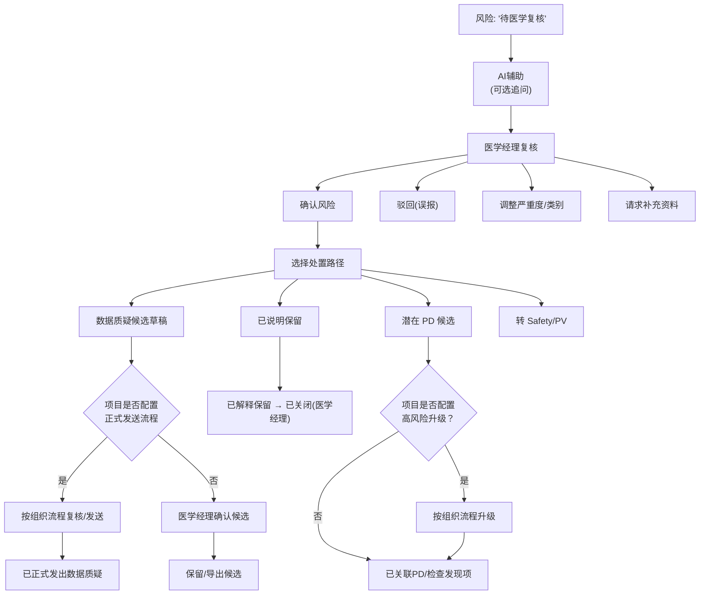
```mermaid
graph TD
    RISK["风险: '待医学复核'"]
    RISK --> AI["AI辅助<br/>(可选追问)"]
    AI --> REVIEW["医学经理复核"]

    REVIEW --> CONFIRM["确认风险"]
    REVIEW --> REJECT["驳回(误报)"]
    REVIEW --> ADJUST["调整严重度/类别"]
    REVIEW --> MORE["请求补充资料"]

    CONFIRM --> ACTION["选择处置路径"]
    ACTION --> QUERY["数据质疑候选草稿"]
    ACTION --> PD_CAND["潜在 PD 候选"]
    ACTION --> EXPLAIN["已说明保留"]
    ACTION --> SAFETY["转 Safety/PV"]

    QUERY --> ROUTE{"项目是否配置<br/>正式发送流程"}
    ROUTE -->|是| APPROVAL["按组织流程复核/发送"]
    ROUTE -->|否| READY["医学经理确认候选"]
    APPROVAL --> ISSUED["已正式发出数据质疑"]
    READY --> EXPORT["保留/导出候选"]

    EXPLAIN --> DIR_CLOSE["已解释保留 → 已关闭(医学经理)"]

    PD_CAND --> PD_DIR{"项目是否配置<br/>高风险升级？"}
    PD_DIR -->|是| DIR_APPROVE["按组织流程升级"]
    PD_DIR -->|否| PD_CLOSE["已关联PD/检查发现项"]
    DIR_APPROVE --> PD_CLOSE
```

**图26-1：人机协作与组织流程。** AI 提供候选，医学经理完成当前医学工作中的确认和处置。只有项目明确配置的正式发送、高风险升级或其他组织动作进入额外流程。

### 26.4 审计要求

每次操作必须记录：

| 审计字段 | 说明 |
|---|---|
| risk_instance_id | 医学风险记录标识 |
| project_id | 项目标识 |
| content_revision | 操作时的内容修订号 |
| rule_version | 操作时的规则版本 |
| operator | 操作者（用户 ID） |
| timestamp | 操作时间 |
| action | 动作（confirm/reject/adjust/request_info/query_draft/approve/close/reopen） |
| previous_value | 操作前的值/状态 |
| new_value | 操作后的值/状态 |
| reason | 理由（医学经理填写的文字理由） |
| source_evidence_snapshot | 操作时的证据快照 |
| approval_chain | 审批链（如适用） |
| failure_record | 失败记录（如审批被驳回、操作被拒绝） |

*示例：医学经理询问“为什么提示疑似 AE 漏报”。AI 回答分为三段：事实为“ALT 313 U/L、基线22 U/L、未检索到时间和方向一致的 AE”；推断为“肝酶异常可能尚未被 AE 记录覆盖”；建议为“核对复测、症状、研究者评价及 AE 表”。用户指出已有“肝功能异常”AE 后，系统重新展示术语、日期和严重度覆盖差异，医学经理可驳回漏报候选或改为“已有 AE 严重度需复核”，所有修改保存前后文本。*

---

## 27. 前端信息架构与关键交互

### 27.1 页面结构

```
医学监查首页 (/monitoring)
├── 顶栏：项目选择器 + 当前批次 + 模式(日常/锁库前/核查前)
├── 摘要栏：总风险数/未读/高严重度/待行动/本批次变化 统计卡片
├── 主工作区（Tab 切换）
│   ├── 医学风险清单：七列可筛选排序风险列表
│   │   ├── 筛选栏：紧凑多条件布局，保留已选条件、清除、保存视图、导出
│   │   └── 详情工作区（底部/侧边叠加）
│   │       ├── Tab 1：证据工作区（原文+方案+规则+定位）
│   │       ├── Tab 2：风险处置（状态+医学判断+处置动作）
│   │       ├── 页签 3：受试者时间线
│   │       ├── 页签 4：患者概览
│   │       ├── Tab 5：AE/MH 核查（关联事件列表）
│   │       ├── Tab 6：来源证据（原文片段面板）
│   │       └── Tab 7：批次历史
│   ├── 受试者时间线：独立全页时间线视图
│   └── 患者概览：独立全页患者概览视图
├── Safety/PV 投影入口（只读）
└── 页脚：免责声明（小字）
```

内容修订号、解析器版本、规则版本和技术运行详情不得常驻占用主工作区；仅在“批次详情/来源与审计”中按需展开。页面首屏优先支持“现在需要复核什么、为什么、下一步做什么”。

### 27.2 关键交互规范

| 交互 | 规范 |
|---|---|
| **风险列表** | 桌面端高信息密度；支持多条件筛选、排序、保存视图和 CSV/Excel 导出 |
| **详情工作区** | 底部或侧边叠加打开，不替换当前页面。优先展示原始信息正文 |
| **跨视图跳转** | 医学风险清单、受试者时间线与患者概览之间使用同一风险实例标识和焦点参数；返回时恢复筛选、排序、滚动位置和选中风险 |
| **未读标记** | 新风险/变化风险/重开风险显示未读标记。已读操作绑定来源版本 CAS；过期版本返回 409 |
| **处置完成后** | 列表实时更新状态和更新时间；离开待复核状态后判断锁定 |
| **响应式** | 以桌面端高信息密度体验为主（≥1440px 宽）。移动端为未来规划 |
| **中文标签** | 使用临床试验语境中文标签。缩写可能歧义时写全："AE/MH 漏报""实验室异常评价" |
| **空态与失败态** | 区分“该受试者确无记录”“来源域缺失”“映射未确认”“计算失败”；不得都显示为空白或“暂无数据” |

### 27.3 前端技术栈约束

- React 18+ / Vite 构建
- Recharts 或 ECharts 渲染患者概览图表
- 自定义甘特图/泳道组件渲染受试者时间线
- 所有状态通过 REST API 持久化，不使用 localStorage 存储关键医学判断
- 医学监查以独立路由和功能模块挂载，不与医学写作共用大型业务组件；共享项目选择器、设计令牌和基础壳层通过稳定接口复用

*示例：用户在医学风险清单选中“示例受试者01试验药物依从性记录需核对”，底部证据工作区展开后仍保留列表筛选和选中行。切换到受试者时间线时自动聚焦同一受试者的六条给药事件；再切换患者概览时保持风险标识不变，不自动跳到该受试者另一条实验室风险。点击关闭叠加层后返回原列表滚动位置，已读状态改变但风险不会消失。*

---

## 28. 后端服务、数据模型与接口

### 28.1 微服务/模块拆分

| 服务/模块 | 职责 |
|---|---|
| **项目配置服务（Project Config）** | 方案解构存储、规则配置、字典版本、项目元数据 |
| **文档解析服务（Document Parser）** | Excel/CSV/DOCX 解析、表头识别、字段提取 |
| **录入服务（Ingest Service）** | 批次创建、内容校验、幂等控制、文件登记 |
| **语义映射服务（Semantic Mapping）** | 字段映射候选、未映射字段管理、AI 辅助映射 |
| **差异引擎（Diff Engine）** | 增量差异计算、业务键匹配、变化类型分类 |
| **规则引擎（Rule Engine）** | 确定性规则计算、AI 辅助提示、结果标准化输出 |
| **医学风险库（Risk Store）** | 医学风险记录的创建、查询、更新和停用，处置状态管理，并发版本控制及批次历史 |
| **证据服务（Evidence Service）** | 来源定位、原文片段提取、派生过程生成 |
| **时间线服务（Timeline Service）** | 受试者事件聚合、泳道分组、风险高亮 |
| **患者概览服务（Profile Service）** | 趋势计算、基线/参考范围/CTCAE 叠加、缺失标记 |
| **任务审批服务（Approval Service）** | 处置记录、审批链、状态转换 |
| **审计服务（Audit Service）** | 全操作审计日志、只追加、不可删除 |

### 28.2 核心接口

```text
#### 批次管理
POST   /api/v1/projects/{project_id}/monitoring-batches
       请求: { source_checksum, protocol_revision, mapping_revision, mode, idempotency_key }
       响应: { batch_id, content_revision, status, precheck_result }

POST   /api/v1/projects/{project_id}/monitoring-batches/{batch_id}/run
       响应: { batch_id, risk_summary, diff_summary, run_status }

POST   /api/v1/projects/{project_id}/monitoring-batches/{batch_id}/confirm
       响应: { batch_id, status: "confirmed", confirmed_at }

#### 风险查询与处置
GET    /api/v1/projects/{project_id}/risks?status={status}&severity={severity}&site_id={site_id}
       响应: { risks: [...], total, page, page_size }

GET    /api/v1/risks/{risk_id}
       响应: { risk_instance_id, ..., evidence: [...], disposition: {...}, audit_trail: [...] }

POST   /api/v1/risks/{risk_id}/dispositions
       请求: { expected_risk_revision, action, medical_reason, judgments: [...], linked_object }
       冲突: HTTP 409 { error: "RISK_VERSION_CONFLICT", current_revision, message: "数据已更新，请刷新后复核" }

#### 时间线与概览
GET    /api/v1/projects/{project_id}/subjects/{subject_id}/timeline?risk_id={risk_id}
       响应: { events: [...], highlights: [...], swimlanes: [...] }

GET    /api/v1/projects/{project_id}/subjects/{subject_id}/profile?metric_set_id={metric_set_id}
       响应: { trends: [...], events: [...], data_completeness: {...} }

#### 汇总与导出
GET    /api/v1/projects/{project_id}/risks/summary?level=trial
       响应: { total_risks, by_severity, by_category, by_site, by_status, safety_pv_count }

GET    /api/v1/projects/{project_id}/risks/export?format=csv
       响应: CSV 文件流

#### 审计
GET    /api/v1/projects/{project_id}/audit-log?risk_id={risk_id}&limit={page_size}
       响应: { entries: [{ timestamp, operator, action, previous, new, reason }] }
```

### 28.3 接口设计约束

- 写接口使用内容修订号进行乐观并发控制（Optimistic Concurrency Control）；过期客户端提交必须拒绝（HTTP 409）。
- 所有写操作携带预期风险或内容修订号，服务端只接受与当前版本一致的操作。
- 错误体至少包含：稳定错误码（error_code）、中文用户信息（message）、可否重试（retryable）、当前修订号（current_revision）和审计标识（audit_id）。
- 同一幂等键、来源内容、项目和任务类型重复提交时返回既有任务；键相同而请求内容不同则拒绝。
- 分页接口使用 page + page_size，支持 cursor-based 分页用于大数据量场景。

### 28.4 内容修订号与差异处理约定

- **来源内容修订号（source_content_revision）**由来源文件内容哈希和稳定的内在元数据计算。此处“文件角色”只指文件内在类型（如方案、listing、数据字典），不指“医学监查来源”或“医学写作来源”等消费模块用途。相同项目中的同一文件在不同模块引用时共享同一来源内容修订号。
- **模块用途绑定**单独记录 `module`、`usage_role`、`bound_at` 和模块配置修订，不参与来源内容修订号计算，也不得覆盖其他模块的绑定。
- **解析输出修订号（parse_revision）**由来源内容修订号、解析器版本和解析配置计算；解析器升级可以产生新的解析输出，但不伪装成源文件内容发生变化。
- 方案事实、字段映射、规则包和分析引擎分别使用独立修订号，并明确引用其来源内容修订和解析输出修订。
- 行级差异先以项目配置的稳定业务键匹配，匹配后逐字段比较。
- 业务键变化进入“可能为同一记录”的待核对项，由映射规则判断是记录迁移（同一记录、键变化）还是“删除后新增”（不同记录）。
- 语义差异表示事实变化导致风险条件、严重度、置信度或证据状态变化。

*示例：用户甲打开风险修订号 R17 并准备关闭；期间用户乙补充医学理由，服务端把修订号更新为 R18。用户甲提交时携带 expected_risk_revision=R17，接口返回 HTTP 409、current_revision=R18 和中文提示。前端重新加载乙的意见并要求用户甲再次确认，不能用“最后写入覆盖”丢失乙的医学判断。*

---

## 29. 权限、审计、部署与性能

### 29.1 基础部署要求

无论采用单机、公司内网或个人私有化部署，均须满足以下基础要求：

| 能力 | 要求 |
|---|---|
| **用户身份** | 登录身份识别，区分不同用户 |
| **项目隔离** | 不同项目数据完全隔离，不可跨项目查询 |
| **最小权限** | 医学经理不可执行系统管理操作；系统管理不可修改医学判断 |
| **完整审计** | 审计日志只追加，不可物理删除或修改 |

首版本地单机运行可使用统一医学经理身份完成业务验证，但必须保留 `user_id`、`role_claim`、`project_scope` 和动作审计字段。该简化不等同于完成生产身份、角色权限或电子签名验证；迁移至公司内网或多用户私有化部署前必须完成相应专项验证。

### 29.2 私有化网络部署要求

| 能力 | 要求 |
|---|---|
| **传输加密** | TLS 1.3 传输层加密 |
| **存储加密** | 数据库静态加密（AES-256） |
| **组织目录** | LDAP/AD 集成或独立用户目录 |
| **角色权限（RBAC）** | 医学监察员/医学经理/医学总监/系统管理/只读 |
| **备份恢复** | 每日自动备份，支持时点恢复 |
| **服务健康** | Health check 端点、资源监控、告警 |
| **日志留存** | 应用日志 + 审计日志，按法规要求留存（如 ≥5 年） |
| **模型网关** | 模型服务可替换，不绑定单一供应商 |

### 29.3 性能验收基准

性能验收应使用能够代表目标项目复杂度的脱敏数据集，并在验收方案中预先确定数据量、并发数、硬件配置和网络条件。不同部署环境的结果不得直接横向比较。

| 操作 | 验收要求 | 记录要求 |
|---|---|---|
| 文件解析 | 在约定数据规模和硬件条件下于目标时间内完成 | 记录文件规模、工作表数、总行数、耗时和失败重试情况 |
| 批次差异计算 | 完成全部受影响记录的行级、字段级和医学语义差异识别 | 记录比较基线、差异数量、遗漏检查和耗时 |
| 全量规则运行 | 不截断数据、不静默跳过规则，任务状态可查询 | 记录规则包版本、处理对象数、失败规则和耗时 |
| 风险清单查询 | 常用筛选、排序和翻页操作保持可交互响应 | 记录数据量、筛选条件和响应时间分布 |
| 受试者时间线 | 完整加载该受试者的访视轴、事件泳道和风险定位 | 记录事件数、风险数和首屏可用时间 |
| 患者概览 | 完整加载方案要求的疗效与安全性趋势 | 记录指标数、数据点数和首屏可用时间 |
| 安全性风险视图 | 在统一风险记录上完成安全性筛选和下钻 | 记录风险数量、筛选条件和响应时间 |

**高负载约束：** 不得通过截断风险或静默跳过工作表维持响应时间。异步任务需展示进度、失败原因、可重试性和幂等结果。

### 29.4 部署与测试闭环

```mermaid
graph LR
    subgraph 开发["开发环境"]
        DEV_CODE["代码提交"]
        UNIT["单元测试<br/>发布阻断项全部通过"]
        LINT["Lint + Type Check"]
    end

    subgraph 集成["集成环境"]
        BUILD["生产构建<br/>(npm run build)"]
        API_TEST["API 契约测试"]
        DB_MIGRATE["数据库迁移"]
    end

    subgraph 验证["验证环境"]
        REAL_PROJ["代表性项目回归<br/>不同适应症与研究设计"]
        BROWSER["桌面浏览器检查<br/>布局、交互、可访问性"]
        CROSS["跨项目适用性检查<br/>字段、阈值、访视与术语"]
    end

    subgraph 发布["发布"]
        DEPLOY["部署"]
        SMOKE["冒烟测试"]
        MONITOR["运行监控"]
    end

    开发 --> 集成
    集成 --> 验证
    验证 --> 发布
```

**图29-1：部署与测试闭环。** 从开发到发布的完整流水线。

*示例：某批次 listing 数据量较大，任务进入后台队列后持续报告“内容校验—字段映射—差异计算—规则运行—风险汇总”的进度。若规则运行中断，系统从已提交的检查点恢复，并明确显示失败步骤和重试状态；不得以空风险清单代替失败结果。部署形态发生变化时，医学规则、风险记录和前端交互约定保持一致。*

---

## 30. 测试、验证与项目验收

### 30.1 测试矩阵

| 测试层级 | 覆盖内容 | 通过标准 |
|---|---|---|
| **单元测试** | 每个服务和模块的核心逻辑 | 所有发布阻断级测试通过；不得用总体通过率掩盖关键失败 |
| **接口约定测试** | 每个接口的请求、响应、错误码和并发控制 | 约定内场景全部通过，异常响应可追踪 |
| **规则单元测试** | 每条规则的触发、排除、严重程度和可信程度 | 经医学确认的标准病例全部达到预定结果 |
| **集成测试** | 批次导入、解析、差异计算、规则运行和风险生成的端到端流程 | 使用多个不同研究设计完成完整流程，结果可重复 |
| **前端交互测试** | 每个按钮、筛选、排序、详情打开和跨视图跳转 | 桌面端全部操作可达，状态与后端一致 |
| **浏览器视觉验收** | 目标桌面视口下的布局、图表和文本 | 无横向溢出、元素重叠、截断或不可达操作 |
| **跨项目适用性测试** | 不同适应症、分期、方案结构和数据格式 | 不存在项目名称、阈值、表名、访视或术语硬编码 |
| **性能测试** | 代表性数据规模和并发负载 | 满足 §29.3 预先批准的性能目标 |
| **访问与隔离测试** | 路径访问、权限控制和项目数据隔离 | 不发生越权读取或跨项目数据泄漏 |
| **审计完整性测试** | 关键操作的前后值、操作者、时间和版本 | 审计记录完整、只追加、可追溯 |

### 30.2 金标准病例验证

每条医学规则必须通过金标准病例（Gold-Standard Cases）验证，评估：

| 指标 | 定义 | 目标 |
|---|---|---|
| **召回率（Recall）** | 标准病例中应被识别的风险被规则检出的比例 | 由规则风险等级和使用目的预先批准 |
| **误报率（False Positive Rate）** | 规则触发但经医学复核不成立的比例 | 由规则用途、复核成本和受试者安全影响预先批准 |
| **证据充分性** | 展示的事实、方案依据和计算过程能否支持医学复核 | 各必需证据维度均达到规则验收要求 |

验证使用"原始方案 + 原始 listing"的端到端方式。不能使用已经解构的后半程产物冒充从原始方案和原始 listing 开始的端到端验证。

### 30.3 发布前验证清单

发布前至少验证以下场景（详细见附录 D）：

1. 同一输入重复运行时结果保持一致，不同内容修订均可追溯。
2. 删除、数据修改、迟发补录和规则升级不会直接自动关闭风险。
3. CM 与 IP 变更严格分域，IP 变更在独立泳道展示。
4. 受试者时间线的访视轴、泳道颜色和事件位置正确。
5. 患者概览能够呈现趋势、基线、参考范围和计划外访视。
6. 风险清单的筛选、排序、详情证据和跨视图跳转均可使用。
7. 目标桌面视口下无文字溢出、元素重叠、错位和不可达操作。
8. 锁库前全量重算覆盖版本冻结、数据域核对和未决事项汇总。
9. 核查前三级汇总能够支持受试者级、中心级和试验级核对。
10. 使用多个不同适应症和研究设计验证跨项目适用性。
11. 至少一个真实研究使用两个以上连续全量 listing 批次，验证结构漂移、字段改值、迟发补录、撤回候选、风险继续、变化、重开和处置继承边界。
12. 产品内独立 AI 在不依赖开发代理的情况下完成字段语义候选、方案条款候选、证据摘要和用户追问；AI 失败时确定性流程仍可完成。
13. 所有前端可见按钮、筛选、排序、页签、叠加层、导出、处置、冲突、空态、失败和重试逐项实际操作，并核对后端状态。
14. 与项目总看板、共享项目/来源/方案事实服务、Safety/PV 投影及审批中心的消费者约定通过，且未改写医学写作子系统拥有的文档数据。
15. 至少三个结构明显不同的真实研究从原始方案和原始 listing 开始完成回归；其中不得复用上一项目的表名、阈值、访视、指标或映射。
16. 由不参与实现的资深医学经理按真实顺序完成首次项目配置和至少五条不同类别风险的复核处置：不得依赖技术日志、开发人员解释或只显示定位符的证据；记录从零输入项、人工修订项、点击路径和无法继续点，用于减少下一轮不必要输入。验收关注任务是否顺畅完成，不以固定点击次数或固定用时替代医学可用性判断。

*示例：跨项目回归分别导入皮肤科研究和消化系统疾病研究的原始方案与原始 listing。测试不仅检查页面是否出现数据，还替换工作表名称、访视别名和疗效指标，确认系统按照当前项目映射生成相应疾病评分，不会沿用上一项目的表名、阈值或受试者编号。每个风险按钮、筛选、排序、证据跳转和处置写入均逐项运行，并保存接口响应和审计记录。*

---

## 31. 运行维护、规则变更与持续改进

### 31.1 规则变更流程

```mermaid
graph LR
    PROPOSE["医学提出变更<br/>(依据+影响范围+回溯策略)"]
    SHADOW["并行验证运行<br/>（在历史项目上比较新增、不再触发和误报）"]
    REVIEW["医学复核<br/>并行验证结果"]
    APPROVE["批准启用<br/>(记录批准人+生效日期)"]
    RETROSPECT["回溯<br/>(标记受影响的历史风险→需重新复核)"]

    PROPOSE --> SHADOW
    SHADOW --> REVIEW
    REVIEW --> APPROVE
    APPROVE --> RETROSPECT
```

**图31-1：规则变更流程。** 新规则先进行并行验证，比较结果后再决定是否启用。方案修正案或字典升级可能触发“需重新复核”。

### 31.2 持续改进指标

系统持续统计以下指标，用于改进流程和规则——不作为简单人员绩效排名：

| 指标 | 说明 |
|---|---|
| **风险确认率** | 医学经理确认的风险占总触发的比例 |
| **驳回原因分布** | 误报的常见原因（如阈值过低、证据不足） |
| **首次响应时间** | 高风险从触发到首次医学复核的时间 |
| **关闭周期** | 风险从触发到关闭的中位时间 |
| **重复问题率** | 同一受试者/中心反复出现的同类风险 |
| **证据缺口率** | 因证据不完整导致置信度低的风险比例 |
| **中心聚集信号** | 某中心在特定风险类别上的显著偏离 |

### 31.3 模型/提示词升级

模型或提示词升级必须使用固定回归集重新验证。升级后对同一数据集的 AI 输出（语义映射、线索归纳、数据质疑草拟）与上一版本比较，评估质量变化后再批准部署。

---

## 32. 综合案例

### 32.1 跨模块受试者级综合案例

*示例：对虚构受试者 示例受试者04 开展跨模块综合监查。*

**背景：** 34岁男性，试验组，接受试验药物 150 mg QD。筛选期 2025-11-03，随机 2025-11-05，首次给药 2025-11-05。

**实验室与 AE 交叉：**
- V2D15（2025-12-15）：ANC 1.24 ×10⁹/L（CTCAE 2级），AE 域记录"中性粒细胞减少（1级）"
- V4D29（2026-01-14）：ANC 0.98 ×10⁹/L（CTCAE 3级），AE 域无对应更新
- 系统触发：疑似 AE 漏报"ANC 降至 CTCAE 3 级未记录" + AE 严重度不一致"AE 仍标记为 1 级但 ANC 已达 3 级"

**IP 执行：**
- ECA 记录：2025-12-15 暂停给药（理由正确）、2025-12-22 ANC=1.68→2025-12-23 以 150 mg 重启（符合方案）
- 但 2026-01-14 ANC=0.98 后，ECA 直到 2026-01-19 才暂停（延迟 5 天）
- 系统触发：IP 暂停延迟（ANC 3 级后 5 天才暂停）

**CM 检查：**
- 2026-01-10 新增对乙酰氨基酚 500 mg PRN（适应证"发热"），在允许范围内（≤2g/d，≤3天/周）
- 2026-01-12 新增布洛芬 400 mg（适应证"关节痛"）。布洛芬为非甾体抗炎药（Nonsteroidal Anti-inflammatory Drug，NSAID），方案 Section 5.8 规定"试验期间禁止长期使用 NSAID（连续 >7 天）。短期使用（≤3天）允许"。
- 系统：布洛芬使用 1 天，在方案允许的短期使用范围内。不触发"禁用药疑似 PD"，但标记"CM 关注"。

**时间线整合：**
受试者时间线显示完整事件链：V2D15 ANC↓ → AE 中性粒细胞减少 → IP 暂停 → ANC 恢复 → IP 重启 → V4D29 ANC↓↓ → IP 延迟暂停 → 新增 CM（对乙酰氨基酚、布洛芬）。

**医学处置：**
- 风险 1（AE 漏报）：确认 → 数据质疑候选 → 按项目配置审批草稿文本/发送建议 → 由数据管理或组织流程正式发出数据质疑：“请更新示例受试者04在 V4D29 的 AE 记录；ANC 0.98×10⁹/L 对应 CTCAE 3级。”
- 风险 2（IP 暂停延迟）：确认 → 标记潜在 PD → 关联已有 PD 登记。
- 风险 3（CM 关注）：解释保留——NSAID 短期使用在方案允许范围内。

### 32.2 中心级聚集案例

*示例：示例中心A 的聚集性分析。*

在某项虚构的多中心研究中，系统在中心级汇总时发现：
- 示例中心A共 8 例受试者，其中 5 例（62.5%）的 ≥2 级实验室异常被标记为 NCS，而其他 11 个中心的 NCS 使用率中位数为 28%（四分位距 18%-35%）。
- 系统按检验指标拆分：ALT、AST 的 NCS 率分别为 60% 和 55%，与其他中心（25% 和 22%）差异最明显。
- 系统列出该中心受试者明细：示例受试者08（ALT 112 U/L → NCS）、示例受试者09（ALT 98 U/L，AST 85 U/L → 均 NCS）、示例受试者10（ALT 135 U/L → NCS）。

系统生成中风险提示："示例中心A 的 ≥2 级实验室异常 NCS 标记率（62.5%）高于其他中心中位数（28%）。建议复核该中心研究者的 CS/NCS 评价习惯。"

医学经理复核后：
1. 复查了 5 例受试者的完整实验室趋势、AE 记录和临床背景；
2. 确认 示例受试者09 的 ALT/AST 升高已有 AE"肝功能异常（1级）"覆盖，NCS 标记可能为研究者对同一事件的不同理解；
3. 对其他4例向该中心发出数据质疑，建议重新评估 CS/NCS 标记；
4. 未直接认定中心不合规——仅基于比例差异标记了复核建议。

---

## 33. 附录A：风险规则模板

| 字段 | 必填内容 | 类型 |
|---|---|---|
| **rule_id** | 稳定编号（如 RULE_AE_LB_001） | string，唯一 |
| **rule_name** | 简短医学名称（如"ALT 升高—疑似 AE 漏报"） | string |
| **medical_purpose** | 需要控制的受试者安全或数据可靠性风险 | text |
| **scope** | 适用研究类型、阶段、数据域、适用日期范围 | object |
| **protocol_basis** | 方案条款编号（如 Section 7.3.2.1 Table 4 第4行）和原文 | text |
| **input_domains** | 输入表和字段（含单位、日期、受试者/事件键） | list |
| **business_keys** | 用于跨批次匹配的稳定业务键（如 subject_id + lb_test_code + visit_date） | list |
| **preconditions** | 数据完整性条件、基线确认条件、版本条件、映射条件 | list |
| **trigger_conditions** | 可计算的候选风险逻辑（表达式或伪代码） | list |
| **exclusion_conditions** | 明确不应触发或应降级的情形 | list |
| **severity_rules** | 严重度分级依据：high/medium/low 各自对应的条件 | object |
| **confidence_rules** | 置信度分级依据：high/medium/low 各自对应的条件 | object |
| **evidence_template** | 原始信息正文模板、方案原文引用、推导过程展示格式和定位格式 | object |
| **disposition_guidance** | 建议处置路径、责任人和可验证关闭条件 | text |
| **cross_references** | 关联的其他规则（如同时关注 AE 漏报和 IP 暂停的联动规则） | list |
| **version_governance** | 规则起草人、复核人、批准人、生效日期、回溯策略 | object |
| **shadow_run_results** | 并行验证结果（新增风险数、不再触发风险数、误报数、金标准召回率） | object |

---

## 34. 附录B：状态流转与最小审计信息

### 34.1 风险处置状态流转

详见 §6.3“风险处置状态流转”。

### 34.2 批次处理状态流转

| 状态 | 含义 | 允许操作 |
|---|---|---|
| **pending_validation** | 批次已上传，内容校验中 | 查看校验结果、确认覆盖 |
| **validated** | 校验通过，等待运行规则 | 运行规则、修改批次元数据 |
| **running** | 规则运行中 | 查看进度、取消运行 |
| **completed** | 规则运行完成 | 查看风险、执行处置、批次确认 |
| **confirmed** | 批次已确认，成为下一轮基线 | 只读查看、导出 |
| **frozen** | 批次已冻结（用于锁库前/核查前） | 只读查看、全量导出 |

### 34.3 审计最小集

每条审计记录必须包含：

| 字段 | 类型 | 说明 |
|---|---|---|
| audit_id | UUID | 审计记录唯一标识 |
| risk_instance_id | UUID | 医学风险记录标识 |
| batch_id | UUID | 所属批次 |
| project_id | string | 项目标识 |
| content_revision | string | 操作时的内容修订号 |
| rule_version | string | 操作时的规则版本 |
| operator | string | 操作者 ID |
| timestamp | datetime | 操作时间（UTC） |
| action | enum | 动作类型 |
| previous_value | JSON | 操作前的完整状态快照 |
| new_value | JSON | 操作后的完整状态快照 |
| reason | text | 操作理由 |
| source_evidence_snapshot | JSON | 操作时的证据快照 |
| approval_chain | JSON | 审批链（如适用） |
| failure_record | JSON | 失败记录（如审批被驳回） |
| ip_address | string | 操作者 IP（如适用） |
| user_agent | string | 客户端标识 |

审计日志**只追加（append-only）**，不允许前端或后端的物理删除。

---

## 35. 附录C：缩略语表

| 缩写 | 中文全称 | 英文全称 |
|---|---|---|
| ADaM | 分析数据模型 | Analysis Data Model |
| AE | 不良事件 | Adverse Event |
| AESI | 特别关注不良事件 | Adverse Event of Special Interest |
| AI | 人工智能 | Artificial Intelligence |
| ALCOA+ | 数据完整性原则 | Attributable, Legible, Contemporaneous, Original, Accurate, Complete, Consistent, Enduring, Available |
| ALT | 丙氨酸氨基转移酶 | Alanine Aminotransferase |
| ANC | 中性粒细胞绝对计数 | Absolute Neutrophil Count |
| AST | 天门冬氨酸氨基转移酶 | Aspartate Aminotransferase |
| BSA | 体表面积 | Body Surface Area |
| CAPA | 纠正与预防措施 | Corrective and Preventive Action |
| CAS | 比较并交换（并发控制） | Compare-And-Swap |
| CDISC | 临床数据交换标准协会 | Clinical Data Interchange Standards Consortium |
| CFDI | 国家药品监督管理局食品药品审核查验中心 | Center for Food and Drug Inspection of NMPA |
| CI | 置信区间 | Confidence Interval |
| CM | 合并用药或治疗 | Concomitant Medication/Therapy |
| CS | 有临床意义 | Clinically Significant |
| CSV | 逗号分隔值文件 | Comma-Separated Values |
| CTCAE | 通用不良事件术语标准 | Common Terminology Criteria for Adverse Events |
| DBL | 数据库锁定 | Database Lock |
| DM | 数据管理 | Data Management |
| EASI | 湿疹面积和严重程度指数 | Eczema Area and Severity Index |
| ECG | 心电图 | Electrocardiogram |
| EDC | 电子数据采集系统 | Electronic Data Capture |
| ET | 提前退出 | Early Termination |
| GCP | 药物临床试验质量管理规范 | Good Clinical Practice |
| IB | 研究者手册 | Investigator's Brochure |
| ICH | 国际人用药品注册技术协调会 | International Council for Harmonisation |
| IP | 试验用药品 | Investigational Product |
| LB | 实验室检查 | Laboratory |
| MedDRA | 监管活动医学词典 | Medical Dictionary for Regulatory Activities |
| MH | 病史 | Medical History |
| MMP | 医学监查计划 | Medical Monitoring Plan |
| NCS | 无临床意义 | Not Clinically Significant |
| NMPA | 国家药品监督管理局 | National Medical Products Administration |
| NRS | 数字评分量表 | Numerical Rating Scale |
| NSAID | 非甾体抗炎药 | Nonsteroidal Anti-inflammatory Drug |
| PD | 方案偏离 | Protocol Deviation |
| PE | 体格检查 | Physical Examination |
| PRO | 患者报告结局 | Patient-Reported Outcome |
| PV | 药物警戒 | Pharmacovigilance |
| QTcF | 经Fridericia校正的QT间期 | QT interval corrected by Fridericia |
| RBAC | 基于角色的访问控制 | Role-Based Access Control |
| SAE | 严重不良事件 | Serious Adverse Event |
| SDTM | 标准数据表格模型 | Study Data Tabulation Model |
| TG | 甘油三酯 | Triglyceride |
| ULN | 正常值上限 | Upper Limit of Normal |
| VS | 生命体征 | Vital Signs |

---

## 36. 附录D：验收清单

| 编号 | 验收项目 | 验收方法与通过标准 |
|---|---|---|
| D-01 | 数据来自原始方案和原始 listing，而非预先解构产物 | 从原始文件开始完成端到端验证，保留输入修订号和处理记录 |
| D-02 | 覆盖不同适应症、分期和方案结构 | 使用多个代表性项目运行同一完整流程，结果均符合项目规则 |
| D-03 | 每条规则均有依据、前置条件和排除条件 | 逐条医学审核并保存批准记录 |
| D-04 | 原始信息正文在界面中直接可见 | 逐项检查事实正文、方案原文、计算过程和来源位置 |
| D-05 | CM 与 IP 严格分域 | 专项检查全部事件、风险分类和时间线泳道，不得交叉污染 |
| D-06 | 增量差异状态准确 | 使用至少两个连续批次验证新增、变化、重开、持续、需复核和条件不再满足 |
| D-07 | 风险可在清单、时间线和患者概览间一致定位 | 跨视图核对风险标识、受试者、证据和处置状态 |
| D-08 | 无项目硬编码 | 跨项目代码与配置审查，不得固化阈值、表名、访视或术语 |
| D-09 | AI 输出边界明确 | 所有 AI 结果标注待医学复核，不自动确认 AE、MH、PD 或监管结论 |
| D-10 | 桌面端交互完整 | 目标桌面视口下无溢出、重叠、截断和不可达操作 |
| D-11 | 审计记录只追加并覆盖关键动作 | 验证创建、修改、审批、关闭、重开和版本变化的完整前后值 |
| D-12 | 同一输入重复运行结果一致 | 对同一内容修订重复提交并比较任务、风险和审计结果 |
| D-13 | 并发修改得到正确处理 | 过期客户端写入被拒绝，并提示重新加载最新记录 |
| D-14 | 锁库前全量重算完整 | 完成版本冻结、数据域覆盖核对、未决事项汇总和关闭依据检查 |
| D-15 | 核查前三级汇总一致 | 受试者级、中心级和试验级数字可逐层回溯至同一风险记录 |
| D-16 | 跨项目适用性充分 | 使用预先批准的代表性项目集完成回归，不出现上一项目残留配置 |
| D-17 | 标准病例达到项目批准指标 | 召回、误报和证据充分性达到规则验收方案预设标准 |

---

## 37. 附录E：数据域字段字典

### E.1 受试者域（SUBJ）

| 字段 | 类型 | 说明 |
|---|---|---|
| subject_id | string | 受试者唯一标识 |
| site_id | string | 中心编号 |
| randomization_date | date | 随机日期 |
| treatment_arm | string | 治疗分组（盲态下可能不可见） |
| icf_date | date | 知情同意日期 |
| sex | string | 性别 |
| birth_date | date | 出生日期 |
| race | string | 种族 |
| enrollment_status | enum | 入组状态：筛选/随机/进行中/完成/提前退出 |

### E.2 访视域（VISIT）

| 字段 | 类型 | 说明 |
|---|---|---|
| visit_name | string | 实际访视名称（EDC 中记录） |
| planned_visit_name | string | 方案规定的计划访视名称 |
| actual_date | date | 实际访视日期 |
| visit_type | enum | 计划访视/计划外访视/提前退出/电话随访 |
| key_assessment_flag | boolean | 是否包含关键评估 |

### E.3 AE 域

| 字段 | 类型 | 说明 |
|---|---|---|
| ae_id | string | AE 唯一标识 |
| ae_term | string | AE 术语（MedDRA PT 或原始录入） |
| ae_start_date | date | AE 起始日期 |
| ae_end_date | date | AE 结束日期 |
| ae_ongoing | boolean | 是否持续 |
| severity_grade | enum | 严重程度：1/2/3/4/5 级 |
| seriousness | enum | 严重性：非 SAE/SAE |
| seriousness_criteria | list | 严重性标准：死亡/危及生命/住院/残疾/先天畸形/其他重要医学事件 |
| causality | enum | 与试验药物因果关系 |
| action_taken | enum | 对试验药物的处理：无变化/暂停/减量/停药/不适用 |
| outcome | enum | 转归：已恢复/恢复中/未恢复/恢复伴后遗症/死亡/未知 |
| aesci_flag | boolean | 是否 AESI |
| sae_report_date | date | SAE 报告日期 |

### E.4 MH 域

| 字段 | 类型 | 说明 |
|---|---|---|
| mh_id | string | MH 唯一标识 |
| mh_term | string | 病史术语 |
| mh_start_date | date | 起始日期 |
| mh_end_date | date | 结束日期（如适用） |
| mh_ongoing | boolean | 是否持续 |
| mh_severity | enum | 严重程度 |
| mh_category | enum | 既往病史/现病史 |

### E.5 LB 域

| 字段 | 类型 | 说明 |
|---|---|---|
| lb_test_name | string | 检验项目名称 |
| lb_test_code | string | 检验项目编码 |
| lb_result | float | 检验结果（数值） |
| lb_result_text | string | 检验结果（文本，用于定性结果） |
| lb_unit | string | 单位 |
| lb_ref_low | float | 参考范围下限 |
| lb_ref_high | float | 参考范围上限 |
| lb_collection_date | date | 采样日期 |
| lb_collection_time | time | 采样时间 |
| lb_fasting | boolean | 是否空腹 |
| lb_cs_ncs | enum | CS/NCS/未评价 |
| lb_abnormal_direction | enum | 异常方向：低/高/双向/无 |

### E.6 CM 域

| 字段 | 类型 | 说明 |
|---|---|---|
| cm_id | string | CM 唯一标识 |
| cm_term | string | 用药/治疗名称（原始） |
| cm_generic_name | string | 通用名 |
| cm_ingredient | string | 核心成分 |
| cm_route | string | 给药途径 |
| cm_dose | float | 剂量 |
| cm_dose_unit | string | 剂量单位 |
| cm_frequency | string | 频次 |
| cm_start_date | date | 起始日期 |
| cm_end_date | date | 结束日期 |
| cm_ongoing | boolean | 是否持续 |
| cm_indication | string | 适应证/使用原因 |
| cm_ae_related | boolean | 是否与 AE 相关 |

### E.7 IP 域

| 字段 | 类型 | 说明 |
|---|---|---|
| ip_id | string | IP 记录唯一标识 |
| drug_name | string | 试验药物名称 |
| planned_dose | float | 计划剂量 |
| actual_dose | float | 实际剂量 |
| dose_unit | string | 剂量单位 |
| frequency | string | 频次 |
| route | string | 途径 |
| administration_date | date | 给药日期 |
| pause_start_date | date | 暂停起始日期 |
| pause_end_date | date | 暂停结束日期 |
| restart_date | date | 重启日期 |
| discontinuation_date | date | 停药日期 |
| dose_change_reason | string | 调整原因 |
| ae_related | boolean | 是否 AE 相关 |
| dispensed_qty | integer | 发放数量 |
| returned_qty | integer | 回收数量 |
| compliance_pct | float | 依从性百分比 |

---

## 38. 当前实现真值与剩余缺口

本章区分“已经由当前代码与真实运行证据支持的能力”“存在实现但未完成生产验收的能力”和“仅作为目标设计的能力”。本章随正式验证记录更新；不得根据页面是否可打开或演示数据是否有内容自行提升状态。

### 38.1 状态定义

| 状态 | 定义 | 对外表述 |
|---|---|---|
| **已验证基础** | 当前代码、自动化测试和真实项目运行均有证据支持 | 可作为后续发布回归的基础，仍不等同于生产上线 |
| **部分实现** | 已有页面、服务或局部测试，但完整业务链、跨项目或异常场景未闭环 | 仅说明正在实现/验证 |
| **目标设计** | 本说明书定义的正式目标能力 | 未完成正式验证前不得承诺可用 |

### 38.2 当前能力真值表

| 能力 | 当前状态 | 已验证范围 | 尚未完成 |
|---|---|---|---|
| 项目级原始来源登记 | 已验证基础 | 两个真实研究的方案/listing、项目/中心/受试者下钻和来源修订 | 第三个结构差异明显项目的泛化验证 |
| 技术可读性与内容适配校验 | 已验证基础 | 项目、适应症、文件类型、版本、关键域、覆盖理由和不可覆盖失败 | 与总系统 Source Registry 的正式消费者约定 |
| 来源修订、并发冲突和失效保护 | 已验证基础 | 内容修订、过期写入拒绝、来源变化触发复核 | 多用户私有化环境专项验证 |
| 统一医学风险及处置 | 已验证基础 | 风险列表、状态、处置、批次历史、跨视图入口 | risk_key/实例迁移的全批次回归 |
| 受试者时间线 | 部分实现 | 真实项目受试者入口、事件和风险关联 | 高密度泳道、类别颜色、稀疏数据、碰撞和精确聚焦回归 |
| 患者概览 | 部分实现 | 真实项目疗效/安全性指标展示 | 项目中立指标生成、计划外访视、盲态和三级汇总 |
| Safety/PV 风险投影 | 已验证基础 | 同一风险标识的只读安全性筛选和关联 | 总系统导航、权限和正式协作契约 |
| 产品内独立 AI | 部分实现 | 已有服务接口和提示词框架 | 产品内真实调用、超时/失败/低置信度降级和跨项目提示词回归 |
| 真实增量批次差异 | 部分实现 | 不可变来源、差异模型和真实多文件研究 | 项目中立业务键、结构漂移门、逐行/逐字段真实执行和风险迁移 |
| 锁库前整体医学监查 | 目标设计 | 流程、规则复用和输出合同 | 冻结版本、全量重算、覆盖核对和开放项演练 |
| 核查前总结性自查 | 目标设计 | 三级汇总和证据包设计 | 受试者/中心/试验逐层回溯的完整演练 |
| Query 外部发送和回复 | 目标设计 | 候选草稿和关联对象 | 外部系统接入、回复、重开和组织审批 |
| 多角色权限与电子签名 | 目标设计 | 数据模型预留 | 首版只开放统一医学经理；内网多用户部署前专项实现 |
| EDC/运营系统自动接入 | 未来能力 | 接口和幂等边界预留 | 当前采用用户手动上传，不纳入首版完成定义 |

### 38.3 当前最高优先级缺口

1. **真实增量链路：** 从两个完整快照自行计算结构、行、字段和医学语义差异，不依赖演示标记。
2. **产品内独立 AI：** 证明产品可脱离开发代理独立完成语义候选、条款候选、证据摘要和交互追问。
3. **风险身份：** 用 risk_key 与 risk_instance_id 正确处理继续、变化、取代、重开和无法匹配。
4. **第三个真实项目：** 从原始文件开始验证跨适应症、方案结构、listing 结构、访视和指标的泛化。
5. **三种运行策略：** 日常增量、锁库前全量和核查前三级总结性自查分别完成完整演练。
6. **前端模块边界：** 医学监查从总入口的大型业务组件中形成独立挂载面，避免与医学写作并行开发互相覆盖。

---

## 39. 总系统集成与并行开发契约

### 39.1 集成原则

医学监查最终作为 AI 全流程医学经理工作台中的独立子系统接入。总系统提供统一登录壳层、项目选择、项目主数据、导航、设计令牌、来源登记、通知和审计基础；医学监查保留自身的批次、规则、风险、证据、处置、Timeline 和 Patient Profile 业务边界。

集成必须满足：

- 一个项目在所有子系统中使用同一 `project_id`，不得用显示名称或目录名拼接第二套项目身份。
- 一个来源文件可以被多个子系统引用，但每个模块绑定自身用途和来源修订；任何子系统不得覆盖另一子系统的绑定。
- 同一项医学风险只在医学监查风险库维护一次；总看板和 Safety/PV 读取投影，不复制处置状态。
- 共享方案事实可被入排、医学监查和医学写作复用，但每项事实保留来源、确认状态、适用版本和消费者；共享不是相互覆盖。
- 医学监查可以读取医学写作已确认的项目基础事实，但不得修改方案文档、章节内容或写作版本。
- 医学写作可以读取医学监查已确认的项目事实或风险摘要作为来源，但不得直接修改医学监查风险和处置。

### 39.2 共享对象与写入所有权

| 对象 | 权威所有者 | 医学监查 | 项目总看板/其他子系统 |
|---|---|---|---|
| 项目主数据 | 总系统项目服务 | 读取；创建监查模块配置 | 读取；各自创建模块配置 |
| 来源登记与内容修订 | 共享来源服务 | 登记 listing、方案和监查补充资料用途 | 可登记自身用途，不覆盖监查绑定 |
| 方案事实 | 共享方案事实服务 | 读取；创建监查候选；医学确认后形成新事实修订 | 入排/写作按权限读取或创建候选 |
| 医学监查批次 | 医学监查 | 唯一写入 | 总看板读取摘要 |
| 医学风险、证据、处置和未读 | 医学监查 | 唯一写入 | 总看板与 Safety/PV 只读投影；审批中心仅写配置动作的审批结果 |
| Subject Timeline / Patient Profile | 医学监查聚合服务 | 生成和维护 | 其他模块通过深链只读打开 |
| 写作文档及章节版本 | 医学写作 | 只读关联，不修改 | 医学写作唯一写入 |
| Safety/PV 文档审阅对象 | Safety/PV 协作模块 | 建立风险关联，不复制风险 | Safety/PV 写入其文档审阅和协作状态 |

### 39.3 最小共享接口

```text
GET  /api/v1/projects/{project_id}
GET  /api/v1/projects/{project_id}/sources?module=medical-monitoring
POST /api/v1/projects/{project_id}/sources/{source_id}/bindings
GET  /api/v1/projects/{project_id}/protocol-facts?consumer=medical-monitoring
POST /api/v1/projects/{project_id}/protocol-facts/candidates
GET  /api/v1/projects/{project_id}/module-summaries/medical-monitoring
GET  /api/v1/projects/{project_id}/deep-links/medical-monitoring
```

`module-summaries/medical-monitoring` 只输出总看板需要的稳定摘要，例如：

```json
{
  "project_id": "project-id",
  "latest_confirmed_batch_id": "batch-id",
  "unread_count": 0,
  "high_risk_open_count": 0,
  "action_required_count": 0,
  "source_revision": "revision-id",
  "updated_at": "ISO-8601"
}
```

总看板不得根据该摘要自行关闭、变更或重建风险。

### 39.4 深链和焦点合同

跨模块打开医学监查时至少支持：

```text
/monitoring
  ?project_id={project_id}
  &scope={trial|site|subject}
  &site_id={site_id}
  &subject_id={subject_id}
  &risk_instance_id={risk_instance_id}
  &view={checklist|timeline|profile|evidence}
```

参数必须通过项目权限和对象归属校验。视图打开后：

1. 若风险存在，精确聚焦该风险和关联事实。
2. 若风险已被新实例取代，明确跳转至当前实例并保留旧实例入口。
3. 若某数据域为空，显示缺失原因，不切换至其他受试者或其他风险。
4. 关闭叠加层后恢复原模块筛选、排序和滚动位置。

### 39.5 视觉与交互一致性

总系统与各子系统统一：

- 康哲品牌标识及准确 Logo；
- 字体、字号层级、间距、色彩、边框、阴影、图标和状态色设计令牌；
- 顶部项目上下文、全局导航、通知、空态、加载、失败和对话框行为；
- 桌面端最小视口和可访问性要求；
- “AI 候选”“已确认”“资料待补充”“需重新复核”等跨模块状态术语。

医学监查保持独立：

- 风险清单、证据、Timeline 和 Patient Profile 的信息架构；
- 事件类别颜色及医学风险视觉编码；
- 日常/锁库前/核查前三种运行模式；
- 风险处置、批次历史和医学证据交互。

不得为了全局视觉一致性把所有页面改造成相同卡片模板，也不得把版本、日志和技术警告常驻在医学主工作区。

### 39.6 并行开发防冲突

在医学写作与医学监查并行开发期间：

1. 每轮开始前记录共享文件当前哈希、所有者会话和计划变更范围。
2. 医学监查优先在独立目录、路由、样式作用域和测试目录中开发；不得大范围重写医学写作页面。
3. 共享契约新增字段默认可选并保持向后兼容；破坏性变更先列出全部消费者和迁移步骤。
4. 工作区无版本控制时建立任务级快照、变更清单和文件哈希；合并采用逐文件、逐块审阅，不使用覆盖式复制。
5. 发现另一会话已修改同一文件时，停止写入该文件，先比较差异并把功能迁移到独立模块或共享契约扩展点。
6. 合并后同时运行医学监查、医学写作、项目总看板和共享项目/来源契约回归。

---

## 40. 生产发布门与需求追溯

### 40.1 真实项目矩阵

正式发布前至少使用三个结构差异明显的真实临床研究。每个研究均须从原始方案和原始 listing 开始，覆盖以下差异：

| 维度 | 最低覆盖 |
|---|---|
| 适应症 | 至少三个不同适应症或疾病领域 |
| 分期/研究设计 | 不同分期、盲法、对照、给药和访视密度 |
| 干预途径 | 至少覆盖两类不同给药途径或给药模式 |
| listing 结构 | 不同工作表命名、表头行、访视编码、日期格式和事件键；至少一个项目采用与其他项目实质不同的 EDC 导出约定或等价的结构差异 |
| 指标 | 不同疗效量表、安全性指标和项目特异 AESI |
| 批次 | 至少一个项目包含两个以上可比较的真实连续全量批次 |

测试不得复用上一项目的表名、阈值、规则参数、受试者编号、访视映射、疗效指标或已解构产物。若三个项目来自同一 EDC 或采用相近导出模板，必须额外加入单行/多行表头、中文/英文编码、不同给药域命名和不同事件键等结构变体，证明解析与映射不是依赖供应商惯例。每个项目至少选择 3–5 名具有不同数据完整性和风险模式的受试者做逐功能下钻，同时对全项目执行完整规则和汇总。

中心聚集分析至少需要一个项目在项目批准的统计方法下具有足够的中心数、受试者数和有效观测数；若现有真实项目均只支持描述性展示，则中心聚集能力保持“待验证”，不得用少量中心病例的页面可见性替代统计方法验证。

### 40.2 三种运行策略发布门

| 运行策略 | 必须完成的证据 |
|---|---|
| 日常医学监查 | 手工上传→内容校验→基线选择→真实 diff→受影响规则→风险变化→医学处置→批次确认 |
| 锁库前整体医学监查 | 来源/方案/字典冻结→全量规则重算→关键域覆盖→开放项和关闭依据→责任与锁库决策记录 |
| 核查前总结性自查 | 全量风险→受试者/中心/试验三级汇总→聚集信号→明细回溯→整改状态和证据包 |

任何模式都不得以“已有风险记录能展示”代替该模式的端到端执行。

### 40.3 独立 AI 发布门

1. 产品内 AI 由系统配置和调用，测试人员不得手工补写成功结果。
2. 至少在三个真实研究中执行字段语义映射、方案条款提取、风险证据摘要和交互追问。
3. 检查引用是否真实存在、定位是否正确、是否跨项目混入、是否把未检出写成否定事实。
4. 验证超时、限流、无效结构、低置信度、模型切换和重试。
5. AI 不可用时，原始数据查看、确定性规则、人工映射、医学处置和批次历史仍可完成。
6. 提示词和模型升级使用固定跨项目回归集，保留输入修订、输出、人工评价和差异。

### 40.4 每轮 LOOP

每项能力按下列闭环执行：

1. **定位（Locate）：** 从用户任务、原始文件、当前代码、历史记录和外部依据确定本轮唯一问题。
2. **定义（Define）：** 写清输入、输出、数据所有权、异常分支、医学边界和通过标准。
3. **实现（Implement）：** 在明确文件所有权的最小模块内修改，保存变更前哈希和回退点。
4. **证明（Prove）：** 先做确定性单元/契约测试，再从真实页面逐项点击；涉及医学判断时对照原始方案和 listing。
5. **挑战（Challenge）：** 由独立执行/会商角色从工程师和“懒惰但专业的资深医学经理”视角发现遗漏；只把有证据的冲突点交回修订。
6. **回归（Regress）：** 修复后重跑当前场景、相邻共享契约、另一真实项目和总系统接入。
7. **持久化（Persist）：** 更新任务记录、需求追溯、变更清单、测试证据、未解决风险和下一安全动作。

若连续两次尝试产生同一失败且没有新证据，必须改变假设、数据样本、工具或实现路径，不得盲目重复。

### 40.5 完成定义

医学监查子系统只有在以下条件全部满足后才可标记“可上线”：

- 本章真实项目矩阵、三种运行策略和独立 AI 发布门全部通过；
- 七列风险清单、证据工作区、Timeline、Patient Profile、Safety/PV 入口和三级汇总的所有按钮与异常状态完成真实浏览器验证；
- CM 与试验药物/剂量调整在数据、规则、颜色、泳道、筛选和导出中均严格分离；
- 新增、变化、持续、条件不再满足、重开、来源修订和规则/方案变化均有正确风险实例和审计历史；
- 原始事实正文、方案依据、系统规则和计算过程可以逐条追溯，定位信息作为次级信息可打开；
- 服务重启后项目、批次、风险、处置、未读和审计保持一致；
- 共享接口消费者约定通过，医学写作子系统的文档与状态未被改写；
- 真实桌面视口无文字溢出、重叠、焦点丢失、白屏或不可达操作；
- 已知 P0 缺口全部关闭，剩余风险有明确边界且不影响真实医学任务完成。

---

## 41. 参考资料

1. 国家药品监督管理局、国家卫生健康委员会。《药物临床试验质量管理规范（2026年修订）》。2026年第50号公告，2026年6月8日发布，2026年9月1日起施行。本说明书编制日为2026年7月16日，2020版当时仍为现行有效版本；项目应按实际执行日期选择适用版本。

2. 国家药品监督管理局、国家卫生健康委员会。《药物临床试验质量管理规范》。2020年第57号公告，2020年7月1日起施行。

3. International Council for Harmonisation. *ICH E6(R3) Guideline for Good Clinical Practice*. Step 4, 6 January 2025. [Official PDF](https://database.ich.org/sites/default/files/ICH_E6%28R3%29_Step4_FinalGuideline_2025_0106.pdf).

4. U.S. Food and Drug Administration. *A Risk-Based Approach to Monitoring of Clinical Investigations: Questions and Answers*. Final Guidance, 2023. [Official guidance](https://www.fda.gov/regulatory-information/search-fda-guidance-documents/risk-based-approach-monitoring-clinical-investigations-questions-and-answers).

5. National Cancer Institute. *Common Terminology Criteria for Adverse Events (CTCAE)*. 项目使用时应确认具体版本（如 v5.0、v4.03）和适用条目。

6. Clinical Data Interchange Standards Consortium (CDISC). *Study Data Tabulation Model (SDTM)*. 适用版本由项目确认。

7. International Council for Harmonisation. *MedDRA (Medical Dictionary for Regulatory Activities)*. 适用版本由项目确认。

---

**文档控制声明：** 本说明书中的示例均为说明性虚构案例，日期、数值和受试者编号不代表真实受试者数据。项目实施时，以当前有效并经项目确认的方案、修正案、医学监查计划、数据管理文件和适用法规为准。AI 初始输出须经医学人员复核；医学经理采纳、修改或确认后即形成当前医学工作记录，组织级审批仅在项目明确配置的动作中适用。目标要求只有在完成正式验证和发布后，方可作为已上线能力使用。
