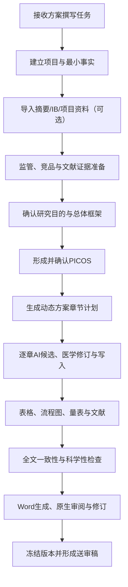

# 医学写作工作台：临床试验研究方案撰写说明书（通用版）

**文档类型：** 产品需求说明书（PRD）/ 医学业务规则说明书  
**适用范围：** 中国创新药 I、II、III 期临床试验研究方案撰写  
**主要用户：** 医学经理，兼顾医学监察员、医学总监、医学撰写等医学角色的工作视角  
**版本：** V1.1 通用外发版  
**日期：** 2026-07-27  
**文档状态：** 可用于不同组织的内部评审、跨部门沟通、产品建设与验收；不代表任何具体系统已经完成生产上线  

---

## 1. 文档目的

本说明书用于统一医学写作工作台的产品定位、真实医学写作流程、医学规则、独立 AI 应用要求、交互原则、文档标准、质量要求和上线验收口径。

它不是单纯的软件功能清单，也不是技术架构说明，而是以资深医学经理实际承担研究方案设计与撰写任务时的工作方式为主线，回答以下问题：

1. 医学经理拿到一个研究方案撰写任务后，需要准备什么、判断什么、确认什么；
2. 系统应如何主动完成资料检索、证据整理、设计建议和文稿预填；
3. 哪些内容可以复用组织内部语料或竞品方案，哪些内容必须根据研究药物和适应症重新形成；
4. 人类与独立 AI 如何分工，哪些决策必须由人类明确作出；
5. 如何确保研究摘要、正文、表格、流程图、量表、参考文献和 Word 输出保持一致；
6. 如何适配不同适应症、分期、药物类型、给药途径和研究设计；
7. 什么状态才可以称为“方案可用”，什么状态才可以称为“系统可上线”。

---

## 2. 产品愿景与定位

### 2.1 产品愿景

医学写作工作台的目标不是提供一套更复杂的空白表单，也不是在传统富文本编辑器旁增加一个聊天机器人，而是建设一个面向医学经理的 **AI 研究方案撰写器**：

> 最少项目事实输入  
> → 自动获取和解析项目资料、监管依据与竞品证据  
> → AI 形成有来源的研究设计及 PICOS 建议  
> → 医学经理选择、修改、确认  
> → AI 按章节生成可直接使用的专业文稿  
> → 人机协同完成表格、流程图、量表、文献和全文一致性  
> → 输出格式准确、可继续编辑的正式 Word 方案

### 2.2 初版业务边界

初版聚焦：

- 创新药企业；
- 中国临床试验；
- I、II、III 期研究；
- 非肿瘤及常规创新药研究方案写作；
- 统一医学经理身份；
- 研究方案优先。

后续可扩展至：

- 研究者手册（IB）；
- 知情同意书（ICF）；
- 临床研究报告（CSR）；
- CTD M2.5、M2.7.3、M2.7.4；
- 其他标准化医学写作文件。

监管问询回复等高度非标准文件不作为初版常备写作模块。

### 2.3 系统在医学经理工作台中的位置

医学写作是医学经理工作台的核心子系统之一。它与以下能力共享底层项目事实，但保持清晰边界：

- 证据调研与方案设计：共享适应症、竞品、监管和研究设计证据；
- 入排审核：共享结构化入排标准及其规则编号；
- 医学监查：共享方案规定、访视、药物、终点、AESI 和风险规则；
- 数据分析与 TFL：共享终点、分析集、统计假设和时间点；
- Safety/PV 协同：共享 AESI、安全性监测和风险控制要求。

研究方案中经医学经理确认的设计事实应成为其他子系统可复用的项目级权威事实，避免不同模块分别理解同一份方案。

---

## 3. 核心产品原则

### 3.1 AI 先工作，人类以判断和修订为主

医学经理不应在系统中重复从零填写大量内容。凡可由项目资料、公开证据、语料库和研究设计逻辑推导的内容，系统应先完成：

- 检索；
- 提取；
- 比较；
- 结构化；
- 形成推荐；
- 预填；
- 标记来源与不确定性。

用户的主要动作应为：

- 采用；
- 修改后采用；
- 拒绝；
- 重生成；
- 补充少量关键事实；
- 对冲突作出判断。

### 3.2 用户已经给过的信息不得重复询问

以下信息一经用户输入、从摘要提取并确认或从项目资料确认，后续步骤必须继承：

- 研究药物；
- 适应症；
- 研究分期；
- 研究目的；
- 药物类型和给药途径；
- 研究设计；
- PICOS；
- 其他已确认项目事实。

系统不得在不同页面以不同表述重复要求确认同一事实。

### 3.3 用户采纳即构成医学作者确认

在初版单一医学经理身份下：

- 用户选择某个设计选项；
- 采用 AI 推荐；
- 修改后保存；
- 确认自然语言解析结果；
- 对校验结果执行有理由的 override；

均代表该医学经理已作出项目层医学决定。

不应再次显示“待医学批准”，也不应把同一内容重复送入审批中心。

需要区分：

| 对象 | 正确状态 |
|---|---|
| 尚未被用户采用的机器内容 | AI 建议、抽取候选、待采用 |
| 用户已采用的项目事实 | 已采用、已确认 |
| 已写入正文的 AI 文稿 | 已写入工作稿 |
| 整章检查 | 草拟中、待审阅、审阅完成、需调和 |
| 完整文档 | 工作稿、可生成送审版、已生成送审版 |

企业级医学总监复核、电子签名或正式组织审批应作为未来独立治理流程，不得与当前医学经理的内容确认混为一谈。

### 3.4 所有关键内容必须可追溯

每个重要事实、设计建议和文字候选，应尽可能保留：

- 来源文件或公开来源；
- 来源版本及日期；
- 原始内容；
- 原文位置；
- 适用范围；
- 生成或提取方式；
- 用户决定；
- 后续受影响章节。

前端应优先展示“原始内容是什么”，定位信息作为次级溯源信息。不得只显示文件名、页码或行号而不展示关键原文。

### 3.5 事实、证据、推断和文稿必须分层

系统必须明确区分：

- 项目已确认事实；
- 项目资料中提取但尚未确认的事实；
- 监管要求；
- 竞品研究设计；
- 竞品结果；
- 同类药或同靶点类比；
- AI 推断；
- AI 形成的文稿候选。

AI 推断不得伪装为项目事实。竞品设计不得自动变成目标研究设计。

### 3.6 动态方案优于固定模板

不同方案的章节、表格和内容不是完全相同的。系统必须根据研究设计动态决定：

- 哪些章节必须出现；
- 哪些章节在特定设计下出现；
- 哪些内容应写“不适用”；
- 哪些章节应直接省略；
- 某一设计变化会影响哪些摘要、正文、表格和图。

例如：

- 未设置期中分析时，不应强制出现期中分析章节；
- 设置期中分析后，研究摘要、统计分析、数据审查、样本量或决策规则等相关位置应同步出现；
- 无对照研究不应要求填写对照药，但应由研究设计自动投影“不适用”；
- I 期多部分研究应按各 Part 动态形成流程、终点和监测内容。

### 3.7 桌面端优先

系统面向长期、复杂、专业的桌面写作场景：

- 优先保证桌面端信息组织和编辑效率；
- 不为适配移动端而砍掉关键功能；
- 不追求营销式页面；
- 不以大量卡片、警告、日志和状态信息挤占文档编辑空间。

---

## 4. 真实医学写作工作流总览

---

## 5. 阶段一：接收任务与建立项目

### 5.1 医学经理的现实起点

医学经理拿到写作任务时，通常只掌握部分信息：

- 研究药物或候选药物名称；
- 拟研究适应症；
- 大致研究分期；
- 可能存在一份方案摘要；
- 可能存在 IB，也可能尚未形成 IB；
- 可能已有管理层、BD、临床或统计团队提出的零散要求。

系统不得假设用户已经完成完整研究设计。

### 5.2 两种项目入口

#### 入口 A：从零开始

首屏只要求三个最基本信息：

1. 研究药物；
2. 适应症；
3. 研究分期。

可选：

- 上传 IB；
- 输入一段项目背景或非结构化要求；
- 暂不确定部分信息。

系统应自动生成：

- 内部项目 ID；
- 项目显示名称候选；
- 方案标题候选；
- 方案代号候选；
- 初始证据检索任务；
- 后续待确认事项。

#### 入口 B：导入方案摘要

用户上传已有方案摘要后：

1. 系统先解析文档；
2. 提取基本事实、研究设计和 PICOS；
3. 展示结构化结果、冲突和缺口；
4. 用户批量确认或修改；
5. 已确认事实直接进入后续流程。

不得先让用户重复填写摘要中已经存在的信息。

### 5.3 自然语言事实入口

对于无法由选项完整表达或用户已有大量背景说明的场景，应提供自然语言输入：

- 用户可输入一段或多段非结构化说明；
- AI 先拆解为结构化事实和待确认问题；
- 保留用户原始文字；
- 系统展示解析结果；
- 用户确认后写入项目事实；
- 仅对真正影响方案的缺口进行追问。

该机制适用于：

- 无 IB 项目背景；
- 特殊开发策略；
- 复杂背景治疗；
- 特殊人群；
- 创新研究设计；
- 管理层或合作方提出的非标准要求。

---

## 6. 阶段二：项目资料与研究者手册

### 6.1 IB 的定位

IB 是高优先级项目来源，但不是建项或开始调研的必选项。

IB 可支持：

- 药物身份、剂型和给药途径；
- 靶点与作用机制；
- 非临床药理、PK/TK、安全药理和毒理；
- 已有人体 PK/PD；
- 既往临床研究；
- 已知和潜在安全性风险；
- 剂量依据；
- AESI；
- 入排标准；
- 合并用药限制；
- 监测和停止规则；
- 方案背景与研究依据。

### 6.2 IB 可选状态

系统应支持：

- 建项时上传；
- 后续补充；
- 替换为新版本；
- 暂不提供；
- 明确当前尚无 IB。

没有 IB 不应阻断：

- 项目创建；
- 适应症和竞品调研；
- 初步研究框架建议；
- 通用语料准备；
- 不依赖药物特异事实的章节写作。

### 6.3 无 IB 时的最小产品事实包

系统不应要求用户手工写一份简化 IB，而应先利用公开来源建立候选事实包。

至少覆盖：

- 药物规范名称、研发代号和别名；
- 药物类型；
- 靶点和作用机制；
- 剂型和给药途径；
- 是否已有临床给药；
- 已公开的剂量、暴露、PK/PD；
- 已公开安全性关注；
- 给药频次、半衰期、蓄积、代谢、清除；
- 食物影响和 DDI；
- 局部耐受性、免疫原性或装置依赖；
- 仍然未知的高影响事实。

来源可包括：

- ClinicalTrials.gov；
- PubMed；
- 公开论文；
- 公开监管资料；
- 目标药物明确同义词命中的正式来源。

系统规则：

1. 目标药物事实必须由目标药物名称、代号或已确认别名命中；
2. 同适应症竞品的药物类型、剂量和风险不得写成目标药物事实；
3. 无直接来源时保持未知；
4. 精确剂量、阈值和时间窗必须有直接证据；
5. 类别类比只能作为设计参考；
6. 用户只补充少量会实质影响设计的事实；
7. 用户可选择“未知/尚无资料”。

### 6.4 IB 版本更新

新版本 IB 导入后：

- 不直接覆盖旧版本；
- 系统生成版本差异；
- 标记受影响事实和章节；
- 已确认事实进入“来源变化，需重新确认”；
- 用户可保留旧值、采用新值、合并或自定义；
- 未受影响章节不应被整体重置。

---

## 7. 阶段三：监管、竞品与文献证据准备

### 7.1 证据准备目标

在用户仅提供药物、适应症和分期后，系统应尽早启动证据准备，用于：

- 理解疾病和监管背景；
- 判断常见研究设计；
- 发现可复用的规范化表达；
- 形成 PICOS 建议；
- 识别量表、终点、访视和风险控制；
- 支持后续逐章写作。

### 7.2 竞品研究检索

系统应自动检索 ClinicalTrials.gov，并根据以下维度形成候选：

- 适应症；
- 研究分期；
- 研究目的；
- 靶点或机制；
- 药物类型；
- 剂型；
- 给药途径；
- 人群；
- 研究设计；
- 区域；
- 申办方；
- 研究时间和版本新旧。

不得仅凭适应症名称把所有研究视为同等相关。

### 7.3 Protocol/SAP 获取

对候选研究，系统应：

1. 识别是否公开 Protocol、SAP 或其他附件；
2. 保存公开来源地址；
3. 下载原始文件；
4. 记录研究编号、文档角色、日期、版本、文件大小和哈希；
5. 进行基本信息与内容角色校验；
6. 解析章节、表格、图和量表；
7. 进入翻译和语料准备流程。

如没有公开 Protocol/SAP：

- 明确显示证据缺口；
- 可保留注册信息作为研究登记证据；
- 不得把注册字段伪装成完整方案原文。

### 7.4 文件校验边界

不需要进行费时、费 token 的“文件安全性审核”。

仅进行对医学工作有价值的基本校验：

- 文档是否属于当前适应症；
- 文档是否为目标研究或竞品研究；
- 文档类型是否确为 Protocol、SAP、Publication、IB 等；
- 是否误把 Publication 当作 Protocol；
- 版本是否较新；
- 文件是否可读取；
- 内容是否与文件名基本一致。

用户可在充分提醒后 override。override 应记录原因并立即生效。

### 7.5 候选研究与批量处理

候选研究筛选、文件解析和翻译不应常驻写作编辑器。

应形成独立的“竞品方案参照”流程：

- AI 完成适用性排序；
- 用户确认研究篮子；
- 用户可一键批量启动下载、解析、翻译和提取；
- 单个文件失败不阻断其他文件；
- 任务可刷新、关闭页面后继续；
- 显示医学经理能理解的阶段进度；
- 不展示底层运行日志。

### 7.6 翻译与中文语料形成

英文方案的处理流程：

1. 本地解析或 OCR；
2. 识别目录和章节；
3. 按章节及合理上下文分块；
4. 由专用翻译模型翻译正文；
5. 对章节衔接和分块衔接进行整合 QC；
6. 应用临床试验中英术语词典；
7. 对中文表达进行监管语气和自然化处理，依据中文专业写作自然化规则去除
   机械连接词、空泛结论、重复概括和明显 AI 句式；
8. 形成待医学审阅的中文译文；
9. 审阅后进入项目参考语料。

要求：

- 翻译应忠实，不改变事实；
- 不应保留明显机器翻译腔；
- 医学术语、量表、药物、时间点和统计术语保持一致；
- 原文和译文逐段关联；
- 不能用上层大模型重新翻译后替代专用翻译模型正文。

系统应逐步建立临床试验专用中英术语词典，优先覆盖：

- 研究设计；
- 研究阶段和访视；
- 入排标准；
- 药物类型、剂型和给药途径；
- PK/PD；
- 安全性；
- 统计分析；
- 研究流程表；
- 监管和质量管理。

词典用于固定术语映射和一致性，不替代上下文翻译。对一个术语存在多种中国监管
表达时，应按适应症、章节和组织内部语料选择，并保留术语决策记录。

### 7.7 语料库分层

语料库不是文档仓库，而是经提取、标记、评价和适用性约束的写作参考库。

建议分为：

1. 公司中文方案和方案摘要语料；
2. 中国监管模板和指导原则语料；
3. 同适应症中文语料；
4. 同适应症英文竞品方案译文；
5. 同机制或同药物类型相邻适应症语料；
6. 通用临床试验标准条款；
7. I 期专项语料；
8. 表格、附注、量表和流程图结构语料。

### 7.8 语料适用性标签

每个语料单元至少应标记：

- 适应症；
- 研究分期；
- 研究目的；
- 药物类型；
- 靶点或机制；
- 剂型；
- 给药途径；
- 暴露模式；
- 人群；
- 设计模块；
- 章节；
- 来源级别；
- 来源日期和版本；
- 是否为组织标准表达；
- 可否跨适应症使用；
- 是否存在冲突。

### 7.9 防止语料库过拟合

独立 AI 分析语料时必须：

- 区分同适应症稳定表达和单份方案个性表达；
- 区分同一申办方惯用表达和行业共性；
- 单一来源不得表述为“通常采用”；
- 多数方案一致不等于适用于目标项目；
- 冲突不能通过简单多数表决消除；
- 跨适应症只迁移结构、监管共性和通用条款；
- 不迁移疾病特异阈值、终点、治疗线或用药规则；
- 保留罕见设计和少数派合理方案；
- 明确哪些结论仅适用于特定疾病领域或特定适应症；
- 输出“适用条件”，而不是只输出“推荐文本”。

---

## 8. 阶段四：研究目的与总体框架

### 8.1 研究目的不是正文中的“研究目的”

建项阶段需要明确的“研究目的”是内部开发意图，例如：

- FIH；
- first-in-patient；
- 初始安全性和耐受性；
- PK；
- PD；
- PoM；
- PoC；
- 剂量探索；
- 剂量选择；
- 确证性研究；
- 长期延展性/OLE；
- 特殊人群；
- 制剂桥接；
- 食物影响；
- DDI；
- QT；
- 物质平衡。

这些目的用于指导证据检索、设计建议和章节生成，不直接等同于方案正文表述。

### 8.2 正交研究设计

系统必须把以下维度分别建模，不应把“随机、双盲、安慰剂对照”绑定为一个不可拆选项：

- 是否随机；
- 盲法及被设盲角色；
- 对照类型；
- 干预模型；
- 分组和队列结构；
- 单中心或多中心；
- 区域；
- 样本量框架；
- 研究阶段；
- 数据审查机制；
- 适应性设计；
- 期中分析；
- 样本量重估；
- 转组；
- 开放标签延长期；
- SRC/DMC/IDMC。

所有选项应提供“其他”：

- 用户用自然语言描述；
- AI 解析为结构化设计；
- 显示解析预览；
- 用户确认后生效。

### 8.3 AI 推荐研究设计

系统根据以下信息生成推荐设计和替代设计：

- 分期；
- 研究目的；
- 适应症；
- 研究药物类型；
- 给药途径；
- IB 或最小产品事实包；
- 竞品研究；
- 中国监管要求；
- 运营可行性；
- 统计需求。

推荐方案应说明：

- 为什么推荐；
- 与替代方案的实质差异；
- 适用前提；
- 主要风险；
- 对样本量、盲法、随访、终点和运营的影响。

不应展示大量同义候选。

---

## 9. I 期研究专项要求

### 9.1 I 期不是单一研究类型

I 期项目可能包含多个研究部分，同一方案可以多选并组合：

- SAD；
- MAD；
- 剂量扩展；
- 食物影响；
- 相对生物利用度；
- 绝对生物利用度；
- BA/BE；
- 物质平衡/ADME；
- DDI；
- QT/QTc；
- 肝功能损伤；
- 肾功能损伤；
- 特殊人群；
- 微剂量；
- 其他临床药理研究。

### 9.2 三轴分类

系统应区分：

1. **开发情境：** FIH、首次患者、已有健康人数据后的首次患者、混合情境；
2. **研究部分：** SAD、MAD、食物影响、DDI 等可实际执行的 Part；
3. **目标标签：** 安全性、PK、PD、PoM、PoC、剂量选择等。

PoM/PoC 是研究目标，不应与 SAD、食物影响等物理研究部分混为一类。

### 9.3 多 Part 编排

每个 Study Part 应保存：

- 顺序；
- 前置 Part；
- 是否允许重叠；
- 开始条件；
- 人群；
- 队列；
- 剂量和暴露规则；
- 终点；
- SoA 变体；
- 安全性监测；
- 暂停和停止规则；
- 数据审查委员会；
- 与其他 Part 的依赖关系。

### 9.4 典型组合规则

- SAD + MAD 可在同一方案内序贯，但 MAD 启动应依赖 SAD 的安全性和暴露结果；
- SAD + 食物影响适用于口服制剂，并需控制已验证暴露范围；
- DDI 通常在已有足够安全性和重复给药数据后开展；
- 浓度-QTc 可嵌入，但“有 ECG”不等于完成正式 QT 评价；
- 肝损伤和肾损伤默认分别设计；
- 特殊人群通常不并入首次人体递增逻辑；
- 健康受试者不适宜时，可以 FIP，但起始剂量、停止规则和获益风险必须患者化；
- 多 Part 是否整合只能给条件性建议，不能当作监管许可清单。

### 9.5 药物形态对 I 期设计的影响

不同药物类型和给药途径必须影响：

- 起始剂量方法；
- 剂量递增跨度；
- 哨兵给药；
- 队列间隔；
- 观察窗；
- 最大暴露；
- 蓄积和稳态；
- PK/PD 采样；
- ADA/NAb；
- 局部耐受性；
- 装置相关监测；
- 给药后观察；
- 停止规则。

不得把口服小分子的典型 SAD/MAD 逻辑直接套用于长效抗体、RNA、外用或吸入制剂。

---

## 10. 阶段五：PICOS 设计

### 10.1 交互形式

PICOS 不应是单页巨型表单。应按 P、I、C、O、S 分步呈现：

- 每步先显示 AI 完整建议包；
- 支持批量采用；
- 支持展开精调；
- 支持单项拒绝和重生成；
- 支持部分确认；
- 非关键缺失不阻断继续。

### 10.2 Population：研究人群

系统应先生成一套完整入排建议，而不是空白列表。

模块包括：

- 年龄、性别、体重和 BMI；
- 疾病诊断；
- 病程；
- 疾病严重程度；
- 筛选期和基线期量表；
- 既往治疗；
- 治疗失败定义；
- 治疗线；
- 药物和治疗洗脱；
- 实验室和器官功能；
- 感染；
- 重要系统疾病；
- 妊娠、哺乳和避孕；
- 药物特异风险；
- 健康受试者或患者特异标准。

每条标准应具备：

- 入选或排除；
- 稳定编号，如 IN-05、EX-07；
- 概念；
- 条件和运算符；
- 阈值和单位；
- 时间窗；
- 评估时间点；
- 适用人群；
- 来源；
- 当前状态。

### 10.3 Intervention：干预措施

至少包括：

- 研究药物剂型和给药途径；
- 起始剂量；
- 剂量水平；
- 递增算法；
- 给药频次；
- 疗程；
- 哨兵给药；
- 队列内和队列间审查；
- 暂停、停止、减量和恢复；
- 允许的合并用药/治疗；
- 必须或背景使用的治疗；
- 限制使用的药物；
- 禁止使用的药物；
- 疗效评估前限制药物；
- 导入期治疗；
- 食物条件；
- 洗脱；
- 交叉期；
- 救援治疗。

试验药物剂量调整、暂停、重启或变更必须单独建模，不得混入非试验用药（CM）。

### 10.4 Comparator：对照

对照应作为独立对象：

- 安慰剂；
- 阳性药；
- 剂量对照；
- 同受试者/时期内对照；
- 外部或历史对照；
- 无同期对照；
- 其他。

记录：

- 名称；
- 剂型；
- 用法用量；
- 匹配方式；
- 盲法支持；
- 选择理由；
- 救援治疗。

### 10.5 Outcomes：结局指标

系统应按层级生成：

- 主要终点；
- 关键次要终点；
- 其他次要终点；
- 探索性终点；
- 安全性终点；
- PK/PD 终点；
- AESI；
- I 期各 Part 特异终点；
- 量表及评估时间点。

每个终点包括：

- 定义；
- 评估工具；
- 评估时间点；
- 分析口径；
- 来源；
- 与样本量或主要分析的关系。

不得因为多个方案使用同一概念，就在没有证据时生成精确时间点和阈值。

### 10.6 Study Design / Statistics / Execution

PICOS 后还应形成：

- 研究阶段和流程；
- 分组、队列和时期；
- 随机化；
- 盲法；
- 对照；
- 样本量框架；
- 分析集；
- 主要分析方法；
- 缺失数据策略；
- 多重性；
- 期中分析；
- 样本量重估；
- 数据审查；
- 关键质量因素；
- 研究流程表；
- 研究流程图。

---

## 11. 阶段六：动态方案框架

### 11.1 框架权威来源

研究方案框架遵循以下优先级：

1. 当前项目已确认设计事实；
2. 组织正式研究方案模板；
3. 公司最高优先级方案摘要和方案实例；
4. NMPA 发布的中文 ICH M11 指导原则、模板、技术规范及实施建议；
5. 适用的中国指导原则；
6. 同适应症、同分期、同设计竞品方案；
7. 其他国际方案和监管资料。

ICH M11 是框架性和语义性规范，不应机械覆盖公司已验证的中国方案格式。

### 11.2 公司参考资料边界

- 方案摘要参考用于摘要结构、字段和表达；
- 完整方案模板用于正文结构和最终版式；
- 单个摘要文件不能作为完整方案所有章节的唯一格式权威；
- 当组织内部资料不一致时，应比较多个高质量方案并结合 M11；
- 优先级较低的资料如果在特定章节明显更规范，可经医学评估择优采用；
- 取长补短不能破坏全文一致性。

### 11.3 动态章节规则

章节可分为：

1. **稳定必选章节：** 多数研究均需出现；
2. **分期驱动章节：** I、II、III 期要求不同；
3. **适应症驱动章节：** 疾病特点决定；
4. **药物驱动章节：** 药物类型、给药途径、安全性决定；
5. **设计驱动章节：** 对照、盲法、期中分析、转组、OLE 等决定；
6. **来源驱动章节：** 有无 IB、量表和特定资料决定；
7. **条件性章节：** 可省略或写不适用。

### 11.4 章节联动示例

| 设计事实 | 联动位置 |
|---|---|
| 设置期中分析 | 摘要、统计、数据审查、样本量或决策规则 |
| 设置转组 | 摘要、研究设计、流程图、SoA、干预和分析 |
| 设置 OLE | 摘要、阶段、治疗、随访、终点、安全性 |
| 设置 DMC | 组织、数据审查、期中分析、停止规则 |
| 设置 AESI | 摘要、安全性终点、监测、AE 报告、风险管理 |
| 多 Part I 期 | 摘要、流程、各 Part 人群/剂量/终点/SoA |
| 无对照 | 对照章节省略或自动投影不适用 |
| 阳性药对照 | 对照理由、剂量、盲法、非劣/优效分析 |
| 背景治疗 | 入排、干预、依从性、禁限用药、统计解释 |

### 11.5 章节计划

正式写作前系统应生成章节计划：

- 章节标题；
- 是否启用；
- 启用原因；
- 依赖的研究设计事实；
- 推荐语料；
- 必须引用的证据；
- 表格、图和量表；
- 当前完成状态；
- 设计变化后的影响。

用户可调整章节，但系统必须提示与摘要、PICOS、表图和其他章节的影响。

---

## 12. 阶段七：逐章撰写与 AI 协作

### 12.1 写作台布局

写作台应以两个对象为核心：

1. 文档编辑区；
2. AI—证据协作区。

目录应可折叠、悬浮或按需展开，不应长期压缩编辑空间。

不应常驻：

- 原始日志；
- 写作质量门的技术细节；
- 候选研究解析过程；
- 文件定位清单；
- 大量风险和警告；
- 不影响当前写作决策的系统状态。

### 12.2 AI 候选

选择章节后，AI—证据区直接提供：

- 1 个推荐版本；
- 2-4 个有实质差异的备选版本；
- 每个版本的来源和适用条件；
- 关键差异；
- 不确定性。

用户可：

- 写入工作稿；
- 修改后写入；
- 拒绝；
- 要求重新生成；
- 指定语气、长度或证据；
- 与 AI 继续对话。

### 12.3 不同写作任务的提示目标

#### 从零形成候选

目标：

- 基于已确认研究设计和语料生成完整可用文本；
- 不要求用户先提供草稿；
- 输出 3-5 个版本；
- 不制造无来源精确事实。

从零生成应是最后手段。系统优先按以下顺序组装文稿：

1. 直接复用经确认的组织标准条款；
2. 使用同适应症、同分期、同设计的高质量语料进行变量化改写；
3. 使用经审阅的竞品方案译文形成结构和表达参考；
4. 对项目特异事实进行必要补写；
5. 只有缺少可复用语料时才完全从零生成。

即使从零生成，也必须经过术语词典、监管语气、上下文一致性和“去 AI 味”处理，
避免空泛总结、过度分点、宣传性措辞和不符合方案惯例的表达。

#### 改写

目标：

- 保留医学事实、数字、单位、时间点和逻辑；
- 优化结构、准确性、可读性和监管表达；
- 不擅自增加结论；
- 不用同义替换制造变化。

#### 监管语气

目标：

- 使用中国临床试验方案常用的规范、客观、可执行表达；
- 避免宣传性、推测性和因果过度；
- 统一主语、时态、义务强度和术语；
- 优先使用已确认中文组织内部语料。

#### 扩写

目标：

- 补充必要背景、依据、实施细节或限制；
- 新增内容必须来自允许证据或明确标记为待确认；
- 不通过重复表达增加篇幅。

#### 缩写

目标：

- 保留所有决定性事实、条件、例外和时间点；
- 删除重复、低价值背景和无效过渡；
- 不损失可执行性。

#### 查一致性

目标：

- 比对 StudyDefinition、PICOS、摘要、正文、表格和图；
- 发现名称、剂量、时间点、样本量、终点、阶段和状态冲突；
- 提供来源和受影响位置；
- 不直接静默修改。

#### 补证据

目标：

- 判断哪些陈述需要文献、监管或项目资料支持；
- 检索或推荐相关来源；
- 建议引用位置；
- 无证据时降低表述强度或标记待补；
- 不虚构文献。

### 12.4 对话式细节修订

AI 交互不仅是单次按钮：

- 用户可针对一个句子、段落、表格单元格或章节发起对话；
- AI 应理解当前选区、章节、项目事实和允许证据；
- 每轮保留修改目标和差异；
- 用户可撤销；
- 接受后写入当前工作副本；
- 长对话不应丢失当前章节边界。

### 12.5 人工直接编辑

编辑器至少支持：

- 字体；
- 字号；
- 粗体；
- 下划线；
- 上标；
- 下标；
- 文字颜色；
- 文字高亮；
- 标题 1-4；
- 正文和附注样式；
- 对齐；
- 行距；
- 段前段后；
- 首行缩进；
- 左右缩进；
- 项目符号和编号；
- 撤销和重做；
- 查找和替换；
- 表格插入和编辑；
- 超链接和交叉引用；
- 最大化编辑。

回车、换行、表格输入、复制粘贴、选择、删除和常用快捷键必须按 Word 用户习惯工作。

### 12.6 工作副本与版本

- 源文件保持只读；
- 用户编辑的是版本化工作副本；
- 保存后产生版本；
- AI 写入也产生可审计变化；
- 刷新和重启不丢失；
- 未保存内容提供恢复；
- 发生并发冲突时不得静默覆盖；
- 项目事实变化后只标记受影响章节“需调和”；
- 历史版本可查看和恢复。

---

## 13. 阶段八：结构化表格

### 13.1 表格分类

应区分：

1. 用于页面排版的透明表格；
2. 研究摘要表；
3. 正文中实际打印显示的正式表格；
4. 研究流程表；
5. 可复用的专业表格；
6. 普通临时表格。

首页的排版表格不应被误当作正式编号表格。研究摘要是特殊大表格，不与正文普通表格混同。

### 13.2 表格呈现

所有表格在编辑器中必须真实渲染：

- 不省略；
- 不显示未渲染 Markdown；
- 默认和最大化模式均可编辑；
- 工具栏能力与普通段落一致；
- 单元格可输入、格式化和调用 AI；
- 支持合并、拆分、增删行列；
- 支持列宽、行高、边框、底纹、对齐；
- 支持附注和表题；
- 支持编号和表目录。

### 13.3 研究流程表编辑器

研究流程表应有独立结构化编辑器。

#### 行维度

用户可：

- 选择标准研究活动；
- 添加自定义活动；
- 调整顺序；
- 分组；
- 定义检查项目；
- 指定数据采集要求。

典型活动：

- 知情同意；
- 入排标准；
- 人口学；
- 病史；
- 体格检查；
- 生命体征；
- 实验室；
- ECG；
- 妊娠；
- PK/PD；
- 疗效量表；
- 安全性；
- 研究用药；
- 合并用药；
- 依从性；
- AE/SAE；
- 结束和随访。

#### 列维度

用户可：

- 自定义访视；
- 设置研究日；
- 设置访视窗；
- 设置筛选、基线、治疗、随访；
- 设置 I 期队列或 Part 特异访视；
- 增删列；
- 调整顺序；
- 标记计划外访视和提前终止。

#### 单元格

支持：

- 点选是否执行；
- 执行频次；
- 条件执行；
- 时间窗；
- 脚注；
- 仅特定队列/Part；
- 预填与批量修改。

#### 附注模块

附注与表格同等重要，应结构化：

- 血常规包含哪些项目；
- 生化包含哪些项目；
- 量表在哪个访视、哪个研究日实施；
- 空腹要求；
- 采样时间；
- PK/PD 时间窗；
- 特定条件下追加检查；
- 妊娠检测；
- 影像评估；
- 安全性随访；
- 访视窗和允许偏差。

AI 应根据已确认研究设计和竞品方案预填，用户主要修订。

### 13.4 其他可模板化表格

可按研究流程表思路设计：

- 研究摘要；
- 分析集定义；
- 终点及分析方法；
- 试验药物剂量调整；
- 暂停和停止标准；
- 合并用药分类；
- AESI 定义与监测；
- 入排标准；
- 研究阶段与访视；
- PK/PD 采样；
- 随机化与分层因素；
- 量表清单；
- 样本处理。

高度同质化表格应默认预填，不应从空表开始。

---

## 14. 阶段九：研究流程图、图和量表

### 14.1 研究流程图

研究流程图应由统一研究设计事实自动投影：

- 筛选；
- 导入；
- 随机；
- 分组；
- 治疗；
- 剂量递增；
- 数据审查；
- 期中分析；
- 转组；
- 延展；
- 随访；
- 停止或退出。

用户可在图形化编辑器中：

- 增删节点；
- 调整顺序；
- 修改名称；
- 设置条件分支；
- 设置 Part 依赖；
- 调整布局；
- 确认最终图。

输出优先使用 SVG 等矢量格式，并为 Word 提供兼容 fallback。

### 14.2 研究流程图视觉要求

- 符合组织统一视觉规范；
- 信息层次清晰；
- 不堆叠过多节点；
- 箭头方向明确；
- 条件分支可读；
- 页面宽度充分；
- 图题与图不能分页分离；
- 在 Word 和 PDF 中保持清晰；
- 适合黑白打印时仍可辨认。

### 14.3 量表

系统应从竞品方案和项目资料中识别：

- 量表名称；
- 版本；
- 语言；
- 版权或授权提示；
- 评估时间点；
- 评分方法；
- 方案附件。

英文量表可提取并翻译，但必须提醒用户确认：

- 是否使用官方中文版本；
- 是否需要授权；
- 是否允许系统译文用于正式研究；
- 是否应以图片附件形式插入。

### 14.4 图片附件

图片形式量表或附件应：

- 保持原始页序；
- 保持可读清晰度；
- 图表页按不低于 200 DPI 处理；
- 不被不合理压缩；
- 正确分节和分页；
- 不影响正文页眉页脚；
- 在 Word 中可继续替换。

---

## 15. 阶段十：文献与引用

### 15.1 文献导入

支持：

- DOI；
- PMID；
- PubMed 链接；
- 期刊官网链接；
- 手工题录；
- 方案原有参考文献；
- 项目文献库。

### 15.2 文献处理

系统应：

- 解析题录；
- 去重；
- 识别同一文献的不同入口；
- 保存 DOI、PMID 和来源链接；
- 关联原文或摘要；
- 记录引用位置；
- 支持项目级检索；
- 支持 AI 根据上下文推荐文献。

### 15.3 引用格式

默认：

- GB/T 7714-2015 顺序编码制；
- 正文使用上标形式 `[1]`；
- 引文为可跳转超链接；
- “参考文献”章节自动生成；
- 编号随新增、删除和排序更新；
- 导入方案原有文献必须重新索引；
- 手工引用与 AI 引用使用同一索引。

### 15.4 AI 文献规则

AI 不得虚构文献。

每个推荐文献至少应：

- 可检索；
- 有真实 DOI、PMID 或正式来源；
- 与当前陈述直接相关；
- 区分指南、原始研究、综述和竞品方案；
- 提示全文不可得或证据不足；
- 不以来源名称代替事实核查。

---

## 16. 阶段十一：全文一致性与医学质量

### 16.1 一致性对象

至少核对：

- 项目名称和方案编号；
- 适应症；
- 人群；
- 样本量；
- 分组和比例；
- 随机与盲法；
- 研究阶段；
- 给药剂量、频次和疗程；
- 背景治疗；
- 允许、限制和禁用药；
- 主要和次要终点；
- 评估时间点；
- AESI；
- PK/PD；
- 入排标准；
- 研究流程表；
- 研究流程图；
- 统计方法；
- 期中分析；
- 转组；
- 表图编号；
- 文献编号。

### 16.2 医学科学性检查

- 研究目的与设计是否匹配；
- 人群是否能回答研究问题；
- 终点与适应症、分期是否匹配；
- 主要终点是否支持样本量和分析；
- 给药和监测是否符合药物特征；
- 背景治疗和禁限用药是否自洽；
- 风险控制是否覆盖 IB 和公开风险；
- 洗脱时间是否有依据；
- I 期递增、观察和停止标准是否合理；
- AESI 是否被定义、监测和分析；
- 特殊人群是否处理；
- 运营上是否可执行；
- 是否存在无来源的精确数字。

### 16.3 监管符合性检查

- 章节是否满足中国方案要求；
- 术语是否规范；
- 义务性表达是否清晰；
- 受试者保护是否充分；
- 风险—获益是否一致；
- 统计和数据处理是否可执行；
- 是否符合适用的 NMPA/CDE/ICH 指导原则；
- 国际参考是否被误表述为中国强制要求。

### 16.4 发现问题后的处理

系统应提供：

- 具体问题；
- 原始事实或原文；
- 受影响章节；
- 建议处理；
- 是否阻断送审；
- 用户确认或 override。

不应展示大量泛化“风险分数”或技术日志。

---

## 17. 阶段十二：Word 输出与正式文档

### 17.1 Word 是最终权威输出

最终成果必须是可继续编辑的 DOCX，而不是网页截图或不可编辑 PDF。

### 17.2 字体与样式

- 全文中文默认宋体；
- 英文和数字使用 Times New Roman；
- 标题使用真实 Word“标题 1/2/3/4”样式；
- 正文使用规范正文样式；
- 附注使用独立样式；
- 不使用蓝色或其他非方案规范颜色作为正文或表格默认色；
- 5.1 等正文段落按公司规范首行缩进两个汉字。

### 17.3 首页

首页应匹配公司权威方案模板：

- 方案标题；
- 方案编号；
- 版本；
- 日期；
- 申办方；
- 保密声明等；
- 字体、字号、位置和段落；
- 不重复方案编号；
- 不泄漏内部批准标识；
- 不因透明排版表格而产生正式表格编号。

### 17.4 目录和标题

- “目录”本身不编号；
- 标题父子编号清晰；
- 目录可跳转；
- 标题层级使用 Word 样式；
- 图目录和表目录可跳转；
- 交叉引用可更新；
- Word 中可继续修改并刷新域。

### 17.5 研究摘要

研究摘要应以公司高优先级摘要为准：

- 使用大表格结构；
- 研究目的与终点可使用表格中的嵌套表格；
- 分点内容带正确项目符号；
- 合并单元格、行列和样式可继续编辑；
- 不是把正文段落简单复制到摘要；
- 与 StudyDefinition 和 PICOS 同源。

### 17.6 正文和表图

- 表格是真实 Word 表格；
- SVG/图像正确嵌入；
- 图题与图同页；
- 表题不孤立；
- 表格跨页规则合理；
- 页眉页脚不覆盖正文；
- 横向节结束后恢复纵向正文；
- 附件分页正确；
- 参考文献超链接有效。

### 17.7 Word 验收

必须用 Microsoft Word 原生环境验证：

1. 打开；
2. 更新目录、图表目录和域；
3. 保存；
4. 关闭；
5. 重新打开；
6. 测试跳转；
7. 测试继续编辑；
8. 导出 PDF；
9. 逐页视觉审阅；
10. 检查 OpenXML 结构。

LibreOffice 或静态解析不能替代原生 Word 验收。

---

## 18. 独立 AI 应用要求

### 18.1 独立运行原则

正式运行时：

- 不依赖任何开发工具或开发者个人能力；
- 不依赖开发阶段的外部执行或会商环境；
- 不依赖测试工具代写；
- 所有业务 AI 任务均由产品自身配置、可独立运行的 AI 能力完成。

开发阶段的外部辅助工具仅用于：

- 产品设计；
- 提示词优化；
- 测试；
- 审阅；
- 缺陷发现；
- 科学性复核。

### 18.2 AI 角色

#### 通用独立 AI

负责：

- 项目事实结构化；
- 竞品研究分诊；
- 语料分析；
- 研究设计建议；
- PICOS 候选；
- 章节候选；
- 改写和一致性；
- 证据选择；
- 文献建议；
- 冲突解释。

通用 AI 能力必须通过可配置方式接入。默认模型由部署环境和组织配置决定，任何厂商
或模型均不得写死在业务流程中。

#### OCR AI

默认要求：

- 使用适合中英文医学文档、表格和版面识别的专用 OCR 引擎；
- 最多 8 路并发；
- 图和表页面不低于 200 DPI；
- 可配置百度 OCR 等其他提供方；
- 识别结果保留页码、区块、表格和来源定位。

#### 翻译 AI

正文翻译默认要求：

- 使用经医学和临床试验语料验证的专用神经机器翻译引擎；
- 最多 8 路并发；
- 按章节和上下文分块；
- 不由通用大模型替代正文翻译。

翻译辅助模型负责：

- 目录识别；
- 章节拆分；
- 译后整合；
- 分块衔接 QC；
- 语料选取；
- 术语一致性。

章节识别、译后整合和语料选择可由通用 AI 辅助完成；如默认能力不能胜任，应允许
切换为更强的通用 AI。通用 AI 不得直接替代专用翻译引擎完成正文翻译。

#### VLM

用于：

- 复杂图表理解；
- 量表页面预检；
- 页面结构识别；
- OCR 后图文一致性检查。

可配置合适的视觉理解模型，但不得让视觉模型直接覆盖可由确定性解析获得的结果。

### 18.3 模型选择器

系统应提供通用 AI、OCR、翻译和视觉能力选择器。

应兼容：

- 主流云端 AI 服务；
- 采用通用接口规范的第三方服务；
- 组织内部 AI 服务；
- 主流本地推理服务；
- 可在个人工作站或组织内网部署的本地模型运行环境。

能力：

- 自动识别常见 base URL；
- 输入或覆盖 API Key；
- 选择服务提供方和模型；
- 测试连通性；
- 记录实际执行模型；
- 不把密钥写入业务日志或文档；
- 模型不可用时 fail closed 或按用户配置切换；
- 不静默换模型。

### 18.4 并发与任务恢复

OCR 和翻译允许极端情况下同时：

- OCR 8 路；
- 翻译 8 路；
- 合计 16 路。

所有长任务应：

- 异步；
- 可恢复；
- 可重试；
- 可取消；
- 可显示分阶段进度；
- 单文件失败不拖垮批次；
- 刷新和重新进入后继续；
- 保留实际模型、提示词版本和输入输出摘要。

### 18.5 AI 系统提示词要求

每个业务环节使用独立、版本化提示词，不得共用一个简单“请改写”指令。

提示词至少包含：

- 角色和任务；
- 当前研究事实；
- 当前章节目标；
- 允许使用的来源；
- 禁止使用的来源；
- 输出结构；
- 事实和推断边界；
- 适应症、分期、药物类型和给药途径；
- 不确定性表达；
- 来源定位要求；
- 不得虚构的对象；
- 与其他章节的一致性要求。

### 18.6 提示词防过拟合

语料分析和写作提示词应要求模型：

- 先识别适应症特异表达；
- 再识别跨适应症共性；
- 不把某一适应症的疾病逻辑直接用于其他疾病；
- 不把单个公司表达当作行业规范；
- 不把同靶点不同给药途径视为同等适用；
- 不因资料多而过度偏向大适应症；
- 保留罕见病和稀疏证据场景的不确定性；
- 对精确数字逐一绑定原文；
- 输出适用条件和反例；
- 明确证据不足时需要用户补充什么。

### 18.7 独立 AI 无法完成时

如确认通用 API 模式无法稳定完成多步检索、下载、解析或工具调用：

1. 如实记录失败；
2. 不由开发工具或外部测试模型代做；
3. 调研产品内置的受控任务编排框架或确定性工作流；
4. 比较不同实现路径；
5. 必要时提交产品路线决策；
6. 只有产品自身可运行后才进入上线测试。

可研究把独立 AI 放入产品内置的受控任务编排框架中，以获得检索、下载、文件解析和
工具调用能力，但该框架必须作为产品的一部分独立运行，不能依赖开发阶段的外部工具、
临时会话或人工后台代做。

---

## 19. 前端与人机交互规范

### 19.1 首要原则

面向“专业但不愿做重复劳动”的资深医学写作人员：

- 少填；
- 少点；
- 少重复确认；
- AI 先给最优结果；
- 必要时再展开细节；
- 当前任务重点突出；
- 中等信息密度；
- 不展示与当前决策无关的信息。

### 19.2 写作台

- 文档编辑区占主要空间；
- AI 和证据区与当前章节同步；
- 目录按需展开；
- 其他模块入口不压缩目录和文档；
- 普通段落和表格均可最大化；
- 工具栏不占用过多高度；
- 不在编辑区展示冗长系统声明。

### 19.3 状态与提醒

核心阻断应明确，但普通状态不得使用大面积警告。

例如：

- 段落正在加载：底部小字；
- AI 未配置：按钮禁用并提供 tooltip；
- 文件类型可能不匹配：导入时提醒；
- 设计冲突：在相关设计项旁提示；
- 全文正式导出被阻断：集中列出决定性原因。

### 19.4 进度

长任务显示业务阶段：

- 正在检索研究；
- 正在确认公开方案；
- 正在下载；
- 正在解析；
- 正在翻译；
- 正在形成语料；
- 正在生成研究设计建议。

不展示：

- 模型计量和内部资源消耗；
- 内部队列号；
- 调试堆栈；
- 大量 hash；
- 后台技术日志。

### 19.5 视觉

- 准确使用部署组织确认的标识；
- 组织品牌色仅用于重点和状态；
- 不形成单一橙色页面；
- 卡片边界克制；
- 文字字号适合长时间阅读；
- 图标使用统一专业图标库；
- 不使用夸张营销式视觉；
- 不使用无意义装饰；
- 不牺牲表格、编辑器和目录的实际面积。

---

## 20. 来源权威与内容优先级

### 20.1 项目事实优先级

1. 医学经理当前确认的项目事实；
2. 当前有效 IB；
3. 当前项目摘要或完整方案；
4. 其他项目正式资料；
5. 公开目标药物证据；
6. AI 推断。

### 20.2 研究设计证据优先级

1. 项目已确认研究目的和约束；
2. 中国监管要求和 ICH；
3. IB；
4. 同适应症、同分期、同机制 Protocol/SAP；
5. 同适应症不同机制或同机制不同适应症；
6. 注册记录和论文；
7. AI 推断。

### 20.3 中文措辞优先级

1. 用户指定的公司权威中文方案和摘要；
2. 公司通用方案语料；
3. NMPA 中文监管模板和指导原则；
4. 同适应症中文方案；
5. 经审阅的英文竞品方案译文；
6. AI 从零生成。

语义等价时优先采用自然、规范的中文组织内部语料，避免翻译腔。

---

## 21. 数据与审计规则

### 21.1 关键业务对象

- 项目基本事实包；
- 研究药物画像；
- IB 及版本；
- 来源与证据；
- 竞品研究篮子；
- 翻译及语料；
- 研究设计；
- I 期 Study Part；
- PICOS；
- 动态章节计划；
- 文档工作副本；
- 表格、图和量表；
- 文献；
- 用户决定事件；
- 导出版本。

### 21.2 用户决定记录

记录：

- 谁；
- 何时；
- 对哪个对象；
- 采用前是什么；
- 采用后是什么；
- 来源是什么；
- 是否 override；
- override 理由；
- 影响哪些章节。

### 21.3 跨项目隔离

- 每个项目事实、工作副本、语料和来源都绑定项目；
- 工作副本绑定当前 StudyDefinition 版本和指纹；
- 旧版或未绑定工作副本默认隔离；
- 不应通过适应症关键词粗暴拦截合法跨适应症背景；
- 导出、预览和编辑读取同一有效版本；
- 设计变化后只失效受影响部分。

---

## 22. 已完成工作与当前状态

### 22.1 已形成并经过阶段性验证的能力

- 医学写作 AI 前置产品方向和双入口；
- 最小建项三问；
- 摘要导入与事实确认思路；
- StudyDefinition 和正交研究设计；
- I 期多 Part 分类和编排规则；
- PICOS 建议包框架；
- IB 与无 IB 边界；
- 竞品研究、Protocol/SAP、翻译和语料链；
- 动态章节与设计投影；
- 富文本编辑；
- AI 多候选和修订意图；
- 结构化研究摘要；
- 研究流程表及附注；
- 其他结构化表格；
- 研究流程图；
- 量表附件；
- 文献引用和重新索引；
- 目录、图表目录和交叉引用；
- Word 样式、字体、段落、页眉页脚和附件；
- 独立 AI、OCR、翻译角色配置；
- OCR/翻译并发门；
- 项目状态和工作副本审计；
- 多适应症测试框架。

### 22.2 已通过的代表性 Word 验证

代表性完整方案已验证：

- Word 标题 1-4；
- 父子编号；
- 目录自身不编号；
- 目录、图目录和表目录；
- 研究摘要嵌套表；
- 正文首行缩进；
- 可编辑结构化表格；
- SVG 和 PNG fallback；
- 研究流程图宽度；
- 图题与图同页；
- 九页 220 DPI 附件；
- 中文/英文数字字体规则；
- 正式文档无异常红蓝文字；
- 参考文献链接；
- Microsoft Word 更新域、保存和 PDF 导出。

### 22.3 已验证的独立 AI 与翻译基础

- 独立 AI 实际连通；
- OCR、正文翻译和翻译整合角色已分离；
- OCR 8、翻译 8、合计 16 的准入门已建立；
- 历史错误的翻译引擎名称已从活动产品面移除；
- 多份不同适应症方案摘要已完成基于原始文件的导入兼容性验证；
- 竞品和语料已开展跨适应症泛化审计。

### 22.4 仍未完成的上线阻断

- 大适应症下竞品研究分诊吞吐仍需完成正式评估和优化；
- 全部竞品下载—解析—OCR—翻译—语料—PICOS—全文链仍需在多项目完整长跑；
- 最终多角色、多适应症端到端验收矩阵尚未形成可计数 PASS；
- 每个测试项目必须从干净状态形成完整方案全文；
- 尚未作出生产上线批准；
- 不得因单测、静态页面或代表性 Word 通过而宣称系统已上线。

---

## 23. 上线前验收标准

### 23.1 独立 AI 门

- 不依赖开发工具或外部测试模型；
- 真实调用成功；
- 实际模型身份可验证；
- 提示词版本可追溯；
- 来源绑定；
- 部分失败和超时不伪装成功；
- 不虚构精确事实。

### 23.2 真实资料链门

至少两个以上真实项目分别完成：

- 最小建项或摘要导入；
- 可选 IB；
- 竞品检索；
- 研究分诊；
- Protocol/SAP 下载；
- 文件校验；
- 解析；
- OCR；
- 翻译；
- 语料准入；
- PICOS；
- 章节候选；
- 全文；
- Word。

### 23.3 多适应症和多设计门

测试必须覆盖：

- 大适应症；
- 罕见病或小适应症；
- 非口服/注射制剂；
- I、II、III 期；
- 健康人 SAD+MAD；
- SAD+MAD+首次患者；
- 复杂背景治疗安慰剂对照；
- 期中分析+转组；
- 阳性药对照；
- 多种统计和运营设计。

### 23.4 用户体验门

以“懒惰但专业的资深医学写作专家”视角：

- 从零创建只需三个输入；
- 首个可用 PICOS 前空白必填为零；
- 已确认事实重复提问为零；
- 同一内容重复批准为零；
- 用户主要审核、选择、微调；
- 不被日志和警告淹没；
- 所有按钮和常用编辑行为真实可用。

### 23.5 Word 门

- OpenXML 验证；
- Microsoft Word 原生打开；
- 域更新；
- 保存和重开；
- 目录跳转；
- 表图目录；
- 样式；
- 字体；
- 表格；
- 流程图；
- 量表；
- 参考文献；
- 全文逐页视觉 QC；
- 可继续编辑。

### 23.6 测试纪律

不允许：

- corpus override 当作通过；
- 骨架预填当作全文；
- 外部测试工具替代产品独立 AI；
- 使用一个项目绑定的规则假装跨项目通用；
- 复用失败运行时；
- 只看 HTTP 200；
- 只看静态代码；
- 只看 LibreOffice；
- 未生成完整全文即结束。

---

## 24. 需求追溯矩阵

| 编号 | 需求 | 本说明书位置 |
|---|---|---|
| MW-001 | 研究方案优先，中国 I/II/III 期 | 2.2 |
| MW-002 | 从零和摘要导入双入口 | 5.2 |
| MW-003 | 首屏只填药物、适应症、分期 | 5.2 |
| MW-004 | 已输入或已抽取事实不重复询问 | 3.2、5.2 |
| MW-005 | AI 先调研和预填，用户以改为主 | 3.1、10 |
| MW-006 | 候选提供推荐、替代、其他和自然语言 | 8.2、12.2 |
| MW-007 | 用户采用即确认，不重复医学批准 | 3.3、12.2 |
| MW-008 | IB 是重要但非必选来源 | 6 |
| MW-009 | 无 IB 使用最小产品事实包和对话 | 6.3 |
| MW-010 | 自动检索 ClinicalTrials.gov 竞品 | 7.2 |
| MW-011 | 下载公开 Protocol/SAP | 7.3 |
| MW-012 | 文件基本信息/内容校验和 override | 7.4 |
| MW-013 | 英文方案翻译并形成可追溯语料 | 7.6 |
| MW-014 | 中文语料优先于语义等价英文译文 | 7.7、20.3 |
| MW-015 | 语料按适应症、分期、药物和途径精细标记 | 7.8 |
| MW-016 | 防止语料过拟合和跨适应症错误迁移 | 7.9、18.6 |
| MW-017 | 正交研究设计，不绑定随机/盲法/对照 | 8.2 |
| MW-018 | I 期多 Part 可多选和组合 | 9 |
| MW-019 | 药物类型和途径贯穿设计与语料 | 9.5 |
| MW-020 | PICOS 分步、整包推荐、批量采用 | 10 |
| MW-021 | 入排标准结构化并可形成规则 | 10.2 |
| MW-022 | 背景治疗、禁限用药、剂量调整边界清晰 | 10.3 |
| MW-023 | 动态章节和跨章节联动 | 11 |
| MW-024 | ICH M11 是框架，不机械覆盖组织既定格式 | 11.1 |
| MW-025 | 编辑器和 AI 交互为页面核心 | 12.1 |
| MW-026 | 每章 3-5 个可直接使用候选 | 12.2 |
| MW-027 | 改写、扩写、缩写、监管语气、一致性、补证据 | 12.3 |
| MW-028 | 支持多轮对话式细节修订 | 12.4 |
| MW-029 | 完整 Word 类富文本能力 | 12.5 |
| MW-030 | 表格真实渲染和编辑 | 13.2 |
| MW-031 | 研究流程表和附注独立编辑器 | 13.3 |
| MW-032 | 高度同质化表格默认预填 | 13.4 |
| MW-033 | 研究流程图模块化并嵌入 Word | 14.1 |
| MW-034 | 量表提取、翻译、确认和图片附件 | 14.3、14.4 |
| MW-035 | DOI/PMID/链接文献导入和 GB/T 7714 | 15 |
| MW-036 | 导入方案原有文献重新索引 | 15.3 |
| MW-037 | 全文科学性、监管和一致性检查 | 16 |
| MW-038 | DOCX 中文宋体、英文数字 TNR | 17.2 |
| MW-039 | 目录不编号、父子编号、Word 样式和跳转 | 17.4 |
| MW-040 | 研究摘要使用嵌套表和公司参考格式 | 17.5 |
| MW-041 | Microsoft Word 原生验收 | 17.7 |
| MW-042 | 产品独立 AI 不依赖开发工具或外部测试模型 | 18.1 |
| MW-043 | 独立 AI/OCR/翻译/VLM 分角色 | 18.2 |
| MW-044 | 多服务提供方和本地模型选择器 | 18.3 |
| MW-045 | OCR 8 + 翻译 8，共 16 | 18.4 |
| MW-046 | 各业务环节使用专门提示词 | 18.5 |
| MW-047 | 桌面端优先、界面清爽、不展示日志 | 19 |
| MW-048 | 项目事实和工作副本跨项目隔离 | 21.3 |
| MW-049 | 至少两个真实项目测试每个子系统 | 23.2 |
| MW-050 | 多角色、多适应症、多设计真实端到端测试 | 23.3-23.6 |

---

## 25. 建设和运营边界

### 25.1 部署

初版可本地单机部署和测试，但设计上应支持：

- 组织内网私有化；
- 个人私有化；
- 多端网络访问；
- AI 服务提供方切换；
- 本地模型；
- 数据和模型适配器分离。

可评估使用 Sites 等托管能力快速形成演示或协作版本，但真实项目生产环境仍以
本地或组织内网私有化为优先，必须评估数据出域、访问控制和运行依赖。

Word 文档生成、转换和导出组件不得依赖需要持续付费才能解除使用限制的商业引擎。
可采用许可证允许企业使用的成熟开源组件、Microsoft Word 用户已有的本地能力或
自研最小实现；任何替换均须经过真实 Word 格式、图表、页眉页脚和可编辑性比较。

### 25.2 角色

初版统一为医学经理，不开放复杂 RBAC。

底层应保留未来角色：

- 医学监察员；
- 医学经理；
- 医学总监；
- 医学撰写；
- 统计；
- 临床运营；
- PV；
- 法规；
- 管理层。

### 25.3 正式发布

初版用户确认和未来组织审批分开：

- 项目事实：医学经理采用即确认；
- 章节：医学经理审阅；
- 文档：形成送审版；
- 企业批准/电子签名：未来独立流程。

---

## 26. 关键经验与已识别陷阱

1. 前端能显示不代表功能完成；
2. API 返回成功不代表业务链可用；
3. 测试数据通过不能代表真实项目；
4. 已拆解的数据不能代替从原始文件开始；
5. 外部测试工具不能代替产品独立 AI；
6. 同一个项目的规则可能被误写成通用规则；
7. 摘要、正文、表格和图若不同源会产生不一致；
8. 固定章节模板无法适配期中分析、转组、多 Part 等设计；
9. “待医学批准”容易制造重复审批；
10. 只展示来源定位而不展示原文会使证据页面不可用；
11. 大面积警告、日志和卡片会挤占编辑器；
12. 单一来源不得归纳为行业规律；
13. 同适应症但不同给药途径的竞品未必适用；
14. 无 IB 不等于可以猜测药物事实；
15. Word 的真实分页、域和样式必须由 Word 原生验证；
16. 图和图题分段可能在 Word 中产生孤立页面；
17. 导入文档的旧参考文献如果不重索引会与新文献冲突；
18. 旧工作副本如果未绑定研究定义可能造成跨项目污染；
19. 长 AI 任务若同步执行，会出现超时、重复和无法恢复；
20. 测试应按真实懒惰用户习惯，而不是按开发者预设路径。

---

## 27. 后续执行优先级

### P0：上线前必须完成

1. 大适应症竞品研究分诊和吞吐优化；
2. 独立 AI 完整资料链；
3. 从零与摘要导入的完整方案全文；
4. 多角色、多适应症端到端测试；
5. 多项目隔离；
6. Word 原生最终门；
7. 所有 P0/P1 缺陷修复后从干净状态重测。

### P1：产品可用性增强

1. 语料覆盖继续扩大；
2. I 期不同药物类型专项语料；
3. 无 IB 公开事实包；
4. 更多表格设计器；
5. AI 提示词持续 LOOP；
6. 资深医学写作经理真实项目反馈。

### P2：后续扩展

1. IB/ICF/CSR；
2. CTD 模块；
3. 企业级审批和电子签名；
4. 多角色协作；
5. 组织内网部署；
6. 与临床运营、统计、PV 和数据系统联动。

---

## 28. 文档维护规则

本说明书应作为医学写作子系统的业务主合同维护：

- 新需求先判断是否改变产品定位、医学规则、AI 边界或验收标准；
- 确认后更新对应章节；
- 被新决定取代的规则应明确标记；
- 实现状态与目标状态分开；
- 不把模型报告直接写成已实现；
- 每次正式发布更新版本、变更摘要和未完成项；
- 技术细节放入独立设计文档，本说明书只保留影响医学业务和治理的内容。

---

## 附录 A：现行关键决策

1. 研究方案是医学写作初版第一优先级；
2. 系统是 AI 撰写器，不是空白编辑器；
3. 首屏最少只填药物、适应症、分期；
4. 两条入口最终汇入同一项目事实和研究设计；
5. 用户采用即确认；
6. IB 重要但不必选；
7. 无 IB 以公开事实包和最小追问补足；
8. PICOS 由 AI 先形成完整建议；
9. I 期支持多 Part；
10. 药物类型和途径影响全流程；
11. Protocol/SAP 自动获取、解析、翻译和语料化；
12. 中文组织内部语料优先于等义英文翻译；
13. 章节根据设计动态生成；
14. 文档编辑和 AI 交互是前端核心；
15. 表格、流程图、量表和文献必须进入真实 Word；
16. 正文翻译使用经验证的专用神经机器翻译引擎；
17. 独立 AI、OCR、翻译和 VLM 可配置；
18. 正式运行不依赖开发工具或外部测试模型；
19. 桌面端优先；
20. 未完成完整多项目 E2E 前不得宣称上线。

## 附录 B：记录体系

项目建设过程中应持续维护：

- 用户需求和决策记录；
- 医学规则说明；
- 语料来源和准入记录；
- AI 提示词版本；
- 模型及服务提供方运行记录；
- 测试项目和原始文件清单；
- 缺陷和修复记录；
- Word 和浏览器验收记录；
- 需求追溯矩阵；
- 上线门状态；
- 无损暂停与恢复边界。

记录的目标不是增加流程负担，而是确保：

- 上下文压缩后可恢复；
- 程序中断后可恢复；
- 其他授权团队或工程师可接手；
- 每个医学结论和产品决定可解释；
- 不重复踩已知问题。

## 附录 C：方案结构与格式参考权威

### C.1 NMPA 中文 ICH M11 文件

以下文件用于方案框架、章节语义、结构化数据和实施要求：

1. 《M11 指导原则中文版》；
2. 《M11 模板中文版》；
3. 《M11 技术规范中文版》；
4. 《M11 指导原则及相关文件实施建议》。

这些文件以 NMPA 官方版本为准。ICH M11 是框架性建议，不机械替代公司中文方案
的成熟版式、常用章节表达和项目特异设计。

### C.2 组织内部方案摘要参考层级

组织内部摘要类参考应按以下原则分级：

1. 经最新医学审阅和组织确认的标准摘要模板；
2. 与目标研究分期、适应症、药物类型和研究设计最接近的高质量摘要；
3. 已完成跨部门评审、格式稳定且内容完整的历史摘要；
4. 其他经医学质量评估后准入的摘要。

该优先级适用于摘要结构、内容域和中文表达，不表示某一摘要可以覆盖所有适应症、
分期和设计。较低层级资料如在某一章节明显更规范，可经对比、说明适用条件后择优使用。

### C.3 完整方案参考

完整方案的正文结构和最终样式优先参考：

- 组织正式方案模板；
- 已完成医学审阅的真实中文完整方案；
- 与当前适应症、分期和设计最接近的组织内部方案；
- 经审阅的国际申办方竞品方案；
- ICH M11 对组织内部资料缺口或混乱部分的补充。

语料和样式必须分别评估。某文件可以是优秀的语料来源，但不一定是最终 Word
版式权威；某模板可以是格式权威，但不能替代项目特异医学内容。

## 附录 D：初版上线测试范围边界

最终上线矩阵使用互不重复的非肿瘤适应症，覆盖大适应症、罕见病/小适应症和
非口服/注射制剂。当前矩阵不使用：

- 肿瘤；
- 细胞治疗；
- 基因治疗；
- 医疗器械。

这只是初版上线验收范围，不表示领域模型永久不支持这些产品。未来扩展前必须增加
对应监管、风险、设计、终点和语料专项能力。

## 附录 E：决策演进与建设记录主题索引

本附录用于说明本说明书如何归并项目建设期间形成的需求、决定、验证记录和纠错经验。
它不是工程日志清单，也不要求外部读者访问内部工作目录。

### E.1 已归并的记录主题

| 记录主题 | 本说明书中的归并位置 |
|---|---|
| 产品定位由“编辑器加 AI”调整为“AI 先撰写、人类修订” | 第 2、3、4、5、10、12 章 |
| 从零开始与方案摘要导入双入口 | 第 5 章 |
| IB 可选、无 IB 最小事实包与自然语言补充 | 第 6 章 |
| ClinicalTrials.gov 竞品检索、Protocol/SAP 获取与批量处理 | 第 7 章 |
| OCR、章节识别、专用机器翻译、整合和语料候选 | 第 7、18 章 |
| 研究目的、正交研究设计、I 期多 Part | 第 8、9 章 |
| AI 预填 PICOS 和研究设计，用户以改为主 | 第 10 章 |
| ICH M11 与公司模板、摘要、完整方案的权威关系 | 第 11、20 章及附录 C |
| 设计驱动的动态章节和跨章节联动 | 第 11、16 章 |
| 编辑器、AI 候选、对话修订和 Word 类格式能力 | 第 12、19 章 |
| 研究流程表、表中表、流程图、量表和图片附件 | 第 13、14 章 |
| 文献导入、重新索引、GB/T 7714—2015 和超链接引用 | 第 15 章 |
| 中文表达、监管语气、去“AI 味”和语料泛化 | 第 7、12、18、20 章 |
| 独立 AI、OCR、翻译、视觉理解和服务选择器 | 第 18 章 |
| Word 首页、目录、样式、字体、分页、表图和原生验收 | 第 17、23 章 |
| 真实项目、多适应症、双路径、完整全文 E2E | 第 23 章及附录 D |
| 当前成果、未完成项、上线门和后续优先级 | 第 22、23、27 章 |
| 无损暂停、交接、缺陷、diff 和回归记录要求 | 第 21、26、28 章及附录 B |

### E.2 已明确替代的历史口径

以下规则曾在早期探索或阶段性实现中出现，现已被后续决定替代：

1. **“待医学批准”状态：** 不再用于医学经理已经选择、采用或修改保存的内容。
   现行规则是“用户采用即确认”；未来组织审批另建流程。
2. **独立 AI 固定为单一模型：** 早期单一模型的测试证据可以保留，但现行产品必须
   支持服务提供方和模型选择器；默认模型按部署配置管理，不能把任一模型写死为永久
   唯一选择。
3. **历史错误的翻译引擎名称：** 前端、后端、配置、文档和提示词中均不得保留错误
   名称。产品说明仅使用“经验证的专用神经机器翻译引擎”等能力性表述，具体型号由
   部署配置和受控运行记录管理。
4. **逐文件人工审批竞品资料：** 不作为默认流程。用户批准候选范围后，可由系统批量
   下载、解析、翻译、校验和形成语料候选；医学人员重点审核研究相关性和最终采用内容。
5. **把安全扫描作为核心导入步骤：** 已取消。现行要求仅做文件基本信息与内容适配性
   校验，并允许用户在充分提示后 override。
6. **固定章节模板：** 已由设计驱动的动态章节规则替代。是否出现某章节取决于研究
   分期、目的、设计和实际内容语义，而不是仅比较标题名称。
7. **空白式 PICOS 和表格录入：** 已由 AI 预填、模板化组件和用户修订模式替代。
8. **外部测试工具代替产品 AI：** 明确禁止。外部工具只以测试、执行辅助或审阅身份
   操作系统；产品内检索、解析、生成、改写和校验必须由独立 AI 实际完成。

### E.3 当前状态表述原则

为避免把规划、原型或单点测试写成已交付能力，本说明书统一采用以下口径：

- “应、必须、不得”表示正式产品要求；
- “已形成、已验证”表示已有实现和对应证据；
- “部分验证”表示仅覆盖部分资料、适应症或输出场景；
- “仍未完成、上线阻断”表示在正式上线前必须关闭；
- 外部辅助工具建议、会商结论和设计稿在未进入真实系统并通过验收前，不计为已实现；
- 浏览器可见、API 成功或样例文件生成均不能单独证明完整业务链可用。
