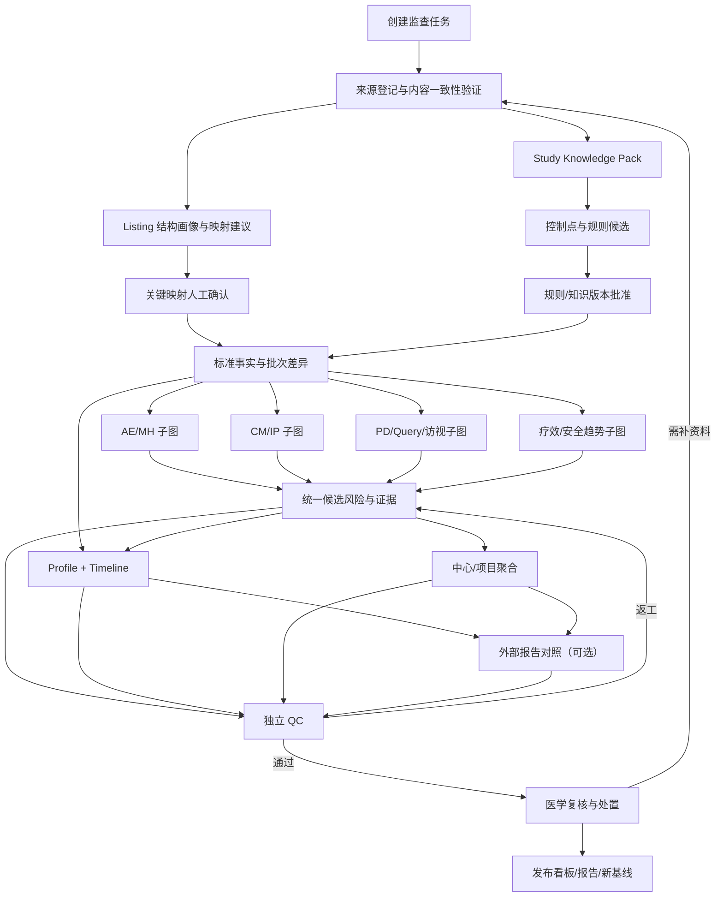

# 医学经理工作台—医学监查子系统全量复盘与 AI 原生重构设计基线

日期：2026-08-09  
状态：设计准备完成，产品实现冻结，等待逐轮产品决策  
性质：基于当前文件系统的证据重建；不声称恢复已删除的原始逐条对话

## 0. 核心结论

现有医学监查子系统已经形成了数量可观、局部质量较高的工程资产，但整体仍属于“围绕既有项目适配器、Patient Profile、Subject Timeline 和风险漏报能力逐步加固的功能集合”，尚未形成以一次医学监查任务为中心的 AI 原生系统。

当前最有价值的资产不是已有页面本身，而是以下可迁移的领域能力：

- 来源身份、方案版本、批次版本和证据 token；
- project/site/subject/risk 的稳定身份；
- listing 映射、标准化临床事件、批次差异和规则运行；
- AI 候选与确定性规则结果分离；
- 风险事实、医学复核、处置和审计记录；
- Patient Profile、Subject Timeline 和受试者/中心/项目投影；
- CAS、fail-closed、append-only 审计和发布门意识。

当前最需要被替换的不是某一个算法，而是控制架构：

- 巨型 `main.py` 和 `App.jsx` 承担了过多装配与流程状态；
- 多个 SQLite 仓储和局部服务组成应用级 saga，却没有单一、持久、可恢复的监查任务图；
- 项目专用适配器仍是主干路径；
- 规则、AI 候选、风险事实、医学处置和聚合存在相邻或重复权威；
- 既往 LOOP 大量优化了身份、哈希、shape 和 fail-closed 微合同，但真实临床工作流、科学性、视觉可读性和跨项目泛化没有形成同等强度的证据。

医学监查适合多 Agent，但不适合“七个 Agent 自由聊天”。推荐采用：

> 由代码拥有的确定性状态图负责流程、身份、权限、重试、检查点和停止条件；由有界专业 Agent 负责高语义、高上下文、高专业度的工作；由独立 QC Agent 进行 fresh-context 挑错和 veto；由资深医学人员对正式风险、处置和外部输出负责。

用户提出的七类 Agent 方向基本正确，但需要把第⑦类拆成“确定性 Graph Controller”和“AI 统筹规划能力”，并为每个 Agent 加上类型化输入、类型化输出、证据与不确定性、禁止动作、验收器和可跳过条件。

## 1. 审计边界与方法

### 1.1 本轮检查的范围

本轮按当前文件系统重建了以下链路：

- 医学经理工作台的产品边界和八个用户表面；
- 医学监查原始 PRD、说明书、阶段计划和 Goal；
- P0-P10、Phase A/B/C、v9-v12 和 P10 5.x 局部切片；
- 后端模块、共享合同、前端 feature、巨型外壳和测试结构；
- B6、批准输入、source token、aggregate/CAS、runtime identity 等当前门；
- 真实 LOOP 准入、串行矩阵、角色测试和发布 dossier；
- Graph engineering、多 Agent、持久工作流、人机审批和监管可审计性。

### 1.2 本轮没有做的事情

- 未运行任何服务、测试、浏览器或真实项目；
- 未调用外部模型执行/会商；
- 未修改产品代码和运行库；
- 未重新激活旧 Goal、B6、v11 或真实 LOOP；
- 未选择或安装工作流框架。

### 1.3 审计限制

- 工作台目录不是 Git 仓库，不能用 commit graph 证明完整历史；本报告依赖当前文件、哈希、任务记录、LOOP ledger、审阅与运行证据。
- 多处记录是实现者自述或静态合同证据；只有真实命令输出、当前文件、浏览器运行、真实项目结果和独立医学审阅才是更强证据。
- 既往测试通过记录没有在本轮重跑，因此被视为历史证据，不等于当前可重复通过。

## 2. 医学经理工作台的总体目的

工作台当前定义了六个临床医学子系统和两个工作台级表面：

1. 项目总看板；
2. 证据调研与方案设计；
3. 入排审核；
4. 医学监查；
5. 数据分析与 TFL；
6. 医学写作；
7. 安全信号与 PV 协同；
8. 审批中心。

总系统的正确定位不是替代 EDC、项目启动、中心运营或招募，而是把医学经理在临床研究设计、证据、入排、监查、分析、写作和安全协同中的知识工作统一到可追溯、可复核、可持续更新的项目上下文中。

医学监查是其中的数据—风险中枢：

- 向上接收研究方案、IB、风险控制点、项目知识和批准规则；
- 横向接收 listing、批次、中心和受试者数据；
- 向下产出候选风险、医学确认、趋势、Query/PD 建议和监查报告材料；
- 向外与 PV、安全信号、TFL、医学写作和审批中心交换受控的事实与决策；
- 不把“某个子系统看到的信息”复制成另一套不一致的权威。

## 3. 医学监查的目标产品定义

### 3.1 主要用户

核心用户是懒惰、视觉敏感、数据敏感、风险敏感的资深医学监察员。“懒惰”在这里意味着系统必须承担机械检索、交叉核查、聚合和整理，而不是要求用户记住路径、重复筛选、手工拼表或阅读大量 AI 过程文本。

### 3.2 三种监查模式

三种模式应共享同一事实层、风险身份和审计链，只改变基线、范围、关闭条件与输出：

| 模式 | 输入范围 | 核心比较 | 主要产物 |
|---|---|---|---|
| 日常医学监查 | 新批次 + 上次已确认基线 | 增量、变化、撤回、重新出现 | 新风险、风险变化、待确认、趋势更新 |
| 锁库前医学监查 | 当前全量 + 多轮 query 后修订 | 全量重算 + 修订轮次差异 | 未关闭风险、数据一致性、锁库阻断项 |
| 锁库后—CFDI 核查前 | 固定总量 | 固定事实上的汇总与现场准备 | 项目/中心/个例报告、风险集中呈现、checklist |

### 3.3 三个观察层级

- 受试者级：纵向事实、治疗暴露、AE/MH/CM/PD/Query、疗效和安全趋势；
- 中心级：发生率、集中性、延迟性、重复模式、中心偏倚和系统性执行问题；
- 项目级：总体安全/疗效趋势、风险演化、关键质量因素、中心离群和研究级结论。

### 3.4 重点医学域

目标至少覆盖：

- 方案入排、禁忌、剂量、访视、检查、停药和 AESI 控制点；
- AE/SAE/AESI、MH 漏报或不一致；
- CM 与试验药物严格分离；
- 试验药物暴露、给药中断/调整、回收与依从性；
- PD、Query 和未解决问题；
- 疗效端点、量表、时间窗和前后趋势；
- 实验室、生命体征、检查及其临床相关性；
- 多表交叉逻辑、科学性和时间关系；
- 个例、中心、项目层级信号和风险趋势；
- CRO 医学监查报告的来源核对、遗漏、过度结论、证据不足和前后不一致。

### 3.5 正式输出

- 受试者 Patient Profile；
- Subject Timeline；
- 个例、中心、项目三级看板；
- 风险看板和风险明细；
- 趋势、离群、风险变化和待办；
- 内部 Query/PD/复核建议；
- 日常/锁库前/核查前监查报告；
- CRO 报告审阅意见与证据对照；
- 审计日志、版本差异、模型/规则/人工来源和导出包。

### 3.6 医学权威边界

用户已在 2026-08-09 选择“受控自治”路线。现有说明书的“AI 只生成候选，不能自动确认 AE/MH/PD”将调整为更细的风险比例边界：

- 原始事实不可由 AI 改写；
- AI 结论必须能追溯到具体来源单元、规则/知识版本和模型运行；
- 规则命中不自动等于医学风险成立；
- 高置信度、可确定性重放验证、已在批准能力范围内的低/中风险，允许自动成为正式风险记录；
- 高风险、证据冲突、低置信度、超出批准能力范围、重要处置/关闭和外部报告结论，属于人工医学决策；
- 确定性变换可自动完成，但必须可重放并有输入/输出指纹。

自动确认不是省略审计：系统必须记录自动确认理由、证据、规则/模型版本、置信度、适用范围和后续人工纠正。人工纠正必须作为新事件追加，不能覆盖原始自动决定。

### 3.7 运行中新增自然语言风险规则

用户明确要求：最初未定义的特殊风险评判条件，可以在后续任一阶段监查时由用户新增，并由 AI 识别自然语义后拆解。

推荐将其设计为 `Natural-language Rule Authoring` 子图：

1. 用户描述风险条件、临床意图和期望风险等级；
2. AI 拆解为结构化规则候选；
3. 系统解析数据域、字段、术语、单位、时间关系、阈值、布尔逻辑、例外和缺失处理；
4. 系统生成反例、边界例和无法判断场景；
5. 在当前数据上只读模拟命中数、受试者/中心分布、既有风险重叠和潜在误报；
6. 用户确认规则文字、适用范围、风险等级和激活时间；
7. 生成不可变 `rule_version`，后续修改创建新版本；
8. 每条命中绑定 `rule_version + source_revision + run_id`。

AI 不能把自然语言直接转换成静默执行代码。结构化规则必须通过 schema、字段存在性、单位/时间语义、模拟和用户确认。新规则的历史作用语义现已确认为逐次选择，并始终保护既往签署结论。

用户随后确认采用逐次选择策略。每个 `rule_activation` 必须冻结以下字段：

- `evaluation_scope = full_history | current_snapshot | future_only`；
- `source_revision_ids`、`data_cutoff_at`、`baseline_id`；
- AI 推荐范围、推荐理由和未采纳推荐时的用户选择；
- 规则版本、激活人、激活时间和失效/替代关系。

三种范围的业务语义：

| 范围 | 处理对象 | 历史结果语义 |
|---|---|---|
| 全历史回溯 | 所有保留的历史来源修订/快照 | 在当前 run 产生回溯性发现，保留事件时间、激活时间、发现时间，不改写旧签署结果 |
| 当前数据快照 | 激活时选择的当前截止版本 | 只评价该快照的当前事实，不复活已被修订替代的旧值 |
| 仅未来数据 | 激活水位线之后的新来源修订 | 从后续增量开始执行，历史状态不重新评价 |

AI 推荐应优先考虑受试者安全、数据可靠性和潜在系统性风险：涉及 SAE/AESI、关键入排、关键给药/停药、重要实验室风险或可能影响研究结论的规则，通常推荐全历史回溯；纯运营提醒或只对未来流程有意义的规则可推荐仅未来数据。最终范围由用户确认。

## 4. 当前系统结构

### 4.1 工程规模

2026-08-09 只读快照：

- API 顶层 Python 文件 250 个；
- 文件名含 `monitoring` 的后端 Python 文件 125 个；
- 医学监查前端 feature 文件 104 个；
- Python 测试文件 416 个；
- `frontend/src/App.jsx` 16,002 行；
- `frontend/src/styles.css` 23,226 行；
- `services/api/app/main.py` 11,276 行。

代码量本身不能证明成熟度。当前规模更说明：领域能力已经分散到很多模块，而装配、状态和用户流程仍集中在少数巨型文件中。

### 4.2 当前医学监查数据路径

现有能力大致形成以下路径：

1. 来源登记、内容验证、project registry；
2. 方案版本、listing 预检与结构画像；
3. 字段映射、AI field profiler、B6 医学批准；
4. 数据批次、差异、基线；
5. 标准化临床事件/观察；
6. 方案规则、规则包、影子样本与发布；
7. 确定性规则与 AI 语义候选；
8. 风险事实、证据、身份、医学复核和处置；
9. 日常运行账本、全量重算和多级汇总；
10. Patient Profile、Subject Timeline、风险清单和保障面板。

这条路径已经接近一个领域流水线，但没有被表达成一个统一的任务图；每个局部服务各自持有状态、就绪条件和错误语义，导致调用方需要理解大量内部细节。

### 4.3 当前可复用的强资产

| 资产 | 可复用价值 |
|---|---|
| `monitoring_study_config.py` | 项目来源、能力和配置指纹的领域合同基础 |
| `monitoring_clinical_event_contract.py` | 统一临床事实/观察模型基础 |
| batch/diff/daily-run 服务 | 增量、基线、重跑和任务账本基础 |
| protocol rules / rule lifecycle | 方案控制点和确定性规则生命周期基础 |
| AI source/evidence/risk packet | AI 候选的证据包与边界基础 |
| medical risk identity/repository | 风险稳定身份、事实和审计基础 |
| CAS / identity / source token | 并发、错项目、陈旧写入和证据漂移防护 |
| Profile/Timeline 组件 | 受试者级事实和趋势的成熟交互参考 |
| assurance/rollup 合同 | 全量重算和三级聚合的基础 |

### 4.4 当前需要重构的结构债

1. **装配根过大**：`main.py` 集中导入、实例化和连接大量服务，仍硬编码 RUX、MY009、MG-K10 等项目专用服务和本地路径。
2. **前端外壳过大**：`App.jsx` 同时承担导航、项目选择、状态、请求、审批、多个子系统和医学监查路由。
3. **持久化碎片化**：多个 SQLite 仓储形成跨库业务操作，缺少统一事务/补偿/任务历史。
4. **权威面重复**：风险事实、映射批准、AI 候选、处置、保障聚合均有自己的状态语言，组合后易形成双权威。
5. **接口命名不统一**：前端存在 `/modules/medical-monitoring`、`/monitoring`、`/subjects/.../monitoring`、`/workbench-inbox` 等多种命名空间。
6. **项目泛化不足**：三类真实项目适配器是显式注册主路，project-neutral 合同尚未取代专用路径。
7. **知识层不足**：适应症、药物、方案、IB、监管与项目控制点没有形成版本化的 Study Knowledge Pack。
8. **工作流不可视**：用户看见多个功能面板，却看不见“一次监查任务现在在哪、为什么阻断、哪一步可自动恢复”。

## 5. 需求—实现—证据矩阵

| 能力 | 当前状态 | 已有证据 | 关键缺口 |
|---|---|---|---|
| 来源登记与身份 | 部分落地 | registry、source token、content validation | 硬编码候选和本地路径；未成为统一任务入口 |
| 方案/IB 控制点提取 | 部分落地 | protocol prep、rules、AI packet | 方案深度解构、IB/监管联动、版本差异与跨项目泛化不足 |
| listing 结构识别 | 合同较强、激活阻断 | classifier、shape matrix、field profiler | B6 未批准；真实异构 listing 泛化未证实 |
| 字段映射与医学批准 | 部分落地 | draft、semantic quality、activation gate | 正式 reviewer 权威缺失；用户体验仍技术化 |
| 批次与增量 | 较强 | batch、diff、daily run、baseline | 未在多项目真实浏览器中完成全过程 |
| 标准化事实层 | 已有基础 | clinical event/observation contracts | 领域覆盖、单位、编码、部分日期和冲突语义仍需统一 |
| 确定性规则 | 较强但未泛化 | protocol rules、rule lifecycle、release panel | 项目知识包、规则生成/验证/批准仍碎片化 |
| AI 语义核查 | 框架存在、运行阻断 | AI task、worker、quality、evidence packet | 独立产品 AI、稳定 provider、真实数据和科学性未验收 |
| 风险身份与证据 | 较强 | risk key/instance、source span、fact-first | 事实、候选、医学结论、处置和聚合需统一状态机 |
| AE/MH/CM/IP/PD 等域 | 不均衡 | 多个规则与现有项目能力 | 深度和准确性依赖项目；缺少统一域验收集 |
| 疗效/安全趋势 | UI/合同部分落地 | Profile、metric configuration | 指标自动识别、临床解释和跨适应症泛化未验收 |
| Subject Timeline | UI 资产较成熟 | visit-axis、事件泳道、身份防错 | 实际数据完整性、密度、美学和科学性未做正式 UAT |
| Patient Profile | UI 资产较成熟 | 中心—受试者树、趋势、事件索引 | 多项目真实结果和高信息密度验收不足 |
| 中心/项目级看板 | 部分 | rollup/summary/assurance | 系统性风险、中心离群、趋势解释与 drill-down 不完整 |
| CRO 报告审阅 | 基本缺失 | 零散报告/风险材料可复用 | 无独立报告解析—主张—证据—遗漏—审阅工作流 |
| 全流程 QC | 合同存在、未闭环 | assurance、release gate、fail-closed | QC 独立性、fresh context、参考基座和 veto 未正式实现 |
| 统一任务编排 | 缺失 | 多服务局部状态机 | 没有单一 graph/run/checkpoint/artifact/task authority |
| 专业使用 E2E | 未开始 | acceptance contract 和 synthetic schema fixture | 真实 UI、科学性、多模型风险分析和恢复验收未执行 |

## 6. 构建过程复盘

### 6.1 形成路径

系统从已有真实项目资产出发：先把 Patient Profile、Subject Timeline、AE/MH 漏报、风险明细和项目适配器接入工作台，再逐步补充来源、映射、批次、规则、AI、风险身份、CAS、保障和发布门。

这种路径在早期有明显收益：

- 快速获得了真实临床界面参考；
- 能把多个分散工具纳入一个产品外壳；
- 很早就意识到项目身份、数据证据和医学确认边界；
- 通过 fail-closed 防止错项目、错批次、错来源和陈旧写入。

它的代价也逐步放大：

- 以页面/局部风险为中心，而非以监查任务图为中心；
- 后续每增加一个边界都新增局部合同和 adapter；
- 为保护已有路径，投入大量微观身份/shape/hash 加固；
- 新项目需要继续穿过旧项目专用装配和 UI 状态；
- “功能存在”与“用户完成一次监查”之间没有统一验收对象。

### 6.2 P0-P10 的问题

原 P0-P10 是线性功能阶段：从边界、来源、映射、批次、规则、AI、风险、日常运行、Profile/Timeline 到全量/核查前保障。作为 backlog 它覆盖面广；作为系统架构，它缺少三项先决设计：

1. 一次医学监查任务的 canonical state；
2. Agent/规则/人工各自产物的正式 schema；
3. 哪些节点可重跑、补偿、跳过、并行或等待人工。

结果是阶段后期不断用合同修补前期没有统一表达的状态和身份。

### 6.3 B6 长期 pending 的真实含义

B6 不是单纯的“还没点批准”。它代表 listing 字段映射、项目语义、医学可用性和正式 reviewer 身份尚未由具备权限的人绑定到不可变输入上。后续的 source token、aggregate/CAS、runtime principal 都依赖这一步。此前围绕 B6 构建了大量 gate 与 revalidation，但正式医学权威输入始终缺失，因此业务链无法进入真正运行。

新架构不能把 B6 原样搬成一个孤立大门。应把它拆成：

- 技术映射校验；
- 语义映射建议；
- 医学关键字段确认；
- 影响范围与版本差异；
- reviewer 权限与签署；
- 对后续节点的可见、可恢复依赖。

## 7. 前期多模型 LOOP 的问题

### 7.1 量化观察

对 P10 ledger 的结构化计数显示：

- LOOP 标题约 638 个；
- 其中 5.x 标题约 389 个；
- 包含 identity/hash/shape/strict/guard/revalidation 的标题约 280 个；
- 包含 UI/browser/visual/Timeline/Profile/Checklist/frontend 的标题约 62 个；
- 包含 real/runtime/project/canary 的标题约 76 个（其中仍含离线/计划性描述）。

这不是说身份校验没有价值，而是说明优化重心明显偏向微合同与自证，低于真实医学工作流和用户体验应占的比重。

### 7.2 验收对象选错

早期多模型 LOOP 经常验收：

- JSON schema 是否严格；
- hash 是否稳定；
- 缺字段是否 fail-closed；
- fixture 是否能被 acceptance harness 识别；
- 静态合同是否覆盖一段文案或交互。

真正应该验收的对象应是：

- 用户能否从零建立并启动一次研究监查；
- AI 是否准确理解研究方案、IB、药物和适应症；
- 风险是否临床合理、重点明确、证据充分且少漏报/少误报；
- 个例、中心、项目三级数据是否能在数秒内定位；
- 三种模式是否正确处理基线、修订和固定总量；
- 报告是否与风险账本、事实和前次版本一致；
- 用户是否能理解、复核、纠正和追溯系统行为。

### 7.3 测试顺序倒置

真实 LOOP 矩阵在来源批准、产品 AI、runtime identity 和正式医学 reviewer 尚未就绪时就定义了复杂的“五测试者×两角色×两轮”目标。随后大量工作用于防止 fixture、prompt hash、串行会话和 evidence manifest 被误计为通过。

正确顺序应为：

1. 先让一个端到端任务在一个代表性项目和一个正式用户上完成；
2. 再建立 gold cases 和医学/视觉/操作验收器；
3. 再扩展到不同项目、适应症、药物和 listing；
4. 最后用多模型、多角色、多轮矩阵证明稳定泛化。

### 7.4 角色独立性不足

多个模型参与不自动等于独立验证。若参与者只审阅相同合同、相同上下文和相同自生成 fixture，容易形成相关性共识。正式 QC 必须：

- 使用 fresh context；
- 只接收待验收产物、验收标准、来源和必要上下文；
- 不接收 worker 的推理轨迹；
- 可以 veto，不能静默修写后自我通过；
- 至少绑定一个非 LLM 锚点和一个版本化参考基座；多模型共识本身不能充当真值。

### 7.5 科学性与美学证据不足

历史构建和 Node 测试能够说明源代码合同存在，但不能证明：

- 某条风险在临床上成立；
- 风险分级符合适应症/药物实际；
- 图表突出正确重点；
- 页面密度适合资深医学监察员；
- CRO 报告遗漏或结论确实被发现。

后续 LOOP 必须把“准确、易读、临床合理、监管合理、视觉一致”转化为明确的 gold cases、评分量表和用户任务，而不是附加的自由文本评价。

## 8. Graph engineering 调研结论

### 8.1 本项目中的 Graph engineering 是什么

这里的 graph 是控制图，不是知识图谱：

- 节点：确定性处理器、规则引擎、专业 Agent、QC、人工决策或导出；
- 边：依赖、条件、并行、重试、回退、阻断、升级和补偿；
- 状态：一次监查 run 的可持久、可检查、可版本化事实；
- 产物：节点之间传递的类型化、带来源的 artifact；
- 完成：由验收器和 final authority 决定，而不是由 worker 自报。

### 8.2 外部官方证据

1. [LangGraph Persistence](https://docs.langchain.com/oss/python/langgraph/persistence) 提供线程级 checkpoint、HITL、time travel 和故障恢复；[Interrupts](https://docs.langchain.com/oss/python/langgraph/interrupts) 明确要求中断前副作用具备幂等性。LangGraph 代码以 MIT 许可证发布。
2. [OpenAI Agents SDK orchestration](https://openai.github.io/openai-agents-python/multi_agent/) 区分 manager 调用 specialist（agents as tools）和 handoff，并指出代码编排更确定、可预测；SDK 提供 guardrails 与 tracing，代码为 [MIT 许可证](https://github.com/openai/openai-agents-python/blob/main/LICENSE)。
3. [Temporal Python SDK](https://github.com/temporalio/sdk-python) 以确定性 workflow history、replay、activity、长任务和故障恢复支持持久业务流程，MIT 许可。它比纯 Agent 框架更接近长期运行控制平面，但基础设施与迁移成本更高。
4. [Microsoft Agent Framework Workflows](https://learn.microsoft.com/en-us/agent-framework/workflows/) 明确区分 Agent 的动态 LLM 路径与 Workflow 的显式业务流程，支持类型化图、checkpoint、HITL、顺序/并行/handoff/manager 模式；代码为 [MIT 许可证](https://github.com/microsoft/agent-framework/blob/main/LICENSE)。该框架是新候选，仍需实测成熟度和 Python 集成。
5. [A2A 1.0](https://github.com/a2aproject/A2A/blob/main/docs/specification.md) 解决独立、可能不透明的 Agent 系统之间发现、长任务和互操作，Apache-2.0。当前工作台内部仍是单体 Python 应用，第一阶段引入 A2A 会增加不必要的分布式复杂度，宜延后到跨进程/跨供应商场景。
6. Anthropic 的[生产多 Agent 复盘](https://www.anthropic.com/engineering/multi-agent-research-system)指出，多 Agent 对真正 breadth-first、可并行和超上下文任务有效，但其系统约使用聊天交互的 15 倍 token，且复杂依赖/共享上下文场景并不适合；其后续[何时使用多 Agent](https://claude.com/blog/building-multi-agent-systems-when-and-how-to-use-them)强调只有上下文隔离、并行和专业化三类收益能持续抵消协调成本。
7. [ICH E6(R3) Step 4 Final Guideline](https://database.ich.org/sites/default/files/ICH_E6%28R3%29_Step4_FinalGuideline_2025_0106.pdf) 3.10 要求把质量内建、按风险比例识别/评估/控制/沟通/复核/报告；3.11 将独立审计与日常监查/QC 区分；第 4 章要求计算机化系统按预期用途验证、保持审计追踪和访问控制。这支持“独立 QC、风险比例门控、可追溯工作流”，不支持不可解释的自治黑箱。
8. [FDA 2023 Risk-Based Monitoring Q&A](https://www.fda.gov/regulatory-information/search-fda-guidance-documents/risk-based-approach-monitoring-clinical-investigations-questions-and-answers)把监查定位为判断研究活动是否按计划执行的质量控制工具；[FDA Computerized Systems Used in Clinical Trials](https://www.fda.gov/inspections-compliance-enforcement-and-criminal-investigations/fda-bioresearch-monitoring-information/guidance-industry-computerized-systems-used-clinical-trials)强调可归因、原始、准确、同期、可读、审计追踪和研究重建。

### 8.3 适配判断

本项目满足多 Agent 的三个有效条件：

- **上下文隔离**：方案/IB/监管、listing 结构、个例长时间线、中心聚合、外部报告各自上下文很大；
- **真实并行**：多个数据域、中心、受试者和报告章节可以独立处理；
- **专业化**：资料抽取、映射、疗效、安全、药物、报告审阅、QC 需要不同工具、prompt 和知识包。

本项目也有不适合自由多 Agent 的特点：

- 所有节点共享强身份、批次、方案版本和风险状态；
- 一次错误写入会污染后续医学判断；
- 多个任务有严格顺序和人工批准；
- 需要重放、审计、证据和可解释终止。

因此，适配结论是“混合式有向状态图”，不是 Agent swarm。

## 9. 三种架构路线

| 路线 | 描述 | 收益 | 风险 | 判断 |
|---|---|---|---|---|
| A. 现有单体 + Agent 包装器 | 在现有 panel/service 上加七个 Agent 名称和调用 | 改动小、短期可演示 | 继续保留双权威、专用适配器、巨型装配和不可恢复流程 | 不推荐，仅可作快速概念演示 |
| B. 类型化领域状态图 + 有界 Agent | 建立统一 run/artifact/state；确定性图调度专业 Agent、规则、QC 和 HITL | 可审计、可恢复、可增量迁移、保留现有领域资产 | 需要重做控制平面和部分 API/UI | 推荐 |
| C. 分布式 Agent mesh / event bus | 各 Agent 独立服务，通过 A2A/消息总线协作 | 跨语言、跨供应商、弹性扩展 | 事务、身份、调试、成本和监管验证复杂度最高 | 未来多用户/分布式需求出现后再评估 |

推荐路线 B。它既能实现用户设想的七类 Agent，又不会把正式医学流程交给不可控的 LLM 群聊。

## 10. 推荐的 AI 原生目标架构

### 10.1 八层结构

1. **来源与权限层**：项目、人员、来源、版本、脱敏、权限、批准和变更控制。
2. **标准事实层**：不可变 raw snapshot、标准化 clinical fact、单位/术语/日期不确定性、来源定位。
3. **知识与控制点层**：适应症、药物、方案、IB、监管、风险控制点和项目规则，形成版本化 Study Knowledge Pack。
4. **任务图控制层**：run、node、edge、checkpoint、retry、compensation、HITL、budget、timeout、cancel。
5. **专业 Agent/工具层**：七类 Agent 及其有界 skills；确定性解析器、统计器和规则引擎也作为节点，但不伪装成 Agent。
6. **风险与决策层**：candidate、fact、medical assessment、disposition、query/PD、closure、signal 和 review history 的单一状态机。
7. **投影与交互层**：用户任务首页、三级看板、Profile、Timeline、报告审阅、审批中心和导出。
8. **保障与运营层**：独立 QC、验证、审计、模型/规则版本、性能、成本、重放、数据保留和发布 dossier。

### 10.2 七类 Agent 的修订版

#### Agent ① 资料收集与研究控制点 Agent

- 输入：方案/修订、IB、风险管理资料、统计/安全计划、监管/文献、项目元数据；
- 输出：Study Knowledge Pack、方案控制点、药物/适应症风险、关键质量因素、来源差异；
- 禁止：把推断写成方案事实；自动批准规则；覆盖原始来源。

#### Agent ② 数据解构与提取 Agent

- 输入：listing/分组表/外部数据包及当前知识包；
- 输出：结构画像、字段语义、映射候选、标准事实、完整性/冲突/不确定性；
- 禁止：在缺少关键标识时猜测项目、中心、受试者或日期；未经批准激活关键映射。

#### Agent ③ Patient Profile + Subject Timeline Agent

- 输入：标准事实、派生指标、风险候选、方案时间轴；
- 输出：受试者级叙事、纵向事实、实际日期/访视轴、疗效/安全趋势和来源索引；
- 禁止：以缺失数据推断“无风险”或“稳定”；混淆 CM 与试验药物。

#### Agent ④ 多维风险整理 Agent

- 不是一个大 prompt，而是由 AE/MH、CM、IP、PD/Query、疗效、安全、实验室、入排/访视、中心/项目聚合等 domain skills 组成的可并行子图；
- 输出：候选风险、证据包、严重度建议、反证、冲突、趋势和建议动作；
- 接收已批准的版本化自然语言规则；规则新增或修订后按明确的历史作用策略生成独立重算任务；
- 禁止：直接关闭风险、生成无证据结论或篡改事实。

#### Agent ⑤ 外部监查报告审阅 Agent

- 输入：CRO 报告、结构化事实、风险账本、前次报告/处置；
- 输出：报告主张清单、来源支持、遗漏风险、过度结论、前后不一致、修改建议；
- 禁止：把报告文本当作事实权威；无证据重写正式结论。

#### Agent ⑥ 全流程审阅与 QC Agent

- 使用 fresh context，不继承 worker 推理；
- 按完整性、准确性、可追溯性、临床合理性、监管合理性、视觉/可读性、跨项目泛化和状态一致性评分；
- 可以 `accept`、`veto`、`request_rework`，不能静默修写后自行通过；
- 高风险节点必须绑定确定性校验和医学 gold case。

#### Agent ⑦ 统筹规划 Agent + Graph Controller

必须拆成两个责任：

- **Graph Controller（代码权威）**：决定允许的节点、依赖、并行、检查点、重试、门控、身份、预算和终止；
- **Planning Agent（建议者）**：根据项目、模式、数据可用性提出任务分解、优先级和 3–5 个建议选项及理由。

Planning Agent 不能自行更改正式 graph policy、跳过强制 QC、扩大数据权限或确认医学结论。

### 10.3 标准化 Agent 交付物

每个 Agent 只通过 Artifact Envelope 交付：

- `artifact_id`、`artifact_type`、`schema_version`；
- `project_id`、`study_id`、`site_id/subject_id`（适用时）；
- `run_id`、`node_id`、`parent_artifact_ids`；
- `source_revision_ids`、`source_spans`、`input_hash`；
- `producer_type`（rule/AI/human/system）、模型/规则/skill 版本；
- `facts`、`inferences`、`recommendations` 分区；
- `uncertainties`、`counter_evidence`、`missing_inputs`；
- `validation_results`、`approval_state`；
- `created_at`、`supersedes`、`retention_class`。

Agent 之间不传递整段聊天历史作为业务权威。聊天记录可作调试材料，正式下游只消费通过 schema 和 gate 的 artifact。

### 10.4 推荐主图



### 10.5 三种模式如何复用主图

用户确认采用“共用核心图 + 模式专属子图”的混合路线。

- 日常监查：首次可全量构建，之后从批准 baseline 与新 snapshot 做增量，只调度受影响的受试者、中心、规则和聚合节点。
- 锁库前：先全量重算，随后针对每轮 query 数据修订做增量；保留轮次差异，未关闭或反复出现的风险升级。
- 核查前：先以固定总量全量构建；原则上不再随意重算，若正式数据发生受控修订，则绑定明确基线做一次可追溯的增量重算。

同一个研究可以有多个 run，但同一 `source_revision + graph_version + knowledge_pack_version + mapping_version + rule_pack_version` 应具有幂等身份，避免重复启动造成两套风险账本。

共同核心只拥有一套来源、事实、风险身份、医学决策和证据；三种模式的差异落在专属子图：

| 子图 | 主要节点 | 完成重点 |
|---|---|---|
| 日常监查 | snapshot diff、影响传播、风险变化分诊、增量摘要、数据基线提升 | 本次变化已解释，新增/升级风险已进入相应自动或人工路径 |
| 锁库前 | 全量重算、query 修订轮次、未关闭风险、关键一致性、关闭门 | 锁库关键问题有明确状态，修订差异可追溯 |
| 核查前 | 固定总量、三级汇总、全量报告、风险集中、现场 checklist | 固定数据上的个例/中心/项目材料完整且可重建 |

模式子图可以共享核心 artifact 引用，但不得复制并维护三套风险事实。

### 10.6 Monitoring Run 的顶层身份

用户确认采用研究级 Run，且必须区分全量运行和基于既有项目进度的增量更新。推荐合同：

```text
MonitoringRun =
  study/project
  + monitoring_mode
  + execution_basis(full|incremental)
  + data_cutoff/source_revisions
  + knowledge/mapping/rule/graph versions
  + baseline_run_id (incremental only)
```

`monitoring_mode` 表示业务目的，`execution_basis` 表示计算方法，两者不能合并：

| 业务模式 | 全量 | 增量 |
|---|---|---|
| 日常监查 | 项目首次建模、规则重大变更或用户主动重算 | 新批次相对已批准基线的常规更新 |
| 锁库前 | 当前全量数据的锁库准备重算 | 每轮 query 修订后的差异更新 |
| 核查前 | 固定总量的三级看板、报告和 checklist 构建 | 仅在受控数据修订时基于明确基线执行 |

增量传播不能只比较文件行。它应从变更事实计算影响图：字段/事件变化 → 受影响规则 → 风险实例 → Profile/Timeline → 中心/项目聚合 → 报告章节。未受影响节点复用已验证 artifact，并保留父子来源关系。

### 10.7 全量 listing 输入与增量语义

用户明确了真实数据供应方式：项目定期导出的是包含当前全部数据的全量 data listing；锁库或时间锁定后发生数据修改时，也会再次导出修订后的全量 listing。系统不应要求外部提供“增量文件”。

因此增量引擎的正确模型是 immutable snapshot diff：

```text
accepted full snapshot N
          +
new full snapshot N+1
          ↓
record diff → field diff → clinical semantic diff → impact graph
```

差异分类至少包括：

- `added`：本次新增记录；
- `modified`：同一记录一个或多个字段变化；
- `removed_or_missing`：上次存在、本次缺失，尚不能直接认定删除；
- `reappeared`：曾缺失或撤回后再次出现；
- `unchanged`：身份和值均未变化，可复用既有验证产物；
- `identity_ambiguous`：无法可靠判断是否同一记录，必须进入身份/映射复核。

字段差异还要转换为医学影响。例如：

- AE 严重度或严重性变化可能升级风险并影响报告；
- AE 起止日期变化可能改变与给药、CM 或实验室异常的时间关系；
- 试验药物停药原因变化可能影响 PD、依从性和安全评估；
- 疗效数值变化可能重算趋势和项目级效应方向；
- 旧行缺失可能来自导出范围/结构变化，不能自动关闭风险。

用户选择数据基线与医学决策基线分离：

- **数据基线**：来源、映射、标准事实和流程 QC 通过后自动提升，用于下一次 snapshot diff；
- **医学决策基线**：风险确认、处置、Query/PD、报告和签署的版本化状态；未完成事项可跨 Run 结转；
- 正式报告绑定当时两类基线，后续快照不会回写已签署版本。

### 10.8 来源权威矩阵与冲突子图

用户确认采用按问题类型划分的来源权威矩阵，而不是固定全局排序或每项目从零配置。

| 主张/问题类型 | 首要权威 | 重要边界 |
|---|---|---|
| 研究设计、入排、访视、给药和方案程序 | 当前生效且已批准的方案/修订 | 必须按生效时间、人群和阶段判断适用性 |
| 已录入数据状态 | 已接受的全量 listing 快照及差异/审计 | 证明记录状态，不自动证明临床真实情况 |
| 药物已知风险和参考安全信息 | 当前适用且批准的 IB/RSI/安全资料 | 不应越权覆盖方案中的项目执行要求 |
| 项目监查、数据、统计和安全执行要求 | 已批准计划与正式项目决定 | 仅在授权范围内补充方案，不得暗改方案 |
| CRO 医学监查报告 | 无原始事实权威；属于待验证主张 | 必须与 listing、风险账本和来源证据对照 |
| 外部指南、文献和同类药物证据 | 解释、建议和风险提示 | 不自动覆盖项目批准文件，可触发重新评估 |

冲突处理子图：

1. 识别冲突的 claim type、版本、生效时间、适用范围和批准状态；
2. 生成 `source_conflict`，绑定冲突双方的精确来源位置；
3. 计算受影响的规则、风险、Profile/Timeline、聚合和报告节点；
4. 只阻断依赖冲突的节点，其余节点继续；
5. AI 生成 3–5 个处理方案、推荐理由、影响和不确定性；
6. 用户裁决形成不可变 `source_resolution`；
7. 新来源/修订使相关裁决重新进入待确认，而不覆盖旧记录。

### 10.9 条件 Agent 调度与影响图

用户确认七类 Agent 不必在每个 Run 全量重跑，由 Graph Controller 根据输入、模式、变更影响和可复用产物条件调度。

| Agent | 每次 Run 的最低行为 | 深度运行条件 |
|---|---|---|
| ① 资料/控制点 | 检查来源与知识包版本是否仍适用 | 方案、IB/RSI、项目计划、证据或知识版本变化 |
| ② 数据解构 | 处理本次全量快照；执行 full 或 snapshot diff | 每次必需 |
| ③ Profile/Timeline | 检查影响集合 | 全量 Run 覆盖全部；增量只重建受影响受试者/指标/投影 |
| ④ 多维风险 | 运行适用风险域并传播变化 | 每次必需，但内部按域、受试者、中心条件分片 |
| ⑤ 外部报告 | 检查是否存在报告输入/输出任务 | 上传/审阅 CRO 报告或模式要求生成/复核报告 |
| ⑥ 独立 QC | QC 本次新产物、复用决定和完成条件 | 每次必需 |
| ⑦ 统筹/控制 | 规划建议、代码路由、预算、门控、停止 | 每次必需 |

调度依据不是 Agent 自报，而是 artifact dependency graph：

```text
source/knowledge change
  → changed facts or rules
  → affected risk domains
  → affected subjects/sites/project aggregates
  → affected Profile/Timeline/report sections
```

跳过和复用也是正式决定。每个节点必须区分：

- `passed`：本次运行并通过；
- `reused`：依赖未变化，复用指纹一致的既有产物；
- `skipped`：策略允许且有明确理由；
- `not_applicable`：本 Run 无对应输入或业务需求；
- `blocked`：依赖、冲突、权限或 QC 不满足。

强制节点、人工门和独立 QC 不能由 Planning Agent 或 specialist Agent 自行跳过。

### 10.10 风险自动关闭策略

用户选择：所有由系统自动建立的低/中风险，在下一次已接受的全量 listing 快照中不再命中时自动关闭。

该自动化不等于“旧行没了就关闭”。关闭前仍须证明本次全量快照完整、导出范围一致、记录身份可比较，并排除结构变化或来源缺失。状态转换：

```text
auto_open_low_or_medium
  → trigger_absent_in_accepted_snapshot
  → source_and_identity_checks_passed
  → auto_closed
```

每次自动关闭追加 `risk_transition`，至少记录：

- 原风险与风险实例身份；
- 上次命中证据与本次未命中/修订证据；
- 两个全量快照及 Run；
- 规则、映射和知识版本；
- 自动关闭原因、执行时间和系统 principal；
- 是否影响当前 Profile/Timeline、中心/项目聚合和报告。

若同一事实以后重新命中，则重开同一实例；若出现新的临床事件，则在同一风险类型下建立新实例。高风险、SAE/AESI、人工确认/升级或进入强制人工处置链的风险仍需人工关闭。历史报告不回写。

### 10.11 Query 草稿与 PD 边界

用户修订并确认：医学监查自动生成结构化 Query 草稿；PD 不是医学监查负责报送的事项，涉及潜在 PD 时也应写入 Query，请相关责任方核实。

Query 的 canonical schema 至少包括：

```text
basis    = 依据：方案条款、医学判断、数据规则或前后关系
finding  = 发现：参与者/中心的具体事实、日期、值和矛盾
action   = 行动项：要求核实、说明、补充、更正或评估的问题
```

同时绑定 `query_draft_id`、`risk_instance_id`、`subject/site`、`source_spans`、`protocol_clause`、`time_window`、`confidence`、规则/模型版本和生成时间。三段在 UI 中可以合成为自然中文，但不得只保存一段不可解释文本。

示例模式：

- 医学合理性：`ALT轻度升高通常临床意义有限` + `当前参与者ALT仅轻度升高且相关记录为NCS` + `请核实AE判定理由是否充分`。系统必须使用真实值、参考范围和实际 NCS 字段生成，不能把 NCS 当作数值界限。
- 潜在方案偏离：`研究方案规定xxx药为禁用药` + `参与者YYDD-YYDD期间使用a药且其包含xxx成分` + `请核实是否为PD`。

边界：

- 可以核查现有 PD 记录与其他数据是否一致；
- 可以产生 `potential_protocol_deviation` 内部标签和 Query 草稿；
- 不自动创建、分级、提交或关闭正式 PD；
- 草稿自动进入内部待办，用户可编辑、合并、撤回或批准；
- 向 EDC/CRO/中心或其他外部系统发送前必须用户确认。

### 10.12 Query 只生成、审核和导出，不承担外部回复闭环

用户选择 B：当前版本的工作台不跟踪 Query 在 EDC、CRO 或研究中心侧的回复、充分性、追问和关闭。

当前职责边界为：

```text
风险/事实证据
  → 自动生成 Query 三段式草稿
  → 用户审核、编辑、合并、撤回或批准
  → 导出批准版本
  → 外部系统与责任流程接管
```

其中“导出”是内部交付动作，不等于外部“发送”或“接收”。系统只审计草稿/批准版本、导出时间、导出身份、格式、关联风险/事实和来源版本，不创建未经外部集成证明的 `sent`、`responded` 或 `resolved` 状态。

后续新全量 listing 中出现的数据修订，由 snapshot diff、标准事实和风险图重新计算；系统不得凭时间相邻性认定该变化由某条 Query 导致。自动建立的低/中风险是否关闭仍按 D8 的快照证据与完整性门判断。未来若要做 EDC/CRO 双向 Query 集成，应作为独立能力重新完成接口、身份、审计、幂等、权限和验证设计。

## 11. 对用户界面的影响

### 11.1 用户不应看见“Agent 群聊”

主界面应展示医学任务，而不是模型消息：

- 当前研究、监查模式、数据截止时间和比较基线；
- 任务阶段、完成度、阻断原因和下一建议动作；
- 新增/升级/下降/已解决风险；
- 最高优先级的受试者、中心和项目信号；
- 需要用户决策的少量卡片；
- 受试者、中心、项目三级快速钻取。

Agent 运行详情、模型、token、重试和技术日志放在可展开的审计层，不占据主任务表面。

### 11.2 “傻瓜式启动”的最小输入

理想入口只要求用户：

1. 选择项目；
2. 选择监查模式；
3. 选择或拖入本次新增/全量资料；
4. 确认数据截止时间和基线；
5. 对系统识别出的关键歧义作少量选择。

系统需要决策时，Planning Agent 提供 3–5 个互斥或可组合方案，每项显示：推荐标识、理由、影响范围、风险、是否可撤销、默认安全选项。只有真正改变医学结论、正式输出、数据权威或技术路线的事项才打断用户。

### 11.3 三层看板的默认信息密度

- 默认入口是风险行动驾驶舱，完整列出全部高风险与中风险，不限于 3–5 条；高风险置顶，中风险按临床影响、紧迫度、新增/升级状态、证据确定性和影响范围排序；
- 低风险默认汇总折叠但可随时展开、筛选和搜索；同类风险可以聚簇显示，但不得丢失单条风险身份、证据和行动项；
- 项目级：关键数字、风险变化、中心离群、重要安全/疗效信号和待决事项；
- 中心级：受试者分布、风险率/延迟/重复模式、中心趋势和可点击的风险簇；
- 受试者级：Profile + Timeline + 风险证据，默认突出异常与变化，原始数据按需展开；
- 所有图表都能回答“发生了什么、何时、与什么相关、证据在哪里、需要我做什么”。
- 风险可从驾驶舱直接下钻到项目—中心—受试者、Profile、Timeline、来源证据和 Query 草稿；返回时保留原筛选与排序上下文。
- 研究分析总览与层级对象目录仍为一级视图，但不是默认落点。Planning Agent 的 3–5 个推荐方案仅用于重大用户决策，不构成风险条目上限。

## 12. 框架候选与初步技术策略

### 12.0 知识生命周期：分层、版本化复用

知识权威不能等同于一个持续变动的大模型上下文。用户确认采用四层知识结构：

```text
通用医学/适应症知识
  ↓ 引用
药物与同类机制知识
  ↓ 引用
项目 Study Knowledge Pack
  ↓ 约束
项目激活规则与正式裁决
  ↓ 冻结到
Monitoring Run knowledge manifest
```

通用医学与药物知识跨项目复用；项目资料、项目裁决和激活规则按研究隔离。每条知识保留来源定位、证据类型、适用范围、有效时间、版本、置信度和不确定性。项目批准文件只在其主张范围内覆盖上层通用知识，不把 listing 或外部文献错误提升为方案权威。

每次 Run 通过 `knowledge_manifest` 冻结四层版本及内容哈希。新资料或外部证据先生成影响分析，再由用户确认是否创建并启用新版本；历史 Run、风险、Query 和报告不被静默重写。新知识的回溯范围复用 D2 的全历史/当前快照/仅未来选择。

该结构也是防止过拟合的核心：标准事实和风险能力使用项目无关合同，项目 adapter 只处理来源结构与经批准的项目特异内容；验证必须跨适应症、药物类别和 listing 结构。

### 12.0A 产品主形态：本地单用户

用户确认主形态为本地单用户产品，并在后续取消商业化目标。它需要在一台工作站上独立保存项目资料、不可变快照、领域 artifact、图检查点、风险与审计，并完成核心监查流程；中央服务器、多用户账号和多租户平台不是运行依赖。

本地单用户不是开发态 localhost 的同义词。稳定本地交付需封装应用启动/停止和本地服务生命周期，提供清晰的数据目录、项目级迁移、备份恢复、升级迁移、故障重启和卸载数据处置。用户不应手工启动端口、数据库或命令行服务。

即使只有一个人，审计仍区分 `human_local_user`、`system_controller`、`agent/model` 和受控导入来源；批准、规则激活、基线提升、导出和报告等动作追加记录而不覆盖。领域合同保持未来可迁移到私有化多用户形态，但当前不实现与单用户目标无关的租户/并发复杂度。

### 12.0B 模型运行边界：外部能力优先、用户配置执行、本地掌握业务状态

用户选择外部 AI 能力优先，并明确产品不替用户选模型。复杂文档理解、医学推理、风险候选和内容生成由用户配置的直接 API 或 Agent harness 承担；本地应用保留来源、标准事实、规则、图检查点、风险与决策、审计和导出等全部权威状态。

统一 `AI Capability Adapter` 适配 API 及 Codex、Kimi Code、Grok Build、OMP、Hermes、Reasonix、CodeBuddy CLI 等用户已有 harness。用户定义 provider/model/selector/effort、命令或 session 方式、凭据、超时和 fallback；产品只声明节点能力合同并预检配置，不自动选择或替换模型。所有实际执行配置和结果均冻结审计，供应商/harness session 不构成 Monitoring Run 的恢复权威。

故障只沿用户显式配置且已经过对应能力验收的 fallback 执行。若没有合格备用，节点必须阻断并可从检查点恢复，不能自行寻找其他模型。断网时既有内容和确定性功能仍可用，但未完成的 AI 节点不得显示为成功。

### 12.0C 本地身份：记录操作系统用户名，不做重认证

用户选择最低摩擦身份模式：应用读取本机操作系统用户名及设备/安装实例，关键动作展示影响摘要并由用户单击确认，不要求应用密码、系统密码或 Touch ID。

每次确认仍绑定动作、对象、前后版本、时间、本机用户名、设备/安装实例和确认界面版本；Agent/Graph Controller 使用独立系统 principal。该证据只能说明当前已登录本机会话执行了动作，不能证明独立身份再认证。产品不得把它宣称为合规电子签名；需要正式签名的报告在外部流程完成，工作台保留准确导出版本与时间。

### 12.0D 审计：业务账本长期追加，技术日志独立轮转

用户确认采用覆盖业务状态和 AI 来源链的长期追加式审计。来源、快照、事实、规则、Graph 节点、AI 调用清单、风险状态、人工确认、基线、导出、备份和恢复均形成不可原地修改的事件；修订通过新事件引用旧事件。

事件通过项目级哈希链或等效清单连接，并在备份、迁移和恢复后验证，从而发现插入、删除、改写或链断裂。由于本地单用户可控制本机文件，该设计承诺的是篡改可检测，而非绝对防篡改，也不改变当前非电子签名的身份边界。

模型审计保存输出 artifact、输入 artifact 引用和内容哈希、provider/model、prompt/skill/知识/规则版本、重试、耗时、成本和结果；大文件不在每条事件中重复嵌入，密钥不进入账本。可轮转的技术日志仅用于诊断，不作为医学审计权威。

### 12.0E 长任务体验：后台单次权威运行与真实节点进度

用户修订 B：不是阻塞用户停留在等待页，而是不做快速预览、只运行一条权威分析路径。任务默认后台执行，用户可以离开进度页继续查看上一基线或其他内容；本次结果仅在强制节点和最终 QC 完成后统一发布。

运行前冻结版本化 `execution_manifest`，展开阶段、节点、受试者/中心/风险域 work unit 与依赖。进度显示真实的完成节点数/总节点数、百分比及 running/waiting/reused/skipped/not_applicable/blocked/failed 数量，并可逐项核对详情。运行中新增节点必须生成 manifest revision 并解释分母变化，不允许假进度。

进度下方滚动播报结构化当前工作，包括节点、对象、用户可理解的任务名、开始时间和耗时；不展示模型隐藏推理或原始 chain-of-thought。窗口切换不影响后台工作，进程/设备中断通过检查点恢复；完成或阻断提供本地通知。

### 12.0F 质量、速度与成本：质量覆盖优先，不内置模型选择

用户确认所有适用医学域和强制 QC 完整执行，不能以成本或时限为由抽样、跳过或延后。优化限于增量传播、复用、缓存、批处理、受控并行和上下文压缩等已证明不降低覆盖与质量的方式。

模型/API/harness 完全由用户配置；产品不为“质量优先”绑定特定供应商或型号。每次 Run 冻结执行 profile 与节点级实际 adapter/model/harness。若预算或能力不可用则阻断并说明，不能自动削减医学检查或发布不完整结果。

### 12.0G 执行配置：全局默认、能力覆盖、项目覆盖

用户选择低干预的分层配置。版本化 `ExecutionProfile` 保存用户的 API/harness adapters 和 bindings：全局默认 → 按 Agent/能力覆盖 → 项目覆盖；Run 启动时解析成不可变 `effective_execution_profile`。普通运行无需逐 Agent 选择。

优先级只解析用户配置，Agent 不得自行换模型。fallback 由用户显式排序并逐项通过能力预检。Run 中切换必须形成 execution revision；凭据只保存在本地安全引用中，不随普通 profile/项目包明文导出。审计记录实际 adapter/model/harness，而不是仅记录抽象角色名。

### 12.0H 验收目标修订：既有交付物为基座，多模型用于发现与挑战

用户明确取消商业化目标。系统面向本人/内部专业使用，不再要求商业验证 dossier、法规电子签名或企业多用户认证。

MG-K10、芦可替尼 AD 等已有 Profile、Timeline、风险、漏报、checklist 和报告作为版本化 `reference_baseline`；它们用于回归、迁移和已知发现召回，但不是绝对真值。多模型结果分为基座一致、证据支持的基座外新增、与基座/模型冲突及反证排除四类。对缺少衍生成品的项目，以方案、IB、listing 和项目资料作为来源基座，由多模型建立初始风险参考集。

因此验收重点变为：既有有效能力不丢失、证据支持的新风险不被基座压制、多模型分歧透明、用户能快速复核、真实项目可运行/恢复/审计。后续仍做严格工程和医学验证，但不宣称商业化或监管认证。

### 12.0I 多模型风险分析：同题独立并行，不以多数票代替医学判断

用户选择同题独立并行。两个或多个用户配置的模型/API/harness 在隔离上下文中接收同版本的事实、来源、知识、规则和输出 schema；互不读取对方结果。每份原始输出作为不可变 artifact 保留，后续归并器不改写原文。

归并通过统一风险/事实身份和时间窗形成共同发现、单模型独有、分级/理由冲突、相互否定和基座已知但模型漏检等关系。多模型一致性只是 `agreement_signal`；单模型证据充分的新风险不会因少数而丢弃，多数票也不会自动把候选变成医学真值。

每个独立分析及汇总均进入真实 execution manifest 和进度明细。领域能力可以配置不同执行者，但关键风险包仍需独立交叉分析，不能退化为各模型完全不重叠的分工。

### 12.0J 基座暴露：所有模型从既有交付物出发，但必须回查来源和寻找缺口

用户选择所有独立模型在初次分析时即可看到同一冻结 `reference_baseline`。每个模型必须逐条把基座发现判为 confirmed、partially_supported、unsupported、outdated、insufficient_evidence 或 not_applicable，并绑定当前来源证据；禁止只复述基座。

每个风险域同时强制执行 `baseline_gap_search`，查找基座外的受试者、中心、数据表、时间窗和风险类型。基座与当前方案/IB/listing 版本不一致时先标记版本冲突。不同模型仍相互隔离，以保留独立核验与新增发现。没有衍生成品的项目使用原始项目资料清单作为 source baseline。

该方案存在锚定风险，缓解依赖来源定位、反证、gap search、独立模型和后续证据裁决；系统不宣称锚定风险不存在。

### 12.0K 分歧处置：确定性证据核对 → 独立裁决 → 用户复核

用户选择证据优先的独立裁决。代码 verifier 先处理身份、版本、日期、单位、来源和规则等可确定问题；随后由用户单独配置的 adjudication binding 在新上下文中审阅不可变模型 artifacts、基座和证据。

裁决只新增 `adjudication_record`，标记 merged_supported、distinct_supported、rejected_by_evidence、version_mismatch 或 needs_user_attention，不改写 worker 输出。多数意见只是辅助信号。重复/错配/明确反证等可自动解决；高风险、低置信度、重要医学结论和裁决后仍冲突的中高风险在看板中重点呈现。

高风险不能仅由裁决模型关闭或隐藏。裁决能力不可用时保留原始结果并阻断发布，不退化为多数票或让生产模型自审。

### 12.0L 用户复核初案已修订：不建设强制异常待办

用户先选择 exception-only review，随后明确子系统主要用于看、查、定位风险和个例/中心数据源头，不应以待办交互为主。因此取消独立强制处置队列；其模型对照、正反证据、裁决、Query 和来源定位能力进入风险详情 inspector。

高风险、未解决中风险、低置信度和冲突项通过排序、标识、筛选和摘要突出，但不要求逐条点击完成。最终看板仍完整呈现所有中高风险，低风险默认折叠可查。

### 12.0M 发布与交互：`analysis_complete` 直接可看，无“人工复核未完成”横幅

用户选择分析/人工决定分离，但取消全局 review gate。强制 Agent、裁决和最终 QC 完成后，本次看板、风险、Profile 和 Timeline 直接发布。界面不显示“人工复核未完成”，也不要求清空待办。

人工确认、备注、规则激活、Query 批准和导出仅在用户主动操作时形成 `user_decision` 与审计；没有人工动作不等于存在一个未完成任务。产品表面是风险信息看板和证据导航器，不是工单系统。

### 12.0N 风险—受试者导航：分栏 Inspector 深链完整 Profile/Timeline

用户选择风险列表与证据 Inspector 分栏。左侧保持风险上下文，右侧并排呈现基座、多模型、裁决、正反证据、标准事实、原始 listing 和方案/IB 定位。

从 Inspector 可深链到同一项目、Run、快照和受试者的完整 Profile 或 Timeline，并锚定相关事件；不能只显示裁剪片段或复制新的 Profile/Timeline 数据面。返回时恢复风险筛选、排序、滚动和选中项。项目/批次/中心/受试者身份不一致时 fail-closed。

Profile、Timeline、风险 Inspector 使用同一 canonical facts/risk authority，只是不同投影；每个视图继续支持定位到原始 listing 与项目资料。

### 12.0O Subject Workspace：Profile 与 Timeline 共享时间骨架

用户选择把完整 Profile 与 Timeline 放入统一 Subject Workspace 的两个一级页签。两者共享受试者身份、Run/快照、风险摘要、返回上下文和 canonical `Subject Temporal Spine`。

时间骨架同时表达实际日期、研究日、名义/实际访视、非计划访视、治疗阶段、首次/末次给药和不确定日期。它是共同坐标与 visit identity，不强迫 AE、CM、住院或非计划检查归入名义访视。Profile 保持医学域趋势/摘要，Timeline 保持事件序列/重叠关系。

两个页签共享时间窗、缩放、轴模式、治疗阶段背景带和选中锚点；在 Profile 选中访视/异常点可同步定位 Timeline，反向亦然。深链接和页签切换保留完整 temporal context，部分/冲突日期在两页语义一致。

### 12.0P Subject Temporal Spine 默认实际日期轴

用户选择实际日期作为 Profile/Timeline 默认连续横轴，名义/实际访视、治疗阶段、首次/末次给药和数据截止点叠加显示。事件不能为迁就访视结构而被吸附或改写日期。

用户可切换到项目定义锚点的研究日轴；切换只改变投影，不改变事实身份、排序或结论。长随访通过缩放、brush/minimap 和快捷跳转处理，不使用会掩盖时间距离的不透明断轴。部分日期显示不确定区间，计划—实际访视偏移和冲突日期显式可见。

单受试者默认实际日期；跨受试者/中心比较可以按需要切换研究日或访视对齐。

### 12.0Q 中心级默认风险图谱

用户选择中心风险图谱作为默认入口：高/中风险、风险领域热图、前后 Run 变化、重复/系统性风险簇、热点受试者和数据完整性信号优先；统计总览与受试者目录作为同页一级切换视图。

中心模式与单个偶发事件分开。风险簇显示人数、占比、时间范围、共同特征和证据，可下钻到过滤后的风险 Inspector 或完整 Subject Workspace。中心对照需显示数量、适当分母/暴露调整和数据覆盖，小样本/随访/缺失影响显式提示，不做惩罚性中心排行榜。

### 12.0R 中心比较采用绝对量与标准化指标双值

用户选择每项同时展示受影响受试者/事件绝对量和明确分母下的比例或暴露调整率。分母随指标语义选择并公开定义；零/未知/覆盖不足显示 not_evaluable，而不是 0%。

小样本、短随访、暴露差异和导出缺失显式提示。每个聚合数字可展开分子、分母和来源集合；中心页与项目页使用同一指标合同。不采用不可分解的黑箱综合中心风险分数。

### 12.0S 项目驾驶舱变化优先且保留当前全量

用户选择项目首页先突出相对基线的新增、升级、持续、降级、关闭、重开和不可评估变化，同时始终保留当前全部中高风险；增量入口不能隐藏存量高风险。

每项变化绑定前后 Run/快照、状态、证据和原因。数据修订、知识/规则、mapping/fact、模型/裁决配置、用户决定和来源完整性变化分开，不能把分析管线变化冒充临床变化。首次全量无基线时显示初始全量，不伪造差异。

变化摘要、中心热图、受试者热点和当前全量列表联动，并与中心/受试者层使用同一风险变化合同。

### 12.0T 分析模型数量不设硬下限

用户选择按实际配置运行，一个或多个分析执行者都可完成 Run。一个执行者时不生成多模型一致性/分歧/共识指标；两个及以上时才启用独立并行聚类。实际 ensemble size 在 manifest、进度和审计中记录，但不变成主看板待办。

模型数量不替代来源证据与 QC，所有适用风险域仍必须完成。独立裁决仅在实际存在模型—模型、模型—基座或模型—证据冲突时触发。零个可用分析执行者仍是缺少必要能力，不属于允许完成状态。

### 12.0U 外部报告主张—来源逐条核查

用户选择深度医学审阅。CRO/外部报告冻结为不可变来源，抽取原子主张后逐条对照方案、IB、listing、canonical facts、风险、Profile/Timeline、中心/项目指标、基座和前次报告。

每条主张标记 supported、partially_supported、unsupported、outdated/wrong cutoff、overstated、understated、internally inconsistent 或 not_evaluable，并附报告定位、正反证据、影响和中文修订建议。系统还从当前风险反向识别报告遗漏，区分真实遗漏与范围外事项。

报告中的新风险进入统一证据/风险链；原报告不被改写，审阅结果通过可下钻的主张矩阵查看。Agent ⑤ 的模型数量、分歧与 QC 分别沿用 D32、D23 和独立 QC 合同。

### 12.0V 报告审阅三件套

用户选择结构化问题矩阵、带批注副本和可选清洁修订稿。问题矩阵以稳定 issue ID 绑定报告定位、事实/风险、正反证据、影响和建议，是权威审阅 artifact；原报告永不覆盖。

批注副本尽量保留版式并把批注锚定 issue ID；格式不支持时生成可验证的旁注副本，不能伪称原位批注。清洁修订稿仅按用户要求生成，明确标为 DRAFT，未决冲突不能被静默改写为确定结论。

三件套共享 issue 身份和来源，可相互及向下钻取。修订报告作为新来源重新审阅，并比较 issue 的解决/部分解决/未解决/新增状态。导出前核验项目、版本、数据截止、锚点、引用和文件哈希。

### 12.0W 三种监查模式的组合输出

用户选择模式化输出且共享同一看板权威。日常模式生成增量摘要、风险变化＋当前全量、受影响 Query 草稿和变化原因；不默认生成冗长全量报告。锁库前生成全量风险、Query/数据多轮修订影响、个例/中心清单和锁库检查包。锁库后—CFDI 核查前生成固定版本全量项目报告、中心汇总、受试者材料入口及项目/中心/个例 checklist。

所有摘要、报告、Query 和 checklist 从同一 canonical facts/risk/decision artifacts 投影，数字与状态必须一致；输出中文原生、重点优先并冻结项目/Run/快照/知识/规则/执行版本。外部报告审阅三件套与系统自产报告严格区分，无用户主动动作不外发。

### 12.0X AE/MH 漏报进入统一风险与受试者历时视图

用户新增硬需求：AE/MH 漏报不再作为旁路工具，而是统一风险子图的一部分。系统明确区分已记录 AE/MH facts 与 potential_unreported_ae / potential_unreported_mh candidates；候选不能计入已报告数量或用正式事件样式。

候选从症状、诊断、实验室/检查、住院/操作、CM 适应证、给药处置、严重事件线索及跨表时间关系中形成，绑定正反证据与来源。AE/MH 分类依据研究起点和既往存在/新发/恶化关系，不确定时保持 uncertain。候选可生成“依据＋发现＋行动项”Query，后续补录匹配记录或反证触发版本化关闭。

项目/中心层聚合漏报变化与重复模式；受试者层从风险下钻 Profile/Timeline 和原始来源。Profile 表达医学解释及关联指标，Timeline 表达真实日期上的事件关系；事实与候选使用明确不同视觉语义。MG-K10 等既有漏报结果作为 reference baseline 进入多模型核验。

### 12.0Y AE/MH 漏报在 Profile 与 Timeline 双投影同步呈现

用户选择两个受试者页签都默认呈现同一候选。Profile 提供触发线索、已记录 AE/MH 对照、正反证据、分类不确定性和 Query；Timeline 以独立候选覆盖层/泳道显示真实日期或不确定区间及其与 CM/IP、访视、检查和处置的关系。

候选使用唯一身份和非事实视觉样式，两个页签同步选择、时间窗和来源。后续补录正式 AE/MH 后新增事实事件，并保留候选的解决历史与匹配关系。Profile/Timeline 候选投影不一致时 QC 阻断该受试者视图发布。

### 12.0Z 专业使用完成覆盖五个真实项目

用户选择 MG-K10-SAR、芦可替尼 AD、MY008-3-02、MY008-3-01 和 MY009-UC-2-01 全部进入完成门。每项至少完成一次真实全量 Run 和来源—知识—事实—风险—漏报—三级看板—Subject Workspace—输出—QC 全链。

两个成熟项目做基座无损与新增风险验证；两个 MY008 做无衍生成品的从零构建及同类研究隔离；MY009 做跨适应症、小数据和 not_evaluable 验证。增量只在存在真实兼容双快照时计入，外部报告只在真实存在时运行。原始项目资料只读，输出进入隔离目录。

### 12.0AA 最终缺陷门：五项目双角色连续两轮零 P0-P4

用户选择最严格完成门。工程师与资深医学监察员两个角色分别在五个真实项目上完成连续两轮独立验收，任何开放 P0-P4 均阻断完成。医学角色必须通过真实 UI/Playwright 从零操作并评价准确性、风险、证据、中文、图表、Profile/Timeline 和来源定位；工程师角色覆盖安装、运行、恢复、审计、迁移、导出、性能和身份。

缺陷等级、项目/来源、ExecutionProfile 和验收矩阵在最终轮前冻结。修复会重置受影响传播范围的 clean streak；重复/非问题关闭必须有裁决和复验证据。最终 coverage matrix 按项目×角色×轮次×模式×风险域×界面/恢复/输出记录证据。该门只证明内部专业使用质量，不声称商业或法规认证。

本轮不直接选型或安装。推荐先定义框架中立的领域图合同，再做隔离 POC：

| 候选 | 适合部分 | 不适合/待验证 |
|---|---|---|
| LangGraph | Agent 子图、checkpoint、interrupt/HITL、Python 集成 | 生产运维、历史保留、合规验证需自建较多 |
| Microsoft Agent Framework 1.0 | 类型化 workflow、HITL、图/函数 API、Python/.NET | 较新；稳定性、数据库和生态需实测 |
| OpenAI Agents SDK | 节点内 agent loop、structured output、guardrails、tracing | 不应单独承担跨天业务流程和正式状态权威 |
| Temporal | 长运行、重放、恢复、重试、补偿、运维可见性 | 引入独立服务和确定性编程约束，迁移成本高 |
| A2A | 未来跨进程、跨供应商 Agent 互操作 | 第一阶段内部单体重构过重 |

初步推荐：

1. 先实现框架中立的 `MonitoringRun / NodeRun / Artifact / Decision / Checkpoint` 领域模型；
2. 用两个代表性子图做 LangGraph 与 Microsoft Agent Framework 隔离 POC；
3. 同时用 Temporal 做一个最小“跨重启 + 人工等待 + 幂等活动 + 重放”POC；
4. 根据真实恢复、审计、开发复杂度和性能选择：
   - 单机专业使用：一个图引擎作为主控制面；
   - 跨天、高并发、严格运营：Temporal 控制业务流程，Agent 框架只运行节点；
5. 不把任何供应商特有 session/message 当作医学业务状态。

## 13. 暂定的完整重构阶段计划

该计划是设计骨架，必须在多轮问题和架构会商后锁定，当前不进入实现。

### 阶段 R0：冻结、审计和产品决策（当前）

目标：确定权威、边界、任务单位、七类 Agent 和专业使用验收对象。

步骤：

1. 完成当前冻结与基线审计；
2. 逐轮确认自动化/医学权威、任务单位、模式、来源冲突、Agent 边界、UX 和部署；
3. 形成 System Design v1；
4. 通过独立会商挑战复杂度、监管边界和迁移可行性；
5. 用户批准目标架构和迁移路线。

完成证据：批准的 PRD、领域模型、状态图、Agent cards、artifact schemas、ADR 和验收策略。

### 阶段 R1：架构 POC 与选型

目标：用最小真实切片证明图状态、恢复、人机门控和 Agent 交付物。

步骤：

1. 定义框架中立 graph IR；
2. 选择一个项目、一个数据批次和两个风险域；
3. 实现两种图引擎 POC；
4. 验证中断、重启、幂等、重放、人工批准和失败恢复；
5. 比较开发/运维/审计/性能/成本；
6. 选择并固定版本、许可证和回滚方案。

完成证据：可重复 POC、决策记录、失败注入、恢复日志和框架选型 ADR。

### 阶段 R2：领域内核与迁移底座

目标：建立单一事实、任务、风险和决策权威。

步骤：

1. MonitoringRun/NodeRun/Artifact/Decision 模型；
2. 来源、方案、批次、映射、规则和知识包版本；
3. canonical clinical fact 与 evidence locator；
4. 风险候选—事实—医学评估—处置—关闭状态机；
5. 统一事务/事件/审计；
6. 现有服务通过 adapter 接入新内核；
7. 建立双读比对，暂不切换用户流量。

完成证据：schema/migration 测试、旧新投影一致性、审计重建、回滚演练。

### 阶段 R3：Study Intelligence 与数据智能

目标：让新研究、药物、适应症和 listing 不依赖硬编码适配器。

步骤：

1. 资料分类、版本与内容一致性；
2. 方案/IB/监管/文献解构；
3. Study Knowledge Pack；
4. listing 结构画像、字段语义和置信度；
5. 关键映射人工门；
6. 标准事实、单位/编码/部分日期与冲突；
7. 跨项目 generalization fixture、既有交付基座与多模型新增风险对照。

完成证据：至少三种适应症、三种药物、三种 listing 结构的盲测。

### 阶段 R4：风险 Agent 子图

目标：覆盖核心医学域并统一证据与分级。

步骤：

1. AE/MH；
2. CM/IP 暴露与依从性；
3. PD/Query/访视；
4. 疗效；
5. 安全/实验室/检查；
6. 多表交叉和时间逻辑；
7. 中心/项目聚合；
8. 反证、误报抑制、优先级与医学复核。

完成证据：每域 reference cases、基座召回、新增证据支持率、漏报/误报分层和独立 QC。

### 阶段 R5：Profile、Timeline 与三级看板重构

目标：把 Agent 产物转成资深医学监察员可快速操作的工作面。

步骤：

1. 任务首页和阶段/阻断/建议；
2. 项目级风险与趋势；
3. 中心级离群和风险簇；
4. Profile；
5. Timeline；
6. 风险证据 inspector；
7. 人工批量复核和相邻导航；
8. 桌面优先视觉系统和真实浏览器 QC。

完成证据：真实用户任务时长、点击数、定位成功率、视觉/信息密度评分和无 P0-P4 连续两轮。

### 阶段 R6：外部报告审阅与正式输出

目标：审阅 CRO 报告并生成三种监查模式的受控输出。

步骤：

1. 报告结构和主张抽取；
2. 主张—事实—风险—前次报告对照；
3. 遗漏、过度结论和前后矛盾；
4. 修改建议和医学确认；
5. 个例/中心/项目报告与 checklist；
6. DOCX/PDF/HTML 导出和审计附件。

完成证据：人工双盲报告审阅对照、来源定位、导出保真和版本差异。

### 阶段 R7：三模式闭环与跨子系统协同

目标：跑通日常、锁库前、核查前，并与安全/PV、TFL、写作和审批中心共享受控事实。

步骤：

1. 日常增量 baseline；
2. 锁库前 query 修订多轮；
3. 固定总量和现场自查；
4. PV/TFL/写作 handoff；
5. 统一审批与通知；
6. 跨模块身份、权限和审计。

完成证据：同一项目三模式贯通、跨模块不复制权威、重启恢复和全链重放。

### 阶段 R8：专业使用验证与迁移

目标：证明跨项目泛化、质量、性能、可靠性和可部署性。

步骤：

1. 全部五个指定真实项目，每项至少一次真实全量 Run；真实兼容双快照存在时追加增量 Run；
2. 工程师/资深医学监察员独立 Playwright E2E；
3. 多模型按独立角色测试，prompt 和项目轮换；
4. 科学性、易读性、风险分层、图表逻辑和美学评分；
5. 失败注入、重启、恢复、并发、CAS、性能和成本；
6. 访问、审计、数据保留、备份、验证和部署包；
7. 五项目×工程师/资深医学监察员双角色连续两轮无任何开放 P0-P4；修复后重跑受影响传播范围；
8. 迁移、并行运行、回滚和本地稳定交付。

完成证据：专业使用验证记录、追踪矩阵、使用说明、备份恢复与回滚演练；不声称商业化或法规认证。

## 14. 设计问答路线

后续按一次一个高杠杆问题进行，避免在权威尚未确定前堆叠低层实现细节：

1. 自动化与正式医学权威（已确认：受控自治）；
2. 运行中新增规则的历史作用范围（已确认：每次激活时选择）；
3. 一次工作流的最小任务单元（已确认：研究级 Run，独立区分全量/增量）；
4. 增量 Run 的基线形成与提升规则（已确认：双基线；全量快照间计算增量）；
5. 三种模式共用主图的范围（已确认：共用核心图 + 模式专属子图）；
6. 来源与冲突裁决（已确认：按问题类型的权威矩阵）；
7. Agent 分工、并行与可跳过条件（已确认：条件调度）；
8. 风险自动关闭（已确认：自动建立的低/中风险不再命中时自动关闭）；
9. Query/PD 的生成、登记和发送边界（已确认：结构化 Query 草稿；疑似 PD 写入 Query；不报 PD）；
10. Query 回复与风险闭环（已确认：只生成/审核/导出；外部闭环不跟踪）；
11. 看板默认信息与用户干预（已确认：中高风险全量优先的行动驾驶舱）；
12. 知识包的适应症/药物/项目生命周期（已确认：分层、版本化复用）；
13. 部署、模型、性能和成本（已确认本地单用户、外部 AI 能力优先且用户自行配置、质量优先、本机用户名且不重认证、追加式审计、单次权威后台运行与精确进度、全局配置并可按能力/项目覆盖；性能 SLO 待基准实测）；
14. 专业使用验证、既有交付基座和多模型风险分析（当前，确认多模型拓扑）。

每个回答都将进入设计记录；出现真正改变架构或产品权威的分叉时才会停下来决策。设计确认后再发起正式架构会商和实施计划，不提前修改产品。

## 15. 审阅者视角的五个最大失败风险

1. **把 Agent 数量当作 AI 原生程度**：已通过“graph-first、agent-if-needed”原则限制。
2. **重构丢失现有强资产**：迁移必须通过 adapter、双读和投影一致性保留，不允许清空重做。
3. **自由 LLM 改写正式医学状态**：代码状态机、artifact schema、HITL 和独立 QC 共同限制。
4. **框架选型先于领域模型**：先定义框架中立合同，再做隔离 POC，当前不安装。
5. **再次陷入合同自证而没有真实用户证据**：后续每阶段完成定义必须包含真实任务、版本化参考基座、多模型新增发现证据和 audience-facing runtime。

## 16. 冻结与恢复边界

截至本报告：

- 产品源码未修改；
- 8911 必须保持停止；
- 旧 Goal 保持 paused；
- P10 最新停止点为 LOOP 5.387；
- 当前真实 LOOP 仍被五项门阻断；
- 当前外壳指纹已记录；
- 下一安全动作仅是继续逐项确认尚未确定的产品与医学权威边界。

收到用户回答后，只更新设计记录并继续下一轮问题；不得因为问题答案明确就直接恢复旧 P10/B6 或启动真实项目。
