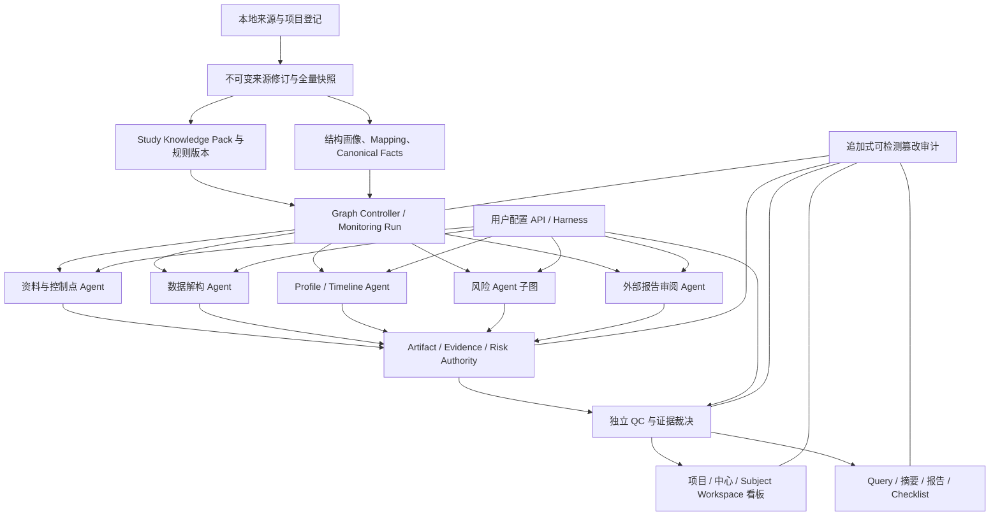

# 医学监查 AI 原生系统设计 v1.1

**状态**：`POST_CONFERENCE_USER_APPROVAL_DRAFT`  
**日期**：2026-08-09  
**适用目标**：用户本人/内部专业使用的本地单用户医学监查看板与分析系统  
**非目标**：商业化认证、多租户 SaaS、企业多用户协作、受监管电子签名  
**实现状态**：会商修订设计稿；文件路径保留 `v1` 作为恢复锚点；尚未授权据此修改产品源码或运行真实项目

## 1. 设计来源与权威

本设计整合以下来源：

1. 当前文件系统与既有医学经理工作台/医学监查实现；
2. `context/medical_monitoring_ai_native_rearchitecture_audit_20260809_context.md` 中 D1-D39 用户决策；
3. `reviews/codex_medical_monitoring_ai_native_rearchitecture_audit_20260809_review.md` 的全量审计、外部技术研究与重构路线；
4. 现有 Patient Profile、Subject Timeline、AE/MH 漏报、风险清单和项目资料；
5. ICH E6(R3)、FDA 风险监查原则及 LangGraph、Microsoft Agent Framework、Temporal、OpenAI Agents SDK、A2A 等官方资料的框架能力比较。

发生冲突时，用户 D1-D39 的后续修订优先；外部报告、模型输出和既有项目交付物均为证据或参考基座，不是指令权威或绝对医学真值。

## 2. 产品目标

构建一个 AI lead、用户以看和查为主的中文医学监查系统，使资深医学监察员能够：

- 以最少输入启动研究级全量或增量医学监查；
- 由系统解构方案、IB/RSI、项目计划、listing 与外部报告；
- 对 AE/MH、CM/IP、方案/访视/Query、疗效、安全/实验室、多表交叉、数据质量、中心模式等风险进行完整分析；
- 在项目、中心和受试者三级看板快速看到当前风险、前后变化、趋势、来源和不确定性；
- 从任何风险直接定位中心、受试者、完整 Patient Profile、完整 Subject Timeline、原始 listing 行/单元格和方案/IB 条款；
- 自动获得中文原生、可追溯的三段式 Query 草稿；
- 审阅 CRO/外部医学监查报告，识别主张证据、遗漏、过度结论和前后矛盾；
- 跑通日常增量、锁库前多轮修订、锁库后—CFDI 核查前三种监查模式；
- 在应用中断、模型/harness 故障和数据版本变化后恢复并重放关键业务状态。

## 3. 用户与体验原则

目标用户是懒惰、视觉敏感、数据敏感、风险敏感的资深医学监察员。产品表面必须是医学看板和证据导航器，而不是 Agent 群聊、技术控制台或待办工单系统。

核心体验原则：

1. **风险优先**：项目和中心默认先显示风险，而不是大段说明或通用 KPI。
2. **中高风险完整可见**：不以 3-5 条上限截断中高风险；低风险默认聚合可展开。
3. **变化与当前全量并存**：先回答“本次变了什么”，同时保留“现在还有什么”。
4. **一跳到证据**：任何数字、风险、趋势、Query 或报告问题都能到分子/分母、事实和原始来源。
5. **看板优先、交互克制**：无“人工复核未完成”横幅，无强制清空待办；只有用户主动编辑/导出时才产生交互决策。
6. **真实进度**：长任务后台运行，进度数字必须逐项对应 execution manifest 节点，不显示假进度或无意义模型思考日志。
7. **中文原生**：标签、风险解释、Query、报告与 checklist 使用自然、专业、可直接工作的中文。
8. **内部术语不外露**：`CanonicalFact`、`RiskCandidate`、`RiskInstance`、状态机枚举和字段名只属于领域合同与审计。监察员界面不得显示“正式事实”“候选信号”“已建立风险”“正反证”“只读投影”等工程术语；必须按医学含义显示为“已记录 AE/MH/用药/检查”“疑似 AE/MH 漏报或待核实风险线索”“具体风险类型＋风险等级”“支持依据/排除依据”“只读查看”等自然中文。源数据记录可能仍需核实，不得仅因已入库就称为“事实”。
9. **事件和风险按临床域编码**：时间轴、图例、列表和风险标记至少分别识别 AE、MH、CM、IP给药、实验室/检查、住院/操作等临床域；风险标记同时显示临床域与风险等级。不得用一个“已记录事项”覆盖全部事件，也不得用一个通用菱形覆盖全部风险；颜色不能成为唯一辨识手段。

## 4. 总体架构

推荐采用“确定性状态图 + 有界专业 Agent + 独立 QC + 可选用户决定”的混合架构，不采用七个 Agent 自由对话或分布式 Agent mesh 起步。



### 4.1 八层边界

1. **来源与权限层**：项目资料、报告、listing、文件身份、只读来源。
2. **事实层**：不可变快照、mapping、canonical facts、时间与来源定位。
3. **知识层**：通用医学、药物/机制、项目 Knowledge Pack、激活规则。
4. **控制图层**：Monitoring Run、Node Run、Execution Manifest、Checkpoint、状态机。
5. **AI 能力层**：用户配置的 API/harness adapters 与专业 Agent/skills。
6. **风险与决策层**：候选、证据、分级、裁决、生命周期、Query、报告问题。
7. **投影层**：项目/中心/受试者看板、Profile、Timeline、Inspector、输出。
8. **保障层**：独立 QC、审计、备份恢复、性能和验收证据。

任何供应商模型 session、harness 对话、前端组件状态或单个 SQLite 表都不得独自成为医学事实、风险或 Run 状态权威。

## 5. 领域模型

| 对象 | 职责 | 关键不变量 |
|---|---|---|
| `StudyProject` | 研究项目身份与隔离边界 | 不同研究不可复用业务主键或静默串扰 |
| `SourceRevision` | 方案、IB、报告、listing 等不可变来源版本 | 内容寻址；保留来源、版本、有效时间、范围 |
| `ListingSnapshot` | 某数据截止的全量 data listing | 输入始终是全量快照；不可变；记录结构与完整性 |
| `SnapshotAcceptance` | 快照、关键 mapping、来源范围与身份算法的接受记录 | 状态依次为 imported、structurally_valid、mapping_reviewed、snapshot_accepted、baseline_eligible |
| `StudyKnowledgePack` | 项目要求、终点、给药、风险、访视、控制点 | 版本化；项目文件在其主张范围内优先 |
| `RuleActivation` | 自然语言规则拆解后的批准激活实例 | 冻结 scope、版本、回溯范围与影响分析 |
| `MonitoringRun` | 一次研究级医学监查 | `project × mode × cutoff/source revision × execution_basis` |
| `ExecutionManifest` | 阶段、节点、work units 与依赖清单 | 真实进度分母；修订必须显式版本化 |
| `NodeRun/Checkpoint` | 可重试、恢复、跳过或复用的节点状态 | 幂等；不把失败或中断冒充成功 |
| `ArtifactEnvelope` | 节点间唯一交付合同 | 类型、版本、输入哈希、事实/推断/建议、证据、QC、supersedes、coverage manifest、complete/partial/truncated/not_evaluable |
| `CanonicalFact` | 标准化临床事实 | 与来源定位绑定；事实与推断分离 |
| `SubjectTemporalSpine` | 受试者共享时间骨架 | 实际日期、研究日、访视和治疗阶段语义一致 |
| `PatientJourneyProjection` | Profile、Timeline、风险与来源的同步受试者医学旅程投影 | 只读引用同一 Temporal Spine/事实/风险权威；共享时间窗与选择，不复制业务状态 |
| `ReferenceBaseline` | 既有 Profile/Timeline/风险/漏报/报告基座 | 可质疑、可过时；不压制证据支持的新发现 |
| `RiskCandidate` | 规则/模型产生的可追溯候选 | 不自动等同正式事实或人工结论 |
| `RiskInstance/Transition` | 风险身份与追加式生命周期 | 建立、升级、降级、关闭、重开不覆盖历史 |
| `ModelAnalysis` | 单个 API/harness 独立结果 | 原始输出不可被归并器改写 |
| `AdjudicationRecord` | 确定性核对与独立裁决结果 | 证据优先；多数票不是医学真值 |
| `QueryDraft` | 依据＋发现＋行动项草稿 | 只生成/审核/导出；不跟踪外部回复闭环 |
| `ReportClaim/ReviewIssue` | 外部报告主张与问题 | 原报告不可变；问题与来源证据绑定 |
| `AuditEvent` | 长期业务审计 | 只追加、链式可校验；与轮转技术日志分离 |
| `ProjectionVersion` | 看板、Profile、Timeline、报告等投影 | 引用同一事实/风险权威，不复制业务状态 |

### 5.1 正交状态与发布语义

系统不得用单个 `complete` 同时表达计算、证据、医学处置和输出状态。每个可见风险或交付物至少携带：

- `analysis_state`：not_started/running/complete/blocked/failed；
- `evidence_state`：complete/partial/truncated/not_evaluable/conflicted；
- `review_state`：not_required/deterministic_verified/independent_ai_reviewed/needs_user_attention/user_confirmed；
- `output_state`：not_published/dashboard_visible/draft_exportable/exported；
- 可选 `user_disposition`：只有用户实际确认、编辑、否决或导出时记录。

`analysis_complete` 只表示已按 manifest 产生可查看分析，不代表用户已确认医学结论。看板仍直接发布且不显示“人工复核未完成”横幅、不建立强制待办；高风险、证据冲突和低置信度结论必须保留清晰的证据/审阅状态。报告、Query 和 checklist 可以作为明确标识的草稿导出，只有用户主动确认时才称为 `user_confirmed`，不得由系统或模型冒充人工确认。

### 5.2 节点类型与副作用

每个 Graph 节点必须声明一种类型：

- `deterministic_service`：解析、hash、identity、diff、单位/日期校验、覆盖对账、状态迁移；
- `ai_candidate`：提取、解释、建议、风险候选或报告主张候选；
- `human_decision`：用户主动接受关键 mapping、规则或正式措辞；
- `projection`：只读生成看板、Profile、Timeline、报告和导出。

LLM/Agent 只能提交候选 artifact；不能直接提升 canonical facts、快照/数据基线、风险事实或用户确认状态。高置信度 mapping 可由已批准系统策略和确定性校验自动接受；任何身份、来源范围或关键 mapping 歧义都进入 `needs_user_attention` 并阻断数据基线提升，但不形成全局待办队列。

## 6. 运行与基线

### 6.1 Monitoring Run

顶层身份：

```text
study/project
× monitoring_mode(daily | pre_lock | post_lock_pre_cfdi)
× data_cutoff/source revisions
× execution_basis(full | incremental)
```

受试者、中心、风险域和 Agent 是 Run 内 work units，不是新的顶层 Run。

### 6.2 全量与增量

- 每次输入均为新导出的全量 listing，不接收“差异文件”作为事实替代物。
- `full` 对当前截止版本完整构建/重算。
- `incremental` 比较两个已接受全量快照，仅重算变化事实及其影响传播路径。
- 差异包含记录级、字段级和临床语义级变化。
- 旧记录在新快照消失时，先检查导出范围、结构、文件漏行和真实删除，不能直接解除风险。
- 快照只有依次通过 `imported → structurally_valid → mapping_reviewed → snapshot_accepted → baseline_eligible` 才能参与增量比较。接受主体记录为 `system_policy` 或当前本地 OS 用户；系统策略仅可接受已批准范围内、通过确定性校验的高置信度 mapping。
- Run manifest 冻结 source coverage、mapping、record/risk identity algorithm、knowledge/rule/graph/schema 版本、adapter 和 effective ExecutionProfile。任一身份、mapping 或来源范围歧义都会使快照保持非 baseline eligible。

### 6.3 双基线

- **数据基线**：来源、mapping、canonical facts 与流程 QC 通过后自动提升，用于下次快照 diff。
- **医学决定版本**：风险、Query、报告与用户动作独立保存；不阻断数据基线提升，也不回写既往签署/导出版本。

### 6.4 三模式合同

每种模式必须形成不可静默转换的 `ModeContract`：

| 模式 | 进入条件 | 基线与修订 | 输出资格 |
|---|---|---|---|
| 日常监查 | 当前全量快照已接受；可选兼容上次基线 | 允许后续新全量快照；按影响传播增量或 full | 变化摘要与当前全量风险均通过 coverage/QC |
| 锁库前 | 明确锁库准备窗口与 cutoff | 允许 Query 后全量 listing 修订；每次均为新 SourceRevision/Run | 全量风险、修订影响和检查包绑定同一 cutoff/revision |
| 锁库后—CFDI 前 | 数据锁定/时间锁定版本由用户明确选择 | 固定总量；任何受控修订必须创建新 revision/Run，旧输出不覆盖 | 全量报告、中心/个例材料和 checklist 绑定固定版本 |

跨模式只可显式新建 Run 并声明 carry-forward 来源；模式变化、cutoff 变化和规则/知识/模型变化不得伪装成临床数据变化。

## 7. 知识体系

采用四层知识：

1. 通用疾病/适应症与医学判断；
2. 药物、同类机制、剂量/暴露、疗效与安全风险；
3. 项目 Study Knowledge Pack：方案、IB/RSI、项目计划和正式裁决；
4. 项目激活规则：自然语言拆解、模拟、用户确认、版本化激活。

每次 Run 冻结四层版本与内容哈希。更新先产生影响分析，再选择全历史、当前快照或仅未来范围。通用知识可复用，项目资料和规则按研究隔离。

## 8. Graph 与 Agent 组织

### 8.1 Controller 与 Agent ⑦

- `Graph Controller` 是代码拥有的控制平面，负责依赖、强制节点、状态、恢复、幂等、skip/reuse 和发布门。
- Agent ⑦是 Planning Agent，负责解释资料、建议工作分解、方案和下一动作；无权自行跳过强制节点或改变正式状态。

### 8.2 专业 Agent

| Agent | 主要职责 | 何时运行 |
|---|---|---|
| ① 资料/控制点 | 来源分类、方案/IB/计划解构、知识与规则影响 | 每 Run 轻检查；来源/知识变化时深跑 |
| ② 数据解构 | 全量快照、结构画像、mapping、diff、facts | 每 Run 必跑 |
| ③ Profile/Timeline | Subject Temporal Spine、完整 Profile/Timeline、受影响重建 | full 全部；incremental 仅受影响对象 |
| ④ 风险 | AE/MH、CM/IP、PD/Query/访视、疗效、安全/实验室、多表、中心/项目 | 每 Run 按适用域分片 |
| ⑤ 报告审阅 | 外部报告主张/遗漏/修订；模式化报告生成 | 有报告或模式要求时运行 |
| ⑥ QC | 输入、事实、风险、投影、输出与恢复的独立验收 | 每 Run 强制 |
| ⑦ 规划 | 用户输入解释、3-5 个重大选择建议、运行说明 | 每 Run；不拥有状态权威 |

节点状态必须区分 `passed/reused/skipped/not_applicable/blocked/failed`。任何 skip/reuse 产生原因、依赖指纹和复用 artifact 记录。

“Agent”是专业职责边界，不等于每步都调用 LLM。Agent ②中的结构解析、identity、diff 与 coverage，Agent ③中的时间轴投影，Agent ⑥中的完整性/QC 对账优先实现为确定性服务；LLM 只在语义映射、医学解释、候选发现与文本生成等有价值的节点运行。每张 Agent card 必须列明允许读取的 artifact、可产生的候选、禁止写入的权威对象、失败/不适用语义及验收器。

### 8.3 通用核心图与模式子图

共用核心图：来源验证 → Knowledge Pack → 快照/diff → mapping/facts → 风险 → Profile/Timeline → 三级聚合 → 独立 QC。

- 日常子图：变化传播、风险变化、增量摘要、新数据基线。
- 锁库前子图：当前全量、多轮 Query/数据修订、关键一致性与锁库检查包。
- 锁库后—CFDI 前子图：固定总量、全量报告、中心/个例汇总、现场自查 checklist。

## 9. AI Capability Adapter 与多模型机制

### 9.1 用户拥有执行选择

产品不替用户挑选模型。统一 `AI Capability Adapter` 可接入：

- 用户配置的直接 API；
- Codex、Kimi Code、Grok Build、OMP、Hermes、Reasonix、CodeBuddy CLI 等用户已有 harness。

列举工具仅表示适配目标，具体兼容需实际验证。用户配置 provider/model/selector/effort、命令/session、凭据、超时、并发和 fallback。

`ExecutionProfile` 层级：全局默认 → 能力/Agent 覆盖 → 项目覆盖 → Run 冻结的 effective profile。节点无权自行换模型；故障只沿用户显式 fallback。

`CapabilityRegistry/AdapterContract` 至少冻结：binding ID、capability、provider/model/selector/effort、adapter 与模型版本、输入哈希、允许工具、上下文隔离方式、超时/取消/继续语义、原始输出位置、解析状态、complete/partial/truncated、覆盖清单、失败原因和用户选择的本地/外部执行端点。用户配置外部端点即是本地单用户产品中的执行选择；系统负责清楚显示和审计，不再另建企业级数据外发审批流程。

### 9.2 分析数量

- 至少一个可用执行者；数量不设更高硬门。
- `ensemble_size=1` 不显示多模型一致性或分歧。
- `ensemble_size>=2` 时，同题、同输入版本、隔离上下文独立并行。

### 9.3 基座与归并

所有分析执行者均可看到相同 reference baseline，但必须回查原始来源并运行 baseline gap search。每个基座条目被评价为 confirmed、partially supported、unsupported、outdated、insufficient evidence 或 not applicable。

原始模型输出不可改写。归并通过风险/事实身份和时间窗形成共同发现、单模型新增、分级冲突、相互否定和基座漏检等关系。一致度只是信号。

### 9.4 分歧裁决

1. `evidence_verifier` 核对身份、版本、日期、单位、来源、规则与 artifact 完整性；
2. 用户配置的独立 adjudication binding 在新隔离上下文中审阅原始 artifacts 和证据；同一底层模型允许复用，但 binding/session 必须独立，worker 不能兼任自身 adjudicator；
3. 裁决新增 merged_supported、distinct_supported、rejected_by_evidence、version_mismatch 或 needs_user_attention 记录。

高风险、低置信度或重要医学分歧在看板中醒目呈现；不能由多数票或裁决模型静默关闭/隐藏。

如果只有一个执行模型且无法建立独立 adjudication binding，主分析仍可完成；确定性 verifier 之后保留 `needs_user_attention`，不显示虚假的多模型一致度，不静默关闭冲突。

## 10. 风险与 Query

### 10.1 风险生命周期

- 确定性、高置信度、已批准能力范围内的低/中风险可自动建立。
- 高风险、重要结论、冲突和低置信度保留更强证据与用户可见性。
- 系统自动建立的低/中风险，在下一已接受全量快照不再命中且完整性/身份检查通过时可自动关闭。
- 高风险、SAE/AESI、人工升级或强制处置链不自动关闭。
- 同一事件重现重开原实例；新事件创建新实例；所有 transition 追加保存。

风险身份由 `project + subject/site scope + risk domain + source/event identity + normalized clinical concept + relevant temporal window + rule/knowledge lineage` 生成稳定键，并保留算法版本。系统必须支持 merge/split、重复、改期、严重度/因果性变化、撤回后重现和正式补录匹配。

无法确定同一性时标记 `identity_ambiguous`，禁止自动合并或关闭。规则、mapping、knowledge、identity 算法或来源范围变化导致“不再命中”时，transition 使用 `superseded` 或 `not_evaluable`，不得伪装为临床问题已解决；只有接受快照中证据显示风险事实真正消失/纠正且覆盖完整，才使用 `resolved_by_data`。

### 10.2 Query

Query canonical schema：

```text
basis   依据：方案条款、医学判断、数据逻辑或前后关系
finding 发现：受试者/中心的具体事实、日期、值、药物或矛盾
action  行动项：请核实、说明、补充、更正或评估
```

疑似 PD 只作为内部线索写入 Query，请有权责任方核实；系统不正式报送、分级、登记或关闭 PD。

工作台只生成、编辑、可选用户确认和导出 Query，不发送、不跟踪外部回复/关闭状态。Query 以可检索、可筛选的草稿视图呈现，不形成全局待办或完成门；导出不等于发送。

### 10.3 AE/MH 漏报

`potential_unreported_ae` 和 `potential_unreported_mh` 是风险候选，不是正式 AE/MH facts。

以上仅为内部领域对象分类。受众界面直接表达医学含义，不显示“风险候选”“正式事实”等对象名：例如显示“疑似 AE 漏报：疲乏（中风险）”“当前 AE/MH 中未发现对应记录”“已记录 AE：头痛”。“信号”仅在确指药物警戒/安全性信号时使用，不把一般待核实线索称为“候选信号”。

候选来源包括症状、检查/实验室、住院/操作、CM 适应证、给药处置、死亡/严重事件线索及跨表矛盾。分类依据项目时间起点、既往存在、新发/恶化和规则；不确定时保持 uncertain。

- 项目/中心层聚合当前量、变化、重复模式、绝对量和分母率；
- Profile/指标趋势显示医学解释、关联指标/用药/处置、已记录 AE/MH 对照和 Query；
- Timeline/事件明细以候选覆盖层/泳道显示真实日期关系；
- 受试者医学旅程把待核实风险线索和中高风险提示锚定到同一实际日期、访视与事件，并与 Profile 异常点、Timeline 事件、依据和 Query 双向联动；
- 已记录 AE/MH/用药/检查与待核实风险线索使用不同形状/线型/图标，不只靠颜色；
- 补录正式记录后保留候选解决历史和匹配关系。

### 10.4 风险域覆盖合同

每个风险域在实现前冻结 coverage matrix：适用前提、必需输入与来源权威、预期受试者/记录范围、时间边界、阳性/阴性/边界/反证案例、候选/事实/正式结论区分、允许的 `not_applicable/not_evaluable`、误报/漏报计量和医学评审规则。域节点“运行过”不等于“覆盖完成”；必需输入缺失或 coverage 不足必须在项目/中心/受试者看板可见并阻断完整覆盖声明。

R1 先用 AE/MH 漏报完成一个端到端医学纵切，包含症状、CM 适应证、实验室/检查、住院/操作、严重事件、日期冲突、已有 AE/MH 反证、Profile/Timeline 展示、Query 草稿、中心聚合及 coverage/QC；通过后再在 R4 扩展其余域。

## 11. 看板与导航

### 11.1 项目级

默认风险驾驶舱：

- 变化优先：新增、升级、持续、降级、关闭、重开、不可评估；
- 当前全量：全部高/中风险，低风险聚合；
- 中心热图、风险簇、热点受试者、疗效/安全信号和数据覆盖；
- 区分数据变化与知识/规则/mapping/模型/用户决定造成的分析变化。

### 11.2 中心级

默认中心风险图谱：风险领域热图、变化趋势、重复/系统性风险簇和热点受试者。统计与目录为一级切换视图。

中心比较同时显示：

- 受影响人数/事件数；
- 明确分母下的比例或暴露调整率；
- 数据覆盖和小样本/短随访提示。

所有聚合可展开分子、分母和来源。不使用黑箱综合中心评分或惩罚性排行榜。

### 11.3 风险 Inspector

桌面端主从分栏：左侧保留风险列表与筛选，右侧展示基座、多模型、裁决、正反证据、事实、原始 listing、方案/IB、Query 和历史。

可深链到同一项目/Run/快照/中心/受试者的受试者医学旅程，并落到相应时间窗和选中风险；完整 Profile/Timeline 仍可在旅程内切换。返回时恢复列表筛选、排序、滚动和选中风险。

### 11.4 Subject Workspace

统一受试者外壳，共享身份、风险摘要与返回上下文；默认入口为交互式“受试者医学旅程”，完整 Profile 与 Timeline 分别作为“指标趋势”和“事件明细”同步子视图保留，不以合并为由删减专业内容。

共享 `Subject Temporal Spine`：实际日期、研究日、名义/实际/非计划访视、治疗阶段、给药和截止点。

- 默认实际日期连续轴；访视/阶段叠加；可切换研究日。
- 顶部固定访视轴同时显示研究阶段、截止点、名义/实际/非计划访视；访视间事件保持真实日期，不强制吸附到名义访视。
- 旅程总览至少按八类临床轨道组织点或区间事件：AE；MH；CM；IP 给药；检验与检查；住院与操作；症状与疗效（含量表/PRO/PK/生物标志物）；方案符合性（含入排、禁用药、访视/给药/样本/评估等 PD）。轨道由方案与数据自适应，不适用或未提供须可解释。
- Profile/指标趋势负责分领域医学趋势、摘要、结构化表格和与时间轴对齐的小多图。
- Timeline/事件明细负责事件持续时间、重叠、顺序和关系。
- 旅程、Profile、Timeline、风险和来源抽屉同步时间窗、缩放、选择与关联高亮；项目/中心风险深链直接恢复受试者、时间窗和选中标记。
- 风险标记锚定事件/区间/访视；前台按临床域、风险类型与等级直接标识，例如“AE漏报·中”“禁用药偏离·高”“入排不符合·高”，不得使用“已记录事项”“正式事实”“候选信号”“通用风险点”等笼统或研发标签。AE/MH/CM/IP/检查/住院/症状疗效/方案符合性各有稳定形状、域名短标签和线型，不只靠颜色；中高风险全部优先显示，重叠标记可聚类，点击联动依据、排除依据、原始来源和 Query。
- 日期缺失、部分日期、日期冲突或访视归属不确定进入独立待定区域并保留不确定性，不伪造精确位置。
- 高密度个例支持泳道折叠、语义缩放、风险优先和时间刷选；筛选或视窗变化不得改变风险生命周期或伪装结论已关闭。
- 不能强迫访视间事件落入名义访视；部分/冲突日期两页语义一致。

## 12. 长任务进度与发布

- 启动后默认后台运行，用户可离开进度页。
- 运行前产生版本化 execution manifest；进度显示 completed/total 及 running/waiting/reused/skipped/not applicable/blocked/failed。
- 运行中新增节点必须显式修订 manifest 和分母。
- 下方滚动播报结构化工作事件，不显示 chain-of-thought。
- 面向用户的进度投影将内部状态翻译为中文临床工作语句，不显示 provider/model/attempt/backend、内部状态码、哈希、日志标签、“只读xx”或“候选信号”等研发词；总数、完成数、失败/受阻数仍须与权威 manifest 精确一致。
- 强制节点、证据验证和最终 coverage/QC 通过后进入 `analysis_complete`，看板直接发布；该状态不等于用户已确认医学结论。
- 不显示“人工复核未完成”，不要求清空待办；用户动作仅在实际发生时记录。
- 应用/设备中断依赖 checkpoint 恢复；中断不能标为成功。
- 每个 artifact 声明 expected input units 与 produced units，至少覆盖 source/table/row/subject/site/risk-domain；未处理项必须给出原因。空结果、not applicable、not evaluable、partial、truncated 与 failed 严格区分，确定性 QC 对账不足时禁止 `analysis_complete`。
- artifact、NodeRun、AuditEvent 和 manifest revision 通过幂等提交协议保持原子可恢复：先落不可变 artifact 与校验，再追加审计/状态引用，最后推进 publication pointer；迟到或重复回调按 idempotency key 去重，不得覆盖已验证完成历史。

## 13. 外部报告审阅

Agent ⑤将外部报告冻结为不可变来源，抽取原子主张并对照方案、IB、listing、facts、风险、Profile/Timeline、中心/项目指标、基座和前次报告。

状态：supported、partially_supported、unsupported、outdated/wrong cutoff、overstated、understated、internally inconsistent、not evaluable。

系统同时从当前风险反向检测报告遗漏。输出三件套：

1. 结构化问题矩阵（权威 review artifact）；
2. 保留原文的带批注副本；
3. 用户按需生成的清洁修订稿（明确 DRAFT）。

原件不可覆盖；三件套共享 issue ID 和证据链。修订报告作为新来源重新比较问题解决状态。

报告审阅同时维护 `ClaimCoverageLedger`：逐页记录正文段落、表格、图形、脚注、分母、cutoff 和可提取主张；每个单元必须关联 claim/issue 或明确 `no_claim/not_evaluable`。批注副本需验证锚点仍指向原版本正确位置，清洁修订稿需验证 DRAFT 身份、问题覆盖和未决冲突未被删除。coverage 不完整时不得声称“全报告已审阅”。

## 14. 模式化输出

### 日常监查

增量摘要、风险变化＋当前全量、受影响 Query 草稿、数据/知识/规则/模型变化说明；不默认生成冗长全量报告。

### 锁库前

全量风险、关键一致性、多轮 Query/数据修订影响、个例/中心清单、Query 修订包和锁库检查包。

### 锁库后—CFDI 核查前

固定版本全量项目报告、中心汇总、受试者材料入口、项目/中心/个例风险 checklist 和现场自查材料。

所有输出来自同一 facts/risk/decision authority，无用户主动动作不外发。

## 15. 本地运行、审计与恢复

### 15.1 产品形态

- 单台工作站本地单用户应用；
- 本地后端/浏览器或桌面壳由应用封装；
- 用户不手工管理端口、数据库或命令行服务；
- 项目数据、状态、审计、备份和导出均在明确本地数据域。

### 15.2 身份

读取操作系统用户名、设备/安装实例。关键动作单击确认，不重认证。因此不得宣称电子签名；需要正式签署时在外部流程完成。

### 15.3 审计

长期业务审计只追加，并用项目级哈希链或等效机制检测改写/删除/插入。技术日志独立轮转。审计记录来源、事实、节点、模型/harness、规则、风险、裁决、用户动作、导出、备份与恢复。

本地文件可由用户控制，因此承诺 tamper-evident，不承诺绝对不可篡改。

### 15.4 备份与迁移

项目级导出/导入、内容校验、备份恢复、升级迁移、失败回滚和卸载数据处置必须具备真实验证。凭据不随普通项目包明文导出。

恢复与原子性不是 R7 才补的包装能力。R1 起即需通过 artifact 写入前后、审计追加前后、manifest revision 前后、重复提交、迟到回调和损坏 artifact 的故障注入；R7 只完成用户级备份、迁移和本地应用封装。

## 16. 质量、性能与成本

- 医学质量和适用风险域完整覆盖优先。
- 不为省时/省钱跳过风险域、受试者或强制 QC。
- 优化手段限于增量传播、复用、缓存、批处理、受控并行和上下文压缩。
- 时间、调用、token/费用（adapter 可得时）透明展示；超限不自动换未声明模型或削减覆盖。
- 性能 SLO 不凭空设定，待五项目真实基准按数据规模制定。

## 17. 专业使用完成门

覆盖全部五个真实项目：MG-K10-SAR、芦可替尼 AD、MY008-3-02、MY008-3-01、MY009-UC-2-01。

- 每项至少一次真实全量 Run；真实兼容双快照存在时追加增量 Run。
- 成熟项目验证基座无损与新增风险；无衍生成品项目验证从零构建；MY009 验证小数据/跨适应症。
- 原始项目资料只读；输出进入隔离目录。

最终缺陷门：五项目 × 工程师/资深医学监察员双角色 × 连续两轮，任何真实 P0-P4 均不得开放。医学角色必须真实 UI/Playwright 从零操作；修复后重跑受影响传播范围并重新累计 clean streak。

### 17.1 R0 冻结的缺陷与覆盖合同

- `P0`：可能造成项目/受试者串扰、来源破坏、不可恢复状态、严重医学事实颠倒或系统级不可用；
- `P1`：可能静默漏掉/错误隐藏高风险、SAE/AESI/重要趋势，或把错误版本/证据用于正式输出；
- `P2`：核心监查任务、证据定位、Profile/Timeline/中心聚合、报告审阅或恢复功能实质错误/不可完成；
- `P3`：明显影响专业判断效率、中文易读性、图表逻辑、交互一致性或非核心数据准确性；
- `P4`：仍可复现的轻微视觉、文案、边界或一致性缺陷。最终门要求同样清零，不因严重度低而忽略。

R8 开始前不能再改变上述严重度语义，只能补充示例。每项目/角色/轮次预先冻结 task coverage matrix、gold/negative/boundary/hidden cases、缺失输入与 `not_applicable/not_evaluable` 规则、基座开启/隐藏挑战、缺陷关闭证据及独立医学裁决。`非问题` 必须有可定位证据、判定理由和复验证据；不得通过缩小范围、缺失输入或改标签制造 clean streak。

该完成门只证明内部专业使用质量，不声明商业化、法规认证或电子签名合规。

## 18. 明确非目标与禁止捷径

- 不恢复旧 P10/B6/真实 LOOP 作为新架构入口。
- 不把现有巨型 `main.py/App.jsx` 继续当作新控制图。
- 不先选框架再倒推领域模型。
- 不把模型/harness session 当业务状态。
- 不以模型多数票、基座存在或 UI 数字通过替代来源证据。
- 不将候选 AE/MH、疑似 PD 或 CRO 报告主张伪装成正式事实。
- 不用 synthetic/fixture 结果冒充真实项目完成。
- 不在设计批准前启动 8911、真实项目或产品源码迁移。

## 19. R1/R2 需证伪的实现型 ADR

以下不再需要用户产品偏好选择，但需独立架构会商和 POC 证据：

1. 主图引擎：LangGraph、Microsoft Agent Framework 或小型自有 graph IR/runtime；
2. 是否需要 Temporal 作为长期运行控制平面，或单机图引擎已足够；
3. 统一本地存储：关系数据库、内容寻址 artifact store、审计链和大文件布局；
4. 旧服务 adapter、双读、迁移与回滚边界；
5. AI Capability Adapter 对 API 与各 harness 的最小公共合同；
6. Subject Temporal Spine、风险身份、报告 claim/issue 的精确 schema；
7. 进度分母、动态 manifest revision、断点恢复和并行调度实现；
8. 五项目数据规模、真实双快照和报告可用性清单；
9. P0-P4 缺陷分类与最终验收矩阵；
10. 性能、存储与调用成本基线。
11. 状态/Artifact 原子提交与崩溃恢复协议；
12. 三模式 ModeContract 的状态机实现；
13. Adapter complete/partial/truncated 与 coverage 对账；
14. 报告 ClaimCoverageLedger 与批注锚点精度。

### 19.1 反过拟合与模型责任边界补充

- 真实研究方案、IB、data listing 是泛化挑战与来源证据，不是产品常量库；领域内核不得硬编码特定疾病、药物、量表、风险、列名或表格布局。
- listing 结构解构与药物/疾病知识提取由用户配置的独立 harness/LLM 完成，并保留 binding、输入哈希、原始输出、coverage 与来源锚点；确定性内核只校验结构、身份、完整性和可追溯性。
- Codex/开发层负责提示框架、schema、失败语义、挑战矩阵和验收，不直接代替独立模型产出项目医学解构。
- 任何只在单一项目、单一列名、单一疾病或单一药物上成立的实现，不得进入公共规则层；必须通过跨项目异构结构、未知实体、同义表达、缺失/冲突资料和对抗性格式验证。

## 20. 批准边界

本设计通过独立会商并由用户明确批准后，才进入隔离 POC 与代码迁移。批准不等于允许运行五个真实项目；真实项目运行仍需达到对应阶段的只读来源、隔离输出和验证准备条件。
