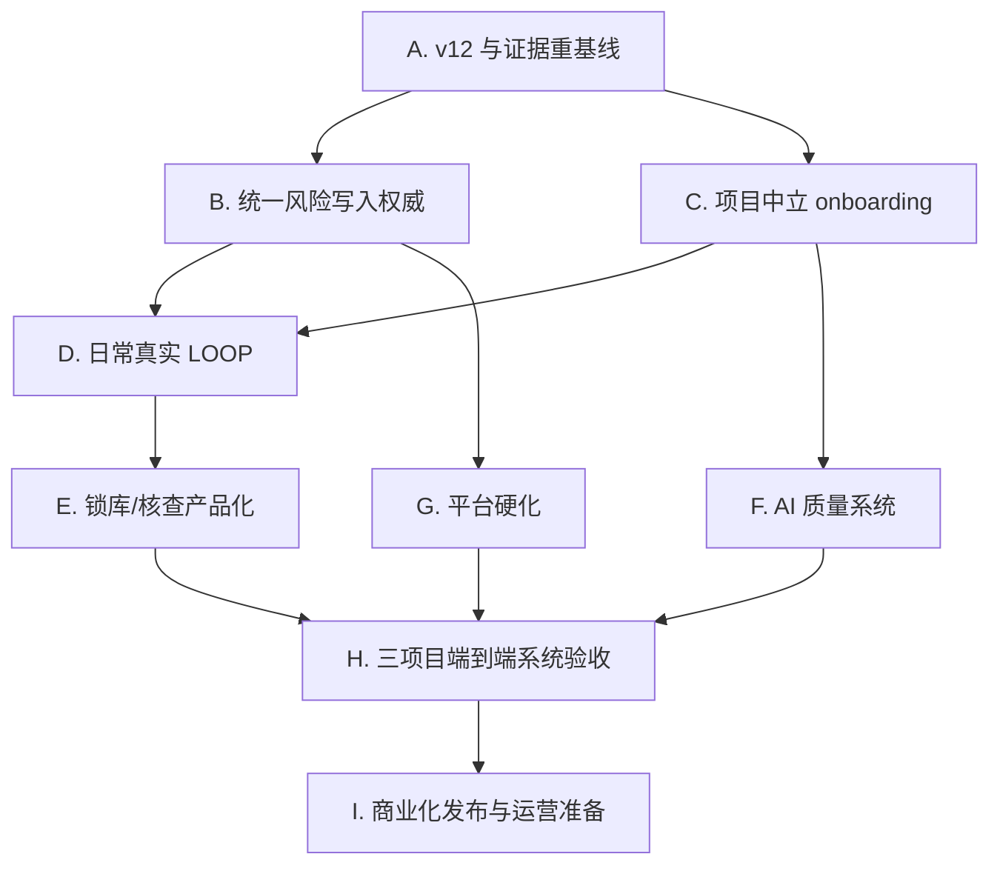

# 医学监查子系统整体复盘、代码审查、外部调研与后续路线图

Date: 2026-08-01 20:54 CST  
Updated: 2026-08-01 22:22 CST  
Updated: 2026-08-02 00:05 CST  
Updated: 2026-08-02 00:16 CST  
Updated: 2026-08-02 00:28 CST  
Updated: 2026-08-02 00:38 CST  
Updated: 2026-08-02 01:06 CST  
Updated: 2026-08-02 00:49 CST  
Updated: 2026-08-02 01:19 CST  
Updated: 2026-08-02 01:31 CST  
Updated: 2026-08-02 01:44 CST  
Updated: 2026-08-02 01:54 CST  
Updated: 2026-08-02 01:55 CST  
Updated: 2026-08-02 02:12 CST  
Updated: 2026-08-02 02:27 CST  
Updated: 2026-08-02 07:51 CST  
Review type: 主代理独立复盘 + Phase A A1-A6、Phase B B1-B7 Codex 离线契约终审  
Product/test changes after review: Phase A 2 服务 + 4 直接测试；Phase B authority/reconciliation/mapping/approval/review contracts + B7 risk projection；Phase C1 StudyMonitoringConfig + C2 adapter-translation/read-only-registry + C3 review-only mapping inventory + C4 clinical event/observation contract + C5 projection/read-model + C6 consumer handoff + C7 frontend consumer fixture + C8 adapter consumer coverage matrix + C9 source-bound fixture validation + C10 source-fixture field-presence/diff report + C11 cross-surface conservation + C12 adapter fallback/retirement policy + C13 blocked activation/projection route + C14 B6-to-C13 authority gate + focused tests  
Runtime/services/real-project runs: 1 个隔离 A6 canary；三真实项目运行 0  
Release verdict: **尚不可上线；已经进入 P10 上线收敛期，而不是从 P0 重新建设**

---

## 1. 执行摘要

### 1.1 总体判断

当前医学监查子系统已经不是演示页或早期原型。它具备以下真实工程基础：

- 原始方案与 listing 来源绑定、内容修订和不可变批次；
- 字段画像、映射候选、映射确认、能力门禁与结构漂移保护；
- 方案事实、规则模板、规则包、shadow、诊断/金标准和完整身份链；
- 独立产品 AI 的任务、队列、尝试、候选、修复、启动恢复和 fail-closed；
- 风险快照、`risk_key`/`risk_instance_id`、批次迁移、证据、导出和处置投影；
- Subject Timeline、Patient Profile、日常运行状态机；
- 锁库前/核查前 assurance 的后端任务、冻结身份、全量重算证明、三级汇总和完成门；
- 总系统摘要、深链、Safety/PV 只读投影和较大规模的回归测试。

本轮按当前文件口径统计：

| 范围 | 文件数 | 约代码行 |
|---|---:|---:|
| 监查相关后端模块 | 58 | 65,766 |
| `frontend/src/features/medical-monitoring` | 33 | 11,522 |
| 根前端 `App.jsx` | 1 | 15,985 |
| 名称包含 monitoring 的测试 | 67 | 59,373 |

因此，后续不应再使用“从 P0 开始重做 P0-P10”的工作方式。更准确的阶段名称应是：

> **P10 发布收敛、权威对象合并与证据重基线。**

### 1.2 当前上线阻断

按优先级，当前真正的阻断不是“功能数量不够”，而是：

1. **当前最窄阻断：** v12 A1-A6 已完成一次隔离 RUX 运行闭环；当前最窄产品阻断转为 Phase B 的医学风险/处置写入权威尚未统一。单次 canary 不是三项目发布证据，也不能替代后续 authority、UI 和真实项目矩阵。
2. **项目中立性不足：** 三个真实项目仍通过代码内绝对路径和项目专用 adapter 注册；通用批次/映射/日常运行底座已存在，但 Timeline/Profile/部分规则投影仍依赖项目专用服务。
3. **医学风险写入权威未完全统一：** 风险事实位于 `MedicalRiskRepository`，已读/医学处置仍通过 workbench inbox/disposition store 汇入；这与“医学风险、证据、处置和未读由医学监查唯一写入”的目标合同不完全一致。
4. **P8 产品闭环未完成：** pre-lock/pre-inspection 后端能力是真实实现，不是空设计；但前端没有 assurance 工作区，三项目真实操作证据也不存在。
5. **发布证据不足：** 尚未形成三个项目 × 三种运行策略 × 产品 AI × 全按钮/异常态 × 重启/性能的闭合证据矩阵。
6. **生产硬化不足：** 多个 SQLite 仓库仍在启动时追加列/回填；跨库步骤依赖补偿而非单事务；真实身份仍由前端硬编码 `medical_manager`；API 未形成稳定 `/api/v1` 发布面。

### 1.3 当前停止点

最新权威停止点不是旧恢复材料中的“四项身份/治疗边界阻断”。那四项已在 2026-07-31 的 Codex review 中关闭并留下聚焦、相邻和监查回归证据。当前最新停止点为：

- v11 terminal history 继续冻结：
  - job `monai_3632c414655546ad250ce8bf7dbd`
  - attempt `monattempt_564f58bf463c42758a4c394f190be9de`
  - source revision `mpr_40b82826a43e46342344841242e6`
  - terminal `failed / invalid_ai_output / retryable=0`
  - 2 个 provider outputs，0 candidate
- v12 A1-A5 离线纠偏已经关闭：
  - 在完整用户可见 visit boundary 上输出稳定、去重的 candidate/path/token/span/family/code diagnostics；
  - repair 必须重生成受影响的完整字段，禁止只删 token、生成后替换或增加无依据事实；
  - unchanged/partial repair 精确 fail-closed，完整字段重生成可通过；
  - v11 位于 immutable retirement-audit set，仍不可 status-compatible/retry/reuse；
  - pycompile、Ruff check、focused 5、core 533、adjacent 146 通过；
  - full monitoring（仅忽略已知无关 medical-writing collection blocker）
    `1494 passed, 4480 deselected, 27 warnings`；
  - Codex offline review PASS，P0-P4 none。
- v12 A6 已通过一次全新 clone、zero-submit 和单项目单主题 canary：
  job `monai_343e98b4992acc36e0c60da30e98` terminal `completed`、一次
  `success_repaired`、3 个 proposed candidates、0 active；
- A6 运行证据已关闭，但不代表三项目商业发布；
- v9/v10/v11 不得 retry/reuse/salvage/reclassify/candidate action；
- 8911、5174 必须保持停止；18911/PID 43191 是无关运行时，不得接触。

---

## 2. 审查范围、来源与证据边界

### 2.1 权威来源

本轮以当前文件系统为最终真相，主要读取：

- `docs/medical_monitoring_manual/医学监查子系统说明书.md`
- `docs/medical_monitoring_manual/医学监查子系统_PRD审阅与差距矩阵.md`
- `docs/medical_monitoring_manual/医学监查子系统_分阶段实施与LOOP计划.md`
- `docs/medical_monitoring_manual/医学监查子系统_Goal模式启动Prompt.md`
- `records/active_slices/medical_monitoring_goal_p10_20260730/`
- 最新 v11 context、terminal evidence、zero-submit evidence、review 与 metrics；
- 当前后端、前端、契约和测试源码；
- 监管/标准、全球厂商、中国平台、论文和开源项目的最新可访问一手页面。

四份主文档当前 SHA-256：

| 文件 | SHA-256 |
|---|---|
| 说明书 | `076f7cb6087b4ec7d5bc112707e553de12668f4d379d04ecb107450da8d5182d` |
| PRD 差距矩阵 | `6f490bfbb4307c2fa3919b27f9f5c4f8a813af0194b39b9b577dd279836ec4ab` |
| 分阶段/LOOP 计划 | `ac41b68b51cf5c1dc3074cf0a3147f6a282948a38ed112f375b6f5915c8670cd` |
| Goal 启动 Prompt | `306806d08a51c1872ae27c8a158b739a293fee439901336676dbe954330023ed` |

### 2.2 恢复性质

原父 Session JSONL 已删除。本报告是：

> **基于现存文件、记录、哈希、运行证据和恢复材料形成的证据重建续作，不是原始逐条对话恢复。**

### 2.3 本轮没有做的事情

- 未修改任何产品源码、测试、运行库或说明书；
- 未运行 pytest、build、lint、浏览器或三个真实项目；
- 未启动 8911、5174 或任何产品服务；
- 未调用产品独立 AI；
- 未使用执行/会商或任何外部角色产出；
- 外部厂商页面只视为厂商自述，不视为独立验证；
- 没有把既有历史测试结果冒充本轮新运行结果。

---

## 3. 需求模型复盘

### 3.1 正确的产品目标

医学监查子系统的本质不是“AI 自动找问题”，而是：

> 将不断变化的原始临床试验数据、方案要求、确定性规则、AI 候选和医学人员判断，组织成可追溯、可复核、可比较、可处置、可在锁库/核查时重演的医学质量闭环。

系统必须同时维护四种真相：

1. **来源真相：** 哪一份方案、listing、字典和配置，内容修订是什么。
2. **计算真相：** 哪个批次、映射、规则包、模型和算法产生了什么结果。
3. **医学真相：** 哪些只是候选，哪些已由医学经理确认、修改、关闭或重开。
4. **过程真相：** 谁在什么版本上做了什么动作，是否可重放、可审计、可解释。

### 3.2 六层框架

说明书的总体方向正确，可归纳为六层：


这六层不能被“一个大模型 + 一个聊天框”替代。AI 只能在受治理来源、稳定任务合同和确定性门禁中增强语义工作。

### 3.3 不可退让的边界

当前需求中最成熟、应继续保留的边界是：

- 日常监查从最新**全量原始 listing**出发，不能把 SDTM/ADaM 作为前置条件；
- 完整快照证据不足时可保存但不能成为正式 diff 基线；
- CM 与 investigational product/试验治疗必须在数据、规则、颜色、泳道、筛选和导出中分离；
- AI 只能产生疑似漏报、潜在 PD、需复核等候选，不能自动确认医学事实；
- 医学采纳即形成当前医学工作记录，不重复套一层“待医学批准”；
- `risk_key` 表示稳定医学含义，`risk_instance_id` 绑定来源、方案、映射和规则修订；
- 主界面优先展示可读事实，locator 和技术身份作为可展开证据；
- 三种运行策略复用同一底层事实，但证据和完成门不同；
- 无关键映射、无完整身份、无来源或 AI 无效时必须 fail-closed，不得用空页面伪装成功。

---

## 4. P0-P10 需求—实现—证据矩阵

| 阶段 | 目标 | 当前实现判断 | 主要证据 | 剩余发布缺口 |
|---|---|---|---|---|
| P0 | 冻结现状与可执行合同 | **已建立且多次强化** | 当前文档、context/review/metrics、文件哈希、停止边界 | 说明书 §38 与当前 P10 证据已漂移；需重基线，不重做 |
| P1 | 模块边界与共享接线 | **部分完成** | 独立 monitoring feature、项目摘要、深链、Safety/PV 投影 | 根 `App.jsx` 仍承载大量监查状态/动作；API/权限/共享对象未完全稳定 |
| P2 | 来源、不可变批次、真实 diff | **后端能力较强，发布证据未闭合** | batch/source repositories、完整性门、结构漂移、行身份、真实 RUX 双批次记录 | 真实双全量批次端到端闭环、1GB 性能、三项目统一路径 |
| P3 | 方案事实与确定性规则 | **广泛实现** | protocol fact/rule/pack/shadow/diagnostics，映射能力身份 | 项目中立配置、版本迁移、三项目正式发布链和所有规则族证据 |
| P4 | 产品内独立 AI | **真实实现，当前有单主题阻断** | task/repository/queue/repair/startup recovery、v11 terminal evidence | v12 精确修复反馈；四类发布任务 × 三项目；失败/重试/模型切换完整矩阵 |
| P5 | 统一医学风险工作台 | **功能丰富但写入权威分裂** | risk snapshots、Checklist、证据、处置投影、导出 | 风险事实与处置/已读合并为单一权威聚合；迁移/重启/多用户证明 |
| P6 | Timeline 与 Patient Profile | **真实实现，主要在 RUX 验证** | 访视轴、泳道打包、缩放、风险聚焦、趋势图、能力限制投影 | 三项目统一生成、稀疏/密集碰撞、计划外访视、盲态、跨项目指标 |
| P7 | 日常监查闭环 | **状态机和恢复设计已实现，真实 LOOP 未完全闭合** | daily-run repository/service、步骤、lease、AI/规则组装、崩溃重试测试 | 两个以上真实连续完整快照；所有转换/重开/取代；浏览器与重启证据 |
| P8 | 锁库前/核查前 | **后端真实实现，产品面未完成** | assurance repository/service/router、冻结身份、proof、三级 reconciliation | 前端工作区、真实三项目全量重算、核查证据包、方法学批准后的中心信号 |
| P9 | 总系统接入 | **已接入但仍耦合** | module summary、深链、项目切换、Safety/PV、壳层 | `/api/v1` 稳定合同、真实身份/RBAC、写作/总看板消费者最终回归 |
| P10 | 三项目全功能发布 LOOP | **未通过** | 三项目来源、部分真实页面、产品 AI 运行记录、v11 fail-closed | 三项目 × 三模式 × 全功能 × AI × 浏览器 × 重启/性能/审计完整发布 dossier |

结论：

> P0-P9 不是“未做”，而是成熟度不均；P10 的主要工作是把这些能力统一到同一权威模型、同一项目中立路径和同一证据框架中。

---

## 5. 代码架构审查

### 5.1 已做得较好的部分

#### A. AI 输出不是直接落事实

`monitoring_ai_service.py` 明确区分不同任务 prompt identity，并对来源、输出 schema、候选数量、证据绑定、一次受控 repair 和 terminal failure 建模。当前 v11 的失败证明：

- 验证覆盖 title/text/structured fields/claim text/uncertainty/user action；
- 受控 repair 失败后没有 candidate 落库；
- 没有用 provider 输出绕过确定性边界；
- 失败可被冻结、审计且不污染权威运行库。

这比“模型返回 JSON 就入库”的常见实现成熟。

#### B. 项目能力会按映射质量降级

`monitoring_project_registry.py:86-210` 对 Timeline、Profile、精确时间规则、CTCAE 和量表复算分别判断：

- full；
- limited；
- unavailable；
- Timeline/Profile 同时不可用时直接失败，而非返回空成功。

这符合医学系统的 fail-closed 原则。

#### C. Timeline 是真实交互，不是静态装饰

`MedicalMonitoringSubjectViews.jsx:123-242` 和 `:492-643` 已实现：

- 实际日期轴和访视锚点；
- 多泳道事件打包与碰撞处理；
- 缩放、聚焦、计划外/持续事件；
- 事件类别颜色、风险关联、原始明细；
- 无数据和边界箭头。

该方向与外部 TrialView、clinDataReview 的患者级纵向视图一致。

#### D. P8 后端合同严谨

`monitoring_assurance_repository.py` 和 service/router 已包括：

- pre-lock/pre-inspection 两种模式；
- 冻结 batch/mapping/protocol/rule/dictionary/CTCAE/model/risk snapshot 身份；
- 一项目一模式一个 active task；
- idempotency、event audit、full recompute proof；
- subject/site/trial reconciliation；
- 关闭风险缺证据阻断；
- 无批准方法或样本不足时 site signal 只能 `descriptive_only`，不得标异常/不合规。

这不是“目标设计”，而是尚未产品化的后端实现。

#### E. 多库崩溃窗口已有针对性补偿

`monitoring_daily_run_analysis_service.py:422-447` 先存 risk snapshot，再绑定 daily run，存在跨库窗口；但 `test_monitoring_daily_run_analysis_service.py:694-748` 已证明“保存快照后崩溃”的一次重试复用同一 snapshot，不会重复创建。

因此这里应描述为：

> 已覆盖一个关键 crash window，但尚未证明全部跨库失败点、进程并发和启动 reconciliation。

不能简单称为“完全没有恢复机制”。

### 5.2 需要纠正的代码问题

#### Finding R0-01：v11 repair 反馈粒度不足

证据：

- `monitoring_ai_service.py:2737-2874` 的 repair envelope 只接收 `validation_errors: str` 和整个 invalid output；
- `:3720-3749` 会扫描每个用户可见字段；
- `:4322-4353` 返回“候选不能包含 dispensing/return...”这类 family 级错误；
- provider 不知道命中字段是 `candidate[0].claims[2].uncertainty`，命中 token 是 `回收`。

判断：

- validator 正确；
- repair contract 信息损失导致 provider 只清掉部分禁用内容；
- 下一步应输出结构化 diagnostics，而不是加更长的自然语言禁令。

v12 最小数据合同建议：

```json
{
  "code": "visit_topic_forbidden_family",
  "candidate_index": 0,
  "field_path": "candidates[0].claims[2].uncertainty",
  "matched_token": "回收",
  "family": "dispensing_return_weighing_adherence_pk",
  "repair_action": "regenerate_entire_user_visible_field"
}
```

禁止的修法：

- 删除 `uncertainty` 的验证；
- 放宽 `回收`；
- provider 返回后静默字符串替换；
- salvage v11 输出。

#### Finding R0-02：项目专用 adapter 仍是关键功能主路径

证据：

- `main.py:480-509` 把 RUX、MY009、MG-K10 的方案/listing 绝对路径写在代码中；
- `main.py:545-562` 只注册三个项目服务；
- `main.py:592-623` 同一真实项目还存在多个 alias/raw config；
- `monitoring_project_registry.py:98-102` 明确在正式 mapping activation 前仍返回 source-specific adapter；
- RUX/MY009/MGK10 service 各自持有固定 sheet、指标和解析约定。

判断：

- 三个专用 adapter 是有价值的真实 fixture 和兼容层；
- 但它们不能继续作为“新增研究的正式方式”；
- 目前“项目中立批次/映射/日常链”和“项目专用 Timeline/Profile 聚合链”并存。

目标：

- 新项目通过数据/配置创建，不修改 Python；
- 专用 adapter 降级为 golden fixture、迁移兼容或只读 fallback；
- 第四个未见项目做抗过拟合 dry run。

#### Finding R0-03：医学风险事实与处置存在双权威

证据：

- `medical_monitoring_summary.py:645-733` 从 `risk_repository` 读取当前风险快照；
- 同时在 `:1088-1164` 从 `workbench_inbox_service.rux_disposition_store` 拼接已读和处置；
- `App.jsx:2532-2593` 直接 POST 到 `/workbench-inbox/.../actions` 和 `/risk-disposition`；
- 风险来自本次规则结果、尚无 `inboxItemId` 时，页面明确不能写入处置；
- `actor` 固定为 `medical_manager`。

风险：

- risk snapshot、item/source version、inbox item 和 disposition record 需要持续投影对齐；
- 重启、迁移、并发或项目 alias 可能造成事实可见但无法处置、处置可见但风险实例已取代；
- 与说明书“医学风险、证据、处置和未读由医学监查唯一写入”不完全一致。

建议：

- 设计一个 `MedicalRiskAggregate` 写入边界；
- risk fact 可以保持 append-only snapshot，处置/read/event 绑定公开风险实例和来源版本；
- inbox 只读投影，不再成为医学处置事实源；
- 采用受控迁移 + reconciliation，不长期双写。

#### Finding R0-04：P8 只有 API，没有资深医学经理可操作的工作区

证据：

- assurance repository/service/router 完整；
- `frontend/src` 未检出 `monitoring/assurance`、`pre_lock`、`pre_inspection` 产品路径。

影响：

- 无法证明锁库前“冻结→重算→覆盖→开放项→锁库决策”；
- 无法证明核查前“三级汇总→明细回溯→整改→证据包”；
- P8 后端存在不等于 P8 业务闭环可用。

#### Finding R1-01：运行库迁移依赖启动时 `_ensure_column`

证据：

- `monitoring_protocol_rule_repository.py:626-790` 启动时建表、逐列检查、回填 legacy state；
- AI、batch、daily-run、risk 等 repository 有类似 `ALTER TABLE`/回填模式。

开发期好处：

- 兼容历史运行库快；
- 回归覆盖容易。

生产风险：

- 缺少可审核的迁移编号、前置检查、备份、锁、回滚和完成记录；
- 多进程同时启动的迁移行为尚未证明；
- schema 更新与业务服务启动耦合。

建议：

- 保留 repository schema guard；
- 引入显式 migration ledger；
- 每一迁移有 from/to、preflight、backup、transaction/compensation、post-check、rollback；
- 完成真实历史库副本和多进程启动演练。

#### Finding R1-02：多 SQLite 形成应用层 saga

daily run、risk snapshot、AI、mapping、protocol/rule、assurance、inbox 分布在多个 SQLite。当前已有：

- idempotency；
- lease/version CAS；
- 单点崩溃重试；
- frozen identity；
- startup recovery。

但仍需：

- 列出每个跨库写入点；
- 为“写 A 前/后、写 B 前/后、进程终止、重复请求、并发 worker”建立 failure matrix；
- 启动 reconciliation 找到 orphan snapshot、unbound run、dangling disposition；
- 先证明单机补偿足够，再决定是否迁移 PostgreSQL/队列；不要因“多库”直接重构整套技术栈。

#### Finding R1-03：前端根组件过度耦合

证据：

- `frontend/src/App.jsx` 15,985 行；
- 监查页面在根文件中直接维护上传、风险、处置和原始 fetch；
- `App.jsx:2664` 仍保留 `{false && (...)}` 的旧上传 UI；
- 同时已存在 33 个 monitoring feature 文件和集中 API helper。

建议：

- 以业务 slice 拆 `MonitoringWorkspaceController`、`RiskReviewController`、`AssuranceWorkspace`；
- 根 App 只保留壳层、路由、项目上下文；
- 删除死 UI 前先确认没有测试/样式依赖；
- 所有请求统一进 typed API client，取消根组件裸 fetch。

#### Finding R1-04：API、身份与权限仍是开发期合同

证据：

- `medicalMonitoringApi.mjs:1-73` 同时使用：
  - `/modules/medical-monitoring/...`
  - `/monitoring/...`
  - `/subjects/.../monitoring`
  - `/workbench-inbox/...`
- 说明书目标接口使用 `/api/v1`；
- 前端/后端默认 actor 多处为 `medical_manager`；
- 没有真实登录身份、RBAC、电子签名和权限归属证据。

结论：

- 当前 local-first 单医学经理可接受；
- 不能直接推断为可部署的多用户受监管系统；
- P10 前需要冻结 v1 API、错误码、身份注入和兼容窗口。

#### Finding R1-05：文档与追踪真值漂移

例子：

- 说明书 §38 仍将锁库/核查前能力写为“目标设计”，但 P8 后端已实现；
- requirement traceability 同时出现 mapping V13、protocol prompt v11，若不明确命名空间，容易误以为同一版本线；
- Goal Prompt 第一轮仍要求重新创建 P0 五件套；
- 工作台根 `AGENTS.md` 保留旧的本地路由历史，与最新全局文件的“全局 Section 12 为唯一 canonical route”方向不一致。

建议：

- 不频繁重写主 PRD；
- 增加一份短小 current release ledger：
  - capability version stream；
  - code implemented；
  - deterministic verified；
  - real-project verified；
  - browser verified；
  - release accepted；
- 主说明书只在阶段退出时更新。

### 5.3 测试与证据评价

现有测试不是薄弱项。已观察到的优势包括：

- AI invalid output/repair/frozen history；
- identity/CAS/idempotency；
- 项目切换和迟到请求拒绝；
- crash-after-snapshot-save 重试；
- mapping capability 降级；
- risk identity、source revision、规则发布、shadow；
- Timeline/Profile 和导出合同；
- P8 assurance 的完成门。

但自动化测试不能替代以下发布证据：

- 三项目从原始方案/listing 走同一项目中立路径；
- RUX 两个以上真实完整全量批次的日常 diff；
- pre-lock/pre-inspection 的真实 UI LOOP；
- 四项 AI 任务 × 三项目的引用/失败/重试；
- 全按钮、筛选、排序、空态、冲突、导出和深链；
- 进程重启、多进程启动、1GB 性能、真实身份/RBAC。

---

## 6. 外部监管、平台和实现思路调研

### 6.1 监管与标准基线

#### ICH E6(R3)

[ICH E6(R3) Annex 1 Step 4](https://database.ich.org/sites/default/files/ICH_E6%28R3%29_Step4_FinalGuideline_2025_0106_ErrorCorrections_2025_1024.pdf) 强调：

- quality by design；
- 与风险相称、fit-for-purpose 的系统和流程；
- 关键质量因素、受试者保护和数据可靠性；
- 记录、可追溯和适当监督。

[Annex 2 Step 4](https://database.ich.org/sites/default/files/ICH_E6%28R3%29_Annex%202_Guideline_Step%204_2026_0603_0.pdf) 已于 2026-06-03 采用，后续应纳入去中心化、务实和真实世界数据相关场景的适用性评估，但不能在未核对本地实施日期前直接升级产品合规声明。

#### FDA 风险监查

[FDA 2023 RBM Q&A](https://www.fda.gov/regulatory-information/search-fda-guidance-documents/risk-based-approach-monitoring-clinical-investigations-questions-and-answers) 的核心不是减少监查，而是：

- 根据研究设计、终点、受试者复杂性、中心经验、数据采集方式和产品安全性调整监查；
- 监查计划说明已识别风险、方法和结果沟通；
- 监查随新风险演进。

对本项目的直接含义：

- 规则/风险必须绑定版本化监查计划和适用范围；
- 日常、锁库、核查不应只是三个按钮，而是三套证据门；
- “没有命中规则”不能等于“没有风险”。

#### 中国 GCP 与 CDE

[NMPA 2026 修订信息](https://english.nmpa.gov.cn/2026-06/12/c_1190202.htm) 显示新版 GCP 将于 2026-09-01 生效，增加数据治理，并要求新技术/新方法符合伦理、科学和法规，强调全过程质量管理。本报告日期为 2026-08-01，因此：

- 当前执行仍需按实际日期判断 2020/2026 适用版本；
- 发布基线应保存 NMPA 中文主公告/正文，而不能只依赖英文新闻摘要；
- AI/新技术的适用、验证、审计和人类监督需要进入正式 validation dossier。

[CDE 临床试验期间安全信息管理页面](https://www.cde.org.cn/main/guide/contentpage/545cf855a50574699b46b26bcb165f32) 强调申办者安全风险管理主体责任、SUSAR/其他潜在严重风险信息和 DSUR 等渠道。对本系统的含义是：

- 医学监查不能替代 Safety/PV 法定流程；
- Safety/PV 应读取监查风险关联，而不是复制/夺取风险处置权；
- 高风险升级必须保留责任人、状态和外部流程关联。

#### CDISC

[CDISC Data Exchange](https://www.cdisc.org/standards/data-exchange) 说明 ODM 是 vendor-neutral、platform-independent 的临床数据/元数据/审计交换格式。项目不应把 SDTM/ODM 设为日常监查前置，但应：

- 为未来 EDC/机构系统接入预留 ODM/Define-XML/Dataset-JSON adapter；
- 把当前原始 listing adapter 与标准交换 adapter 放在同一 source contract 下；
- 不把标准化转换后的数据冒充原始来源。

### 6.2 全球平台：可借鉴的产品模式

以下均为厂商官方自述，不是本轮独立性能或合规验证。

| 平台 | 官方呈现的实现思路 | 对本项目的启示 |
|---|---|---|
| [Medidata Clinical Data Studio](https://www.medidata.com/cn/data-experience/clinical-data-studio/) | Medidata/第三方数据统一审阅；Data Review、Patient Profiles、RBQM、Audit Trail；KRI/QTL、AI/自动化 | 数据、审阅、风险和医学监查需要共享同一受治理数据面；“signal → action”不应跨多个孤岛 |
| [CluePoints Detection](https://cluepoints.com/what-we-do/risk-based-quality-management-rbqm/detection/) | KRI、QTL、Central Statistical Monitoring、patient atypicality、issue tracking | 当前患者级确定性监查之外，未来可增加有方法学批准的 site/trial 统计层；不能用小样本页面排序代替统计验证 |
| [eClinical elluminate Agents](https://www.eclinicalsol.com/elluminate-ai-agents/) | governed data、protocol context、HITL、traceable/explainable/auditable；mapping/review/RBQM/operations agents | 当前按任务拆分 AI 的方向正确；先治理数据和合同，再谈 agent；AI 输出必须进入人审和审计，不直接成为事实 |
| [Veeva Risk-based Study Management](https://www.veeva.com/wp-content/uploads/2021/08/Veeva_Vault-CTMS-RBSM_Datasheet_v6.pdf) | study/country/site 风险，CTMS/eTMF 内的评估、缓解、整改和 issue workflow | 风险处置应有一个完整工作流和单一权威；P9 总系统接入不能只做摘要展示 |
| [Saama Smart Data Quality](https://www.saama.com/platform/products/smart-data-quality/) | AI 异常、query 草稿、互动 listing、规则构建 | 可借鉴 AI 辅助 query/异常解释；效率数字为营销主张，不能作为本项目验收目标 |
| [Oracle Clinical One](https://www.oracle.com/cn/life-sciences/clinical-trials/data-collection/) | 多源数据采集与统一临床平台 | 更偏采集/EDC；本项目应保持“监查工作台”边界，不复制完整 EDC |

### 6.3 中国平台：本地部署与机构数据接入更突出

| 平台/机构 | 官方呈现的实现思路 | 对本项目的启示 |
|---|---|---|
| [太美 eMonitoring](https://www.taimei.com/en/product-id-20/) | HIS/LIS/EMR/PACS/病历/处方等 360° 视图；方案预设逻辑检查；禁限用药、SAE；本地部署、脱敏、审计 | 中国环境重视机构内数据、远程监查、本地部署和行为审计；当前项目先做好 sponsor 侧 listing，再定义医院侧接入边界 |
| [太美 GCP-X](https://www.taimei.com/en/product-id-17/) | 医院多源数据清洗/标准化；CDISC/ODM；NLP；远程监查；数据不出院 | 证明“原始多源 → 标准映射 → 受试者全景 → 逻辑检查”是成熟方向；但不能把医院接入加入首版范围 |
| [太美 2025 中期报告](https://ir.taimei.com/media/n1kd51y0/2025092502150.pdf) | 公司披露 iMAP Medical Monitoring Intelligent Analysis Platform，以及 iDM/iCTA/iPV 等数字员工 | 说明国内也在把医学监查放进平台化 AI 产品矩阵；披露材料未提供算法、验证集或闭环细节，只能作为产业方向证据 |
| [泰格 DCT/RBQM](https://www.tigermedgrp.com/zh/DCTs) | 远程/中心化风险监查、DCT、E2E、eCOA、RBQM | 中国落地是现场、远程、中心化的组合；本项目应输出可指导人工监查的证据，不试图完全替代 CRA/医学监查员 |
| [泰格临床监查](https://www.tigermedgrp.com/zh-hant/solutions/clinical-development/clinical-monitoring) | MMP、方案审阅、入组合格性、PD、数据医学审核、紧急医学事务 | 产品需求必须覆盖医学工作责任，而不只是异常图；入排、PD、安全性、数据清理和咨询需要清晰边界 |
| [泰格 RBQM 实践](https://www.tigermedgrp.com/zh/media-resources/tigermed-insights/33) | 风险评估、中心化监查、现场/远程监查、风险可视化和缓解 | 其公开材料也提示中国 RBQM 成熟度并非完全一致；适合按问题管理→风险管理→中心化监查→统计分析分阶段推进 |
| [泰格 2026 AI/DCT 活动稿](https://www.tigermedgrp.com/zh/media-resources/press-releases/199) | 厂商自述 CRA Agent、TMF Agent、MM Agent 可做数据汇总核对、风险预警、文件管理和入组资料审核，同时承认数据漂移、偏差和透明度挑战 | 可借鉴按专业任务拆 agent 和全程留痕；活动新闻不等于产品验证，不能据此引入自主执行或取消医学复核 |
| [泰格 2025 半年度报告](https://static.cninfo.com.cn/finalpage/2025-08-29/1224603702.PDF) | 公司披露自研 RBQM 和 AI 平台 | 属企业披露，可证明产业投入方向，不能证明具体算法或本项目适配性 |

### 6.4 论文与开源实现

#### clinDataReview

[2024 论文](https://pmc.ncbi.nlm.nih.gov/articles/PMC11271019/) 展示了经过验证的开源临床医学/安全性审阅报告：

- 任意 tabular long format，包括但不限于 SDTM/ADaM；
- 按 study/batch 保存定期快照和版本；
- 互动 TLF、listing、patient profile；
- standalone HTML 和可重现配置；
- 强调 traceability、reproducibility、qualification/validation。

[当前 package manual](https://openanalytics.r-universe.dev/clinDataReview/doc/manual.html) 显示 v1.6.1、MIT，支持双批次比较、互动表图和 R Markdown。

适配判断：

- **不建议替代当前系统。** 它更偏配置化报告和标准化数据审阅，不包含当前风险身份/处置/日常状态机/原始 listing mapping。
- **建议作为 acceptance reference。** 借鉴 standalone 可复现报告、batch compare、plot-linked table、patient profile 和 validation 文档结构。

#### TrialView

[TrialView](https://pubmed.ncbi.nlm.nih.gov/38681743/) 将时间事件数据组织成 Individual、Cohort、Progression、Statistics 四个互联视图，并使用图 AI/聚类辅助探索。

适配判断：

- 当前 Timeline 的事件轴、泳道和风险聚焦方向正确；
- cohort/progression 可以进入后续研究，不应在 P10 前扩大范围；
- graph AI 不是患者时间线可用性的前置条件。

#### Good Statistical Monitoring

[Good Statistical Monitoring 论文](https://pmc.ncbi.nlm.nih.gov/articles/PMC11335794/) 展示开源 KRI、映射、互动可视化和标准报告，用匿名/模拟临床数据验证。

适配判断：

- 可作为未来 site/trial statistical monitoring 方法学与测试数据参考；
- 不能直接给当前少中心项目贴“异常中心”标签；
- 需要项目批准方法、最低样本、适用假设和误报管理。

#### 2026 异常检测/LLM 解释

- [Holistic deep-learning anomaly monitoring](https://pubmed.ncbi.nlm.nih.gov/41703352/) 用模拟结构和案例研究探索多层级、纵向异常检测；
- [Anomaly detection + LLM explanations](https://pubmed.ncbi.nlm.nih.gov/42174801/) 探索对 dashboard 异常生成患者级解释。

它们说明研究方向有价值，但证据仍不足以替换确定性规则或让 LLM 自动确认医学异常。适合 shadow/research track，不进入近期核心发布路径。

### 6.5 开源基础设施候选

| 候选 | 许可证/能力 | 当前建议 |
|---|---|---|
| [DuckDB](https://github.com/duckdb/duckdb) | MIT；嵌入式列式分析、直接查询 CSV/Parquet | 对约 1GB 完整快照 diff/分析投影做隔离 benchmark；不直接替换权威 OLTP/审计库 |
| [Great Expectations / GX Core](https://github.com/great-expectations/great_expectations) | Apache-2.0；数据 expectation 与验证文档；当前仓库已重定向至 Fivetran 组织 | 仅评估结构/技术质量门；医学语义/映射仍由项目规则负责；先核对依赖和当前治理变化 |
| [Temporal](https://github.com/temporalio/temporal) | MIT；durable workflow/execution | 单机 SQLite + 当前状态机尚可继续；只有进入多节点、长事务和外部 EDC 事件编排时再立项 |
| [OpenLineage](https://github.com/OpenLineage/OpenLineage) | Apache-2.0；run/job/dataset lineage 标准 | 当前公开 identity 已很丰富；只有需要跨平台 lineage interoperability 时再映射，避免 P10 前过度引入 |

本轮不建议立即采用任何新运行依赖。先用代表性数据 benchmark，证明收益大于迁移、验证和供应链成本。

### 6.6 外部调研的八条统一结论

1. **统一受治理数据面先于 AI。**
2. **批次和“自上次复核后发生什么变化”是高频用户入口。**
3. **患者时间线/档案是医学审阅主工作面，不是 dashboard 装饰。**
4. **patient-level 医学规则与 site/trial-level RBQM/CSM 是不同层，不能混为一谈。**
5. **signal 必须进入 owner、due、action、audit 的闭环。**
6. **AI 适合 mapping、解释、线索、query 草稿；最终事实和处置需要 HITL。**
7. **protocol/study context 必须冻结并隔离，禁止跨项目阈值和语义泄漏。**
8. **中国环境需要本地部署、脱敏、角色权限和机构数据边界，但不应让这些扩张首版医学监查范围。**

---

## 7. 项目实际与外部方案的对照

### 7.1 当前项目已经领先或更适合自身场景的部分

- 不把 SDTM 作为日常监查前提，适应真实 EDC listing；
- 对完整快照证明、mapping capability 和 source revision 的门禁更细；
- CM/IP 边界明确且有历史反例修复；
- `risk_key`/`risk_instance_id` 比简单 issue ID 更适合批次迁移；
- AI fail-closed、candidate 不落库、受控一次 repair 和历史冻结证据较强；
- 日常/锁库/核查复用同一底层事实的设计正确；
- Timeline/Profile 已进入真实前端，不只输出静态报告。

### 7.2 当前项目相对成熟平台的主要差距

- 仍未把所有项目拉进同一 study configuration/onboarding 路径；
- risk fact 与 disposition/read 还不是单一权威聚合；
- patient-level 规则强，但 site/trial RBQM 只在 P8 后端形成描述性基础；
- 角色、权限、审计签名和 API 稳定性不足；
- 运行库迁移、跨库一致性和多进程恢复尚未形成 validation dossier；
- “产品功能存在”和“真实三项目发布证据”混在同一追踪表中；
- P8 没有医学经理可用的前端。

### 7.3 明确不应照搬的方向

- 云优先、数据外发优先；
- SDTM 前置；
- 用一个综合 AI 自动关闭风险或自动发送 Query；
- 为了“agentic”引入多 agent mesh；
- 小样本中心排序后直接标异常；
- 在 P10 收敛期重写全部状态机或替换全部 SQLite；
- 把 EDC、CTMS、eTMF、PV 全部纳入同一首版产品。

### 7.4 新增产品体验与三级风险联动合同（2026-08-01）

用户进一步明确，最终医学监查系统必须界面清晰简洁、默认信息量克制但重点突出；风险发现直观，个例/中心/项目级数据清晰可查并可图形化展示。该要求纳入项目总 Goal，不另建孤立报表。

本合同综合以下本地能力规范：

- `subject-timeline-builder` v0.1.2；
- `clinical-patient-profile-html` v1.0.2；
- `ae-risk-assessment` v1.3.0。

采用原则：

1. **一个事件与证据层，多种视图投影。** Timeline、Patient Profile、AE/实验室风险卡、中心汇总和项目图表必须引用同一来源记录、实际日期、规则/阈值、计算和不确定性；HTML/图表不是新的事实源。
2. **一个风险聚合，多层级定位。** `MedicalRiskAggregate` 增加 `subject/site/trial` 层级、风险类别、严重度/优先级、状态、责任/处置和证据身份；`risk`、`prompt`、`registered_finding`、`rescue_or_exempt`、`not_applicable`、`uncertain` 分开，不压成单一红黄绿标签。
3. **个例层以纵向医学审阅为主。** Profile 显示稳定人口学/分组/基线/完整性摘要；Timeline 按实际日期组织访视、AE、MH、CM、IP、实验室、生命体征、ECG、Finding/PD 和风险锚点；风险卡点击后聚焦对应事件、原始行和方案/规则依据。
4. **中心层只做可解释聚合。** 展示受试者覆盖、数据完整性、风险类别/严重度/状态、时间趋势、逾期处置和可下钻分布；未批准统计方法或样本不足时只允许描述性汇总，不得把排序或颜色直接称为异常中心。
5. **项目层突出变化与决策。** 首页优先显示自上次复核后的新发/变化/重开/已解决风险、关键缺口和需医学经理处理的事项；图形点击必须过滤到中心/个例和同一风险实例。
6. **渐进披露控制信息密度。** 首屏只保留当前任务、最高优先级风险、关键变化和阻断原因；完整表格、locator、版本、计算和审计置于折叠证据区，不能以技术日志作为主要页面内容。
7. **风险分级必须来源驱动。** CTCAE、实验室/生命体征/ECG 基线变化、AE/MH 解释充分性、方案禁限用药、入排、Finding/PD 状态和项目规则均保留版本与 locator；未配置或证据不足时标 `uncertain`，不得套用旧项目阈值。
8. **跨项目配置化。** 人群范围、中心范围、USV、基线、访视、sheet/column、单位、参考范围、CTCAE、AE/MH/CM/IP 和项目规则通过 study config/mapping 激活；三个技能中的项目特例不得硬编码进通用产品。
9. **三级验收必须互相对账。** 项目数、中心数、受试者数、事件数、风险数和状态数逐级守恒；抽样风险必须能从项目图 → 中心列表 → 个例 Profile/Timeline → 原始 listing/方案条款完整往返。
10. **真实浏览器是最终体验证据。** 验收必须覆盖密集/稀疏个例、计划外访视、长中心列表、宽表本地滚动、图表点击、筛选清除、风险聚焦、无数据/缺能力和窄视口；不得用源码存在或静态截图代替交互验证。

---

## 8. 宏观目标、原则与阶段路线图

### 8.1 宏观目标

> 从当前 P10 v11 冻结点持续建成一个项目中立、证据可追溯、确定性优先、AI 辅助且由医学经理最终裁决的医学监查工作台：能够从原始方案和连续全量 listing 生成可解释、可分级、可处置的风险，以简洁重点界面在项目—中心—个例三级完成图形化总览和逐层下钻，在 Profile、Timeline、风险和原始证据之间保持同一身份，并在日常、锁库前和核查前完成可重演闭环；最终以稳定共享合同接入医学经理工作台，形成经过三真实项目端到端验证、可安装、可升级、可回滚、可审计、可运维、可支持且具备完整发布证据的商业化私有部署版本。

### 8.2 非目标

- 不做自动诊断或自动确认 AE/PD；
- 不替代 EDC/CTMS/eTMF/PV；
- 不在首版承诺自主 AI 发送外部 Query；
- 不在缺少方法和样本时承诺中心异常检测；
- 不为追求统一而破坏医学写作子系统；
- 不在 P10 收敛前进行大技术栈迁移。

### 8.3 总体阶段依赖



阶段按退出门结束，不按时间结束。B/C 可以分别设计，但涉及共享身份、API 和根 App 时串行落地。A-I 均属于同一个项目总 Goal；阶段检查点用于验证和恢复，不代表总 Goal 已完成。

---

## 9. 分阶段目标、步骤与退出门

## Phase A：v12 单点纠偏与当前证据重基线

**当前状态：A1-A6 已通过并形成离线 + 单主题运行证据闭环；Phase A 关闭。**

### 目标

在不触碰真实运行库、不重试 v9-v11、不运行三个项目的前提下，把当前访视主题 repair 的诊断信息从 family 级提升到字段/token 级，并形成可审计的新鲜基线。

### 步骤

1. **A1 重新锚定**
   - 读取 v11 pause、terminal、zero-submit 和 LOOP 3.20-3.21；
   - 重算六个已接受 source/test 哈希；
   - 确认没有中断 Kimi/其他角色留下未报告修改；
   - 确认 8911/5174 停止、18911 不相关。
2. **A2 结构化诊断**
   - validator 返回 candidate index、field path、matched token、family/code；
   - 保留原有 error message 向后兼容；
   - 每个命中有确定性顺序和去重规则。
3. **A3 repair 合同**
   - repair 明确要求重生成受影响的完整用户可见字段；
   - 禁止只替换命中词、禁止删除 uncertainty、禁止引入新事实；
   - 保持一次 repair 上限和来源授权。
4. **A4 回归**
   - 初始输出在 title/text/structured/claim/uncertainty/user_action 各表面命中；
   - repair 清除全部命中后通过；
   - unchanged/partial repair terminal fail；
   - existing CM/IP、withdrawal、safety follow-up、AE/CM collection 和 visit-family 原子性全部不回归。
5. **A5 验证**
   - pycompile；
   - focused、core、adjacent、full monitoring；
   - Codex 静态审阅；
   - 更新 LOOP/review/metrics。
6. **A6 新鲜隔离门**
   - 仅在 A1-A5 全通过后，另建新 clone；
   - zero-submit 证明历史冻结、无 active job、完整性和 authority hash；
   - 只有单独授权后才做一个 topic、一个项目、一个 POST 的 canary。

### 退出门

- v9-v11 历史保持不变；
- validator 不放宽；
- field/token diagnostics 可确定性复现；
- full regression 通过；
- canary 若运行：只能产生已验证候选，或以精确字段/token fail-closed，且 0 非法 candidate；
- 8911/5174 最终停止。

---

## Phase B：统一医学风险与处置权威

**当前状态：B1-B6 离线 authority、只读 reconciliation、mapping dry-run、residual
decision package、approval gate 与 explicit review-outcome gate contract 已完成；B7
已完成不写入的 canonical risk projection contract；实际
五条映射均未批准，仍有 4 条 residual blocker，尚未进入迁移。B6 harness 当前为
`pending_review / migration_ready=false / write_permitted=false`，Phase B 未关闭。**

### 目标

使风险事实、已读、医学处置、重开、Query 草稿和审计由一个医学监查写入边界维护；总看板、inbox、Safety/PV 均为投影。

### 步骤

1. **B1 已完成：**定义 `MedicalRiskAggregate` 公共身份和 immutable event 模型；
   `services/api/app/medical_risk_authority.py` 已通过 focused 与既有风险兼容回归。
2. 增加 `subject/site/trial` 风险层级、风险类别、严重度/优先级、状态、责任/处置和证据身份；
3. 将 `risk`、`prompt`、`registered_finding`、`rescue_or_exempt`、`not_applicable`、`uncertain` 建模为不同状态/结论，不允许只靠展示颜色区分；
4. 明确 snapshot fact 不可变、disposition/read event 可追加；
5. **B1 已完成：**设计 `risk_instance_id + source_version + expected_state/version` CAS；
   精确重复事件幂等，event id 复用和 stale version 均 fail-closed。
6. **B2 已完成：**建立旧 inbox disposition → 新 authority 的只读盘点和迁移映射；
   A6 隔离 clone 的 35 个最新风险与 5 条处置记录均已读，5 条均为
   `disposition_identity_mismatch`，`migration_ready=false`。
7. **B3 已完成：**生成五条 review-only legacy→current 候选并在内存副本上 dry-run；
   2 条可匹配，3 条 MY009 source-version mismatch，1 条 aggregate-state drift，
   `migration_ready=false`。
8. **B4 已完成：**形成 source-token/meaning-token、历史 lineage、处置链和
   aggregate replay residual decision package；五条仍未批准。
9. **B5 已完成：**形成 hash-bound approval gate contract；实际候选无 approval，
   gate 保持关闭。
10. **B6 contract 已完成：**review outcome 必须绑定 B4 package SHA-256、B3 report
    hash、candidate record id/fingerprint，并显式覆盖 residual blocker resolution；
    当前 A6 clone 无 review input，安全门保持 pending，B1-B6/风险兼容回归为
    `117 passed, 17 warnings`。
11. **B7 非写入投影合同已完成：**新增 canonical aggregate-shaped risk projection，
    保持 finding/severity/status、unread/disposition、source/evidence 和显式
    Timeline/Profile/AE/实验室/生命体征/ECG/PD links 分离；项目→中心→个例按
    `risk_instance_id` 守恒去重。未接入 `App.jsx`、API 或运行库。
12. **下一步 B6 实际审查：**取得五条映射的授权医学/工程 review outcome，重新运行
    approved-input dry-run；未批准前不得 dual-read promotion 或写迁移；
13. B6 通过后先 dual-read/reconciliation，禁止长期 dual-write；
14. 映射 review 通过后再另立 versioned migration，验证 orphan/mismatch/duplicate；
15. 改前端只调用 monitoring API，并将 B7 投影作为唯一 UI read model；
16. 保持 inbox/总看板/Safety/PV 只读投影；
17. 重启、取代、重开、旧深链和跨项目隔离回归。

### 退出门

- 任一风险在一个权威位置完成事实+状态+审计查询；
- 不需要 `inboxItemId` 才能处置当前权威风险；
- 旧投影与新权威逐项一致；
- 重启和迁移后 unread/disposition 不漂移；
- 个例、中心和项目投影对同一风险实例的类别、级别、状态和数量完全一致；
- 写作和 Safety/PV 无写入权限。

---

## Phase C：项目中立 study onboarding

**当前状态：C1 离线 `StudyMonitoringConfig`、C2 config→adapter
translation/read-only source-registry、C3 review-only fixed sheet/metric inventory、
C4 shared clinical event/observation contract、C5 read-only projection/read-model
contract、C6 source-preserving consumer handoff、C7 frontend-facing fixture contract、
C8 review-only adapter consumer coverage matrix、C9 source-bound schema-only fixture
validation、C10 source-fixture field-presence/diff report 和 C11 onboarding/consumer
cross-surface conservation 已完成；真实项目 onboarding、adapter invocation、source registry persistence、
frontend/API/runtime 接线仍未开始。**

### 目标

新增研究无需修改 Python 或根 App；三个现有项目通过同一配置/映射/能力路径运行。

### 步骤

1. **C1 已完成：**定义并测试 `StudyMonitoringConfig`：
   - source bindings；
   - domain/field mapping；
   - treatment identity；
   - visits/scales/lab/AE/CM/IP capabilities；
   - protocol/rule pack；
   - display labels。
   - capabilities（八项共享监查能力必须显式声明）；
   - protocol/rule pack；
   - display labels；
   - deterministic canonical `config_sha256` 与 malformed/path-like input fail-closed。
   C1 focused **12 passed**；B1-B6 compatibility + C1 **58 passed**；frontend medical
   monitoring Node 13 文件 sweep、pycompile、Ruff 和 review gate 均通过。
2. **C2 已完成：**定义 config→adapter translation 与 read-only source-registry
   contract；descriptor/config hash、required sources、registry conflict、能力降级
   和 binding hash 均有离线 fixture 回归，未注册真实项目、不改变 `main.py`、不启动服务；
3. **C3 已完成：**以 source-code constants/method locators 建立 RUX 11、MY009 18、
   MG-K10 17 共 46 条 review-only sheet/metric observations；重复 surface、跨项目
   identity、路径型 locator、未知 capability 和非 review-only 状态均阻断。
4. **C4 已完成：**定义并测试纯离线 `MonitoringClinicalEvent` /
   `MonitoringClinicalObservation` 合同，明确 project/trial/site/subject 与
   source revision/row、日期精度/实际日历日期、访视、raw/normalized value、unit/
   reference range、AE/MH/CM/IP/finding/PD/risk links、evidence、rule/threshold、
   completeness、uncertainty、canonical SHA-256 与 round-trip；路径型 locator、
   CM/IP 交叉、未声明 nested reference、非 present 的 normalized value、malformed
   payload 与篡改 hash 均 fail-closed。C4 focused 18；C1-C4 + semantic regressions
   131 passed；pycompile/Ruff 通过，未调用 adapter 或运行库。
5. **C5 已完成：**定义并测试只读
   `MonitoringClinicalProjectionScope`/`MonitoringClinicalProjectionContext` 与
   `MonitoringClinicalReadModel`：显式 all/randomized/allowlist 人群、site filter、
   USV include/exclude、population/visit evidence；Timeline、AE/lab/vitals/ECG
   observation cards、subject Profile、site/project rollups 共享 event hash、
   evidence locator、rule/threshold、completeness/uncertainty，并对重复 event、
   observation reuse、subject-site drift、mixed project、scope ambiguity 和 hash
   tamper fail-closed。C5 focused **12 passed**；C1-C5 + semantic regressions
   **143 passed**；pycompile/Ruff/review gate 通过；未接 API/frontend/runtime。
6. **C6 已完成：**由一个 C5 read model 生成 Timeline、Patient Profile consumer
   records、AE/LAB/VITALS/ECG safety metrics、risk drilldown 与既有 site/project
   rollups；保留 event/observation/risk IDs、event hash、日期精度/raw date、visit/USV、
   raw/normalized value、unit/range、evidence ID→locator、rule IDs、completeness 和
   uncertainty。仅显式安全域生成 metric，风险仅来自显式 risk IDs；缺失 trace、hash
   mismatch、混合身份、证据 locator 冲突和错误 event/domain 均 fail-closed。C6 focused
   **6 passed**；C1-C6 contract files **61 passed**；pycompile/Ruff/review gate 通过；
   未修改 frontend/API/runtime，未调用 adapter 或真实项目。
7. **C7 已完成：**新增纯 frontend `medicalMonitoringConsumerContract.mjs` fixture
   adapter；显式映射 C6 domain 到既有 Timeline/Profile vocabulary，保留 hashes、日期/
   precision、visit/USV、raw/normalized value、range、evidence ID→locator、rules、
   completeness/uncertainty/limitations，并输出 raw profile、安全 metric 和 link-only
   risk fixtures。没有 canonical severity/status/normality/baseline/study-day/efficacy
   inference；C7 focused **13 passed**，既有 frontend **14 test files** 全部通过，
   node check/review gate 通过，未改 React/App/CSS/API/runtime。
8. **C8 已完成：**把 C3 RUX 11、MY009 18、MG-K10 17 共 46 条 review-only source
   observations 映射到明确的 Timeline/Profile/safety_metric/risk_link coverage 和
   C4/C5/C6 required fields；AE/LAB/VITALS/ECG 才有 safety metric surface，`SOURCE`/
   `BACKGROUND_TREATMENT` 显式归入 `OTHER` 并保留原始标签，risk policy 固定为
   `explicit_risk_instance_id_only`，`activation_allowed=false`。C8 focused **4 passed**；
   C1-C8 Python contract suite **65 passed**；矩阵生成、pycompile/Ruff/review gate 通过；
   生成矩阵 hash `ce7dd80adc1806ef9ffaf22dd1a1f8a5f63e571125aa93e6d4c5c76e1714983d`。
9. **C9 已完成：**新增 source-bound schema-only fixture validator；每条 fixture 必须匹配
   C8 mapping/project/trial/source sheet/field/evidence locator/source revision，保留 raw
   value（含 numeric zero）和 explicit missing/unknown，禁止 normalized value、path-like
   locator、active mapping 和 clinical event creation。由 C3/C8 evidence 生成 3 reports/
   46 schema-only records，C9 focused **3 passed**；C1-C9 Python suite **68 passed**；
   manifest hash `1648fa85e6daba48e28acfa6409595b94baf3582af81d5aefb1e05b665476e60`。
10. **C10 已完成：**新增 source-bound schema-only fixture field-presence/diff contract；
    它在 C8 coverage 与 C9 manifest 之上逐条列出 source identity/raw/date 字段的
    `present_fields`，把事件、观察、normalized value、completeness、uncertainty 和
    rule fields 明确列为 `not_assessable`，固定 `status=schema_only_unassessed`、
    `schema_only=true`、`activation_allowed=false`，并以 C8/C9 hash 和 mapping
    conservation 防止漂移。生成 3 reports/46 rows，0 missing mappings，736 个临床字段
    不可评估；C10 focused **3 passed**，pycompile/Ruff/review gate 通过，报告 content
    hash `00b421dab4c9672e2d3ceda9432254c3d4db067f7a0596f1340a1ca838b423bc`。
11. **C11 已完成：**新增只读 onboarding/consumer cross-surface conservation contract，
    将 C8 coverage、C9 schema-only fixture、C10 field-presence row 与 C7 frontend
    surface vocabulary 逐条守恒；每条保留 Timeline/Profile/risk_link，安全 metric 只
    对显式 AE/LAB/VITALS/ECG 保留，surface 映射到 `timeline`/`subjects`/
    `safety_metrics`/`risk_links`，并固定 `structural_only`、
    `schema_only_cross_surface_unassessed` 与 explicit-risk-ID-only。生成 3 reports/46
    rows、0 missing；C11 focused **4 passed**，C1-C11 Python suite **75 passed**，
    pycompile/Ruff/review gate 通过，报告 content hash
    `dd96e05a5faab4a56506a00e0244b4e22ecc2b3639b7861914b51e26e564c327`。
12. **C12 已完成：**新增 source-specific adapter fallback/retirement contract；每条
    C8/C11 mapping 只允许 `limited`/`unavailable`，默认 `unavailable`，payload policy
    固定为 `metadata_only_no_clinical_records`，risk action 固定 blocked，保留诊断
    surface identity；六项真实 source revision、医学批准、字段/证据完整、C4-C6
    consumer、risk authority 和 browser/runtime acceptance 条件全部满足前不得退休。
    生成 3 reports/46 policies、0 missing，全部 `not_retired`；C12 focused **4 passed**，
    C1-C12 Python suite **79 passed**，pycompile/Ruff/review gate 通过，报告 content hash
    `0cd6d75dc37f3a420928948aca6ec75b97c1c7ab546828dd499f08e97231bb42`。
13. **C13 已完成：**新增 blocked activation-to-standard-event-to-Timeline/Profile route；
    未来批准 mapping 只能进入 C4 `MonitoringClinicalEvent/Observation` 和 C5/C6
    `ReadModel/ConsumerHandoff`，当前 46/46 为 `blocked_pending_approval`，event creation、
    projection、activation 全 false，5 个 blocker 均显式保留；C13 focused **4 passed**，
    C1-C13 suite **83 passed**，报告 content hash
    `297823fd71ab6be982ecb6b869a97440653a0b61cfb378d814afa75c6b0d7399`。
14. **C14 已完成：**把实际 B6 `B6_REVIEW_OUTCOME_GATE.json` 与 C13 绑定；当前
    `pending_review`、5 candidates、0 outcomes、5 missing candidate records、2 unresolved
    blockers、`migration_ready=false`、`write_permitted=false`，C13 46/46 rows blocked；
    C14 focused **4 passed**，C1-C14 suite **87 passed**，报告 content hash
    `5db5fedf9ba9c62d6b1605c9869d9051455584b2d61a19245861a273c9596a85`。
15. Timeline/Profile 从激活 mapping 和标准事件层生成；
16. 将人群、中心、USV、基线、CTCAE、项目规则和可选模块纳入版本化 study config；
17. 三项目走同一 API、同一状态机、同一 error contract；
18. 用第四个未见项目只读 dry run，验证无代码修改 onboarding；
19. 验证 CM/IP、访视、量表、基线、CTCAE 和日期精度不会跨项目泄漏。

### 退出门

- 新项目只需来源+配置+医学确认，不改源码；
- RUX/MY009/MGK10 不依赖项目专用业务逻辑才能完成主路径；
- 未见项目不能继承其他项目阈值/表名/指标；
- Timeline、Profile、风险和三级聚合读取同一事件/证据合同，不分别解析原始源；
- 缺能力时明确 limited/unavailable，不空成功。

---

## Phase D：日常医学监查真实 LOOP

### 目标

用至少两个真实连续完整全量快照，证明从上传到批次确认的完整增量闭环。

### 步骤

1. RUX 两个以上真实全量批次的完整性/结构/行身份证明；
2. 结构、行、字段和医学语义 diff；
3. 映射漂移和受影响规则选择；
4. 规则与 AI 并行/失败降级；
5. 风险状态覆盖：
   - new；
   - changed；
   - persisted；
   - condition no longer met/resolved；
   - superseded；
   - reopened；
   - unmatched/manual review。
6. 事实、方案、规则、计算和 AI 四类证据下钻；
7. 已读、医学处置、Query 草稿、批次确认；
8. 个例工作区联动 Profile、实际日期 Timeline、风险卡、趋势图和原始证据；
9. 项目/中心摘要图点击下钻到同一风险实例和个例事件；
10. browser 全按钮/筛选/排序/空态/冲突/导出；
11. 服务重启和重复请求；
12. 1GB 首次运行/缓存命中/内存/耗时基准。

### 退出门

- 一个真实项目完成 2+ 批次全链；
- 另一项目通过相邻泛化回归；
- AI 失败不阻断确定性主路径；
- 风险身份/处置在重启后完全一致；
- 项目→中心→个例→原始证据往返可用，三级计数对账；
- 每个结论可回到原始行/段落。

---

## Phase E：锁库前与核查前产品化

### 目标

把已有 assurance 后端变成资深医学经理可完成的真实工作区。

### 步骤

1. 新建独立 `AssuranceWorkspace`，不继续堆入根 App；
2. pre-lock：
   - 冻结身份；
   - readiness；
   - 全量重算；
   - 关键域覆盖；
   - 开放高风险；
   - 已关闭风险证据；
   - 医学复核；
   - lock impact/decision。
3. pre-inspection：
   - subject/site/trial reconciliation；
   - 风险类别/严重度/状态汇总；
   - CM/IP/Safety 分离；
   - 明细回溯；
   - 整改状态和 evidence manifest。
4. 中心信号：
   - 无批准方法/样本不足时只描述；
   - 有批准方法时固定方法 identity、分母、缺失率、阈值和版本。
5. 项目总览只显示关键变化、最高优先级风险、中心分布、处置逾期和阻断原因；
6. 中心页展示覆盖/完整性、风险分布与趋势，并可下钻至个例 Profile/Timeline；
7. 三项目分别演练；
8. 浏览器、导出、重启和审计验收。

### 退出门

- pre-lock 不能在 proof failure/skip/reconciliation fail/关闭缺证据时完成；
- pre-inspection 没有 rollup 不能完成；
- 页面不暴露技术日志为主内容；
- 项目、中心和个例三级汇总守恒，图表筛选与风险下钻不丢失来源/规则/处置身份；
- 三项目从任务创建到完成/阻断都有真实证据。

---

## Phase F：产品 AI 质量系统

### 目标

把当前庞大的 AI 服务从“实现广”提升到“任务可独立发布、可测量、可回滚”。

### 步骤

1. 按任务拆 service/validator/prompt registry：
   - field mapping；
   - protocol structuring；
   - cross-table clue；
   - evidence summary/QA；
   - query explanation。
2. 所有 validator 使用结构化 diagnostics；
3. 建立三层评测集：
   - unit/golden；
   - 三项目 diagnostic/shadow；
   - 未见项目 anti-overfit。
4. 记录 model/prompt/source revision、latency、token/cost、failure code、repair、人工评价；
5. 建立 prompt release approval、rollback 和旧 job retirement；
6. 用户采纳/修改/拒绝形成反馈数据，但不自动在线学习；
7. 验证 timeout、rate limit、invalid JSON、partial output、low confidence、model switch；
8. 证明 AI 不可用时确定性工作台仍可完成核心任务。

### 退出门

- 主 PRD §40.3 四项必需任务在三项目通过；
- 引用真实、定位准确、无跨项目污染、无“未检出=没有”；
- 每个 prompt/model 版本可回放、比较、回滚；
- 不以开发代理输出代替产品 AI。

---

## Phase G：平台硬化

### 目标

将 local-first 工程状态提升为可验证的单机私有化发布状态。

### 步骤

1. 建立 versioned DB migrations、备份、回滚和迁移 ledger；
2. 跨库 failure matrix 和 startup reconciler；
3. 多进程启动、lease、busy/lock、崩溃恢复；
4. 真实身份注入、RBAC、必要动作的电子签名/再确认；
5. `/api/v1` 路由、schema、error code 和兼容期；
6. 根 App 拆分、死代码清理、集中 API client；
7. audit export、敏感字段/最小显示、内网部署说明；
8. 1GB listing、多个项目、并发读取/单写的性能门；
9. 备份恢复和灾难恢复演练。

### 退出门

- 历史运行库可从旧 schema 可逆升级；
- 服务中断不产生不可解释 orphan；
- actor 来自真实身份上下文；
- API/前端消费者兼容；
- 性能、重启、备份恢复有可复现实证。

---

## Phase H：三项目端到端系统验收

### 目标

冻结候选版本，以三个结构差异明显的真实非肿瘤项目完成医学、功能、数据、AI、跨模块和故障恢复的端到端系统验收；本阶段只收敛缺陷和证据，不再混入大规模架构开发。

### 步骤

1. 冻结 release candidate、schema、prompt、rule pack 和 source registry；
2. RUX、MG-K10、MY009 从原始方案/listing 开始；
3. 每项目覆盖：
   - source/intake/mapping；
   - protocol/rules；
   - product AI；
   - Checklist/Timeline/Profile 与 AE/实验室/生命体征/ECG 风险分级联动；
   - risk disposition/audit/export；
   - daily；
   - pre-lock；
   - pre-inspection；
   - project switch/deep link/Safety-PV；
   - restart/failure/retry。
4. 每项目 3-5 个不同风险/完整性受试者下钻，同时全项目运行；
5. 每项目验证项目→中心→个例→事件/原始行的图形化下钻与反向定位；
6. 验证简洁首屏、渐进披露、密集/稀疏时间线、计划外访视、长列表、宽表和窄视口；
7. 浏览器和医学科学性验收；
8. 写作/总看板相邻回归；
9. 独立检查三项目 system-validation dossier；
10. 所有发布阻断缺陷关闭后才允许进入商业发布准备。

### 退出门

完全采用说明书 §40.5，不以“测试很多”“页面可开”或“AI 看起来不错”替代任何条目。三个项目的全部规定路径均有可复现实证，医学科学性复核通过，且不存在未关闭的 P0/P1 系统验收缺陷。

---

## Phase I：商业化发布与运营准备

### 目标

把通过三项目系统验收的候选版本转化为可在明确支持环境中交付、安装、升级、回滚、备份恢复、监控、审计和支持的商业版本；商业化标准不等同于声称已经取得任何未实际完成的法规认证。

### 步骤

1. 冻结商业 release candidate、版本号、schema、prompt、rule pack、source registry 和支持环境矩阵；
2. 建立需求—设计—代码—测试—三项目证据的双向 traceability matrix，并关闭未覆盖的发布要求；
3. 形成可重复的安装、初始化、升级、回滚、卸载和环境核验流程，至少在一套干净支持环境中从零演练；
4. 完成第三方开源组件清单、许可证核验、SBOM、依赖与漏洞处置记录，禁止把无合格许可证的可执行组件带入发布包；
5. 完成身份/RBAC、审计完整性、秘密与配置管理、敏感日志最小化、数据导出/留存/删除边界及必要动作再确认的发布检查；
6. 完成性能、并发、长时稳定性、故障注入、重启、迁移、备份恢复和灾难恢复验收；
7. 完成管理员手册、用户手册、医学复核 SOP、AI 能力与限制说明、部署/升级/回滚手册、故障排查和事故响应 runbook；
8. 由目标用户完成受控 UAT 和培训演练，重点验证首屏信息密度、风险可发现性、三级钻取、Timeline/Profile 联动和处置效率，并记录偏差、已知限制、残余风险、接受人和版本；
9. 建立发布、变更、prompt/rule/model 更新、回归、回滚、支持和维护机制；
10. 汇总 commercial release dossier，由产品、医学、质量/验证、技术和运维责任人完成发布决策。

### 退出门

- 所有商业发布必需需求均有可追溯实现和通过证据；
- 三项目系统验收保持通过，发布包与被验收候选版本一致；
- 无未关闭 P0/P1 发布阻断项，低级别残余风险有明确责任人、缓解措施和书面接受；
- 干净环境安装、升级、回滚、备份恢复和故障恢复均可重复成功；
- 开源许可、SBOM、依赖风险、身份、权限、审计和数据边界检查完成；
- 医学经理 UAT、管理员/运维演练和支持交接通过；
- 发布 dossier、已知限制、版本说明、支持范围和回退方案完整；
- 只有上述退出门全部通过并形成明确发布决定，项目总 Goal 才可标记为“达到商业化使用标准”。

---

## 10. 优先级和近期任务队列

### R0：当前切片必须先做

1. Phase B B6：记录五条 mapping candidate 的显式 review outcome，并用 approved
   mapping input 重跑 dry-run；
2. 在 B6 证据通过后，设计 dual-read、重启和深链回归；
3. 再决定是否另立任务做 versioned migration；
4. 保持 v9-v12 历史边界、8911/5174 停止，不在 B1/B2 checkpoint 中启动服务。

### P0：上线前不可缺

1. 统一风险写入权威；
2. 项目中立 onboarding；
3. RUX 两个真实完整批次日常闭环；
4. P8 前端和三项目演练；
5. 四类产品 AI × 三项目；
6. versioned migration、真实身份、重启/性能；
7. 三项目 system-validation dossier；
8. 简洁重点界面、项目/中心/个例三级图形化钻取、Timeline/Profile/风险分级联动；
9. 安装/升级/回滚/备份恢复、traceability、UAT、运维与 commercial release dossier。

### P1：紧随上线收敛

- 根 App 拆分；
- `/api/v1`；
- site/trial RBQM 方法学；
- AI 运行质量和 prompt release dashboard；
- ODM/标准数据 adapter benchmark。

### P2：明确延后

- 多节点 durable workflow；
- 自动 EDC 事件接入；
- 企业 CTMS/eTMF connector；
- graph AI/cohort progression；
- 自主 agent 执行外部动作。

---

## 11. 当前 Goal Prompt 审阅

### 11.1 优点

现有 Goal Prompt 正确地保留了：

- 原始方案/listing；
- 三真实项目；
- 产品 AI 不可由开发代理替代；
- CM/IP 分离；
- 风险身份、证据和处置；
- Timeline/Profile；
- 三种运行策略；
- 总系统/医学写作并行边界；
- 浏览器和真实项目验收；
- §40 才是上线门。

### 11.2 主要问题

1. **目标层级混淆。** 总 Goal 覆盖从当前状态到商业化终点本身是正确的；问题在于旧 Prompt 没有稳定区分“项目总 Goal—阶段目标—当前执行切片—恢复检查点”，导致阶段完成容易被误写成 Goal 完成，或超长运行后难以恢复。
2. **启动动作过时。** 仍要求重建 P0 五件套，但这些已经存在且当前阶段在 P10。
3. **没有最新停止点。** 未写 v11 terminal failure、v9-v11 冻结和 v12 唯一安全动作。
4. **把“已实现”与“已发布验收”混在同一 Goal。**
5. **要求广泛读取 records/logs/context/runs，缺少 checkpoint-first 的渐进加载。**
6. **重复执行方法。** Prompt 自己嵌入执行/会商规则，容易与最新全局 `AGENTS.md` 漂移；应只说动态遵循。
7. **绝对路径重复权威。** 当前工作区副本哈希一致，但更稳妥的方式是先读当前 checkpoint，再验证文档 authority，而不是每次从外部路径开始。
8. **没有阶段进入门、退出门和总 Goal 终止门。** 当前切片结束后既可能无边界扩张，也可能被误当成全项目结束。
9. **版本命名空间不清。** mapping V13/V15 与 protocol prompt v11 容易被误读为同一版本线。
10. **没有明确禁止重试 v9-v11。**
11. **商业化完成定义不足。** 三项目功能演练之后，还需要安装/升级/回滚、质量追溯、许可/SBOM、身份权限、审计、备份恢复、运维、UAT、支持和发布决策，才能称为达到商业化使用标准。

### 11.3 重构原则

- 保留一个从当前 P10 v11 停止点贯穿商业化发布门的项目总 Goal；
- A-I 阶段目标和每次 bounded slice 都从属于总 Goal，不另冒充项目终点；
- objective 写可观察的商业化结果，方法和逐步证据放在路线图与当前 checkpoint；
- resume prompt 先 checkpoint → hash → ports → next action；
- 每阶段通过退出门后固化无损 checkpoint，并继续下一阶段；checkpoint 不等于总 Goal 完成；
- 只有用户明确暂停、出现需用户裁决的重大路线分叉或真实阻断时才暂停；不能仅因一个阶段完成而宣告总 Goal 完成；
- 路由、工具、等待、模型选择只引用最新 `AGENTS.md`，不复制；
- 主 PRD 和商业发布门共同定义最终完成，current ledger/checkpoint 是执行真值；
- v12 是恢复后的第一个安全切片，不是下一段独立项目 Goal。

---

## 12. 项目总 Goal 文本

```text
将医学经理工作台中的医学监查子系统，从当前 P10 v11 终态冻结点持续建设、集成、验证并交付为达到商业化使用标准的私有化产品版本。最终系统必须项目中立、来源可追溯、确定性规则优先、产品 AI 独立可验证、医学经理保留最终裁决权；能够从原始方案和原始连续全量 listing 完成项目 onboarding、方案结构化与规则治理、Checklist/Timeline/Profile、CM/IP 与治疗身份边界、日常增量医学监查、统一风险与处置、锁库前 assurance、核查前 assurance、证据下钻、审计、导出、跨模块联动及失败/重启恢复。产品界面必须清晰简洁、默认信息量克制而重点突出；风险发现直观，项目—中心—个例三级数据可图形化查看并逐层下钻，Profile、Timeline、AE/实验室等风险分级、Finding/PD、处置和原始证据共同定位同一风险实例。

总 Goal 从当前真实停止点开始。第一执行切片是 P10 v12：在不重试、复用、补救或重分类 v9-v11，不放宽 validator，不写权威运行库并保持 8911/5174 停止的前提下，先完成 visit-topic repair 的字段/token 级结构化诊断、完整字段受控重生成、聚焦/核心/相邻/全量回归、Codex review 和新鲜证据重基线；只有离线门通过并另获运行授权，才可进行一个新隔离 clone、zero-submit 和最多一次单项目单主题 canary。v12 只是总 Goal 的第一阶段和恢复入口，不是 Goal 终点，也不能在完成后把整个项目标记完成。

随后按有依赖、可验证的阶段继续完成：统一医学风险与处置写入权威；项目中立 study onboarding 与未见项目 dry run；至少两个真实连续全量批次的日常医学监查 LOOP；锁库前和核查前产品化工作区；产品内独立 AI 的任务拆分、结构化验证、三项目与未见项目评测、版本化发布与回滚；API、数据库迁移、身份/RBAC、审计、并发、性能、重启、备份恢复和灾难恢复等平台硬化；最后以 RUX、MG-K10、MY009 三个结构差异明显的真实非肿瘤项目，从原始方案和原始 listing 开始完成日常、锁库前、核查前三种运行策略及全部医学、功能、数据、AI、浏览器、跨模块、导出和失败路径的端到端系统验收。

通过三项目系统验收后仍不得提前结束。还必须完成商业发布准备：冻结可追溯 release candidate，建立需求—设计—代码—测试—真实项目证据的双向 traceability；完成干净环境安装、初始化、升级、回滚、卸载、备份恢复与故障恢复演练；完成开源许可核验、SBOM、依赖风险、身份权限、审计和数据边界检查；完成性能、并发、长时稳定性与故障注入；形成管理员/用户/医学复核/部署升级/运维支持文档和 SOP；完成目标用户 UAT、培训、已知限制与残余风险接受、支持维护和发布回退机制；汇总 commercial release dossier 并形成明确发布决定。

整个建设过程中必须保护医学写作及其他并行子系统和用户改动，不以开发代理输出代替产品 AI，不以“测试数量多”“页面能打开”或单次 canary 代替真实验收，不声称取得未实际完成的法规认证。每个阶段按进入门和退出门推进并保存无损 checkpoint，但阶段 checkpoint 只用于验证、恢复和审计，不改变项目总 Goal。只有 A-I 全部阶段通过、三真实项目完整验收通过、无未关闭 P0/P1 发布阻断项、残余风险得到书面处置且安装升级、可运维性、可支持性、质量追溯和商业发布 dossier 全部门通过时，才可把本 Goal 标记为“医学监查子系统已彻底构建测试完成并达到商业化使用标准”。
```

### 项目总 Goal 的最终完成定义

- **当前阻断关闭：** v12 精确纠偏与新鲜证据门通过，v9-v11 历史和既有医学边界保持不变；
- **完整功能：** A-G 规定的风险权威、项目中立 onboarding、三种监查策略、Assurance、AI 和平台能力全部实现；
- **真实项目：** RUX、MG-K10、MY009 从原始源开始完成规定的端到端矩阵，医学科学性与浏览器验收通过；
- **体验与三级联动：** 简洁首屏、渐进披露、项目/中心/个例三级图形化钻取、Timeline/Profile/风险分级和原始证据往返均在真实浏览器通过，三级数量和状态对账；
- **数据与 AI：** 来源/规则/模型/prompt/版本/处置全链可追溯，AI 失败可降级且不污染确定性主路径，无跨项目污染；
- **平台质量：** 迁移、权限、审计、API 兼容、并发、性能、重启、备份恢复和灾难恢复均有可复现实证；
- **商业交付：** 安装/升级/回滚、SBOM/许可、文档/SOP、UAT、培训、支持维护、已知限制、残余风险和发布 dossier 完整；
- **发布阻断：** 无未关闭 P0/P1；任何未完成、未验证或被跳过的必需门都阻止 Goal 完成；
- **最终判定：** 由明确版本和证据包支持的发布决定已经形成，而不是仅由代码合并、测试数或演示结果推断。

---

## 13. 下一次恢复项目总 Goal 时的 Prompt

```text
恢复并继续“医学监查子系统从当前 P10 v11 停止点直至彻底构建、完整测试并达到商业化使用标准”的项目总 Goal。本次是基于现存证据的续作，不得声称恢复了已删除父 Session 的原始逐条对话；当前文件系统、最新 checkpoint 和已固化验证证据是最终真相。

先完整读取并遵循恢复时最新的全局 /Users/smkzw/.codex/AGENTS.md 和工作台最近的 AGENTS.md；执行/会商、路由、等待、工具和记录机制均以恢复时的最新规则及用户当前指令为准，不把旧路由表复制进本 Goal。随后按以下顺序 checkpoint-first 重新锚定，不从记忆推断：

1. /Users/smkzw/Documents/康哲项目资料/AI/医学经理工作台/implementation/workbench/context/medical_monitoring_system_retro_pause_20260801.md
2. /Users/smkzw/Documents/康哲项目资料/AI/医学经理工作台/implementation/workbench/reviews/medical_monitoring_system_retro_roadmap_20260801.md
3. context/monitoring_p10_v11_canary_pause_20260801.md
4. runs/execution/monitoring_p10_v11_isolated_canary_20260801/TERMINAL_EVIDENCE.md
5. runs/execution/monitoring_p10_v11_zero_submit_gate_20260801/ZERO_SUBMIT_EVIDENCE.md
6. records/active_slices/medical_monitoring_goal_p10_20260730/LOOP_LEDGER.md 的 3.20-3.21
7. /Users/smkzw/.cc-switch/skills/subject-timeline-builder/SKILL.md
8. /Users/smkzw/.cc-switch/skills/clinical-patient-profile-html/SKILL.md
9. /Users/smkzw/.cc-switch/skills/ae-risk-assessment/SKILL.md

开始任何修改前：
- 核对 v11 zero-submit context 中记录的六个已接受源码/测试 SHA-256；如任一变化，先判断是否为未报告或并行修改，保留医学写作和其他用户改动，不得覆盖；
- 确认 8911、5174 无 listener；18911/PID 43191 为无关运行时，禁止接触；
- 确认 v9、v10、v11 jobs/attempts/candidates 冻结，禁止 retry/reuse/salvage/reclassify/candidate action；
- 识别当前总 Goal 所处阶段、该阶段进入门/退出门、已完成证据和下一安全动作；
- Phase A 期间不启动三个真实项目、不写权威运行库、不迁移隔离库。

当前第一安全动作是完成 Phase A 的 v12 离线切片：
1. 为 visit-topic boundary failure 增加结构化 diagnostics，至少包含 error code、candidate index、精确 field path、matched token 和 forbidden family；
2. repair contract 要求重生成受影响的完整用户可见字段；禁止静默删词/替换、禁止移除 uncertainty 验证、禁止放宽既有边界；
3. 增加初始输出、部分修复、完整修复和所有用户可见字段表面的精确回归，并保持 CM/IP、给药、发放/回收/称重/依从性/PK、退出、安全性随访、AE/CM、完成/终止和访视 family 原子性全部 fail-closed；
4. 运行最小聚焦、核心、相邻和全量 monitoring 回归，完成 Codex 源码审阅；
5. 更新 LOOP、context、review、metrics、测试证据和前后哈希。

只有离线门全部通过并获得单独授权，才可建立全新隔离 clone、执行 zero-submit，并最多运行一个 RUX visit_window_and_order canary。不得因为延迟轮询、重派或干预；按最新 AGENTS.md 的当前机制执行。canary 结束后立即停止 8911，保持 5174 停止，冻结 terminal evidence。

Phase A 通过后，不得把项目总 Goal 标记完成，也不得把 v12 误写成项目终点。固化无损 checkpoint 后，继续按照详细路线图的依赖和退出门推进：
- Phase B：统一医学风险与处置写入权威；
- Phase C：项目中立 study onboarding；
- Phase D：连续全量批次的日常医学监查真实 LOOP；
- Phase E：锁库前与核查前产品化；
- Phase F：产品 AI 质量系统；
- Phase G：API、数据、身份、审计、性能、恢复和灾备等平台硬化；
- Phase H：RUX、MG-K10、MY009 三真实项目端到端系统验收；
- Phase I：安装升级、质量追溯、许可/SBOM、UAT、文档、运维支持和商业发布 dossier。

后续产品实现必须把 Timeline、Patient Profile、AE/实验室/生命体征/ECG 风险评估、Finding/PD 和统一风险处置融合到同一事件/证据与风险身份合同中；界面采用渐进披露，项目→中心→个例→原始记录逐层图形化下钻，并对三级数量、状态和风险身份进行守恒校验。不得把三个技能简单复制成三个孤立 HTML，也不得让图表成为第二事实源。

每一阶段开始前复核源权威和共享边界，按最小可验证切片实施；每一阶段结束时完成代码/测试/浏览器/医学/运行证据中适用的验收并更新 roadmap、LOOP、review、metrics 和 pause checkpoint。阶段 checkpoint 是恢复点，不是总 Goal 完成点。除用户明确要求暂停、出现需要用户裁决的重大路线分叉，或经过安全替代仍无法推进的真实阻断外，应继续到下一阶段。

保护医学写作及其他并行子系统、运行库和用户改动；不以开发代理结果替代产品 AI，不以测试数量、页面打开或单次 canary 代替发布证据。只有 A-I 全部退出门、三项目完整矩阵、医学科学性与浏览器验收、非功能/恢复门、UAT、支持运维和 commercial release dossier 全部通过，且无未关闭 P0/P1 发布阻断项并形成明确发布决定后，才可把项目总 Goal 标记完成。任何未验证或跳过的必需门都必须保持 Goal 未完成。
```

---

## 14. 无损暂停边界

截至 2026-08-02 02:27 CST，复盘、宏观路线图、Phase A A1-A6、Phase B B1-B7
纠偏/运行门以及 Phase C1-C14 配置/翻译/观察清单/临床事件/投影/消费者交接/前端
fixture/adapter coverage/source-bound validation/field-presence-diff/cross-surface-conservation/fallback-retirement/blocked-activation/B6-gate 契约切片均已完成：

- v12 产品身份、结构化 diagnostics、完整字段 repair 合同和 residual
  fail-closed 已实现；
- 冻结 v11 与 distinct v12 的历史边界已有精确回归；
- focused/core/adjacent/accepted full monitoring 和 Codex source review 已通过；
- 新 clone zero-submit 通过；一次 RUX `visit_window_and_order` canary 以
  `completed/success_repaired` 终态返回 3 个 proposed candidates，真实产品 AI
  的初始 3 个 boundary hits 在受控 repair 后归零；
- 最终六哈希、review、metrics、LOOP 3.22 和 lossless checkpoint 已固化；
- `StudyMonitoringConfig` 项目中立 source/mapping/treatment/capability 契约已通过，
  C1 review/metrics/context 与 LOOP 3.31 已固化；
- C2 `StudyAdapterDescriptor`、read-only source registry snapshot 和
  config→adapter binding 已通过，C2 review/metrics/context 与 LOOP 3.32 已固化；
- C3 `StudyAdapterMappingObservation`/`StudyAdapterMappingPlan` 与三项目 46 条
  review-only inventory 已通过，C3 review/metrics/context 与 LOOP 3.33 已固化；
- C4 `MonitoringClinicalEvent`/`MonitoringClinicalObservation` 共享事件/观察合同已
  通过 18 个聚焦测试与 C1-C4 131 项回归，C4 review/metrics/context 已固化；其
  `event_sha256`、证据/规则绑定、日期精度、完整性/不确定性与 CM/IP 边界仍是离线
  合同，不代表真实源映射或运行库写入；
- C5 `MonitoringClinicalProjectionScope`/`MonitoringClinicalProjectionContext`/
  `MonitoringClinicalReadModel` 已通过 12 个聚焦测试与 C1-C5 143 项回归；人群与
  USV 范围、Timeline/Profile/AE/lab/vitals/ECG 投影、证据 locator、规则阈值和
  event/observation/risk identity 守恒均有离线 contract，C5 review/metrics/context
  与 LOOP 3.35 已固化；
- C6 `ClinicalConsumerHandoff` 已由一个 C5 read model 生成 Timeline、Profile
  consumer records、AE/LAB/VITALS/ECG safety metrics、risk drilldown 和既有
  site/project rollups；保留 event/observation/risk ID、event hash、日期/访视/USV、
  raw/normalized value、range、证据 ID→locator、rule、completeness/uncertainty，
  并对缺失 trace、hash/身份冲突、错误 domain mapping 和 locator conflict fail-closed。
  C6 focused **6 passed**；C1-C6 contract files **61 passed**；pycompile、Ruff 与
  review/metrics/context 已固化；未接 frontend/API/runtime，未调用 adapter 或真实项目；
- C7 `medicalMonitoringConsumerContract.mjs` 已把一个序列化 C6 handoff 验证并映射到
  既有 frontend Timeline/Profile vocabulary；显式域标签、event/observation/risk IDs、
  hashes、日期/精度、visit/USV、raw/normalized value、range、证据 ID→locator、rule、
  completeness/uncertainty 与 limitations 均保留；risk 只输出 link，不生成 severity/
  status/normality/baseline/study-day/efficacy。C7 focused **13 passed**，医学监查
  frontend **14 个 test files** 全部通过，node check/review/metrics/context 已固化；
  未修改 React/App/CSS/API/runtime，未启动服务或真实项目；
- C8 已将 C3 RUX 11、MY009 18、MG-K10 17 共 46 条 review-only source observations
  映射到明确 Timeline/Profile/safety_metric/risk_link coverage 与 C4/C5/C6 required
  fields；AE/LAB/VITALS/ECG 才允许 safety metric，`SOURCE`/`BACKGROUND_TREATMENT`
  归入 `OTHER` 且保留原标签，risk policy 为 explicit ID only，activation 永远 false。
  C8 focused **4 passed**；C1-C8 Python contract suite **65 passed**；矩阵生成、pycompile、
  Ruff、review gate 通过，矩阵 hash 为
  `ce7dd80adc1806ef9ffaf22dd1a1f8a5f63e571125aa93e6d4c5c76e1714983d`；
- C9 已新增 source-bound schema-only fixture validator；每条记录匹配 C8 mapping/project/
  trial/source sheet/field/evidence locator/source revision，保留 raw value（含 numeric
  zero）和 explicit missing/unknown，禁止 normalized value、path-like locator、active
  mapping 和 clinical event creation。生成 3 reports/46 records，C9 focused **3 passed**；
  C1-C9 Python suite **68 passed**；pycompile、Ruff、review/metrics/context 已固化；manifest
  hash `1648fa85e6daba48e28acfa6409595b94baf3582af81d5aefb1e05b665476e60`；未读取真实
  listing/protocol，未调用 adapter 或启动服务；
- C10 已新增 source-bound schema-only fixture field-presence/diff report；3 reports/46
  rows，0 missing mappings，736 个 clinical fields 明确 `not_assessable`，保留 C8/C9
  hashes，`schema_only=true`、`activation_allowed=false`，报告 content hash 为
  `00b421dab4c9672e2d3ceda9432254c3d4db067f7a0596f1340a1ca838b423bc`；C10 focused **3
  passed**，pycompile、Ruff、review/metrics/context 已固化；未读取真实 listing/protocol、
  未调用 adapter 或启动服务；
- C11 已新增 onboarding/consumer cross-surface conservation contract；把 C8/C9/C10
  逐条 join 到 C7 `timeline`/`subjects`/`safety_metrics`/`risk_links` vocabulary，生成
  3 reports/46 rows、0 missing；Timeline/Profile/risk-link 46/46，safety metric 21/46，
  全部 `structural_only`、`schema_only_cross_surface_unassessed`、explicit-risk-ID-only；
  C11 focused **4 passed**，C1-C11 Python suite **75 passed**，report content hash
  `dd96e05a5faab4a56506a00e0244b4e22ecc2b3639b7861914b51e26e564c327`；未读取真实
  listing/protocol，未调用 adapter 或启动服务；
- C12 已新增 inactive adapter fallback/retirement policy contract；46/46 policies 只允许
  `limited`/`unavailable`，默认 `unavailable`，metadata-only、risk blocked、六项退出条件、
  `not_retired`，生成 3 reports/46 policies、0 missing，content hash
  `0cd6d75dc37f3a420928948aca6ec75b97c1c7ab546828dd499f08e97231bb42`；C12 focused **4
  passed**，C1-C12 Python suite **79 passed**，pycompile、Ruff、review/metrics/context 已
  固化；未读取真实 listing/protocol、未调用 adapter 或启动服务；
- C13 已新增 blocked activation→C4 event→C5/C6 Timeline/Profile route；46/46 rows
  `blocked_pending_approval`，event creation/projection/activation 全 false；C13 focused **4
  passed**，C1-C13 Python suite **83 passed**，report content hash
  `297823fd71ab6be982ecb6b869a97440653a0b61cfb378d814afa75c6b0d7399`；
- C14 已将实际 B6 `pending_review` gate 绑定到 C13：5 candidates、0 outcomes、5 missing
  candidate records、2 unresolved blockers、migration/write 全 false，C13 46/46 blocked；
  C14 focused **4 passed**，C1-C14 Python suite **87 passed**，report content hash
  `5db5fedf9ba9c62d6b1605c9869d9051455584b2d61a19245861a273c9596a85`；B6 原文件保持只读，
  未读取真实 listing/protocol，未调用 adapter 或启动服务；
- `subject-timeline-builder`、`clinical-patient-profile-html`、
  `ae-risk-assessment` 的融合方向已转化为共享事件/证据/风险身份、渐进披露和
  项目→中心→个例下钻合同，而非三个孤立页面。

仍未完成：

- Phase B-I 的产品实现与商业发布门；
- 三个真实项目、浏览器/医学/性能/恢复/UAT 全矩阵；
- 任何权威运行库迁移或商业发布决定。

Phase B B1-B7 已形成离线 authority、只读 reconciliation、mapping dry-run、residual
  decision package、approval gate、explicit review-outcome gate 与不写入的 canonical
risk projection contract：B1-B4/risk
compatibility **108 passed**，B5 加入 approval focused 4 后为 **112 passed**，B6
加入 review focused 5 后 B1-B6/既有风险兼容总计 **117 passed, 17 warnings**；实际
五条候选均未批准，仍有 3 条 MY009 legacy source-token 缺失复核与 1 条 aggregate
event replay blocker。当前 B6 实际 gate 为 `pending_review`；下一安全动作是取得
显式 review outcome 并以 approved mapping input 重跑；在不触碰运行库的前提下可并行
当前不能安全进入下一步真实 onboarding、approved-input dry-run、Timeline/Profile runtime
接线或权威迁移：必须先取得授权 reviewer 对 5 条 B6 candidate 的显式 outcome，重放
append-only disposition chain 到 aggregate，并完成 legacy source revision token revalidation。
在此之前只能保持 C13/C14 blocked/read-only，仍不得直接迁移权威运行库或长期 dual-write。
C6/C7 已完成但不改变 B6 `pending_review` 状态。

2026-08-02 续作证据复核：Codex 仅从 B3/B4 package 与 A6 zero-submit clone 的最新风险
快照做了离线、只读的 candidate evidence review，形成
`runs/execution/medical_monitoring_phase_b6_codex_review_recommendation_20260802/CODEX_INDEPENDENT_REVIEW_RECOMMENDATION.md`
（content hash `593e8ba22243f71e0307c74d6c600867122be90b6a8ae7f9dcfe4057bbaec996`）。该稿
不是授权 reviewer outcome：MY009 三条仍受 source-token revalidation 与 aggregate replay
阻断，RUX 两条虽 exact-after-identity 但仍须医学/工程显式审查；五条均建议保持
`pending_review`，不生成 outcome、不修改 B6、不写 runtime。当前安全边界不变：先获取
hash-bound 显式 outcome，再重跑 B6 和 approved-input 内存 dry-run；之前不得真实 onboarding、
Timeline/Profile runtime 接线、event/projection activation、迁移、API POST 或服务启动。

2026-08-02 产品层增量：Inbox 风险投影已修正为显式站点身份优先（`site_id`/`site`/
`siteId`/site scope），旧式 `S<site><subject>` 仅作兼容回退；`target_id="10008"` +
`site_id="10"` 回归覆盖，14 个医学监查 Node suite 与 Vite `1914 modules` 构建通过。
这只是前端投影层的确定性修正，不替代真实 adapter 的 canonical site identity、B6
authority outcome、运行时/浏览器验收或商业发布门；未改变 `pending_review`、服务停止和
下一安全动作。

2026-08-02 P8 前端首个产品切片：已在医学监查页增加锁库前/核查前保障工作区入口和
只读/门禁投影。面板读取 task/proof/rollup，展示当前快照、冻结身份缺失项和证据完成状态；
完整九字段 identity 或明确 authority write permission 未由当前后端 payload 提供时，创建按钮保持阻断。focused 18、医学监查
15 个 Node test files 和 Vite 1918 modules build 通过。该切片关闭的是“没有产品入口”的
P8 表面缺口，不等于真实三项目 assurance 完成；后续仍需 B6 outcome、canonical identity、
写入型证据步骤、浏览器/科学性/真实项目验收。

8911 和 5174 必须保持停止。A6/C1/C2/C3/C4/C5/C6/C7/C8/C9/C10/C11/C12/C13/C14 完成不等于项目总 Goal 完成；总 Goal 的唯一
终点仍是 Phase I 商业发布门全部通过。

## 2026-08-02 P4/Phase F 离线质量观测增量

为推进 P4 “产品 AI 可独立发布、可测量、可回滚”的质量基础，在不越过 B6、不启动服务或
provider 的前提下新增 `services/api/app/monitoring_ai_quality.py` 与专属测试。该模块从现有
job/attempt 快照生成不可变、可哈希的质量观测：保留输入 revision/source bindings、prompt/
profile/provider/requested/response model、raw attempt outcome 与归一化结果、failure code、
repair IDs、candidate IDs、可选 latency/token/cost 以及独立 human-review outcome。真实产品
attempt 的 `success/success_repaired/success_deterministic` 和
`invalid_output/provider_error/...` 已按有限集合适配，未知值失败关闭；token 缺项不估算，
`success_repaired` 无 repair evidence 失败关闭。

`summarize_quality_coverage` 只生成 project×task 覆盖、成功/失败、修复、人审计数及缺失组合，
明确不推断医学正确性、mapping/rule/risk 批准或 release-ready。focused **9 passed**；产品
AI 相邻 `tests/test_monitoring_ai_*.py` **608 passed, 17 warnings**；`.venv` pycompile、
Ruff format/check 通过。记录与哈希在
`records/active_slices/medical_monitoring_p4_quality_observation_20260802/`。

该增量只关闭离线质量证据合同，不代表 P4/Phase F 退出：运行时 telemetry 落库、三项目×任务
质量矩阵、未见项目 anti-overfit、prompt release/rollback、真实人审反馈和商业发布门仍未完成。
B6 仍为 `pending_review`、5 candidates/0 outcomes/5 missing、2 blockers、
`migration_ready=false`、`write_permitted=false`；8911/5174 继续停止。

## 2026-08-02 LOOP 3.49：P8 三级 rollup 产品面与 Timeline/Profile 下钻

为继续推进 Phase E、同时不越过 B6，本切片只在前端实现 reference-only rollup 投影：

- 新增 `medicalMonitoringAssuranceRollup.mjs`，只消费后端显式
  `trial_rollup/site_rollup/subject_rollup/distributions`，对项目/中心/个例
  `risk_instance_id` 集合和显式计数做 fail-closed 守恒校验；
- `MedicalMonitoringAssurancePanel` 增加克制的项目/中心/个例重点卡、严重度条形分布、
  三级对账状态和有限条数的中心/个例列表；中心复用风险范围回调，个例通过既有
  `Patient Profile` / `Subject Timeline` 回调下钻；
- 个例下钻显式传递 `subject_id`，避免异步选择状态导致旧个例漂移；App 仅透传既有回调，
  未改 API、authority、runtime、医学写作或风险事实；
- focused rollup **16 passed**；医学监查 frontend **16 个 test files 全部通过**；
  Vite **1919 modules transformed**，仅既有 large chunk warning；8911/5174 仍停止。

该切片完成的是 P8/Phase E 的只读产品面增量，不是 P8 真实三项目演练或 Phase E 退出；
仍未取得真实 rollup/browser/science evidence，未完成 B6 reviewer outcome、approved-input
dry-run、runtime telemetry、三项目 LOOP、Phase G-I。下一安全动作仍是 B6 显式 outcome →
aggregate replay/source revision revalidation → approved-input 内存 dry-run；在此前继续保持
C13/C14 blocked/read-only，不启动服务、不迁移、不 API POST、不 dual-write。

## 2026-08-02 LOOP 3.50：P4 prompt/model release governance contract

为继续推进 Phase F，在不接运行库、不调用 provider 的前提下新增
`services/api/app/monitoring_ai_release.py` 与专属测试。不可变 release snapshot 保留
task type、prompt 精确 hash、model/input/evaluator revision、evaluation observation IDs、
评测快照 hash、审批证据和过渡关系；纯函数 guarded transitions 只允许
candidate→approved→active、同 task 旧版本 retired，以及 active→同 task retired/approved
target rollback。

focused **9 passed**；产品 AI 相邻 `tests/test_monitoring_ai_*.py` **617 passed, 17 warnings**；
py_compile、Ruff format/check 通过。该切片不修改 PromptRegistry、AI queue、job retirement、
API、schema、runtime、医学写作或 B6；8911/5174 继续停止。它只建立后续质量矩阵与发布证据
的离线合同，不代表 P4/Phase F 退出、产品 AI 可发布或真实 rollback 演练完成。下一安全动作
仍是 B6 显式 outcome → aggregate replay/source revision revalidation → approved-input 内存
dry-run；随后另立 Controlled runtime integration 和三项目 AI 评测矩阵。

## 2026-08-02 LOOP 3.51：真实源文件只读 classifier preflight

为在 B6 授权前减少真实 onboarding 的技术不确定性，本切片只使用现有 parser/classifier 对三份
真实 workbook 做 source-bound、read-only 预检：MY009 comparison、RUX processed snapshot 和
RUX raw worksheet-dimension defect。聚焦 `tests/test_monitoring_source_classifier.py`
**8 passed, 1 warning, 61.87s**；三类真实文件均按预期分类，baseline eligibility 全部为
false：MY009=`comparison_workbook`（63 sheets/4,414 rows）、RUX processed=
`processed_full_snapshot`（54/180,793）、RUX raw=`raw_snapshot_with_format_defect`
（54/180,793）。RUX raw 的 `worksheet_dimension_reset` 仍显式保留。

本切片只输出 metadata（basename、size、SHA-256、sheet/row counts、classification），没有
单元格内容或受试者标识落盘；parser/classifier 源码审阅确认没有 registry、adapter、clinical
event、risk、API/SQLite/runtime、provider、浏览器或服务写入。记录与哈希位于
`records/active_slices/medical_monitoring_source_preflight_20260802/`，metrics 位于
`metrics/medical_monitoring_source_preflight_20260802_metrics.md`。

该预检是技术分类证据，不是真实 source mapping、协议/医学语义、onboarding、daily LOOP、
浏览器/科学性验收或商业发布证据。B6 仍 `pending_review`、5 candidates/0 outcomes/2 blockers、
`migration_ready=false`、`write_permitted=false`；8911/5174 保持停止。下一安全动作仍为
B6 授权 reviewer outcome → aggregate replay/source-token revalidation → approved-input 内存
dry-run，之前保持 C13/C14 blocked/read-only。

## 2026-08-02 LOOP 3.52：P4 §40.3 cross-project AI evaluation matrix contract

为把说明书 §40.3 的三真实研究、未见项目 anti-overfit 和人工评价要求转成可验证的离线
证据边界，本切片新增 `monitoring_ai_evaluation_matrix.py` 与专属测试。矩阵只消费既有
immutable quality observations，分离 real-project/unseen-project tracks，并逐 project×task
保留 observation IDs、完成/失败/修复/人工审阅计数；missing、unreviewed、failed-only、矩阵
外 project/task、重复 observation ID 和轨道重叠均 fail-closed。

`build_independent_ai_release_matrix` 固定 §40.3 四项必需产品 AI 面：字段语义映射、方案条款
提取、风险证据摘要、交互追问；矩阵状态恒为 `evidence_matrix_only`，不得表达医学正确、引用
正确、prompt/model 已发布或 release-ready。focused **6 passed**；产品 AI 相邻 **623 passed,
17 warnings**；py_compile、Ruff format/check 通过。记录位于
`records/active_slices/medical_monitoring_p4_ai_evaluation_matrix_20260802/`，metrics 位于
`metrics/medical_monitoring_p4_ai_evaluation_matrix_20260802_metrics.md`。

本切片未调用 provider、未接 PromptRegistry/telemetry/API、未启动服务/浏览器/真实项目、未写
运行库或医学写作；8911/5174 保持停止。它不关闭真实 AI 质量矩阵、医学引用/科学性、人审、
Phase F 或商业发布门。B6 仍 `pending_review`、5 candidates/0 outcomes/2 blockers、
`migration_ready=false`、`write_permitted=false`；下一安全动作仍为 B6 授权 reviewer outcome
→ aggregate replay/source-token revalidation → approved-input 内存 dry-run。

## 2026-08-02 LOOP 3.53：Phase G versioned migration ledger / startup reconciliation contract

Phase G 的代码审查确认监查侧的 `medical_risk_repository.py`、`monitoring_ai_repository.py` 和
`monitoring_batch_repository.py` 仍各自通过启动时 `CREATE TABLE`/`ALTER TABLE` 补齐 schema，
尚无统一的 versioned migration ledger、backup/rollback evidence 或跨数据库 startup reconciler。
本 LOOP 新增纯内存、只读 `monitoring_migration_contract.py` 及测试，明确迁移版本、affected
stores、preflight/post-check、migration/rollback hash、backup/rollback 要求；同一 store 的
重叠迁移区间、缺失/重复/未知 observation、部分 terminal evidence、版本漂移和失败无 error
code 均 fail-closed。

契约的 authority 输入只作为阻断条件，不能授权写入：当前 B6 `pending_review` 或任何非明确
approved 输入固定得到 `blocked_pending_authority`；即使 approved 输入也仅得到 pending、no-op
或 `reconcile_required` 的证据报告，`write_permitted` 与 `migration_write_permitted` 始终为
false。focused **10 passed**；B6/AI startup recovery/mapping activation 相邻 **36 passed,
17 warnings**；py_compile、Ruff format/check 全部通过。证据、review、哈希和 residual risk 位于
`records/active_slices/medical_monitoring_phase_g_migration_contract_20260802/` 与
`metrics/medical_monitoring_phase_g_migration_contract_20260802_metrics.md`。

这是 Phase G 的离线平台硬化基础，不是 executor、实际 SQLite backup/事务/补偿、重启/灾备、
身份/RBAC/e-sign、`/api/v1`、三项目 LOOP、浏览器/科学性验收或商业发布门。未打开 SQLite、未
接 `main.py`/API/provider、未启动服务/浏览器/真实项目、未触碰 B6 原文件或医学写作；8911/5174
保持停止，18911/PID 43191 未触碰。B6 仍 `pending_review`（5 candidates/0 outcomes/2 blockers），
下一安全动作仍为授权 reviewer outcome → aggregate replay/source-token revalidation →
approved-input 内存 dry-run。

## 2026-08-02 LOOP 3.54：B4/B6 legacy source-token compatibility revalidation

B4 residual package 的 source-version blocker 已被拆成可审计的 metadata-only comparison：新增
`monitoring_source_revision_compatibility.py`，不读取 source content，不选择 candidate source
revision。family/rule/meaning/source token 任何不一致、malformed、重复或非法输入均 fail-closed；
legacy 缺 source token 且 meaning 相同固定为
`legacy_source_revision_missing_same_meaning`，必须由授权 reviewer/工程复核原始 bytes、
locator 和 lineage。

对实际 B4 五条 decisions 的只读 replay 得到 2 条 RUX `exact_after_identity`、3 条 MY009
`revalidation_required`，`source_revalidation_complete=false`、`migration_ready=false`，报告
SHA-256 为 `2c4628ea5517f5818eef9be285f659c0930f7c41218b227f15a91e6744ef4f91`。compatibility、
既有 reconciliation、B6 gate 共 **21 passed**；py_compile、Ruff format/check 通过。证据、review、
哈希和 residual risk 位于
`records/active_slices/medical_monitoring_phase_b_source_revision_revalidation_20260802/` 与
`metrics/medical_monitoring_phase_b_source_revision_revalidation_20260802_metrics.md`。

该增量只澄清 B6 blocker，不清除 blocker，不代表 source bytes、aggregate、医学 reviewer、
迁移或商业发布已通过。未修改 B6/aggregate/runtime，未打开 SQLite、未接 API/provider、未启动
服务/浏览器/真实项目，8911/5174 保持停止，18911/PID 43191 未触碰，医学写作未触碰。下一安全
动作仍为授权 reviewer outcome → 原始 source-content lineage revalidation → aggregate replay →
approved-input 内存 dry-run。

## 2026-08-02 LOOP 3.55：B6 append-only disposition chain → aggregate read-only replay

为处理 B6 的 `append_only_disposition_chain_must_be_replayed_into_aggregate` 残差，新增纯内存
`services/api/app/monitoring_disposition_chain_replay.py`。链从 canonical `pending_review` 开始，
按 `created_at + record_id` 排序；canonical state、时区、previous-state gap、重复 event ID 和
expected aggregate drift 均 fail-closed，不自动修复或写入 aggregate。

B4 五条 decisions 按当前 `(project_id, current_risk_instance_id)` 去重为两条独立链：MY009 最终
`submitted_for_approval`，RUX 最终 `pending_review`，metadata replay `replay_complete=true`、
`issue_count=0`；report SHA-256 为
`85e3e8c64b29e1b1699904d61958a1b8aac6efbeb67908f9b72ae6085a191f5d`。报告强制
`aggregate_write_permitted=false`、`migration_ready=false`，因此不代表权威 aggregate 已应用、
CAS/幂等/重启已通过或医学审查已批准。

replay、risk authority、reconciliation、B6 gate 共 **28 passed**；py_compile、Ruff format/check
通过。记录和哈希位于
`records/active_slices/medical_monitoring_phase_b_disposition_chain_replay_20260802/`，metrics 位于
`metrics/medical_monitoring_phase_b_disposition_chain_replay_20260802_metrics.md`。未读取当前
aggregate、未打开 SQLite、未修改 B6/runtime、未调用 API/provider/adapter、未启动服务/浏览器/真实
项目；8911/5174 保持停止，18911/PID 43191 未触碰，医学写作未触碰。B6 仍 `pending_review`（5
candidates/0 outcomes/2 blockers）；下一安全动作仍为授权 reviewer outcome → 实际 aggregate
snapshot/CAS replay → source lineage revalidation → approved-input 内存 dry-run。

## 2026-08-02 LOOP 3.83：Phase F independent-AI release-gate 进展

在不越过 B6/C13、不开服务和 provider 的前提下，新增离线
`monitoring_ai_release_gate.py`，将 §40.3 的矩阵证据、逐 observation 人审、引用/定位与
跨项目污染审阅、六类失败模式、五个 AI 不可用降级面以及 prompt/model explicit approval
绑定为一个 frozen、hashable、fail-closed report。该 gate 对现有矩阵的 cell-level
`evidence_matrix_complete` 再加逐条完成与人审要求，candidate 只能 `approval_required`；
`ready_for_controlled_activation` 也不授予 runtime/provider/write permission。

Focused **8 passed**；产品 AI 相邻 **631 passed, 17 warnings**；assurance/frontend/
unified-risk/Timeline shared contracts **80 passed**；pycompile、Ruff check/format check
通过。源码/测试哈希及完整残余风险见
`context/medical_monitoring_p4_ai_release_gate_20260802_context.md`、
`records/active_slices/medical_monitoring_p4_ai_release_gate_20260802/` 和
`metrics/medical_monitoring_p4_ai_release_gate_20260802_metrics.md`。

这只关闭 Phase F 离线 release-gate 结构缺口；真实三项目/未见项目 AI、医学引用科学性、
runtime telemetry/rollback、浏览器、UAT 与商业发布仍未验证。B6 仍 `pending_review`（5
candidates/0 outcomes/2 blockers），C13 仍 schema-only/activation false；下一安全顺序不变。

## 2026-08-02 LOOP 3.84：Phase G identity/RBAC/action boundary

在不越过 B6/C13 和运行端口边界的前提下，新增
`monitoring_identity_authorization.py`，用纯内存、不可变、hash-bound decision 固化
`principal_id`、角色、项目 scope、目标层级、动作和高风险复核。角色矩阵与说明书 §5.1 对齐：
医学经理可完成普通风险处置且不被默认二次批准卡住，医学写作仅读/导出，系统管理员不能修改
医学判断；高风险关闭/规则变更由医学总监承担并要求再认证与签名证据。

focused **9 passed**、相邻风险/能力/AI 合同 **27 passed**、全量
`tests/test_monitoring_*.py` **1579 passed, 25 warnings**（501.42s）、Ruff/compileall 通过。该切片仍是
离线设计与测试，未实现认证目录、RBAC middleware、电子签名、审计持久化或 API 接线，也未改变
历史默认 actor；未启动服务/provider/浏览器/真实项目，未触碰医学写作。后续商业化硬化优先顺序：
授权 B6 reviewer outcome → aggregate/CAS/source-token revalidation → 在批准范围内接入 principal
与审计/CAS → 三项目真实运行、独立 AI 科学性和浏览器/UAT → 私有化部署与商业发布门。

## 2026-08-02 LOOP 3.85：Phase G append-only audit/source/CAS boundary

新增离线 `monitoring_audit_contract.py`，将身份授权决策真正连接到未来运行时所需的审计对象：
principal snapshot、角色 claims、项目/动作/目标、source revision、decision hash 与 aggregate
CAS 版本。只有授权写动作可声明 mutation，且版本严格前进一位；拒绝动作仍可留痕；链前驱、
重复/改写 ID、session 漂移、敏感字段和 hash drift fail-closed。

验证：focused **8 passed**、相邻 **35 passed**、全量医学监查 **1587 passed, 25 warnings**（514.13s），
Ruff/compileall 通过。该切片仍不等于审计持久化、事务/灾备、电子签名、监管留存或商业上线；未
查询/修改现有 18911/18913/15174，未触碰医学写作。后续仍需 B6 outcome、aggregate/CAS/source-token
复核后，才可做受控 dry-run 与 runtime 接线，再进入三项目真实 LOOP、浏览器/科学性和 UAT。

## 2026-08-02 LOOP 3.86：browser/UI 现实表面缺口已证实

对现有 15174 表面做只读 browser 审计后，确认医学监查路由并非可验收的功能页，而是显式
`功能未配置` 空状态；当前缺少真实风险、个例、中心、项目和图形化数据面。该证据已保存为两张
截图、DOM 观察和 P0/P1 review。总看板的“无真实风险矩阵则不展示热力图”是反伪造正向行为，
但不能替代监查功能。

因此宏观计划中的“浏览器/科学性/UAT”仍是未完成门，不能提前标记商业化准备。授权 B6 前不得
接入运行时；授权后先做 approved-input read-only state 和最小风险优先界面，再以三项目真实
数据复核 Timeline/Profile、中心/项目 roll-up、图形与风险分级联动。

## 2026-08-02 LOOP 3.87：参考项目可见性边界（不改代码）

### 观察

- 源码 catalog 默认包含 `proj_rux_03_002`、`proj_my009_uc` 等八个规范项目，
  `main.py` 已注册相应监查服务。
- 当前 18911/18913 是医学写作隔离运行时，进程环境明确为
  `WORKBENCH_INCLUDE_REFERENCE_PROJECTS=false`；因此当前 `/api/projects` 与 15174
  浏览器表面不暴露真实监查项目，显示 `功能未配置` 是隔离模式的可预期结果。
- `scripts/start_stable_backend.zsh` 不强制该开关；它与隔离运行时不是同一验收配置。

### 影响

不能用当前 15174 空状态宣称真实监查 UI 已完成，也不能通过改变现有隔离环境来推进，
否则会破坏医学写作的交叉污染边界。真实项目 browser/science/UAT 门必须在单独的
reference-enabled runtime 中完成，并且仍受 B6/C13、source-token、aggregate/CAS 闸门约束。

### 下一动作

正式 B6 reviewer outcome → 原始 source-token lineage revalidation → aggregate/CAS read-only
replay → approved-input runtime wiring → MY009/RUX/第三项目的真实浏览器与医学科学性验收。
当前切片记录位于
`records/active_slices/medical_monitoring_reference_visibility_boundary_20260802/`，无产品源码改动。

## 2026-08-02 LOOP 3.88：MY009 legacy source-token 定点探针

对 B6 唯一旧 revision `monsrcv_eeceacd52bd0086cd5549448` 做了受限只读搜索，覆盖 B4/B6
metadata、监查记录/评审、archives、当前 MY009 项目目录与 Trash；没有发现历史 workbook/protocol
bytes 或冻结 legacy snapshot，命中仅是 metadata/recommendation。当前 listing/protocol hash 与
当前 `monsrcv_4d371d8c167050747a122931` 证据已记录，但不能充当旧版本 revalidation。

因此 B6 继续 `pending_review`，不伪造 reviewer outcome，不写 aggregate/CAS/runtime；下一安全
动作仍是取得正式 reviewer 结果或由授权方提供旧源材料，之后才可做受控 replay 和 runtime 接线。

## 2026-08-02 LOOP 3.89：MY008 当前源重锚定与访视 crosswalk 阻断

### 新证据

- 当前 MY008 listing 与早先记录的 size/SHA 不同；当前 fresh parser/classifier 重新得到 59 sheets、
  82,582 rows、0 warnings、`raw_full_snapshot_candidate`，所以旧 parser/precheck report hash 不能
  复用。
- 当前 workbook 的观察记录存在 `表单集名称` 与 `表单集OID`，`SUBJ` 为非访视身份表；这修正了早先
  对“显式访视字段缺失”的过宽描述。
- 方案表 10 仍必须作为规范 schedule：其 D70/D98 为治疗组特异访视，终点列为 V17/提前退出；
  当前 listing 的 OID/label 却呈现 V10=D84、V12=D126、V15=D168，另有 `WITHDRAW`，未见 D70/D98。

### 影响与路线调整

“listing 有 visit 字段”不等于“协议规范 visit 已绑定”。第三项目 mapping 需从简单 ordinal
对齐改为 protocol-revision + day/window + arm + listing label/OID + unplanned/withdrawal 的
显式 crosswalk；D70/D98 完整性和最终四次疗效评估必须在 reviewer matrix 中闭环。当前不推进
baseline、AI、risk、runtime 或 browser onboarding。

### 当前门状态

B6 仍 `pending_review`（5 candidates/0 outcomes/2 blockers），C13/C14 blocked；8911/5174 保持停止。
新增证据与未决项记录于 `records/active_slices/medical_monitoring_my008_mapping_review_20260802/`。

## 2026-08-02 LOOP 3.90：MY008 双 listing 副本路径校正

此前将 `NDA相关/SAE病例叙述-20250925` 副本误当作历史预检的同一路径；窄范围清单核对已确认，
历史 evidence 实际对应 `原始数据/【3-02初治锁库后数据集】...xlsx`，其当前 SHA/大小完全匹配
`152b8c2b...` / 15,149,424 bytes，canonical parser 仍为 82,583 rows。另一个
`c91193f...` / 14,989,958 bytes 的副本保持未批准，不得混入同一 baseline。

这把状态从“canonical source 变更”校正为“source-copy 选择和 lineage 记录待明确”。访视字段可见，
但 D70/D98、V17/退出和 OID ordinal 冲突仍需 reviewer crosswalk；B6、C13/C14 和 8911/5174 状态不变。

## 2026-08-02 LOOP 3.91：离线 protocol→listing visit crosswalk 合同

为 MY008 record-level visit 证据新增纯函数、hash-bound
`monitoring_visit_crosswalk.py` 及 focused tests。合同固定 `activation_allowed=false`，要求
required protocol visit 恰有一个 binding，scheduled listing visit 不得未绑定；missing/
ambiguous/conflict/unknown/duplicate、label mismatch、arm conflict、invalid source/hash/
locator 均 fail-closed。`LABEL_MATCH` 的 OID ordinal 差异只做显式 reviewer-required finding，
UNS/WITHDRAW/COMMON/non-visit 不能代替 scheduled visit。

focused **8 passed**，precheck/B6 activation/source-token 相邻回归 **44 passed**，py_compile、
Ruff format/check 和 workflow review-gate 均通过。首轮四个失败仅为测试夹具对象/映射使用错误，
已修复。此离线切片未接 runtime/API/provider/SQLite/browser/真实项目，未改 B6/C13/C14 或医学
写作；B6 仍 `pending_review`（5 candidates/0 outcomes/2 blockers），C13/C14 blocked，8911/5174
保持停止。它不代表 reviewer outcome、迁移、三项目真实 LOOP、浏览器/科学性验收或商业发布。
证据位于 `records/active_slices/medical_monitoring_visit_crosswalk_20260802/`。

## 2026-08-02 LOOP 3.92：Checklist 处置标签显示纠偏

发现 Checklist 的“当前处置”直接展示原始状态码，现改为复用既有
`riskDispositionStatusLabel`，按 `dispositionState` → `disposition_state` → `status` 显示中文
标签；原始值、筛选、排序和 API 合同保持不变。Python frontend contracts **61 passed**，
医学监查 Node contracts **22 个测试文件通过**，Vite **1925 modules transformed** 构建成功，
workflow review-gate 通过（仅保留既有 chunk warning）。未改 `App.jsx`/`styles.css`、API/runtime/
SQLite/provider/browser、B6/C13/C14、真实项目或医学写作，8911/5174 保持停止。此改动仅推进
界面清晰度，不代表 runtime/browser、三项目科学性或商业发布门通过。证据位于
`records/active_slices/medical_monitoring_checklist_disposition_labels_20260802/`。

## 2026-08-02 LOOP 3.93：来源追溯是界面验收的硬门，不是文案优化

医学监查页面需要“信息量不多但重点突出”，但重点必须可追溯。复核个例风险卡发现，若在
没有 profile/方案/IB 证据时固定显示 `说明书/IB：感染/实验室风险`，即使视觉简洁也属于
医学语义越界。已完成窄范围纠偏：AE 卡以事件、提示、显式关联实验室、定位和明确安全引用
组成；未知安全主题不推断，同访视不等于关联。

这一切片把后续 Timeline/Profile/风险分级联动的验收标准进一步固定为：每个可见风险重点都
必须能回到当前数据的 event/risk/prompt/source locator，缺证据时显示不可判定或需复核，而不是
用固定示例填空；CM/PD 无证据时也必须保持中性空态。Node 22 文件、Python 61 项和 Vite 构建
通过；review-gate 通过。

下一阶段仍按既定顺序：B6 reviewer outcome → aggregate/CAS 与 legacy source-token revalidation
→ approved-input 的独立 reference-enabled runtime → 三项目真实 LOOP、Timeline/Profile/中心和
项目 roll-up、图形化及分级联动浏览器/科学性/UAT → 私有化部署与商业发布门。B6/C13/C14 和
8911/5174 状态不变，医学写作隔离保持不动。

## 2026-08-02 LOOP 3.94：访视锚点状态标签纠偏

为满足“界面简洁但不把计划误报为事实”的要求，`SubjectTimelinePage` 摘要现在按来源字段区分
实际日期访视、计划日尚未匹配的访视和计划外访视。该变化只改变显示标签和静态合同，不计算日期、
不改变 protocol/listing mapping、风险分级或数据查询。

验证结果：Timeline Python 18 项、相邻监查/统一风险/安全投影 Python 44 项、医学监查 Node 22 个
测试文件均通过；Vite 1925 modules 构建成功；review-gate `ok:true`。证据记录在
`records/active_slices/medical_monitoring_timeline_visit_state_labels_20260802/`。

未启动/修改 8911、5174、18911、18913 或 15174，未调用 provider/API、未写 SQLite，未触碰
`App.jsx`、`styles.css`、并行医学写作或 B6/C13/C14。当前工作台仍未通过真实浏览器/科学性验收，
下一顺序不变：正式 B6 reviewer outcome → aggregate/CAS/source-token revalidation → approved-input
runtime → 三项目真实 LOOP、Timeline/Profile/中心项目汇总及图形化联动 → UAT 与商业发布门。

## 2026-08-02 LOOP 3.95：MY008 PNH 2-03 两批源 listing 重验证

从当前文件系统重新读取 MY008 PNH 2-03 的 2025-04-17 与 2025-12-02 两份真实 listing，确认其
SHA-256 与历史 P2 evidence 一致。用当前 parser/classifier/diff 版本重放后，两批均为 33 sheets、
32 domains、0 warnings、raw snapshot candidate；规范化域集合相同，新增 25,156、变更 1,258、
持续 7,401、删除 40、字段变化 5,295、schema diff 0，与历史报告一致。focused engine tests 30/30
通过，review-gate `ok:true`。

这是真实源可重放性证据，不是批准或医学结论：既有冻结 Source Registry 断言仍需授权 reviewer 维持，
本次没有注册/确认来源或写 runtime。它为 P2 连续快照门提供了一个可复核候选，但不能替代 MY008 3-01
第三泛化项目、MY009/RUX 连续批次、B6 outcome、aggregate/CAS/source-token、风险迁移、独立 AI、
浏览器/科学性/UAT 或商业发布。

下一步仍为授权 B6 reviewer outcome → aggregate/CAS/source-token revalidation；取得 authority 后，
优先做 approved-input 内存 mapping/diff dry-run，再进入受控 runtime 和真实三项目 LOOP。证据见
`records/active_slices/medical_monitoring_my008_p2_two_snapshot_revalidation_20260802/`。

## 2026-08-02 LOOP 3.96：RUX/MY009 来源候选审计后的路线校正

对当前可见的 RUX/MY009 workbook 候选进行了同一 parser/classifier 的只读重验证，并保存了
12 个候选的 SHA、大小、sheet/row/domain 计数、warning 与分类。结果显示：RUX 历史附件与当前
处理后文件不能直接称为 original baseline，RUX raw 当前仍有 OOXML dimension defect；MY009
只有 restored 与 comparison 候选。故“RUX/MY009 连续原始全量批次”仍是未证明，不能把历史诊断
diff 当作 P2 退出证据。

这是对路线的收紧而不是范围缩小：下一安全顺序仍是取得正式 B6 outcome，再做 approved-input
aggregate/CAS/source-lineage replay；只有来源父链和守恒证据闭合后，才可把对应批次进入受控
diff/onboarding。证据目录：
`records/active_slices/medical_monitoring_rux_candidate_source_revalidation_20260802/`。

## 2026-08-02 LOOP 3.97：并行医学写作保护面 inventory

为补齐发布总账中医学写作并行保护的未报告 mtime cohort，按当前 filesystem 做了
metadata-only 清点。`2026-08-02 07:47:25 +0800` 精确 cohort 为 66 files，其中
26 个 code/test surfaces、40 个 records/handoffs/run surfaces；sorted relative-path
list SHA-256 为
`ae32ae1f43b4af2c3728d3a6a8a7812d0faa2d3722eae99d3b99d77cea585280`。22 个
protected/shared source surfaces 与 5 个 supporting QC/test surfaces 的当前 bytes、
mtime、SHA-256 见
`records/active_slices/medical_monitoring_protected_surface_inventory_20260802/TASK_RECORD.md`。

该切片没有语义读取或 diff 医学写作源，没有做 owner/authorization 推断，也没有
修改 `App.jsx`、`styles.css`、医学写作、监查产品源码、运行库或 API。没有运行测试、
service、browser、provider、SQLite、migration、source registry、adapter 或真实项目；
8911/5174 保持停止，18911/PID 43191 未触碰。Codex review-gate `ok=true`，无 warnings/
errors。

证据结论仅为 metadata checkpoint，不是保护清除：独立医学写作 owner/handoff 仍须用
其自身 before/after diff 复核该 cohort，直到确认前 release ledger 继续把保护状态记为
partial。下一监查安全顺序仍是正式 B6 reviewer outcomes → aggregate/CAS replay →
legacy source-token revalidation；本切片不授权 runtime write、migration、onboarding 或
三项目运行。

## 2026-08-02 LOOP 3.98：release-gate mtime 引用校正

当前发布门总账仍引用旧 `04:25:18` cohort。对当前 filesystem 的精确时间窗复核为
**0 files**；实际 07:47:25 CST cohort 已由 LOOP 3.97 完成 66-file metadata inventory。
因此只校正总账的证据行和索引，保留“医学写作保护 partial”判定，明确仍缺独立
writing-lane owner/handoff；没有把旧 cohort 不存在当作保护授权。

本切片未改产品源码、医学写作、运行库、B6/C13 或 API，未运行测试、服务、provider、
browser、SQLite、migration、adapter 或真实项目；8911/5174 保持停止。下一安全顺序仍为
正式 B6 reviewer outcomes → aggregate/CAS replay → legacy source-token revalidation。

## 2026-08-02 LOOP 3.99：商业发布证据覆盖切片

为完善从当前状态到最终商业化门的证据链，新增
`records/active_slices/medical_monitoring_release_evidence_coverage_20260802/`。它把发布审计
Section 2 的 16 行与 `monitoring_release_gate.py` 的 canonical order 对齐，并将当前 B6/C14
authority flags 作为严格 boolean 输入重放。结果为 `passed=0`、`partial=12`、`unproven=3`、
`blocked=1`，总决策 `blocked/release_ready=false`，decision SHA 为
`442e59a67df85187e73b0b9739164cad3678b6e9443b40ef7b848fd29c7e3229`。

这只是发布证据 coverage 和 fail-closed 复核，不是把任一部分门升级为通过：三项目科学性、
连续快照、真实 runtime、浏览器交互、总系统消费者、写作 owner/handoff、回滚运维培训审计和
用户签字仍缺；B6 的五条 reviewer outcome、aggregate/CAS/restart 与 MY009 legacy source-token
revalidation 仍是前置阻断。focused 7 tests、py_compile、JSON/hash/replay 和 Hermes
review-gate 均通过；没有启动任何服务/provider/browser/API/SQLite/真实项目，也没有修改
`App.jsx`/`styles.css`、医学写作或运行库，8911/5174 继续停止。

## 2026-08-02 LOOP 4.00：Timeline 实际日期证据覆盖切片

### 用户视角问题

资深医学监查员需要在极少点击下快速分辨“可据此作时间关系判断的事实”与“仍需回源核对的记录”。
旧 Timeline 在无日期时存在 `Date.now()` 视觉回退，混合数据时无日期事件可能贴在回退位置；视觉上像完整
时间轴，数据敏感和风险敏感用户容易误读。

### 实施与验证

- 在 `medicalMonitoringSubjectModels.mjs` 增加 `hasActualTimelineDate`（完整、日历有效 `YYYY-MM-DD`）和
  `timelineDataCoverage`（实际/缺失/无效访视与事件计数、状态、是否可建轴）。不从 planned day、study day、
  visit code、部分日期或自由文本推断。
- `MedicalMonitoringSubjectViews.jsx` 的完整 Timeline 与内嵌风险 Timeline 只绘制有实际日期证据的事件；无轴
  时明确显示非图形状态，混合数据时保留来源明细并显示不能作时间窗/先后结论的警示；缩放控制在无轴时隐藏。
- `dateAtStudyDay` 现在拒绝无效基线日期；新增模型回归和静态 UI 合同覆盖无日期、部分日期、无效日期、计划访视
  与保留明细行为。
- 22/22 医学监查 Node 测试文件通过；前端 Timeline/统一风险/安全投影合同 41 passed；Vite 1925 modules
  transformed 构建成功；workflow review-gate `ok=true`。

### 阶段判定与下一步

该切片关闭了前端日期证据失真缺口，但仅属于离线显示安全改进。没有修改 `App.jsx`/`styles.css`、API、
SQLite、runtime、provider、B6/C13/C14、医学写作或真实项目；8911/5174 继续停止。商业发布审计仍为
`blocked/release_ready=false`。下一阶段不跨越权限边界：继续检查监查专用前端边界（如键盘可达性与风险证据
聚焦）并补齐离线契约；只有正式 B6 outcomes → aggregate/CAS replay → source-token revalidation 后，
才进入 approved-input dry-run、reference-enabled runtime、三项目浏览器/科学性/UAT。

## 2026-08-02 LOOP 4.01：风险清单键盘与选中语义切片

以资深医学监查员“懒惰、视觉敏感、风险敏感”的使用方式复核 Checklist：高密度表格需要在键盘上
快速进入风险、确认当前焦点，并且不能因 Space 默认行为把页面滚走。原实现已有 `onClick`/Enter/Space
回调，但没有 `aria-selected`、完整行标签，也未阻止 Space 默认滚动。

### 实施与验证

- `MedicalMonitoringRiskChecklist.jsx` 增加 `riskRowAccessibleLabel`，由当前可见字段和既有中文标签函数
  组成；行增加 `aria-selected`、`aria-label`，Enter/Space 统一 `preventDefault()` 后调用原 `onSelect`。
- 不改变风险记录、处置、排序、筛选、分页、导出、权限或任何临床语义；不改共享 `App.jsx`/`styles.css`。
- 统一风险/监查/安全投影 Python 合同 44 passed；医学监查 Node 22/22 文件通过；Vite 1925 modules
  transformed 构建成功；workflow review-gate `ok=true`。

### 阶段判定与下一步

这是离线操作可达性改进，不是浏览器 UAT。8911/5174 继续停止，B6/C14 仍阻断，商业发布仍为
`blocked/release_ready=false`。下一阶段继续补齐风险证据聚焦、稀疏数据和错误/空态的离线契约；取得 B6
reviewer outcomes、aggregate/CAS 和 source-token revalidation 后，再进入 approved-input dry-run、
reference-enabled runtime、三项目浏览器/科学性/UAT。

## 2026-08-02 LOOP 4.02：Patient Profile 数值与实际日期形状守卫切片

以数据敏感、风险敏感的资深医学监查员视角复核趋势图：`point.value` 的字符串、`null`、`NaN` 或缺少完整
实际评估日期的点若进入图形计算，会让 SVG 坐标失真，或产生外观完整但不可解释的趋势/时间顺序。

- `medicalMonitoringSubjectModels.mjs` 新增 `metricDataCoverage`，描述数值、实际日期和同时满足两者的可绘制点，不做数值/日期强制转换。
- `TrendSparkline` 只将有限数字且具备完整、日历有效 `YYYY-MM-DD` 实际 `assessment_date` 的点纳入 SVG；不可绘制点保留原始明细并显示“数值未提供”或“日期未提供”，无可绘制点时用明确的非绘制状态替代 SVG。既有风险标记、基线、参考范围和临床解释不变。
- bounded source audit 显示 MG-K10/RUX/MY009 legacy trend builders 的 accepted points 为 day-level ISO 日期；C5 consumer handoff 允许 month/year precision，因此当前日轴对后者采取 detail-only，等待独立精度感知图表契约，不虚构日点。
- Subject model tests、医学监查 Node 22/22、前端 Timeline/统一风险/安全投影合同 42 passed；Vite 1925
  modules transformed；workflow review-gate `ok=true`。

这是离线显示安全切片，不是真实 Profile 科学性或浏览器 UAT。8911/5174 继续停止，B6/C14 继续阻断，商业发布仍为
`blocked/release_ready=false`。下一阶段继续补齐风险证据聚焦与空态离线契约，正式 B6/source-token/CAS 闸门通过后，
才进入 approved-input dry-run、reference-enabled runtime、三项目浏览器/科学性/UAT。

## 2026-08-02 LOOP 4.03：风险清单非零报告空态完整性

从资深医学监查员视角复核 Checklist 的“无数据”语义：接口 `total > 0` 但当前页没有合法可渲染行时，普通空态会把
数据形状异常、分页漂移或快照错位误报为无风险。

- `MedicalMonitoringRiskChecklist.jsx` 增加 `hasReportedRowsButNoSafeRows`：`safeTotal > 0` 且 `safeRows` 为空时显示
  `role=alert` 警告，明确不能据此判定无风险并要求刷新/核对快照或数据形状；零总数仍沿用原空态。
- 不改变风险事实、排序/筛选/分页、API、处置、证据或权限；不修复/推断 malformed rows，不改 `App.jsx`/`styles.css`。
- Timeline/统一风险/安全投影前端合同 **42 passed**；医学监查 Node **22/22**；Vite **1925 modules transformed**；review-gate `ok=true`。

该切片是离线显示安全改进，不是 API 分页、真实风险库、浏览器或商业发布证据。8911/5174 继续停止，B6/C14 继续阻断；
下一顺序仍为 B6 outcomes → aggregate/CAS → source-token → approved-input dry-run → runtime 与三项目真实 LOOP。

## 2026-08-02 LOOP 4.04：Patient Profile 指标可用性空态语义

原有疗效/安全性空指标区显示“等待生成”，没有区分资料未载入、字段映射受限、来源域明确缺失与普通未提供，
不符合数据敏感、风险敏感的监查员对“空态不等于无风险”的要求。

- 新增 `profileMetricEmptyStateMessage`，只读取显式 `rawProfile.capability_mode`、`domain_availability` 和指标数组状态，
  输出未载入/受限/来源未提供/普通未提供说明；所有分支都明确不能据此判断疗效稳定或安全性无风险。
- 有指标时不改变图表、风险标记、基线、参考范围、API 或临床语义；未改 `App.jsx`/`styles.css`。
- Subject model tests 通过；前端 Timeline/统一风险/安全投影 **42 passed**；医学监查 Node **22/22**；Vite **1925 modules transformed**；review-gate `ok=true`。

这是离线空态语义改进，不是来源能力、科学性、浏览器/UAT 或商业发布证据。B6/C14 继续阻断，下一顺序仍为
B6 outcomes → aggregate/CAS → source-token → approved-input dry-run → runtime 与三项目真实 LOOP。

## 2026-08-02 LOOP 4.05：商业发布覆盖报告哈希重绑

4.00–4.04 更新 release audit 后，3.99 覆盖报告的旧 audit SHA 已失效。对当前文件只读重放并更新
`CURRENT_RELEASE_COVERAGE.json` 的 source/evidence bindings：audit SHA
`d246ba57cac0aa4dc4bcc2cd456282ddb330db4a057d20311b600ec816bcf17a`，decision SHA
`384bca2b068ca1b481f6557fc9f10198cec1530c88fc89df91c1b82fe6b74c05`。16 门判定不变：`passed=0`、`partial=12`、
`unproven=3`、`blocked=1`、`release_ready=false`；B6 仍 `pending_review`、无写入/迁移权限。

coverage JSON/hash/replay 与 `tests/test_monitoring_release_gate.py` **7 passed**。这是证据一致性维护，不是新的产品或商业发布能力，
也不进入 runtime；8911/5174 继续停止，下一顺序仍为 B6 outcomes → aggregate/CAS/source-token → approved-input dry-run → runtime。

## 2026-08-02 LOOP 4.07：Risk Checklist 来源绑定状态可见性

从数据敏感、风险敏感且希望少点击的资深医学监查员视角复核风险清单：页面虽然能显示旧快照
警示和风险来源定位，但无法在首屏区分来源绑定完整、来源版本混合、部分行缺绑定和完全无绑定。
这会让用户把可见行数、排序或风险标题误当作数据完整性或可比较性。

- `medicalMonitoringModels.mjs` 新增纯函数 `riskEvidenceLineageSummary` 与
  `riskEvidenceLineageMessage`，只读取风险行显式的 `sourceRevision`、`sourceVersion`、
  `sourceBatchId/source_batch_id/batch`；不从标题、行序、自由文本或模型输出推断新鲜度、来源等价、
  科学性或无风险。
- `MedicalMonitoringRiskChecklist` 在列表顶部显示 `bound`、`mixed`、`partial`、`unbound`、
  `empty` 五态来源绑定信息；混合/缺失态明确要求核对快照/来源版本，并说明不能据此判断数据完整或
  无风险。没有修改 `App.jsx`、`styles.css`、API、SQLite、runtime、权限、风险事实、处置或医学写作。
- 验证：模型测试 **60 passed**；医学监查 Node **22/22**；相关前端 Python 合同 **64 passed**；
  Vite **1925 modules transformed**；release-gate **7 passed**；Hermes review-gate `ok=true`、无
  warnings/errors。release audit/coverage 已重绑当前 audit SHA
  `b0dbc5f4d8a0697790a6b530039be55fc53260360387f027a59b3daa15e5fe24` 与 decision SHA
  `beafcceb9ab54e834c8fafdc4b71aa3eb9574874586e630c5169bafc49d370a9`；16 门状态仍
  `passed=0/partial=12/unproven=3/blocked=1`、`release_ready=false`。
- 本切片未启动服务/provider/API/SQLite/browser/真实项目，未触碰 B6/C13/C14 或并行医学写作；8911/5174
  继续停止。该切片只关闭前端来源绑定可见性缺口，不证明运行时来源新鲜度、B6 authority、浏览器/科学性/UAT
  或商业发布。

下一步仍为正式 B6 outcomes → aggregate/CAS replay → MY009 source-token revalidation →
approved-input dry-run；在授权尚未出现时，只继续不写运行库的相关契约/产品质量切片，不能把本状态
文案当作来源真实性证据。

## 2026-08-02 LOOP 4.08：Subject Timeline/Profile 来源谱系摘要

从懒惰、视觉敏感、数据敏感、风险敏感的资深医学监查员视角复核个例页面：用户需要在少点击下知道当前
画像是否真正绑定了可比较来源，而不能把事件数、趋势点数或空态当作完整性/无风险证明。

- `medicalMonitoringSubjectModels.mjs` 新增 `subjectEvidenceLineageSummary`：只有明确
  `source_revision/source_version`（过滤 `legacy`）才可进入来源已绑定；事件、疗效/安全性趋势点和风险提示
  仅以显式 `source_locator/source_record_id/evidence locator/evidence span` 计入追踪。批次单独存在为
  `仅有批次标识`，修订存在但有未定位记录为 `来源部分绑定`，无修订/空态保持非权威。
- `MedicalMonitoringSubjectViews.jsx` 在 Timeline context 与 Patient Profile 状态区显示紧凑标签和说明；不
  从日期、标题、顺序、计数、自由文本推断来源或临床结论，不改 `App.jsx`/`styles.css`、API/backend、
  runtime、SQLite、权限、风险事实或处置。
- Subject model **60 passed**；医学监查 Node **22/22**；相关 Python 前端合同 **64 passed**；Vite
  **1925 modules transformed**；source-revision **7 passed**；release-gate **7 passed**；Hermes review-gate
  `ok=true`。服务导入级测试仍因全局缺 `cryptography` collection-blocked，未安装依赖。
- 证据覆盖重绑后 audit SHA 为 `1ae750ae6650fcf08199966a50ddc82ffa339bf2b9b983eecc4ce56613c04d67`，
  decision SHA 为 `2e0d5785847f6efa316aee0046c33d82cfdf581af4b4294d0f3882b20206d83d`；16 门仍
  `passed=0/partial=12/unproven=3/blocked=1`，商业发布仍 `blocked/release_ready=false`。

这是前端来源消费护栏，不是三项目真实来源重验、B6 reviewer outcome、aggregate/CAS、浏览器/科学性/UAT 或
商业发布证明。8911/5174 继续停止；下一阶段继续沿 B6 outcomes → aggregate/CAS → MY009 source-token →
approved-input → controlled runtime/三项目 LOOP 的顺序推进。

## 2026-08-02 LOOP 4.09：个例记录逐条来源定位可见性

来源谱系摘要解决“画像是否绑定修订”，但资深医学监查员还需要在当前明细行直接核对事实来源。为减少
跳转并避免把标题/日期当证据：

- `medicalMonitoringSubjectModels.mjs` 导出 `subjectSourceLocator`，只取显式来源定位、来源记录 ID、evidence
  locator/list 或 evidence span ID；没有这些字段就返回空，不根据 event ID、顺序、计数或自由文本补造。
- `MedicalMonitoringSubjectViews.jsx` 在 Timeline 明细、趋势原始点、PD/Query、风险提示和 Source Events 索引显示
  `来源定位：...` 或 `来源定位：缺失`。该标签只是事实索引，不修改趋势数值、风险标记、临床解释、图形坐标或
  后端数据。
- 医学监查 Node **22/22**、前端相关 Python 合同 **64 passed**、Vite **1925 modules transformed**、
  release-gate **7 passed**、Hermes review-gate `ok=true`。service-import 测试仍因全局缺少 `cryptography`
  collection-blocked，未安装依赖。
- 覆盖重绑后 audit SHA 为 `fab507b07abe2c6195b98fe061311a6b67a6780d3b9c3d8481bbcd1f581098d9`，decision SHA
  为 `d1de410a6e9dd9f1b8fafbb2fcf1fad08eaa074d409b4cc06e5ff3b3be6df7b0`；16 门仍
  `passed=0/partial=12/unproven=3/blocked=1`，商业发布仍 `blocked/release_ready=false`。

这是前端来源消费护栏，不是来源字节/token 真实性、科学性、浏览器/UAT、B6 reviewer outcome、aggregate/CAS 或
商业发布证明。8911/5174 继续停止；下一阶段仍沿 B6 outcomes → aggregate/CAS → source-token → approved-input →
controlled runtime/三项目 LOOP 推进。

## 2026-08-02 LOOP 4.10：风险提示显式关联事实可见性

来源定位能告诉用户“去哪里核对”，但不能证明风险提示已绑定到具体事件、指标、风险记录或证据片段。本轮在
Patient Profile 与 PD/Query 消费面补齐这一层：

- `riskPromptEvidenceSummary` 只读取显式关联字段（事件 ID、指标 key、风险 ID、evidence span ID 及 camelCase 别名），不从标题、日期、数量、自由文本或事件顺序推断。
- Profile 风险提示、PD/Query prompt 卡片和关联事件索引显示关联事实类别、标识与来源定位；无绑定固定提示 `未绑定关联事实`，不能被误读为无风险。
- medical-monitoring Node **22/22**、模型 **63 passed**、前端 Python 合同 **64 passed**、Vite **1925 modules transformed**、release-gate **7 passed**、Hermes review-gate `ok=true`；service-import 仍因全局缺少 `cryptography` collection-blocked。
- 覆盖重绑后 audit SHA `f517fd88b0bdf6af102edf4388a33a0c4b7a49bed04c46e793109c1f7b42beff`，decision SHA `45760e4b46c732b6f719c5f07a8f7ee5fa32bea79b659790212e0e17dd70373c`；16 门仍 `0/12/3/1`，商业发布仍 blocked。

## 2026-08-02 LOOP 4.11：风险清单逐行证据形状徽标

为让资深医学监查员在风险列表首屏区分“可回到证据”“只有来源引用”“来源形状异常”“没有绑定”，增加
`riskRowEvidenceBadge` 与风险标题旁徽标：

- 只消费显式 evidence locator/source reference；不从风险标题、来源名称或行数补造证据。缺失/异常不是无风险，绑定也不是风险已关闭。
- 验证与 4.10 相同（Node **22/22**、模型 **63**、Python **64**、Vite **1925 modules**、release-gate **7**、review-gate `ok=true`），8911/5174、服务、真实项目均未启动。
- audit/coverage/decision 仍为 `f517fd88b0bdf6af102edf4388a33a0c4b7a49bed04c46e793109c1f7b42beff` / `e7e6664f22e295c2e54e96909437ab72be4d50390f7b850c1975dba5954731b1` / `45760e4b46c732b6f719c5f07a8f7ee5fa32bea79b659790212e0e17dd70373c`，16 门状态仍 `passed=0/partial=12/unproven=3/blocked=1`。

这两项是前端证据消费护栏，不是来源字节/token 重验、B6 reviewer outcome、aggregate/CAS、科学性、浏览器/UAT 或商业发布证明；下一顺序仍是正式 B6 outcomes → aggregate/CAS → MY009 source-token → approved-input → controlled runtime/三项目 LOOP。

## 2026-08-02 LOOP 4.12：项目—中心—受试者证据覆盖与计数守恒

前端风险投影原本能按项目、中心、受试者下钻，但没有在各层同一显示契约上区分显式 locator、证据 ID 和证据缺失，
也没有把“中心已分配 + 未分配”是否等于项目总数明确暴露。本轮完成纯只读投影增强：

- 每个 rollup 的 `evidenceCoverage` 分别统计 locator 覆盖、evidence ID 覆盖、未绑定风险与条数；只有 locator 全覆盖才是 `bound`，部分/仅 ID 是 `partial`，全无绑定是 `missing`，空集是 `empty`。
- `linkedViewCoverage` 独立统计可导航的事件/画像/AE/实验室/PD 等引用，不能被误读成原始证据。顶层 `scopeConservation` 显式给出中心分区与受试者 scope 投影的守恒状态，空集不伪装为已守恒。
- 风险事实、严重度、处置、权限、后端、数据库、App/styles、B6/C14 和真实项目均未改变。risk projection **26 passed**、医学监查 Node **22/22**、前端合同 **64 passed**、Vite **1925 modules**、release-gate **7 passed**；review-gate 需收尾。

这是跨层数据消费护栏，不是 source-token/字节真实性、临床因果、科学性、浏览器/UAT、B6 outcome、aggregate/CAS 或商业发布证明。下一安全顺序仍是正式 B6 outcomes → aggregate/CAS → MY009 source-token → approved-input → controlled runtime/三项目 LOOP。

## 2026-08-02 LOOP 4.13：C7 consumer handoff 汇总守恒

C7 的前端 handoff 之前只比较项目时间线事件 ID，中心汇总对象没有经过规范化，受试者记录也没有把事件中心归属与风险链接归属作为一致性门。本轮补齐：

- 项目 rollup 必须同时守恒 Timeline 事件、观察点、显式风险链接以及来源派生的 domain/incomplete/uncertain 计数；缺失或漂移 fail-closed。
- site rollup 逐中心比较事件/观察/风险集合，状态明确为 `conserved`、`partial`、`missing` 或 `not_conserved`；空中心汇总不能被解释成没有中心数据。
- subject 级 consumer 记录检查单一中心身份与风险链接归属；risk link 必须绑定 Timeline 已声明风险、所有关联事件和一致中心集合。
- 原始 handoff 保留，未接 App/styles/API/runtime 或 B6/C14；C7 focused **25 passed**、Node **22/22**、Python **64**、Vite **1925**、release-gate **7**、Hermes review-gate `ok=true`。

这是结构与消费可见性护栏，不是源数据真实性、临床因果、科学性、浏览器/UAT、B6 reviewer outcome、aggregate/CAS 或商业发布证明。下一安全顺序仍为正式 B6 outcomes → aggregate/CAS → MY009 source-token → approved-input → controlled runtime/三项目 LOOP。

## 2026-08-02 LOOP 4.14：风险 Checklist 当前页证据覆盖摘要

逐行 badge 解决了“这一行能否回到来源”的问题，但资深医学监查员仍需要先看当前页整体是否有证据缺口。本轮增加：

- `riskEvidenceCoverageSummary` 仅按显式 locator/source reference 数组统计可定位、仅引用、缺失和形状异常行，不能从标题、标签、行数或分页推断。
- Checklist 在已有状态区显示 `当前页 N 条风险` 及分布，明确不是项目全量；缺失/异常不等于无风险，定位不等于风险关闭。
- 模型 **66 passed**、Node **22/22**、前端合同 **64 passed**、Vite **1925 modules**、release-gate **7 passed**、Hermes review-gate `ok=true`；App/styles、API、runtime、B6/C14 和真实项目均未改变。

这是当前页消费提示，不是全量来源字节/token 真实性、临床科学性、浏览器/UAT、B6 reviewer outcome、aggregate/CAS 或商业发布证明。下一顺序仍为正式 B6 outcomes → aggregate/CAS → MY009 source-token → approved-input → controlled runtime/三项目 LOOP。

## 2026-08-02 LOOP 4.15：Subject/Profile 关联证据形状异常可见性

在风险提示消费复核中发现，scalar 关联字段或含非字符串值的数组会被静默丢弃并显示“未绑定关联事实”，这对数据
敏感、风险敏感且希望少点击的资深医学监查员是不安全的歧义。本轮将 `explicitStringList` 改为返回值与 malformed
状态：scalar 字符串保留为可读显式 ID但仍标记异常，非字符串不强制转 ID；`riskPromptEvidenceSummary` 返回
`shapeStatus`，异常时显示 `关联证据形状异常`，明确不能据此判定无风险。新增断言覆盖 scalar event ID 与混合 metric
array，并保留合法 ID。

验证：Subject model 通过；医学监查 Node **22/22**；相关前端 Python 合同 **64 passed**；Vite **1925 modules**；
release-gate **7 passed**。保护性 `App.jsx`/`styles.css`、API/backend、SQLite、B6/C14、真实项目和运行库均未触碰；8911/5174
继续停止，商业发布仍 `blocked/release_ready=false`。首次不存在的合同路径只返回 `no tests ran`，已用四份现有合同文件重跑通过。

证据：`records/active_slices/medical_monitoring_subject_prompt_evidence_shape_20260802/`、
`context/medical_monitoring_subject_prompt_evidence_shape_20260802_context.md`、
`reviews/codex_medical_monitoring_subject_prompt_evidence_shape_20260802_review.md`、
`metrics/medical_monitoring_subject_prompt_evidence_shape_20260802_metrics.md`。

该切片仍不是来源 token/字节真实性、临床科学性、浏览器/UAT、B6 reviewer outcome 或商业发布证明；下一安全顺序仍为
coverage rebind → 正式 B6 outcomes → aggregate/CAS → MY009 source-token → approved-input → controlled runtime/三项目。

## 2026-08-02 LOOP 4.21：B6 身份、source-token 与 append-only chain 只读预审

为让下一次正式 reviewer 复核可以从固定输入开始，本轮没有生成 outcome，而是将 B3/B4/B6 与 source-revision
compatibility 的证据做 hash-bound 预审：

- 5 个 candidate fingerprint、0 个 outcome、B6 `pending_review` 全部保持；不修改 gate、不授予 write/migration。
- source relation 明确分出 RUX 2 条 exact、MY009 3 条 legacy source token 缺失；缺失 source token 不由 meaning token 自动补造。
- disposition chain 仅在 metadata 层按当前风险 identity 分组，MY009/RUX 各一组，组内记录引用相同、状态连续、时间单调；没有写 aggregate/CAS，也没有证明医学处置正确。
- 证据产物：[B6_PREFLIGHT_EVIDENCE.json](../runs/execution/medical_monitoring_phase_b6_preflight_identity_chain_20260802/B6_PREFLIGHT_EVIDENCE.json)，报告 SHA `c1d2ca397f19d9ad762f88a36c9414b52cf5a3a8f6e285f5d326c8c83ab29799`；聚焦回归 **24 passed**，review-gate `ok=true`。

该 LOOP 关闭的是“正式 reviewer 进入前缺少可重放身份/链形状预审”的记录缺口，不关闭 source-content revalidation、aggregate/CAS、B6 authority、runtime、三项目科学性/UAT 或商业发布门。下一步必须等待授权 reviewer 按 B3/B4 hash、candidate fingerprint、source locator、时区时间与 blocker resolution 提交 outcome，之后才可进入 approved-input dry-run。

## 2026-08-02 LOOP 4.18：Subject/Profile 来源修订与批次 token 形状护栏

在个例 Timeline/Profile 的消费层复核中发现，来源谱系摘要此前用 `String(...)` 归一化
`source_revision/source_version/subject_source_revision` 与批次字段；数字、对象等异常值可能被渲染成看似合法的
来源绑定，使数据敏感、风险敏感的医学监查员误把异常 payload 当作可比较趋势。本轮新增严格
`explicitLineageTokenState`：仅保留非空字符串，`legacy`/占位符/缺失仍为未绑定，非字符串计入
`malformedLineageFields`，状态显示 `来源绑定形状异常`，并明确不能证明来源真实性、完整性或趋势可比。

验证：Subject model **67 passed**；医学监查 Node **22/22**；相关前端 Python 合同 **64 passed**；Vite **1925 modules**；
release-gate **7 passed**。修复覆盖报告的派生绑定一致性：16 个顶层与嵌套 decision evidence rows 均绑定当前 audit SHA
`61238b8b13fa5d5d77b624304b6fd45237a2e72a0003f24b3263c787ea399419`；coverage SHA
`7a29dedd81ee3e31f98fb1db3bae385fbc87ebb5d008ef7f84a497260dc7d16f`；decision SHA
`52d6955104fc1bd1b77ee3bf0f5faa0486ec92bb189111325cedaa85d0e47c65`。状态仍为
`passed=0/partial=12/unproven=3/blocked=1`、`blocked/release_ready=false`。

未修改 `App.jsx`/`styles.css`、风险事实、处置、API/backend、SQLite、B6/C14、aggregate/CAS、source-token 或真实项目；
未启动服务/provider/browser，8911/5174 继续停止。本切片只是 payload 形状护栏，不是来源字节、临床科学性、浏览器/UAT、
B6 reviewer outcome 或商业发布证据。下一安全顺序仍为正式 B6 outcomes → aggregate/CAS → MY009 source-token →
approved-input → controlled runtime/三项目 LOOP。

证据：`records/active_slices/medical_monitoring_subject_lineage_shape_20260802/`、
`context/medical_monitoring_subject_lineage_shape_20260802_context.md`、
`reviews/codex_medical_monitoring_subject_lineage_shape_20260802_review.md`、
`metrics/medical_monitoring_subject_lineage_shape_20260802_metrics.md`。

## 2026-08-02 LOOP 4.19：Subject Profile AE—实验室关联形状护栏

代码复核发现 AE 风险卡片原先用通用 `displayEvidenceValue` 处理 AE/实验室关联 ID，数字或标量字段可能被字符串化后
触发自动联合复核。为避免个例层把未经验证的关系当作事实，本轮新增严格的 singular AE `event_id` 与 plural
关联 ID 形状校验：合法字符串关联保持；形状异常时停止自动实验室合并，在 AE 卡片显示“关联实验室未自动合并…
形状异常”，并提示回到来源核对、不能据此判定无风险。

验证：Subject model **67 passed**；医学监查 Node **22/22**；相关前端 Python 合同 **64 passed**；Vite **1925 modules**；
release-gate **7 passed**。未修改 `App.jsx`/`styles.css`、API/backend、SQLite、B6/C14、aggregate/CAS、source-token 或真实项目；
8911/5174 继续停止，商业发布仍 `blocked/release_ready=false`。该切片不是临床关联正确性、来源真实性、浏览器/UAT、B6
authority 或商业发布证据。

证据：`records/active_slices/medical_monitoring_subject_link_shape_20260802/`、
`context/medical_monitoring_subject_link_shape_20260802_context.md`、
`reviews/codex_medical_monitoring_subject_link_shape_20260802_review.md`、
`metrics/medical_monitoring_subject_link_shape_20260802_metrics.md`。

## 2026-08-02 LOOP 4.20：Risk Checklist 来源 token 安全降级护栏

风险清单入口/索引原先对 `source_version/source_batch_id/source_revision` 依赖字符串方法或直接透传；数字、对象等
malformed token 可能让列表崩溃，或被渲染成批次/触发窗口。为符合数据敏感、风险敏感监查员的“异常必须显式”要求，
本轮在 `medicalMonitoringModels.mjs` 增加严格文本状态：合法字符串才进入来源显示，malformed token 不崩溃、不生成
批次标签，`sourceTokenShape=malformed` 且 trigger window 显示“来源绑定形状异常”；lineage summary 计入 malformed binding。

验证：Risk model **69 passed**；医学监查 Node **22/22**；相关前端 Python 合同 **64 passed**；Vite **1925 modules**；
release-gate **7 passed**。未改风险事实、严重度、处置、API/backend、SQLite、App/styles、B6/C14、aggregate/CAS、source-token
或真实项目；8911/5174 继续停止，商业发布仍 `blocked/release_ready=false`。该切片不是来源字节、临床科学性、浏览器/UAT、
B6 authority 或商业发布证据。

证据：`records/active_slices/medical_monitoring_risk_source_token_shape_20260802/`、
`context/medical_monitoring_risk_source_token_shape_20260802_context.md`、
`reviews/codex_medical_monitoring_risk_source_token_shape_20260802_review.md`、
`metrics/medical_monitoring_risk_source_token_shape_20260802_metrics.md`。

## 2026-08-02 LOOP 4.17：Risk Checklist 来源谱系 token 形状护栏

风险清单 lineage summary 原先把非字符串 `sourceRevision/sourceVersion/sourceBatch` 静默降为空，用户无法区分真实缺失
与字段形状异常。本轮新增 `explicitLineageTokenState` 与 `malformedBindingRows`；异常 token 不再进入 bound 状态，既有
Checklist 状态文案明确显示 `来源绑定字段形状异常`，并保留不能据此判断数据完整或无风险的边界。合法 revision/version、
batch-only、missing 和 mixed 行为保持。

验证：模型 **67 passed**；医学监查 Node **22/22**；相关前端 Python 合同 **64 passed**；Vite **1925 modules**；
release-gate **7 passed**。未修改风险事实、处置、API/backend、SQLite、App/styles、B6/C14、真实项目或运行库；8911/5174
继续停止，商业发布仍 `blocked/release_ready=false`。

证据：`records/active_slices/medical_monitoring_risk_lineage_shape_20260802/`、
`context/medical_monitoring_risk_lineage_shape_20260802_context.md`、
`reviews/codex_medical_monitoring_risk_lineage_shape_20260802_review.md`、
`metrics/medical_monitoring_risk_lineage_shape_20260802_metrics.md`。

该切片仍不是来源 token/字节真实性、临床科学性、浏览器/UAT、B6 reviewer outcome 或商业发布证明；下一安全顺序仍为
coverage rebind → 正式 B6 outcomes → aggregate/CAS → MY009 source-token → approved-input → controlled runtime/三项目。

## 2026-08-02 LOOP 4.16：Subject Timeline/Profile 来源定位形状护栏

继续检查个例来源消费时发现，旧 `explicitSourceLocator` 将 locator 数字/对象通过 `String(...)` 渲染为看似可信的
来源文本。为满足数据敏感和风险敏感医学监查员的少点击核对需求，本轮新增 `subjectSourceLocatorState`：singular/
plural 字段形状、非字符串项和空字符串均显式进入 `malformed`；混合数组保留可读字符串但不计为 bound。Timeline 行
显示 `来源定位形状异常`，tooltip 说明不能据此证明来源真实性或无风险；谱系摘要增加 malformed 计数并只将 bound 计入
traced。

验证：Subject model 通过；医学监查 Node **22/22**；相关前端 Python 合同 **64 passed**；Vite **1925 modules**；
release-gate **7 passed**。保护性 `App.jsx`/`styles.css`、API/backend、SQLite、B6/C14、真实项目和运行库均未触碰；
8911/5174 继续停止，商业发布仍 `blocked/release_ready=false`。

证据：`records/active_slices/medical_monitoring_subject_locator_shape_20260802/`、
`context/medical_monitoring_subject_locator_shape_20260802_context.md`、
`reviews/codex_medical_monitoring_subject_locator_shape_20260802_review.md`、
`metrics/medical_monitoring_subject_locator_shape_20260802_metrics.md`。

该切片仍不是来源 token/字节真实性、临床科学性、浏览器/UAT、B6 reviewer outcome 或商业发布证明；下一安全顺序仍为
coverage rebind → 正式 B6 outcomes → aggregate/CAS → MY009 source-token → approved-input → controlled runtime/三项目。

## 2026-08-02 LOOP 4.22：授权 B6 defer outcome 与 C14 pending-state 合同纠偏

本轮确认用户已授予完整执行权限；此前“授权缺口”的表述不准确。真正尚未具备的是可审计的正式医学/工程审查内容，而不是操作授权。基于该授权，五条 B6 候选均写入了与 B3/B4、candidate fingerprint 和来源证据绑定的 `pending_review` engineering defer outcome：`candidate_count=5`、`outcome_count=5`、`pending=5`，没有 approve/reject，也没有把 Codex 工程预审冒充医学 reviewer 判断。

同时发现 C14 原合同把“零 outcome”误当作 pending gate 的必要条件，导致合法的显式 defer 状态无法被门禁消费。已对 `services/api/app/monitoring_b6_activation_gate.py` 做最小契约修复：校验 missing/rejected/pending/accepted 类别互斥、计数守恒、outcome 数量一致，并在存在未解决 blocker 时保持 `blocked_pending_b6_review`。C14 仍为 46/46 C13 rows blocked，activation/event/projection/migration/write 全部 false。

证据：B6 SHA `1f3df053b094c3b6f974e1deec78f17446b03c00e54557b667fcd159ac05557e`；C14 SHA `44ea7c602c9aa017f14992ac4af45efd18203ab4a8e1f1396dda9555a5dca4be`；release-audit SHA `2ce0fc4ea8b789c6cec5445bfb79318fa96c20e4cbb0d9558aef301f8e0ae33d`；coverage SHA `e618f21fb9a9a8cba553778accd0898163a9ab87571040ed0620ba497c78af2e`；release decision SHA `08f5a0b4b1a3bd74ae4b39fd776e0da4d529520455c4fb26f78466745409a02d`。B6/C14/release-gate/disposition-chain focused **34 passed**，`py_compile` 通过，两个新任务 review-gate 均为 `ok=true`。

这一步只关闭了“授权后显式 defer 状态无法进入 fail-closed C14”这一工程记录/契约缺口，未关闭 source-token、aggregate/CAS、正式医学判断、产品 AI、浏览器/UAT、三项目真实 LOOP 或商业发布门。8911/5174 继续停止；下一安全顺序为正式 medical/engineering resolution → MY009 source-token revalidation → aggregate/CAS replay → approved-input dry-run → controlled runtime/三项目。

## 2026-08-02 LOOP 4.23：发布审计与 coverage 状态一致性修复

复核 B6/C14 与发布 coverage 时发现，`RELEASE_GATE_AUDIT_20260802.md` 的 B6 小节仍保留 defer 前的 `outcome_count=0`，会让同一套证据出现互相矛盾的状态。已将该审计小节更新为当前事实：5 candidates、5 条显式 engineering `pending_review` defer、0 missing、5 pending；不将 defer 解释为医学 reviewer outcome，也不改变两个 unresolved blockers。

随后对生成 coverage 做机械重绑，16 个顶层 gate rows 与嵌套 decision rows 统一使用 audit SHA `2ce0fc4ea8b789c6cec5445bfb79318fa96c20e4cbb0d9558aef301f8e0ae33d`；纯发布 evaluator 重新生成 decision SHA `08f5a0b4b1a3bd74ae4b39fd776e0da4d529520455c4fb26f78466745409a02d`，coverage SHA `e618f21fb9a9a8cba553778accd0898163a9ab87571040ed0620ba497c78af2e`。release gate **7 passed**，B6/C14/disposition-chain 联合回归 **34 passed**，coverage replay passed，两个 review-gate 均为 `ok=true`。

这一步只修复证据索引陈旧，不推进 runtime；商业门仍 `blocked/release_ready=false`，8911/5174 继续停止。下一安全顺序仍为正式 reviewer resolution → MY009 source-token revalidation → aggregate/CAS replay → approved-input dry-run → controlled runtime/三项目。

## 2026-08-02 LOOP 4.24：MY009 source inventory recheck

本轮利用当前已授予的本地执行权限，完成 MY009 项目根及含 MY009 的 Langlai 文档树只读 inventory，不把文件名或文档含义当作来源谱系：

- 记录 27 个 workbook/document/archive 行，13 个 listing-identity candidates；每行带路径、扩展名、字节数、SHA-256、候选类型和排除原因。
- 当前字节与 hash replay **27/27 一致**，`SOURCE_INVENTORY.json` SHA 为 `8cc8c99559c9118b691d1d4193268f2a6edcd2867f2f5d8631cfaf566a0f29f9`。
- 2026-04-08 listing 是 restored/transitional；2026-04-10 与 2026-03-04 是 comparison；医学改文件是 review template；`监察/Temp/监察.xlsx` 是工作中间文件；RAR 尚未进行内容/谱系 qualification；ZIP 是 randomization archive。没有发现能证明 legacy token `2ef9c8d72d74` 的新增 provenance-complete historical full listing，token 仍 `not_proven`。
- 本轮未修改真实项目、source registry、runtime/SQLite、B6/C14 或医学写作；B6/C14 与 commercial release 状态不变，8911/5174 无监听。

证据记录位于 `records/active_slices/medical_monitoring_my009_source_inventory_recheck_20260802/`、对应 context/review/metrics。下一顺序仍为正式 reviewer resolution 或 provenance package → MY009 token revalidation → aggregate/CAS replay → approved-input dry-run → controlled runtime/三项目 LOOP；这不是授权等待，而是证据前置条件。

## 2026-08-02 LOOP 4.25：MY009 RAR member qualification

为消除 4.24 中“RAR 尚需内容 qualification”的残余不确定性，本轮只读列出两份 RAR 的成员并对其中两份 XLSX 做内存级 OOXML 元数据检查：

- 两份归档均以 7-Zip `l -slt` 成功读取，各 5 个成员，共 10 个；归档 hash 与前一轮 inventory 记录一致。
- MMP 归档成员为医学监查计划、入组资格审核表、基线资格审核表、方案偏离记录表、医学 Q&A 记录表；两份 XLSX 的工作表/维度显示为表单与日志，不是 EDC medical-monitoring listing。
- V2.0 归档含方案 DOCX/PDF、tracking PDF/DOCX 和版本修改说明。10 个成员中 listing-like member 为 **0**，没有 provenance-bearing historical full listing，legacy token `2ef9c8d72d74` 仍 `not_proven`。

成员证据：[ARCHIVE_MEMBER_INVENTORY.json](../records/active_slices/medical_monitoring_my009_archive_member_inventory_20260802/ARCHIVE_MEMBER_INVENTORY.json)，SHA `c97de19ae4f89898334ed407f208aa8e775dbe1314118834cbeab12d2f6f5b14`；`ARCHIVE_REPLAY=passed`，新切片 review-gate `ok=true`。本轮不改变 B6/C14、aggregate/CAS、runtime 或商业 release gate；下一顺序仍是正式 reviewer resolution 或 provenance package → token revalidation → aggregate/CAS → approved-input → controlled runtime/三项目。

## 2026-08-02 LOOP 4.26：Aggregate/CAS replay contract

为把 B6 残差 `append_only_disposition_chain_must_be_replayed_into_aggregate` 从“只有 metadata chain replay”推进到可审计的工程契约，本轮新增纯内存 `monitoring_aggregate_cas_replay.py` 与 focused tests。契约按 UTC 时间和 `record_id` 确定性排序，校验 aggregate identity、source revision、previous state、重复事件、expected version/CAS 序列和终态漂移；缺失 `expected_version` 始终显式报错，绝不推断或写回版本。即使 synthetic complete stream 通过，报告也固定 `aggregate_write_permitted=false`、`migration_ready=false`。

只读重放 B4 五条 decisions，按当前 identity 得到 MY009/RUX 两条链：metadata `metadata_chain_complete=true`，但 B4 五个事件均未携带 observed `expected_version`，所以 `issue_count=5`、`cas_applied_event_ids=[]`、`cas_replay_complete=false`。证据文件为 [B4_AGGREGATE_CAS_REPLAY.json](../records/active_slices/medical_monitoring_aggregate_cas_replay_contract_20260802/B4_AGGREGATE_CAS_REPLAY.json)，report SHA `2face7f0ebd7dc8c7b99b66a990d01b17b2cdb4bb5667dbe13134f9a57babfba`。聚焦与相邻回归 **54 passed**，`py_compile`、Ruff format/check 全部通过，review-gate `ok=true`。

该 LOOP 只关闭“缺少 aggregate/CAS replay contract”的工程证据缺口，不证明历史 runtime aggregate 已应用，不关闭 MY009 source-token revalidation、正式医工 reviewer outcome、C14 activation、浏览器/UAT 或商业发布门。B6/C14/release 状态保持 fail-closed，8911/5174 继续停止；下一安全顺序为正式 reviewer/provenance package → source-token revalidation → 独立只读 CAS evidence review → approved-input dry-run → controlled runtime/三项目。

## 2026-08-02 LOOP 4.27：Formal reviewer/provenance package

复盘发现旧 reviewer packet 是 defer 前的历史快照（`outcome_count=0`），而当前 B6 已有 5 条 engineering `pending_review` defer；同时新完成的 CAS replay、MY009 source inventory 和 RAR member qualification 尚未在同一 reviewer handoff 中汇总。本轮新增 [B6_FORMAL_REVIEWER_PROVENANCE_PACKAGE.json](../records/active_slices/medical_monitoring_formal_reviewer_provenance_package_20260802/B6_FORMAL_REVIEWER_PROVENANCE_PACKAGE.json)，不覆盖旧快照。

Package 绑定 10 个当前源/证据文件的路径、字节数和 SHA-256，原样保留 5 个 candidate ID/fingerprint、身份/来源版本、两条共享 metadata chain/CAS case、B6/C14/release 状态。所有医学处置、source lineage、aggregate/CAS、外部行动、reviewer identity/time 字段均为 `not_provided`；engineering defer 仅作为当前事实，不被解释为审批。`package_sha256=b200ff595d28665d47ef5f38baa477c7d77e750f321b8b81fb63dc64c32834c2`；package replay 10/10、5/5、5/5、9/9 全部通过，release/CAS/B6 focused **37 passed**，review-gate `ok=true`。

该 LOOP 建立的是正式 reviewer 的证据输入，不是医学结论、source-token 证明、历史 aggregate 应用证明、C14 activation 或商业发布批准。B6/C14/release 继续 fail-closed，8911/5174 保持停止；下一安全顺序为接收 hash-bound reviewer outcomes → source-token revalidation → approved-input dry-run → controlled runtime/三项目。

## 2026-08-02 LOOP 4.28：Approved-input dry-run contract

在正式 reviewer outcome 尚未提供的现实边界下，本轮没有把 `pending_review` 当作批准，而是新增纯内存 `monitoring_approved_input_dry_run.py`。它消费 formal reviewer package，并要求显式 package hash、当前 source-manifest byte/hash observation、reviewer fields、source relation、残余 blocker 和 aggregate/CAS 完整性；任何缺失都形成 typed issue，永不写回或推断。

当前 package dry-run 结果为 `status=blocked`、`approved_input_ready=false`、`write_permitted=false`、`migration_ready=false`，14 个 issues 分别覆盖 B6 gate 未 ready、5 个 reviewer input 缺失、3 个 MY009 lineage gap、3 个 residual-blocker row 和 2 个 CAS case 未完成。完整 synthetic package 可通过 diagnostic readiness，但仍不能授予 write/migration authority。聚焦与相邻回归 **62 passed**，py_compile/Ruff 全部通过，review-gate `ok=true`。证据：[APPROVED_INPUT_DRY_RUN.json](../records/active_slices/medical_monitoring_approved_input_dry_run_20260802/APPROVED_INPUT_DRY_RUN.json)，report SHA `1b28c3658448dd72002f5ce9307b91b28fc7c318eac22f94ccd7483c3ff88cd2`，artifact SHA `0779863424e88ee471e7f00533a50fdaac7e257110ebd010e6fc46326fa3aebb`。

该 LOOP 关闭“approved-input 前置条件没有可重复 dry-run”的工程记录缺口，不关闭正式 reviewer outcome、MY009 source-token、CAS expected_version、C14 activation、runtime/UAT 或商业发布。8911/5174 继续停止；下一安全顺序为正式 hash-bound reviewer resolution → source-token/CAS evidence closure → approved-input re-run → controlled runtime/三项目。

## 2026-08-02 LOOP 4.29：MY009 source-token content revalidation scan

为进一步缩小 MY009 legacy token `2ef9c8d72d74` 的不确定性，本轮只读取 source inventory 的 13 个 listing-identity candidates，做 raw UTF-8/UTF-16LE/BE 与 OOXML/ZIP member content scan；所有直接 token hit 均为 0。唯一 listing-shaped workbook（2026-04-08 restored listing）有 65 个 sheet、标准 `__STUDYOID/USUBJID/SITEID` headers，但不含 source token；两份已 qualification RAR 共 10 个成员、0 个 listing-like member。

结果仍为 `source_token_revalidation_status=not_proven`、`source_token_synthesized=false`、`write_permitted=false`、`migration_ready=false`。证据：[SOURCE_TOKEN_CONTENT_REVALIDATION.json](../records/active_slices/medical_monitoring_my009_source_token_content_revalidation_20260802/SOURCE_TOKEN_CONTENT_REVALIDATION.json)，SHA `c7dcb66c3adc4b0407ae6a391de64006b3eb506e899b7dcd08a52a9a82f92604`，review-gate `ok=true`。这不是“token 从未存在”的证明，也没有改变 B6/C14 或 runtime 状态；下一步仍需 provenance-bearing source artifact 或正式 reviewer resolution。

## 2026-08-02 LOOP 4.30：Reviewer package 与 approved-input 证据刷新

将 4.29 source-token content scan 作为 formal reviewer package 的第 11 个 hash-bound source input，并重新执行 approved-input dry-run，避免 reviewer handoff 和前置检查继续引用 10-input 旧快照。当前 package canonical SHA `fa9f37fcc3c6314e7ddf743336a0b0ceb2e341ff5eb00fb415508212ac02710c`、file SHA `a9e2664307dc5a7224e35fc7b57b0bd231c91959de5e925469411e311efffd68`；dry-run source manifest 11/11，仍 `blocked`、14 issues，report SHA `1b28c3658448dd72002f5ce9307b91b28fc7c318eac22f94ccd7483c3ff88cd2`，刷新 artifact SHA `a9d19fc9af3d10b35d84b635bb24ab97991497e256619d217b45fc6bac56a87d`。

这是证据索引一致性修复，不是 B6/C14/release/runtime 推进；8911/5174 继续停止，下一步仍需正式 hash-bound reviewer outcomes 或 provenance-bearing source artifact。

## 2026-08-02 LOOP 4.31：Formal reviewer-resolution 验证合同

定点只读核查没有发现未纳入 formal package 的五个 disposition event `expected_version` 或新的外部 reviewer 结果；B4
仍只有 metadata chain，不能从事件顺序或 runtime 之外的线索推断 CAS 版本。为使后续真实 reviewer 输入可重复验收，新增
`services/api/app/monitoring_formal_reviewer_resolution.py` 与 focused tests。它绑定当前 formal package canonical SHA、
B3/B4 source hashes 和 exact candidate fingerprint，要求 reviewer identity/带时区时间、医学处置、source lineage、
aggregate/CAS、外部行动、逐条证据、rationale 和 residual blockers；`approve` 还必须提供 confirmed lineage/CAS、无残余阻断和
显式 observed `expected_version`。

synthetic replay 仅作为合同测试：5/5 conservative `defer`、0 approve、0 issue；报告和 validator 永远保持
`write_permitted=false`、`migration_ready=false`、`activation_allowed=false`，不改变 B6/C14/release。证据位于
`records/active_slices/medical_monitoring_formal_reviewer_resolution_contract_20260802/`，report SHA
`a797f3fde5f67bdf91bf236434bf4ebc37f313175cf963caaebfbfa9a119dc02`、artifact SHA
`5da4338ace172cd04b19b6daa17a62ae9f2f70bd339fae29649a8457afbe88e8`；focused **11 passed**、Ruff/py_compile 通过、
review-gate `ok=true`。

本 LOOP 只关闭“future reviewer input 缺少结构验证器”的工程缺口，不产生医学/工程授权 outcome，也不推进真实 onboarding、
runtime、浏览器/UAT 或商业发布。B6 仍 `pending_review`，C14 46/46 blocked，8911/5174 保持停止；下一顺序是接收真实
hash-bound outcome → validator/B6 → approved-input → source-token/CAS → controlled runtime/三项目 LOOP。

## 2026-08-02 LOOP 4.32：产品虚拟环境 service/API 合同复核

复核历史 collection blocker 后，确认产品 `.venv/bin/python` 可导入 `cryptography 49.0.0`。在不启动共享服务的前提下，对现有监查 AI API、daily-run router、assurance、batch API、protocol-rule API 和 risk-index API 六组合同执行收集与测试：61 项收集、61 项通过，17 个既有 FastAPI/PyMuPDF/SWIG 弃用警告。

证据位于 `records/active_slices/medical_monitoring_service_api_contract_revalidation_20260802/`；review-gate 将记录该切片的边界。它仅证明产品 `.venv` 下的本地 service/API 合同可运行，不替代 8911/5174 控制运行、真实项目 onboarding、provider、浏览器/科学性验收、B6/C14 或商业发布证据。端口仍停止，真实项目、共享 runtime/SQLite、医学写作均未触碰。

## 2026-08-02 LOOP 4.33：前端监查消费合同复核

在不启动浏览器、Vite dev server 或任何服务的前提下，使用 Node `v22.22.3` 对 `frontend/src/features/medical-monitoring/*.test.mjs` 22 个纯合同文件逐一执行，22/22 成功。该结果覆盖现有 Timeline/Profile、风险投影、规则发布、批次/daily-run、项目切换和项目隔离消费层合同，但不替代真实浏览器布局/交互、原始 listing onboarding、科学性验收或商业发布。

同一切片随后执行 `npm run build`，Vite 6.4.2 将 1,926 个模块构建完成（1.99 秒）；1,879.87 kB JS 大 chunk warning 已记录为优化项，不能作为“无警告发布”证据。

证据位于 `records/active_slices/medical_monitoring_frontend_contract_revalidation_20260802/`，review-gate `ok=true`；`App.jsx`/`styles.css` 保护性 SHA 未变。8911/5174、provider/API/SQLite/runtime、三真实项目和医学写作均未触碰，B6/C14/release 继续 fail-closed。

## 2026-08-02 LOOP 4.34：三项目真实 LOOP 进入合同

为避免最终验收阶段临时拼接测试范围，新增 `monitoring_real_loop_readiness.py` 与 `REAL_LOOP_READINESS.json`。合同要求 RUX、MG-K10-SAR、MY009 三项目均具备确认的 raw full/locked listing、至少两份可追溯全量批次、工程师与资深医学监查员两类角色、四类产品 AI 任务、独立 prompt hash、日/夜 Pi 路由，以及 B6/approved-input/source-token/CAS/runtime identity 前置证据；浏览器与科学性验收必须在真实执行后记录，不能由 manifest 推断。

当前 planning fixture 是 3×2×4=24 个计划场景，但仍 `blocked`、10 issues、`execution_ready=false`。RUX raw source 有 dimension defect，MY009 为 restored/transitional，MG-K10 目前只有单一锁库快照；B6/CAS/source-token/runtime 门均未通过。浏览器/科学性验收在真实执行后收口，不被当作 preflight 进入条件。focused **6 passed**、combined **103 passed**，review-gate `ok=true`。该切片不启动任何服务或真实项目、不授予 provider/write/activation authority，后续可在前置门关闭后直接消费这套场景矩阵。

## 2026-08-02 LOOP 4.35：三项目真实 LOOP 执行证据合同

为避免真实测试阶段出现“模型跑过但无法证明跑了什么、引用了什么、是否跨项目串线”的审计缺口，新增纯只读 `monitoring_real_loop_execution.py` 与 `tests/test_monitoring_real_loop_execution.py`。它消费 4.34 的场景矩阵，校验 24 个场景逐条存在、项目/角色/任务/prompt/model identity 不漂移、输出和来源 evidence 可追踪、uncertainty 显式、日/夜 route 与北京时间窗口一致，并要求失败/阻断保留 failure detail、修复后重新运行。

合同完整状态使用 `accepted_for_medical_review`，仍不等于医学批准、浏览器/科学性验收或商业发布；provider、runtime write、medical confirmation 永远为 false。synthetic 24-scenario fixture 为 24/24 passed，报告 SHA `9e59bb47dbb6f11b0e7552890b3982d25488b1ddfa4d1b651ca6323e3763c346`，仅为合同测试。execution+readiness focused **15 passed**，相邻 B6/formal reviewer/approved-input/CAS/source/risk/release/activation regression **112 passed**，Ruff/py_compile/review-gate 通过。

真实运行仍未发生，当前 preflight readiness 仍 `blocked`/10 issues，8911/5174 保持停止。下一工作顺序为正式 hash-bound reviewer resolution → B6/approved-input/source-token/CAS → controlled runtime → 24 场景真实 LOOP → browser/scientific 与 senior medical monitor acceptance。

## 2026-08-02 LOOP 4.36：全量监查合同回归

在产品 `.venv` 中执行全部 89 个 `tests/test_monitoring*.py` 文件：1,640 项收集并全部通过，耗时 476.05 秒；25 个既有 FastAPI/SWIG/PyMuPDF/openpyxl 警告完整保留。该回归覆盖来源、批次、diff、方案/规则、独立 AI 合同、映射、临床事件/投影、风险/CAS、assurance/daily-run、release gate 及真实 LOOP 合同，review-gate `ok=true`。

回归后 8911/5174 仍无监听，保护性前端哈希未变，未启动 provider/目标服务/browser、未执行真实项目或共享 runtime/SQLite/医学写作。它是强离线合同证据，但不替代原始来源三项目 LOOP、独立 AI 真实输出、浏览器/科学性/UAT 和商业发布；下一步仍按 B6/source-token/CAS → controlled runtime → real LOOP 顺序推进。

## 2026-08-02 LOOP 4.37：需求追踪当前状态一致性修复

全量回归后的证据审计发现 P10 `REQUIREMENTS_TRACEABILITY.md` 当前校正段仍引用 B6 defer 前的 `outcome_count=0`。已按正式 package 最小修正为 5 candidates、5 条 engineering `pending_review` defer、0 accepted/rejected、2 blockers，并显式保留 `migration_ready=false`/`write_permitted=false`。同时补入 readiness/execution contract 和 1,640 项回归的“已完成但非真实验收”边界。

package/B6/C14/release 值与文字重放一致，新 review-gate `ok=true`。这只是审计索引修复，不关闭 reviewer/source-token/CAS、真实三项目 LOOP、浏览器/科学性、UAT 或商业发布；8911/5174 与真实运行继续停止。

## 2026-08-02 项目集合追踪说明

历史 P0 矩阵曾将 `MY008211A-PNH-3-01` 作为第三项目候选；当前 P10
Goal、任务上下文和 executable readiness contract 已明确收敛为
RUX、MG-K10-SAR、MY009。MY008 3-02/2-03 的当前源与两批 diff 证据仍是
辅助泛化候选，不能在未同步更新 readiness、24 场景矩阵和验收 dossier 的
情况下替换当前 MG-K10。该说明不改变任何运行或发布门禁。

MG-K10 当前文件复核进一步确认：锁库 listing 是唯一可继续作为 confirmed
snapshot 的候选；EDC 文件存在 worksheet-dimension defect，`__listing__`
及 Patient Profile 副本没有独立批次身份/日期/谱系。因此第二连续全量批次
门仍未通过，不能以同结构文件凑足日常增量退出条件。

另补一项合同级硬化：真实 LOOP readiness 不再接受 scalar `batch_count` 作为
两批证明，必须消费两条显式、去重、带日期/SHA/来源级别/全量证明的
`RealLoopBatch`，且 post-run 证据的 batch ref 必须回到 readiness manifest；否则 fail-closed。该合同通过 19 项聚焦回归，但不代表真实
批次、运行或商业发布完成。

## 2026-08-02 continuation checkpoint — commercial release dossier contract

The generic release gate had a structural blind spot: a single arbitrary
`commercial_release_dossier` summary could be marked passed without proving the
commercial evidence bundle. The bounded corrective added
`monitoring_release_dossier.py` and its tests. It requires eight canonical
sections (functional, non-functional, install/upgrade/rollback, security/
privacy/SBOM, audit/retention, operations/training, UAT, and residual-risk /
release decision), explicit covered/unmet controls, three required signed roles,
and written hash-bound residual-risk dispositions. A strict adapter binds its
digest/status to the existing release gate and rejects stale evidence. The
contract remains offline and cannot grant authority.

The synthetic complete fixture passed the diagnostic contract, while the real
filesystem release remains `blocked / release_ready=false`. The final
dossier/release/migration/AI focused regression was **42 passed** and
the final full monitoring regression was **1,651 passed with 25 existing
warnings in 670.82s**, with compileall/Ruff
and Hermes review-gate passing; 8911/5174 stayed stopped and protected frontend
hashes did not change. This does not substitute for B6 reviewer outcomes, source-token/CAS,
controlled runtime, real three-project runs, browser/scientific acceptance, or
senior-medical-monitor UAT. The next route remains the existing gate order,
followed by filling this dossier from real evidence rather than synthetic rows.

## 2026-08-02 continuation checkpoint — auditable real-LOOP prompt manifest

The next traceability gap was narrower but material: readiness/execution carried
only a prompt hash, so a later reviewer could not reconstruct the exact
project/role/task prompt used for each scenario. The bounded corrective added a
pure offline prompt-manifest builder and validator and bound both readiness and
post-run execution evidence to `prompt_ref` plus exact UTF-8 prompt hash.

The frozen manifest contains 24 deterministic rows for RUX, MG-K10-SAR and
MY009, each with exact prompt text, stable scenario identity, role/task
variation, variant key and SHA-256. Its manifest SHA is
`e42fa4f8d579f59654bf8dfe2db185d493bb6a02e1a2d591c7794bc9a2bc3281`, with the
metadata index at
`records/active_slices/medical_monitoring_real_loop_prompt_manifest_20260802/PROMPT_MANIFEST.json`.
Focused prompt/readiness/execution tests returned **26 passed**; adjacent
release/B6/formal-reviewer/approved-input/CAS/source-revision/migration/AI
regression returned **139 passed**. Compileall, Ruff and Hermes review-gate
passed; 8911/5174 remained stopped and protected frontend hashes were unchanged.

This checkpoint improves replayability only. It does not prove provider output,
clinical correctness, source/batch provenance, B6/CAS/runtime readiness,
browser/scientific acceptance, UAT or commercial release. The next route remains
the existing formal-reviewer → source-token/CAS → approved-input → controlled
runtime order; only after those gates close may the runner consume the 24 prompt
rows for the real dual-role three-project LOOP.

## 2026-08-02 continuation checkpoint — post-manifest full regression and future candidate matrix

After the prompt-manifest change, the product `.venv` full monitoring suite
(`tests/test_monitoring*.py`) completed **1,658 passed, 25 warnings in 580.68s**.
The warnings remain the existing FastAPI/SWIG/openpyxl deprecations; no failure
was observed. This strengthens offline contract confidence only and does not
change B6 (`pending_review`), C14 blocking, runtime/provider authority, or the
release decision.

The user supplied a five-project candidate matrix for eventual browser-based,
dual-role LOOP testing: MG-K10-SAR, Ruxolitinib-AD, MY008-3-02, MY008-3-01 and
MY009-UC-2-01. The executable readiness and frozen 24-row prompt manifest still
use the current three-project canonical set RUX/MG-K10-SAR/MY009. Before any
provider or Playwright dispatch, reconcile the five-project request against
source provenance, batch identity, project adapters, prompt manifest and
acceptance dossier; no substitution or scope expansion is implicit. The next
safe gate order remains formal reviewer resolution → B6/approved-input →
source-token/CAS → controlled runtime → explicitly reconciled real LOOP.

## 2026-08-02 continuation checkpoint — five-project candidate matrix artifact

The user-requested five-project scope is now represented by a separate,
planning-only machine-readable artifact at
`records/active_slices/medical_monitoring_candidate_matrix_20260802/CANDIDATE_MATRIX.json`.
All five local roots were observed to exist, but the record explicitly labels
recursive counts as inventory-only because those roots contain tooling,
generated artifacts and caches. It does not infer source/batch eligibility.

The artifact preserves the executable three-project IDs and prompt-manifest SHA;
MY008-3-01 and MY008-3-02 receive candidate-only opaque IDs and remain outside
readiness/execution. It also records the requested two roles, four task types,
varied prompts, route-window checks, Playwright-only login and two consecutive
P0-P4-clean rounds as future acceptance criteria. JSON integrity, port checks,
protected frontend hashes and Hermes review-gate passed. No provider, API login,
browser, runtime or real project was run.

The candidate record also separates existing non-monitoring aliases: MY008-3-01's
`proj_my008_pnh_3_01` remains limited to medical-writing/TFL surfaces, while
MY008-3-02 has only the monitoring protocol-listing precheck. Neither is admitted
as a monitoring adapter by path or alias presence.

## 2026-08-02 continuation checkpoint — Playwright/P0-P4/two-round acceptance contract

The future tester loop now has a fail-closed evidence contract in
`services/api/app/monitoring_real_loop_acceptance.py` and the frozen metadata
artifact under
`records/active_slices/medical_monitoring_real_loop_acceptance_contract_20260802/`.
It covers the five requested tester routes, both roles, five candidate project
IDs, unique prompt refs/hashes, route-policy/window verification,
Playwright-only user-view login, browser/scientific evidence, P0-P4 issue
traceability, repair/retest evidence and two final consecutive clean rounds per
tester/role. API/backend login and dirty/non-consecutive rounds fail closed.

Focused acceptance tests were **12 passed**; adjacent prompt/readiness/execution
tests **38 passed** after binding every run to a frozen prompt-manifest row,
rejecting duplicate prompt hashes and rejecting boolean type coercion.
Compileall/Ruff, JSON alignment, port and protected-hash checks and review-gate
passed. This is structural evidence only: no provider, browser, route
validation, real project or medical acceptance occurred. The full monitoring
suite then passed **1,670 tests with 25 warnings in 554.25s**. The next gate
order remains B6/source-token/CAS/approved-input/runtime before any controlled
Playwright run.

## 2026-08-02 continuation checkpoint — five-project source/adapter reconciliation

The five requested project roots were reconciled against the current executable
source without changing the canonical set. The machine-readable evidence is
`records/active_slices/medical_monitoring_project_source_adapter_reconciliation_20260802/PROJECT_SOURCE_ADAPTER_RECONCILIATION.json`
(SHA `7267112765a7769f01f9e4efd5eaf5ab50978f0e01e21b3cce1fa4624a1ddf2`).

Static source inspection shows monitoring adapter registrations, raw intake
configs and monitoring source-manifest builders only for `proj_rux_03_002`,
`proj_mgk10_sar_real` and `proj_my009_uc`. Their declared source paths exist,
but the readiness contract still rejects the source/batch set. MY008-3-02 and
MY008-3-01 have no monitoring adapter or current prompt rows; the existing
`proj_my008_pnh_3_01` identity is limited to non-monitoring medical-writing/TFL
surfaces and is not reusable for monitoring. Inventory was not treated as source
or batch evidence.

The task was read-only and Hermes review-gate `ok=true`; no product source,
runtime, provider, service, browser, source registry, batch or medical disposition
changed. B6/C14 and 8911/5174 states are unchanged. Before any candidate admission
or Playwright run, obtain formal B6 outcome and approved-input/source-token/CAS/
controlled-runtime evidence, then reconcile adapter, source bindings, two full
batches and project-specific prompts in one controlled change.

## 2026-08-03 continuation checkpoint — project admission contract

The next offline gap was closed with
`services/api/app/monitoring_project_admission_contract.py` and
`tests/test_monitoring_project_admission_contract.py`. The pure validator is
fail-closed for project-set/identity mismatches, candidate-only roots,
non-monitoring aliases, missing adapter/source/module bindings, missing or
duplicate/ineligible full batches, missing/duplicate project prompt rows and any
false or non-boolean B6/approved-input/source-token/CAS/runtime gate. Its report
is diagnostic-only and never grants activation, provider, write or medical
authority.

Focused tests passed **5** and adjacent readiness/execution/acceptance tests
passed **32**; compileall, Ruff and Hermes review-gate passed. No service,
provider, browser, runtime/database or source registration ran. This contract is
not yet wired to activation; integration waits for the existing upstream gates and
the reconciled project/source/prompt manifest.

## 2026-08-03 continuation checkpoint — external AI/RBM landscape decision

The bounded public-source scan and decision record are stored at
`records/active_slices/medical_monitoring_external_landscape_20260803/EXTERNAL_LANDSCAPE_DECISION_RECORD.md`.
FDA, ICH E6(R3), NMPA and TransCelerate evidence converges on risk-proportional,
CtQ/critical-data-driven, centralized/remote monitoring with explicit roles,
documented actions, adaptive plans and traceable human oversight. Oracle's official
docs corroborate the product shape of cross-subject/site anomaly review, KRI
dashboards, proportionate mitigation and explicit medical-monitor permissions.
CluePoints and 太美 are retained only as vendor-reported implementation patterns;
their performance, compliance and scale claims are not acceptance evidence.

The local design decision is to keep a deterministic rule/statistical path plus an
independent AI sidecar and build a single append-only chain:
`source snapshot → signal → review → human decision → action/mitigation → resolution → recheck/export`.
The UI should serve a senior monitor's small prioritized queue, then one-hop study →
site → subject drill-down into Patient Profile/Subject Timeline, an evidence drawer,
incremental snapshot comparison and explicit confirmation/rejection. It must not
generate automatic medical facts or queries without evidence and user confirmation.

No external platform/dependency was adopted and no source/runtime changed. This
research closes only the method-selection uncertainty; B6/C14, source-token/CAS,
controlled runtime, real Playwright LOOP and commercial release gates remain unchanged.
The next implementation stage after those gates is the `Signal/Review/Decision/Action/Recheck`
event contract and its study/site/subject UX, followed by the specified tester matrix.

## 2026-08-03 continuation checkpoint — signal lifecycle contract

The first concrete implementation of the external pattern is now a pure
`services/api/app/monitoring_signal_lifecycle_contract.py` contract with focused
tests. It models trial/site/subject-scoped signals, source batch/revision and
evidence IDs, review, human decision, proportionate action and recheck. It rejects
pending-review decisions, cross-project/revision mismatches, duplicate IDs,
broader action targets and automatic execution. A chain is only marked closed after
the decision, resolved action and resolved recheck; its report is always
diagnostic-only and cannot grant provider, write or medical authority.

Focused tests **8 passed**; adjacent audit/admission/readiness/execution/
acceptance/AI tests **86 passed**; Ruff/compileall and Hermes review-gate passed.
The module is intentionally not wired to persistence, identity authorization,
activation, frontend or runtime. The next integration must bind these records to
the existing identity/audit/CAS/source-token contracts only after B6 and controlled
runtime gates close.

## 2026-08-03 continuation checkpoint — canonical source/batch preflight

The three canonical monitoring projects were re-anchored to the current filesystem
and exact protocol/listing hashes in
`records/active_slices/medical_monitoring_real_source_batch_preflight_20260803/REAL_SOURCE_BATCH_PREFLIGHT.json`
(SHA `c11c6ac95fd0d8e4a94937b6ad8aa5bc8821fe16626c5706b467958ed8b5ec53`). This is
read-only evidence, not a batch registration or release decision.

The preflight deliberately counts only exact `raw_full_snapshot`/`raw_locked_snapshot`
classes with explicit provenance and full-snapshot proof. It finds no project with
any currently promoted eligible full batch: MG-K10 has one confirmed
`raw_locked_snapshot_candidate` awaiting explicit promotion; RUX's
raw dimension-defect file, processed sibling and level-B historical attachment
remain distinct non-promoted evidence; MY009's restored listing and comparison
alternatives do not close the legacy source-token or second-batch proof. Duplicate
paths are not treated as independent batches.

The evidence and focused contract regression (25 passed) passed JSON/hash checks,
review-gate and listener/protected-frontend checks. B6 remains `pending_review`
with zero accepted review IDs and two blockers; C14 remains 46/46 blocked. The next
safe route is unchanged: authorized B6 outcome → append-only disposition replay and
source-token revalidation → approved-input/CAS → controlled runtime → real
Playwright/scientific LOOP → UAT/commercial dossier. No 8911/5174, service,
provider, browser, source registry, batch, runtime, product source or medical state
was changed.

## 2026-08-03 continuation checkpoint — hash-bound source preflight contract

The static source evidence is now backed by an isolated reusable contract at
`services/api/app/monitoring_source_batch_preflight.py` with focused coverage in
`tests/test_monitoring_source_batch_preflight.py`. It re-reads the actual declared
listing files, checks direct-file path, byte count and SHA-256, accepts only exact
`raw_full_snapshot`/`raw_locked_snapshot` + `confirmed` + explicit full-snapshot
proof, and rejects duplicate batch/content identity or fewer than two distinct
batches per canonical project. The report is permanently diagnostic-only.

The focused contract suite passed **7 tests**; source/project-admission/readiness/
execution combined focused regression passed **32 tests**; Ruff/compileall passed.
Applying it to the current evidence returned `blocked` with 14 issues and zero
promoted eligible batches for RUX, MG-K10 and MY009. This deliberately corrects
the earlier shorthand that treated MG-K10's `raw_locked_snapshot_candidate` as
already eligible. The contract is not wired to activation or runtime; B6/C14,
source-token/CAS, controlled runtime, browser/scientific acceptance and release
gates remain unchanged.

## 2026-08-03 LOOP 4.52：approved-input 与 source-batch 绑定

为关闭“approved-input 只复核形式化 package/source_manifest、却未强制复核实际 listing
批次完整性”的前置合同缺口，新增
`services/api/app/monitoring_approved_input_dry_run.py::dry_run_approved_input_with_source_preflight`。
它要求 formal package 内的 `source_batch_bindings` 和 package-hash-covered
`source_batch_binding_sha256`，将声明重建为 `SourceBatchRecord` 后重新打开实际文件，调用
`monitoring_source_batch_preflight.py` 检查 direct-file、bytes/SHA-256、精确 source class、
confirmed status、full-snapshot proof、重复内容和每个 canonical project 至少两批。现有
`dry_run_approved_input` 保留为 package/reviewer diagnostic；受控入口另有
`ControlledApprovedInputDryRunReport`，不会把 diagnostic ready 转成 runtime、provider、write、
迁移或医学批准。

当前正式 package 的 source manifest 11/11 replay 仍通过，但没有 `source_batch_bindings`，故
受控结果为 `blocked`、15 issues，额外 issue 为 `source_batch_binding_missing`，controlled
report SHA `8c86db02b7773ba32880dc09a802b7722021e15f001b0adcc25446f7f9e58449`。新证据位于
`records/active_slices/medical_monitoring_approved_input_source_binding_20260803/`，artifact SHA
`d5b154c81a44617fb7838a2c70c98f12dd657960b1b54535fcca2531afa3b6cc`；source-preflight 真实结果
仍为三个 canonical project 各 0 个 promoted eligible full batch。Focused **15 passed**，Ruff/
format/compile 与 Hermes review-gate 通过，8911/5174 保持停止。

本轮关闭的是 approved-input→真实源字节的可重复绑定合同，不关闭 B6 reviewer outcome、MY009
source-token、aggregate/CAS、C14、runtime identity、真实三项目/五候选 Playwright、科学性/UAT
或商业 release。下一安全顺序是授权 B6 outcome → source-token/CAS closure → 生成带显式 batch
bindings 的新 formal package → 重新 dry-run → controlled runtime，之后才可真实 LOOP。

## 2026-08-03 LOOP 4.53：商业发布证据新鲜度复核

在等待 B6/source-token/CAS 等上游权威证据时，对当前 16 门 commercial release coverage 做
了一次只读新鲜度复核：重新读取并计算 coverage artifact 声明的 6 个证据文件，6/6 bytes/
SHA-256 通过；16/16 gate rows 的 `evidence_sha256` 均能在声明 source hash 集中解析；decision
gate order 与 top-level rows 一致；B6 snapshot 与当前 `B6_REVIEW_OUTCOME_GATE.json` 一致，未发现
漂移。证据位于
`records/active_slices/medical_monitoring_release_evidence_revalidation_20260803/RELEASE_EVIDENCE_REVALIDATION.json`
（SHA `64c2fe10c63191dbc4d865926f80b895c86f67aae3982c7432fe9efe51a23202`），Hermes review-gate
`ok=true`。

该复核只证明现有 release evidence snapshot 没有发生文件漂移，不能把 `blocked` 改成 ready，不能
替代 B6 reviewer outcome、source-token/CAS、controlled runtime、真实三项目/五候选 Playwright、
浏览器/科学性/UAT 或商业发布签字；8911/5174 继续停止，产品、前端、运行库和医学写作面未改。

## 2026-08-03 LOOP 4.54：可复用 commercial evidence revalidation 合同

将上一轮的一次性 release freshness 命令固化为纯内存
`services/api/app/monitoring_release_evidence_revalidation.py`。合同在不改 release 状态的前提下，
重新打开声明的 direct evidence files，检查存在性、symlink、bytes/SHA-256；要求 16 个 gate
canonical order；逐个绑定 gate evidence hash 到真实重验证源；比较 top-level/decision gate rows、
B6/C14 snapshot 和 authority flag。任何漂移均输出 typed issue 并保持 blocked。

当前 fixture 输出 `status=fresh`、6/6 source match、16/16 gate bound、decision order/B6 snapshot
一致，但 observed release 仍 `blocked`/`release_ready=false`；contract report SHA
`ae835aeaa9cb5fd723affed1130d2b7b843859194c5d8b82059093ed46ac0cfd`。Focused 与 release/
approved-input/source/readiness/execution/acceptance/signal 相邻回归 **79 passed**，Ruff/format/
compile 与 Hermes review-gate 通过。模块 SHA `82a54d5f1b5b9102c168f523e50a4c3e2be03a1c56bbabc68a859a14b3acec09`，测试 SHA
`7035bb6e1d8f1364efa880d07addb82b3bb3eb9bd9fd5a8a915f8486757a9566`。

该合同只关闭 release evidence freshness 的工程缺口，不关闭 B6、source-token/CAS、controlled
runtime、真实项目 LOOP、浏览器/科学性、UAT 或 release signoff；8911/5174 和产品/前端/运行库/
医学写作面保持不变。

## 2026-08-03 LOOP 4.55：商业非功能与运维证据重验边界

在不具备 B6/C14、source-token/CAS 与 controlled runtime 授权的前提下，补齐商业化证据的
工程边界：新增 `monitoring_nonfunctional_evidence_revalidation.py`，把 release dossier 中
安装/升级/回滚/备份恢复、性能/重启/观测、权限/数据外发/SBOM、追加审计/留存/源追溯、运维
手册/事件升级/培训共 16 个 control ID 固化为 closed vocabulary，并要求声明的每一条证据都
绑定 workspace-relative direct file、bytes、SHA-256、section 和 status。绝对路径、遍历、symlink、
缺失/非文件、重复/未知/错 section、字节或 hash 漂移、true authority/readiness 均 fail-closed。

当前 workspace 没有任何实际非功能/运维证据记录，active slice 明确 `blocked`、16 项 missing；
这不是合成“通过”，也不表示安装演练、回滚、恢复、SBOM、UAT 或 release approval 已发生。Focused
与相邻 commercial subset **54 passed**，compileall/Ruff/review-gate 通过；8911/5174、服务、
provider、browser、真实项目、前端和医学写作面未触碰。下一步仍须先完成授权 B6 → source-token/CAS
→ approved-input → controlled runtime，再串行 Playwright/科学性/UAT，并用该边界接纳真实证据。

## 2026-08-03 LOOP 4.56：持久化 commercial dossier 语义重验

在非功能 control manifest 之后，补齐 release dossier 的持久化边界：新增
`monitoring_release_dossier_revalidation.py`，对未来落盘的 dossier JSON 重新构建已有
`MonitoringReleaseDossier`，不复制其医学/发布规则；逐项核对 section/control partition、三类
signoff、residual risk、status、blocking reasons、release-ready 和 canonical dossier digest。
文件入口还要求 workspace-relative direct JSON、bytes 与 SHA-256，路径遍历、symlink、缺失、非文件、
JSON/语义/hash 漂移均 fail-closed。

当前 workbench 没有声明任何 persisted commercial dossier，active slice 明确 `blocked`、payload
缺失；该证据不创建 signoff/UAT/运维演练，也不改变 B6/C14、source-token/CAS、runtime 或 release。
Focused **8 passed**，相邻 dossier/release/revalidation/migration/AI **55 passed**，compileall/
Ruff/review-gate 通过；8911/5174、服务、provider、browser、真实项目、前端和医学写作面未触碰。
下一步仍是授权 B6 → source-token/CAS → approved-input → controlled runtime → Playwright/科学性/UAT，
届时用该边界重验真实 dossier 后再谈商业发布。

## 2026-08-03 LOOP 4.58：B6 reviewer handoff 模板

当前 B6 的真实瓶颈是五条 candidate 缺少授权医学/工程 outcome，而不是缺少一个新的自动
推断器。为减少 reviewer 输入摩擦，在既有 `monitoring_formal_reviewer_resolution.py` 中增加
确定性模板生成器：按当前 package SHA 绑定 5 条 candidate fingerprint 与 B3/B4 source hash，
预置所有结构字段但将医学 disposition、source lineage、aggregate/CAS、外部 action、证据、
reviewer 身份/时间和 rationale 全部留空，并用 `REVIEWER_INPUT_REQUIRED` 保持保守阻断。

当前模板重放 validator 为 `invalid`、40 个显式缺失输入问题、authority/write/migration/activation
全 false；focused **13 passed**、相邻 B6/CAS/release/approved-input/disposition **73 passed**。
这只是 reviewer handoff，不是 outcome、医学批准或 B6 通过；下一步需人工/工程填写后重新验证，
然后才能处理 aggregate/CAS 与 source-token，不能跳过 C14 或启动运行时。

## 2026-08-03 LOOP 4.57：全量医学监查 Python 回归

在新增非功能 evidence manifest 与 persisted dossier revalidation 两个只读契约后，运行完整
`tests/test_monitoring_*.py`，结果为 **1712 passed, 25 warnings in 512.59s (0:08:32)**。
警告是既有 FastAPI lifespan、SWIG/PyMuPDF 和 openpyxl 源文件警告，未隐藏、未降级为通过。
这只证明现有 P0–P10 Python 合同未被破坏，不代表 B6、source-token/CAS、controlled runtime、
真实三项目/五 tester Playwright、科学性/UAT、安装回滚演练或 commercial release 已通过；8911/5174
继续停止，下一安全顺序不变。

## 2026-08-03 continuation checkpoint — five-project LOOP and source-preflight re-anchor

P10 后续离线契约已统一到用户指定的五个真实项目：MG-K10-SAR、Ruxolitinib-AD、MY008-3-02、
MY008-3-01 和 MY009-UC。readiness、prompt manifest 和 execution contract 现使用同一五项目集合；
prompt manifest v2 为 40 个审计行（5 项目 × 2 角色 × 4 任务），只表示计划身份，不表示任何真实 AI
输出或项目验收。

随后把 `monitoring_source_batch_preflight.py` 与 approved-input 默认入口对齐到同一五项目集合，
并以 47 项聚焦回归、Ruff、compileall 和 prompt preflight 验证。当前已落盘的 source-preflight
证据仍是历史三项目 envelope；只读重放以 `source_policy_mismatch` 与 `project_set_mismatch`
正确阻断，五项目 eligible batch count 全部为 0，旧证据未被覆盖或提升。

当前门禁仍为 B6 `pending_review`（5 candidates、5 条 engineering defer、0 accepted review IDs；
append-only disposition replay 与 legacy source-revision-token revalidation 未闭合）；C14
`blocked_pending_b6_review`（46/46 rows blocked）；approved-input 与真实 LOOP 均 blocked，
没有 tester/role/run 的持久化验收证据。8911、5174、8910、4173 均保持空监听。

下一顺序不变：获得五条正式 hash-bound B6 reviewer outcome → revalidate source-token 与
aggregate/CAS → 生成新的五项目显式 batch-binding package 并 dry-run → controlled runtime →
串行 Playwright/scientific/UAT → commercial dossier。任何医学处置、外部行动、来源 token、CAS
expected version 或 reviewer 身份均不得由工程代码推断。

## 2026-08-03 continuation checkpoint — acceptance matrix v2 alignment

为避免历史规划快照继续被误读为当前验收合同，新增
`records/active_slices/medical_monitoring_candidate_matrix_five_project_alignment_20260803/CANDIDATE_MATRIX.json`。
该 v2 矩阵与当前 acceptance contract 一致：五个真实项目、两个角色、四类任务、五条请求中的
tester route，以及 Playwright-only、串行 clean start、每个 tester×role 连续两轮 P0–P4=0 的目标；
它绑定当前 prompt manifest v2（40 行，manifest SHA
`c74a8dbac2cce0025efdf30f6696818f423bf511d9b57a36d468bd639299892c`）。旧的三项目矩阵保持不变，
仅作为历史快照。

矩阵一致性检查通过，聚焦 acceptance/readiness/prompt 测试 **53 passed**，prompt preflight 与
review-gate 通过；所有项目仍是 `upstream_gates_and_source_manifest_required`，所有 route 仍为
`requested_not_dispatched`。B6、C14、approved-input、source-batch 与 real-loop 仍分别为 pending 或
blocked；8911/5174/8910/4173 均空监听。因此这次只完成计划材料对齐，不是实际登录、运行、科学性、
医学或商业验收。

下一安全顺序仍为：正式 B6 outcomes → source-token/byte lineage 与 aggregate/CAS → 五项目显式
source bindings → approved-input dry-run → controlled runtime → 串行 Playwright/scientific/UAT。

## 2026-08-05 LOOP 5.323：候选工作流 server-principal fail-closed

在保持真实 LOOP 门禁阻断的前提下，补齐两个既有候选生产/审阅路由的身份边界：
`protocol-preparation` 与 `rule-template-recommendations` 现在均通过注入的
`resolve_monitoring_principal_from_request` 读取服务器已验证身份，绑定 canonical
project/tenant/action/request，缺少或无效身份在服务访问前以 503/401/403 失败关闭；候选
决定服务接收的 `actor` 始终是服务器 principal ID，不接受请求体中的 client actor。离线
router 测试必须显式 `require_server_principal=False`，生产 `main.py` 保持默认门禁开启。

聚焦 protocol/rule/new-principal-route **75 passed**，相邻 identity/runtime/host-adapter/
assurance/metric/daily-run **142 passed**，py_compile 与受影响文件 Ruff 通过，Hermes
review-gate `ok=true`。证据位于
`records/active_slices/medical_monitoring_candidate_workflow_principal_gate_20260805/`。
本轮仍未启动服务/provider/browser、未登录/运行真实项目、未改运行库/B6/C14/医学写作或
release 状态；8911/5174/8910/4173 继续空监听。下一步仍须正式 B6 outcomes → source-token/
CAS → approved-input/controlled runtime → 真实五项目 Playwright/科学性/UAT，随后才可验证
上游 session middleware 和候选工作流的真实身份注入。

## 2026-08-05 LOOP 5.324：监查 AI 路由 server-principal fail-closed

继续在真实 LOOP 门禁阻断期间关闭高影响工程缺口：`monitoring_ai_router.py` 的全部
source search、field mapping、semantic/risk job、job/status、deterministic repair、
candidate decision 和可选 mapping-draft/revision/active-mapping 路由现在统一要求注入的
服务器验证身份。路由按读取/候选工作流/AI artifact 显式绑定 `READ_SOURCE_EVIDENCE`、
`READ_AI_RUN`、`READ_AI_ARTIFACT` 或 `REVIEW_AI_CANDIDATE`，以 canonical project/tenant
构造 runtime route context；身份缺失、失效、越权和角色不足均在 repository/service/provider
之前失败关闭。客户端 `actor`/`confirmed_by` 不再作为写入身份。生产 `main.py` 接入现有 host
adapter 并开启门禁，15 个旧 AI API router fixture 均显式 opt-out。

新增缺失 principal 与 actor spoof 回归；AI router/API/deterministic-repair 聚焦 **58 passed**，
完整 `tests/test_monitoring_ai_*.py` 回归 **807 passed, 17 warnings**，py_compile 与受影响 Ruff
通过，Hermes review-gate `ok=true`。证据位于
`records/active_slices/medical_monitoring_ai_router_principal_gate_20260805/`。本轮仍未启动
service/provider/browser、未登录/运行真实项目、未改运行库/B6/C14/医学写作/release，8911/5174/
8910/4173 继续空监听。下一步仍需 upstream session middleware + 正式 B6/source-token/CAS/
controlled runtime，再做真实身份、审计/CAS、action granularity 与五项目 LOOP 验收。

## 2026-08-05 LOOP 5.325：旧版读取动作粒度收口

在保持真实 LOOP 门禁 read_only / blocked 的前提下，补齐旧版 main.py
监查读取面的动作粒度：风险目录/索引、历史与证据以及通用风险读取绑定
READ_RISK_AUDIT；工作台收件箱绑定 READ_WORKBENCH_INBOX；AI run 目录/详情
绑定 READ_AI_RUN；AI artifact 绑定 READ_AI_ARTIFACT。新增回归证明医疗写作者
在风险、收件箱和 artifact 服务访问前即被拒绝，客户端 actor/query 不成为
服务器身份。未改变 ACL 成员、医学事实、批次/来源、请求 schema、持久化或
运行库。

聚焦 42、相邻 88、完整 tests/test_monitoring_*.py 2550 passed、25 warnings、
1084.05 秒，compileall 与新增测试 Ruff 通过；main.py 的 118 项 Ruff 为历史
基线，未混入清理。证据位于
records/active_slices/medical_monitoring_legacy_action_granularity_20260805/VERIFICATION.md
及对应 context/review/metrics。8911/5174/8910/4173 继续停止，未启动 service、
browser/Playwright、provider、真实项目，也未触碰 B6/C14、source-token/CAS、前端
或医学写作。

该轮只关闭工程读取动作粒度，不代表医疗、科学性、真实五项目 LOOP、UAT 或
商业发布通过。下一安全顺序仍为正式五条 hash-bound B6 reviewer outcome →
source-token/CAS revalidation → approved-input/controlled runtime → 串行
Playwright/scientific/UAT → commercial dossier。

## 2026-08-06 LOOP 5.326：Checklist 路由滚动位置恢复

在真实 LOOP 门禁保持 `read_only / blocked` 的前提下，补齐 P1-04 的一个纯
浏览器视图缺口：Checklist 的桌面窗口滚动位置现在以有界的
`risk_scroll_top` 保存到既有医学监查路由状态，并用项目/范围/中心/受试者/
筛选签名作为恢复键。离开风险证据、Subject Timeline 或 Patient Profile
后返回时可恢复原位置；切换范围或查询会清空旧位置，避免把旧结果集的视觉上下文
带入新结果。滚动监听 120 ms 节流，且不写入风险、批次、来源、医学处置或运行库。

新增滚动纯函数/hook 与路由状态回归；医学监查 frontend Node 套件 **35/35
测试文件通过、0 failed**，Vite **1,957 modules transformed / build passed**。
相邻 Python 静态契约命令为 **160 passed、4 failed**；四项失败是本切片前的
旧 source-group/Timeline/source-body 静态断言不一致，不引用新增滚动状态，已在
独立验证记录中保留，未将其伪装为全量前端通过。8911/5174/8910/4173 继续空监听，
没有服务、浏览器、Playwright、API 登录、provider、真实项目、B6/C14、医学写作或
release 动作。

证据位于
`records/active_slices/medical_monitoring_route_scroll_restore_20260806/VERIFICATION.md`
及对应 context/review/metrics；Hermes review-gate 返回 `ok=true` 且无 warning。
本轮只代表 P1-04 源/UI 切片完成，不代表临床、科学性、真实五项目 LOOP、B6/C14 或
商业发布完成。下一安全顺序不变：正式五条 hash-bound B6 outcome → source-token/CAS
重验 → approved-input/controlled runtime → 串行五项目 Playwright/scientific/UAT →
commercial dossier。

## 2026-08-06 LOOP 5.328：风险 Checklist 加载取消与重试

针对 P1-05 的用户体验缺口，在不启动运行时的前提下补齐一个可验证的边界：风险
快照请求由 MonitoringPage 持有 AbortController；读取时界面显示当前条件、是否仍
保留上一份已读结果，并提供 `取消读取`。读取失败时 Checklist 显示键盘可达的
`重试读取`，重试沿用当前项目/范围/筛选身份，不把取消、空列表或旧结果解释为无风险。

相邻 frontend/医学监查静态契约 **164 passed**，医学监查 Node 套件 **35/35 文件
通过**，Vite **1,957 modules transformed / build passed**。医学写作保护回归仍为
**197 passed、2 个既有翻译批次冻结范围/anchor 断言失败**；本轮没有修改医学写作源
文件或翻译批次组件。8911/5174/8910/4173 继续空监听，未启动服务、浏览器、
Playwright、API 登录、provider、真实项目、B6/C14 或 release。

证据位于
`records/active_slices/medical_monitoring_risk_load_cancel_retry_20260806/VERIFICATION.md`
及对应 context/review/metrics；Hermes review-gate 返回 `ok=true` 且无 warning。
本轮仅代表 P1-05 加载 UX 切片完成，后端预计算、真实大项目性能、临床科学性和商业发布
仍未验证。下一安全顺序不变：正式五条 hash-bound B6 outcome → source-token/CAS 重验 →
approved-input/controlled runtime → 串行五项目 Playwright/scientific/UAT → commercial
dossier。

## 2026-08-06 LOOP 5.327：证据溯源与路由契约收口

继续在真实 LOOP 门禁阻断期间处理已观测到的相邻前端契约缺口。风险详情现在
复用统一 `riskSourceGroups`，显示已读取的绑定来源片段数量；没有来源正文时明确
提示“当前风险未绑定可直接展示的原始数据或方案正文”，不以风险标题补写事实。只读
来源片段增加 `关联风险` 与 `溯源` 信息，来源证据视图保留原始事实 → 方案依据 →
系统规则/计算 → 来源定位的固定顺序；manifest 的医学监查 route project ID 改为
显式从当前 active manifest 读取，避免隐式身份推断。

本轮修复了此前四个前端静态契约失败：相邻监查契约 **164 passed**，医学监查 Node
模块 **35/35 文件通过**，Vite **1,957 modules transformed / build passed**。医学写作
保护回归为 **197 passed、2 个既有翻译批次冻结范围/anchor 断言失败**；没有修改医学
写作源文件或翻译组件，失败保留为并行子系统后续任务。8911/5174/8910/4173 继续空
监听，未启动服务、浏览器、Playwright、API 登录、provider、真实项目、B6/C14 或
release。

证据位于
`records/active_slices/medical_monitoring_frontend_contract_reconciliation_20260806/VERIFICATION.md`
及对应 context/review/metrics；Hermes review-gate 返回 `ok=true` 且无 warning。
本轮仅收口源/UI 契约，不代表临床科学性、真实五项目 LOOP、B6/C14 或商业发布通过。
下一安全顺序仍为正式五条 hash-bound B6 outcome → source-token/CAS 重验 →
approved-input/controlled runtime → 串行五项目 Playwright/scientific/UAT →
commercial dossier。

## 2026-08-06 LOOP 5.329：稀疏受试者集合与未载入空态

继续在真实 LOOP 门禁 `read_only / blocked` 下收口 P1-06。画像未载入时，
`buildSubjectView` 不再注入“暂无 Subject Timeline”占位事件，Timeline、疗效、安全性、
实验室、Query、风险提示和复核集合保持完整空结构，并提供明确的未载入原因。旧版兼容
Timeline 入口以及项目绑定的 Subject Timeline/Profile 现在把“未载入”与“已载入但无记录”
分开呈现：未载入时明确提示不能据此判定无风险、无 PD/Query 或无事件；真实空数据仍保留
克制空态。未改变风险事实、处置状态、API、批次、来源、运行库或医学写作源。

Subject model 聚焦测试通过；相邻 frontend/医学监查静态契约 **165 passed**；医学监查
Node 套件 **35/35 文件通过**；Vite **1,957 modules transformed / build passed**，既有
主 bundle >500 kB advisory 保留。医学写作保护抽样仍为 **197 passed、2 个既有
translation-batch contract failures**，失败位于未修改的翻译批次组件。8911/5174/8910/4173
继续空监听；未启动 service、browser/Playwright、API login、provider、真实项目、B6/C14、
source-token/CAS 或 release。证据位于
`records/active_slices/medical_monitoring_subject_sparse_collection_20260806/VERIFICATION.md`
及对应 context/review/metrics；Hermes review-gate `ok=true` 且无 warning。

本轮仅代表 P1-06 离线集合/空态切片通过，不代表真实稀疏项目浏览器、临床科学性、独立 AI、
连续批次、真实五项目 LOOP 或商业发布完成。下一安全顺序仍为正式五条 hash-bound B6 outcome
→ source-token/CAS 重验 → approved-input/controlled runtime → 串行五项目
Playwright/scientific/UAT → commercial dossier。

## 2026-08-06 LOOP 5.330：风险身份 continuation/reopen/supersede 只读投影

继续在真实 LOOP 门禁 `read_only / blocked` 下收口 P0-04 的可见语义。既有仓储已按
`risk_key` 做跨批次比较并生成 `persisting`、`reopened`、`changed` 和
`superseded_by_engine`，但历史接口只返回低层标签，用户不能直接辨识“同一风险持续”“新
实例取代旧实例”或“重开且旧处置不可自动继承”。同时，批次分类只把 `RESOLVED` 当作
重开前态，已关闭风险再次满足条件时存在被标为持续的边界。

本轮新增纯只读 `medical_risk_identity_transition.py`，将上述状态投影为 `new`、
`continuation`、`reopen`、`supersede`，并在重开/取代时显式返回前序实例与
`history_only` 处置血缘；若变更或重开复用同一实例 ID 则 fail-closed。仓储将
`RiskStatus.CLOSED` 纳入重开前态。现有风险历史 API 和桌面历史抽屉显示关系，但不写入
处置、不把旧处置应用到当前实例，也没有修改 `RiskCase` schema 或 SQLite 运行库。

聚焦风险身份/仓储/重演/映射测试 **45 passed**，相邻规则桥接、daily-run、API 和前端静态
契约 **198 passed**，医学监查 Node 套件 **35/35 文件通过**，Vite **1,957 modules
transformed / build passed**。医学写作保护抽样仍为 **197 passed、2 个既有翻译批次冻结
范围/anchor 断言失败**；未修改医学写作源或翻译组件。8911/5174/8910/4173 继续空监听，
未启动服务、浏览器、Playwright、API 登录、provider、真实项目、B6/C14、source-token/CAS
或 release。Hermes review-gate `ok=true` 且无 warning。证据位于
`records/active_slices/medical_monitoring_risk_identity_transition_20260806/VERIFICATION.md`
及对应 context/review/metrics。

本轮仅代表 P0-04 离线历史语义投影切片通过，不代表 B6/C14、真实批次迁移、医学临床科学性、
真实五项目 LOOP 或商业发布完成。下一安全顺序仍为正式五条 hash-bound B6 outcome →
source-token/CAS 重验 → approved-input/controlled runtime → 串行五项目
Playwright/scientific/UAT → commercial dossier；持久化 supersedes 边迁移待门禁开放后再做。

## 2026-08-06 LOOP 5.331：canonical 项目中立批次差异读取

P0-03 的现有 diff 算法、不可变来源/批次仓库和字段/结构/删除完整性证据此前只由旧版
`/monitoring/batch-diff` 入口消费，未进入带服务器身份和来源就绪门的 canonical
medical-monitoring module。本轮新增
`/api/projects/{project_id}/modules/medical-monitoring/batch-diff` 只读路由：要求
host-verified principal、`READ_SOURCE_EVIDENCE`、canonical project scope 和已注入的
batch repository/service；跨项目或缺失批次在 diff 执行前 fail-closed，分页只裁剪字段
变更而保留完整输出 hash 与 row/schema/removal/identity 证据。`main.py` 仅注入现有服务，
没有新增写入、迁移或运行库副作用。

canonical route 回归 **4 passed**；module contract + batch diff/service **120 passed**，
batch repository **59 passed**，principal/identity **17 passed**，`py_compile` 通过。
8911/5174/8910/4173 保持停止，未启动服务、浏览器、Playwright、API 登录、provider、真实
项目、B6/C14、source-token/CAS 或医学写作。证据位于
`records/active_slices/medical_monitoring_canonical_batch_diff_20260806/VERIFICATION.md`
及对应 context/review/metrics；本轮只关闭 canonical 读取契约，不代表真实增量导入、风险
迁移、独立 AI、科学性/UAT 或商业发布完成。下一安全顺序仍为正式 hash-bound B6 outcomes
→ source-token/CAS 重验 → controlled runtime → 串行五项目 Playwright/scientific/UAT。

## 2026-08-06 LOOP 5.332：批次差异消费 full-snapshot proof

继续处理 P0-03 的真实增量安全边界时发现，`MonitoringBatchService.detailed_diff()` 曾无条件
把 `full_snapshot_proven=True` 传给 diff 算法；这会让未证明全量性的批次删除进入可解析为
“已解决”的路径。本轮在 `DiffReadyBatch` 上增加 repository 级 proof 重验：冻结状态、明确
确认、依据/确认人、来源 ID 集、规范化行数和 expected domains 必须全部与当前持久化事实一致；
否则 `full_snapshot_proven=false`。service 现在要求前后批次均通过，低层 `BatchDiff` 同时暴露
removal eligible/blocked 和 proof 状态，保留新增/修改观察能力但阻断删除解析。

批次 diff/service/repository **92 passed**（1 个既有 openpyxl warning），canonical 路由/身份
**9 passed**，daily-run/AI **43 passed**，`py_compile` 通过。8911/5174/8910/4173 继续停止，
没有服务、浏览器、Playwright、API 登录、provider、真实项目、B6/C14、source-token/CAS 或医学
写作动作。本轮仅关闭 proof 消费的 fail-open 缺口，不代表来源真实性、临床科学性、风险迁移、
五项目 LOOP 或商业发布完成；下一安全顺序仍为正式 hash-bound B6 outcomes → source-token/CAS
重验 → controlled runtime → 串行五项目 Playwright/scientific/UAT。

## 2026-08-06 LOOP 5.333：前端文件所有权与模块挂载边界契约

继续在真实 LOOP 门禁 `read_only / blocked` 下推进 P0-05。现有医学监查 feature 目录已形成
大量独立组件，但 `frontend/src/App.jsx` 仍为大型共享壳层，且其当前字节与 2026-08-03
审计基线不一致（本轮现场为 801,394 字节、16,965 行、SHA-
`5edf834e7df93083910bdc5367cd8664c9551e3699d3ee4c701c41530e75f0e1`）。没有可归属会话或
可恢复基线时，本轮不回滚、不归因、不清理该漂移。

新增纯契约 `frontend/src/features/medical-monitoring/medicalMonitoringOwnership.mjs` 及
对应 Node 测试：监查 feature 路径为唯一监查写入区；医学写作和 writing-reference 路径
明确保护；`App.jsx`、全局样式、入口、运行时引导和构建文件归入 shared shell，必须有显式
路径清单与非空的路径绑定双重审阅引用；未分类路径需先登记；绝对、协议和目录穿越路径
fail-closed。契约同时
静态确认当前 App 壳层仍声明医学监查与医学写作两个 feature-root 挂载，但不把 import 存在
误报为运行时或临床验收。

聚焦契约通过，医学监查 Node 套件 **36/36 文件通过**，`node --check` 通过，新契约无内嵌
本机绝对路径。App/styles/main/runtime 与医学写作保护文件变更前后哈希未变；8911/5174/8910/4173
继续空监听。未启动服务、浏览器、Playwright、API 登录、provider、真实项目、数据库/CAS、
B6/C14 或 release。证据位于
`records/active_slices/medical_monitoring_frontend_ownership_contract_20260806/VERIFICATION.md`
及对应 context、review、metrics；Hermes review-gate `ok=true` 且无 warning。

本轮只建立 P0-05 的变更防护契约，不代表大型共享壳层已拆分、前端真实隔离、医学科学性、独立
AI、真实五项目 LOOP 或商业发布完成。下一安全动作：先解决当前 App 所有者/基线，再在独立
会话清单、可恢复快照和双重审阅下进行最小挂载壳层拆分；在此之前保持运行时停止。正式五条
hash-bound B6 outcome、source-token/CAS 重验和 approved-input controlled runtime 仍是所有
Playwright/真实项目验收前置门。

## 2026-08-06 LOOP 5.334：共享 App legacy/demo 清理假设被现有合同否决

本轮在 5.333 的所有权快照下做了一个严格受限的源级假设验证：共享 `App.jsx` 中的旧版/演示
Subject Timeline/Profile 定义没有活动路由调用点，原计划移除其定义、局部 renderer helper 和
`demoSubjects` 导入，以减少共享壳层漂移。删除补丁导致现有前端合同 **10 项失败**：这些
合同把 legacy 函数体作为 RiskDetail/SubjectProfile 静态解析边界，并直接验证 CM/IP lane
分隔；删除它们会同时削弱当前源级审计哨兵。未修改测试，App 已用本轮预编辑快照精确回滚。

回滚后 Python 前端合同 **169 passed**，医学监查 Node 套件 **36/36 文件通过**；App SHA 恢复
为 `5edf834e7df93083910bdc5367cd8664c9551e3699d3ee4c701c41530e75f0e1`，styles SHA 保持
`dbd1a99c31cb4877c7f9b13dc8dee7804a39d20a3c0ee805eb4b4a70a76bcefd`。没有服务、浏览器、
Playwright、API 登录、provider、真实项目、B6/C14、source-token/CAS 或医学写作操作；
Hermes review-gate `ok=true` 且无 warning。证据位于
`records/active_slices/medical_monitoring_frontend_legacy_cleanup_20260806/` 及对应
context/review/metrics。

本轮不产生产品源代码变更，也不代表清理完成。下一安全动作不是直接删除，而是另开契约迁移
切片：先把这些静态哨兵迁移到 feature-owned 源文件并证明等价的 CM/IP 回归，再重新评估
共享壳层清理；在迁移获批前保留现状。真实五项目 LOOP、商业化和所有 runtime/medical
authority 仍受正式 B6 outcome → source-token/CAS 重验 → approved-input controlled
runtime 门禁约束。

## 2026-08-06 LOOP 5.335：静态合同迁移后完成共享 App legacy/demo 清理

承接 5.334 的否决证据，本轮先把原先依赖 App 旧版函数体的静态哨兵迁移到 feature-owned
Subject Views/Models，再重新验证清理。三项 Python 合同现在直接检查
`medicalMonitoringSubjectModels.mjs` 的 CM/IP lane、`referenceTimelineLanes`、事件类别和
feature-owned `MedicalMonitoringSubjectViews.jsx` 的稀疏画像空态、风险事件/趋势焦点与图例；
RiskDetail 只使用稳定的 `timelineLaneDefs` 边界。没有删除任何正向医学/风险/来源证据断言，也
没有用 skip 或宽泛存在性检查替代。

合同迁移通过后，从共享 `frontend/src/App.jsx` 移除已确认无活动挂载的 `SubjectProfile`、
`SubjectTimelinePageLegacy`、`PatientProfilePageLegacy`、局部 Timeline/Profile renderer
helpers 和 `demoSubjects` 导入；保留 App `buildSubjectView`/risk dock 仍调用的
`timelineLaneDefs`、`laneForEvent` 与事件类别标签链。活动 Subject Timeline/Profile 仍由
feature-owned 组件渲染并接收项目绑定 `monitoringSubjectCatalog`。

命名 Python 前端/模块合同 **169 passed**，医学监查 Node **36/36 文件通过**，Vite 生产构建
**1,956 modules transformed / passed**；App post SHA 为
`57905f6bcac75ec8e7793fc339651223dfef365c8227b34dbe465d8f98fbc77b`，styles/main/runtime 与
医学写作/reference 保护哈希未变。全量 pytest 收集仍被既有医学写作 ImportError
(`_REQUIRED_CORE_BODY_SEMANTIC_IDS`) 阻断；没有修改医学写作。8911/5174/8910/4173 停止，
没有服务、浏览器、Playwright、API 登录、provider、真实项目、B6/C14 或 runtime write；
Hermes review-gate `ok=true` 且无 warning。

本轮仅完成静态合同迁移与共享壳层死代码清理，不代表运行时/临床科学性、真实五项目 LOOP、
独立 AI 或商业发布完成。下一安全顺序仍是正式五条 hash-bound B6 outcome → source-token/CAS
重验 → approved-input controlled runtime → 串行五项目 Playwright/scientific/UAT；当前 gate
继续 read-only/blocked。

## 2026-08-06 LOOP 5.336：feature-owned 前端写请求移除客户端身份

在真实 LOOP 门禁 `read_only / blocked` 下继续收敛 P1 身份边界。本轮仅处理
`frontend/src/features/medical-monitoring/**`：日常运行、批次确认、字段映射、规则发布和协议/模板
决策调用不再发送硬编码 `actor: "medical_manager"`；`medicalMonitoringApi.mjs` 增加窄范围
`serverOwnedPayload()`，在序列化前剥离顶层过渡性 `actor`，但保留 Blob/ArrayBuffer 和嵌套的
`confirmed_by`/`created_by` 等证据字段。后端既有 server-principal 授权契约未改动。

生产 feature 源扫描未发现 `actor: "medical_manager"`；5 个聚焦 Node 文件通过，医学监查 Node
套件 **37/37 文件通过**，命名 Python 合同 **169 passed**，Vite 构建 **1,956 modules
transformed / passed**。App/styles/main 与 medical-writing/reference 保护哈希未变；生成的
`frontend/dist` 仅作为派生构建输出记录。证据位于
`records/active_slices/medical_monitoring_frontend_server_identity_20260806/` 及对应
context/review/metrics，Hermes review-gate `ok=true` 且无 warning/error。

本轮没有服务、provider、浏览器/Playwright、API 登录、真实项目、数据库/CAS、B6/C14 或医学写作
操作，8911/5174/8910/4173 继续停止。共享 App 中仍有少量 actor 字面量，后端 legacy 默认值/请求
schema 与 server adapter 仍需单独边界审查；正式 hash-bound B6 outcomes → source-token/CAS 重验
→ approved-input controlled runtime 仍是所有真实五项目 LOOP 与商业验收前置条件。本轮不代表
医学科学性、独立 AI、真实 UAT 或商业发布完成。

## 2026-08-06 LOOP 5.337：共享 App MonitoringPage 身份边界收敛

在 5.336 feature-owned 迁移后，对混合共享壳层做了路径绑定审查。只有 `MonitoringPage` 的两个
请求明确落在已验证的 server-principal 保护范围：收件箱 mark-read 与监查 risk-disposition。
本轮从这两个 payload 移除 `actor: "medical_manager"`；后端风险处置路由仍从已验证 principal
读取并写入 `principal.server_actor`，未修改后端。Overview 混合模块收件箱、Eligibility、Writing、
EvidenceDesign、PlannedModule、Approval、SourceRegistry 及所有医学写作路径均保留，避免把不同的
旧身份合同混为一谈。

命名 Python 合同 **169 passed**，医学监查 Node **37/37 文件通过**，Vite **1,956 modules
transformed / passed**；MonitoringPage 静态 actor 扫描为空，App 预/后快照仅有两处预期删除。
styles/main 与 medical-writing/reference 保护哈希未变，Hermes review-gate `ok=true` 且无
warning/error，8911/5174/8910/4173 继续停止。

本轮没有服务、provider、浏览器/Playwright、API 登录、真实项目、数据库/CAS、B6/C14 或医学写作
操作。共享 App 其余 actor 字面量和后端旧请求模型仍是后续的独立边界工作；真实 LOOP 门禁仍为
`read_only / blocked`，正式五条 hash-bound B6 outcome → source-token/CAS 重验 → approved-input
controlled runtime 仍先于五项目 Playwright/scientific/UAT 与商业验收。本轮不代表运行时身份、
临床科学性、独立 AI 或商业发布完成。

## 2026-08-06 LOOP 5.338：来源台账确认使用服务器身份

继续按 route-by-route 原则处理共享壳层残留。本轮确认 `SourceRegistryPage` 的内容验证确认请求
对应后端 `confirm_registered_source_content_validation`：路由先通过
`_authorize_legacy_monitoring_action(..., write=True)`，再将请求 actor 覆盖为
`principal.server_actor` 后才落库。因此仅移除这一处客户端 `actor: "medical_manager"`，保留
`reason`、已确认检查码、期望版本与幂等键；后端及来源证据合同未改。

命名 Python 合同 **169 passed**，医学监查 Node **37/37 文件通过**，Vite **1,956 modules
transformed / passed**；SourceRegistry 静态 actor 扫描为空，App 预/后快照仅有一处预期删除。
styles/main 与 medical-writing/reference 保护哈希未变，Hermes review-gate `ok=true` 且无
warning/error，8911/5174/8910/4173 继续停止。

本轮没有服务、provider、浏览器/Playwright、API 登录、真实项目、数据库/CAS、B6/C14 或医学写作
操作。Overview 混合收件箱、Eligibility、Writing、EvidenceDesign、PlannedModule、Approval 及
其他旧路由仍有不同 actor 合同，不能批量清理；真实 LOOP 门禁继续 `read_only / blocked`，正式
hash-bound B6 outcomes → source-token/CAS 重验 → approved-input controlled runtime 仍先于五
项目 Playwright/scientific/UAT 与商业验收。本轮不代表运行时身份、临床科学性、独立 AI 或商业
发布完成。

## 2026-08-06 LOOP 5.339：同一来源内容确认路由的剩余调用收敛

继续按后端 route contract 逐条清理，而不是批量删除共享壳层 actor。5.338 已处理
`SourceRegistryPage` 后，本轮确认 Eligibility 来源准入确认和 TFL/安全性共用的
`ModuleSourceAdmissionBand` 仍调用同一 `/sources/{entry}/content-validation/confirm` 路由；该
路由由 `_authorize_legacy_monitoring_action(..., write=True)` 验证服务器 principal，并在持久化
前覆盖 `principal.server_actor`。因此移除这两个请求 actor，同时让确认记录优先显示服务端
`payload.actor`/`confirmation_actor`，缺失时显示中性的“服务器核验身份”。Criterion/TFL/安全信号
审阅动作和医学写作未改。

来源准入及命名 Python 合同 **177 passed**，医学监查 Node **37/37 文件通过**，Vite **1,956
modules transformed / passed**；同一路由的全部 App 请求调用已无客户端 actor。App 预/后快照仅
含四处预期变更，styles/main 与 medical-writing/reference 保护哈希未变，Hermes review-gate
`ok=true` 且无 warning/error，8911/5174/8910/4173 继续停止。

本轮没有服务、provider、浏览器/Playwright、API 登录、真实项目、数据库/CAS、B6/C14 或医学写作
操作。项目创建、混合收件箱、Eligibility visual/criterion、Writing、EvidenceDesign、TFL/安全
审阅、Approval 等剩余 actor 属于不同旧合同，仍需逐路由审查；真实 LOOP 门禁保持
`read_only / blocked`，正式 B6 → source-token/CAS → controlled runtime 前置门仍不变。

## 2026-08-06 LOOP 5.340：共享壳层剩余 actor 路由身份矩阵

在完成 feature-owned、MonitoringPage 与共享来源确认路径的迁移后，本轮不再直接改写共享壳层，
而是逐条核对剩余 actor 与后端实际身份合同。当前 `App.jsx` 仍有 **27** 个 role-like 请求/显示
字面量：AppShell 项目 bootstrap 1、Overview 混合收件箱 1、Eligibility visual/criterion 2、
医学写作 19、EvidenceDesign PICOS 1、TFL/安全审阅 2、Approval 1。矩阵逐行记录函数、端点、后端
是否消费 client actor、是否混合/医写保护以及下一动作。

结论是不能批量删除：只有已迁移的监查与来源确认路由证明为 server-principal-owned；Eligibility
visual/criterion、EvidenceDesign、TFL/安全审阅和 Approval 仍需后端先建立身份合同，Overview 需
拆分混合路由，医学写作必须保持专门保护。App SHA 保持
`de942af37999e708d124c99e1beb47fcd2c405ff23ed83fee6dbcc4cf5e0beed`，本轮无产品源改动；8911/5174/
8910/4173 停止，Hermes review-gate `ok=true` 且无 warning/error。

本轮只是身份边界的只读审计，不代表运行时身份验证、医学批准、临床科学性、独立 AI、五项目
Playwright/scientific/UAT 或商业发布完成。真实 LOOP 门禁仍为 `read_only / blocked`；任何下一条
实现必须先选择一个后端可证明的单模块，并继续遵守 formal B6 outcomes → source-token/CAS →
approved-input controlled runtime 的前置顺序。

### 5.340a：Safety/PV 权限模型需显式决策

矩阵审计后，下一候选不能直接实施。现有授权枚举把 `MARK_SAFETY_PV_REVIEW` 只授予 PV，
而共享 `PlannedModulePage` 仍以 `medical_manager` 提交安全审阅动作；直接接入 server principal
会把医学经理动作全部 fail-closed，直接放宽角色又会越过医学/PV 边界。已记录三个选项：PV-only
强制、拆分医学复核与 PV 确认（临床流程更合理但合同改动较大）、或暂缓直至统一会话身份可用。
这是产品/医学权限模型决策，不是 routine 授权；在决策前不修改安全/PV 后端或前端。

### 5.341：跨文件残余 actor 审计（2026-08-06）

5.340 的矩阵声明范围是 `frontend/src/App.jsx`。本轮扩大到生产 frontend feature 文件，确认
医学监查 feature 自身已经没有请求级客户端 actor；其 API 层只保留一个过渡性顶层字段剥离器。
同时发现活动的 `features/evidence-design/EvidenceDesignWorkspace.jsx` 仍有六处
`actor: "medical_manager"`，并且该页面由 App 正式 import/挂载。对应 PICOS、证据审阅、版本提交、
写作交接和 AI 修订后端路由没有 server-principal resolver，服务仍记录 request actor。因此不能
把它当作医学监查 feature 的同一路由进行前端清理，也不能在未定义模块动作、角色与交接所有权前
直接迁移。

本轮只建立跨文件证据，没有产品源代码变更；医学写作与混合 Approval/Overview 仍受保护，
Safety/PV 仍等待显式医学权限模型。记录位于
`records/active_slices/medical_monitoring_non_monitoring_identity_audit_20260806/` 及相应
context/review/metrics。下一安全动作：保持 8911/5174/8910/4173 停止，先取得 Safety/PV
决策；任何 EvidenceDesign 身份迁移必须另立后端先行合同与回归范围。

### 5.342：P8 assurance 只读 readiness 工作区（2026-08-06）

在不启动真实 LOOP、也不把目标缩成身份审计的前提下，补齐 P8 前端保障工作区一个实际可见缺口：
任务详情现在会用现有服务端 readiness 评估端点核验选中任务的冻结身份、任务版本以及项目/中心/个例
覆盖。前端 model 只接受显式非负整数或显式 rollup 数组；受试者/中心覆盖缺失进入阻断字段，绝不
静默视作 0。服务端返回在项目、任务、模式、状态、版本、布尔值和 gap 唯一性校验通过后才进入渲染
状态。缺少服务端 principal、冻结身份、任务版本或覆盖计数时不会发 readiness 请求，切换项目/任务
会取消旧请求并清理旧状态。

本轮只改医学监查 feature-owned model/API/view/panel/style 和对应测试，未改后端 readiness 路由、
共享 App、风险事实/处置、Safety/PV、SQLite/runtime、B6/C14、source-token/CAS、真实项目或医学
写作。医学监查 Node **37/37 文件通过**，focused readiness model **34**、view **29**、
project-switch/static **69**，assurance/principal/identity Python **116 passed**，Vite
**1,956 modules transformed / build passed**，review-gate `ok=true` 且无 warning/error；8911/5174/
8910/4173 继续停止。

这只是离线 readiness 消费契约，不证明真实 session principal、来源新鲜度、医学批准、Safety/PV 角色
选择、B6 formal outcomes、source-token/CAS、controlled runtime、三/五项目真实 LOOP、浏览器/科学
性/UAT 或商业发布。下一顺序保持：Safety/PV 角色模型需显式决定；除此之外可继续选择不依赖该决策的
feature-owned 离线缺口。任何真实运行仍必须先重验当前 gate 与 hash-bound B6/source/CAS/approved-input。

### 5.343：P8 readiness 版本 CAS（2026-08-06）

P8 前端 readiness 已经发送任务版本，但后端服务此前只做了 Pydantic 整数校验，没有把该版本与持久化
任务比较。本轮按后端先行、最小范围修正：服务重新读取任务并在版本不一致时抛出既有
`AssuranceVersionConflictError`；路由传入 `expected_version` 并将冲突映射为 409
`assurance_version_conflict`。新增回归证明过期 readiness 不推进任务版本、不追加 audit event；
既有 fresh readiness 与 principal/identity 合同保持通过（**117 passed**，`py_compile` 和 Ruff 通过）。

本轮由 Codex 直接完成，guard 仅记录了北京夜间有效路线，未调用 provider 或委派 agent。没有启动服务、
浏览器/Playwright、API 登录或真实项目，也没有写 runtime/SQLite、B6/C14、source-token/CAS 激活、
Safety/PV 或医学写作。8911/5174/8910/4173 继续停止，真实 LOOP 门禁仍为 `read_only / blocked`。

这只闭合了 readiness 的离线并发边界，不代表 principal/session、来源新鲜度、医学复核/签名、受控运行时、
真实项目科学性与浏览器 UAT 或商业发布完成。下一步仍需在 gate 放行前继续做不依赖 Safety/PV 决策的
feature-owned 离线合同；任何运行、provider、浏览器或真实项目操作必须先重读 gate 并取得 formal B6、
source-token/CAS 与 approved-input 证据。

### 5.344：P8 assurance evidence/review/completion action adapter（2026-08-06）

后端已经具备全量重算证明、三级汇总、医学复核和完成四类 server-principal/CAS/幂等动作，但前端 feature
此前没有对应 API 适配，也没有把证据 → 复核 → 完成的顺序固化。本轮只在医学监查 feature-owned model/API
中补齐四个 project/task-scoped JSON POST 方法，并在序列化前剥离过渡性的 `actor` 与 `confirmed_by`。
新增 `assuranceActionAvailability`，在没有任务/版本/principal/authority 时全部阻断，无证据不能复核，
无医学复核或 readiness 未通过不能完成。未在 panel 中加入自动提交或伪造 evidence/signature。

全医学监查 Node **37/37 文件通过**，assurance model/API **40 assertions**，Vite **1,956 modules
transformed / build passed**，`node --check` 通过；前一 CAS/principal/identity 后端合同 **117 passed**。
本轮由 Codex 直接完成，guard 只记录夜间路线，未调用 provider。8911/5174/8910/4173 继续停止，真实
LOOP gate 仍是 `read_only / blocked`，没有服务、浏览器/Playwright、API 登录、真实项目、runtime/SQLite、
B6/C14、source-token 激活、Safety/PV 或医学写作动作。

这只是离线 action adapter，不代表 source-derived evidence、受控 UI reauthentication/e-signature、医学
复核质量、principal/source freshness、approved-input、真实 LOOP、浏览器科学性 UAT 或商业发布完成。下一
安全动作是增加只读 action-status surface 或定义受控 evidence payload source，仍不得在 gate 放行前自动提交。

### 5.345：P8 assurance 只读 action-status surface（2026-08-06）

为减少资深医学监察员在任务详情中的认知负担，本轮把“证据生成 → 医学复核 → 完成保障”压缩成三行
只读状态区。每行展示当前状态和具体阻断原因，状态来自前一轮的 `assuranceActionAvailability`、
证据模型和服务端 readiness；不从客户端猜测完成，也不添加提交按钮。移动端改为单列，保持重点突出。

全医学监查 Node **37/37 文件通过**，assurance **40 assertions**，项目隔离 **69 assertions**，Vite
**1,956 modules transformed / build passed**。本轮 Codex 直接完成，未调用 provider；8911/5174/8910/4173
继续停止，真实 LOOP gate 仍为 `read_only / blocked`，没有服务、浏览器/Playwright、API 登录、真实项目、
runtime/SQLite、B6/C14、source-token 激活、Safety/PV 或医学写作动作。

该 surface 只解决信息可见性，不代表实际 visual/runtime、来源证据、principal/session、受控提交、重新
认证/电子签名、医学复核质量、approved-input、真实项目 LOOP、浏览器科学性 UAT 或商业发布完成。下一
安全动作仍是定义受控 evidence payload source 或其他不依赖 Safety/PV 决策的离线合同。

### 5.346：P8 full-recompute proof provenance audit（2026-08-06）

在准备受控 evidence 提交前，对 proof payload 做了后端—仓储—生产 wiring 只读审计。生产服务确实接入
了 pinned risk snapshot reader，且路由强制 verified principal；三层守恒、开放风险/高风险、关闭项缺少
证据等 6 个字段由风险快照重算。但 planned/actual subjects/sites、关键域、规则数、per-domain counts、
failures、skips、retries、owner、lock impact 仍由调用方提供，仓储目前只做类型、冻结快照、content hash、
CAS、幂等和审计链约束。rollup 全部来自 risk reader，proof 则是混合来源。

这意味着当前 action adapter 不能直接升级为商业 evidence：必须先选定“服务端确定性 evidence-run ledger”
或“签名 evidence manifest + 服务端全字段重验”之一。该分叉影响临床/监管证据权威，未在本轮自行决定或改
代码。当前 gate 继续 `read_only / blocked`，8911/5174/8910/4173 停止，没有 provider、服务、浏览器/Playwright、
API 登录、真实项目、runtime/SQLite、B6/C14、source-token 激活、Safety/PV 或医学写作动作。

这是一项高风险前置审计，不代表来源新鲜度、确定性引擎、医学复核、签名、真实 LOOP、浏览器科学性 UAT 或
商业发布完成。下一步应先记录 evidence authority 决策；在此之前保持 proof 提交禁用，继续做不依赖该决策的离线工作。

### 5.347：P8 evidence provenance consumer guard（2026-08-06）

在 authority 选择尚未形成前，本轮只收紧 feature-owned assurance 消费边界，不实现任何服务端 authority
路线。`normalizeAssuranceProofPayload` 现在要求显式 `provenance_status`，仅接受
`server_evidence_run_ledger` 或 `signed_manifest_server_revalidated`；缺失、混合或未知状态在进入渲染状态前
失败关闭。`assuranceEvidenceState` 将 provenance 与计数/三级对账分开报告，`assuranceActionAvailability`
区分“尚无证据”和“已有但不具权威的证据”，后者不再提供静默重记录路径。面板仍然只读，不新增提交控件。

本轮全医学监查 Node **37/37 文件通过**，focused model/view/static **44 + 31 + 69**，两个 model/view
`node --check` 通过，Vite **1,956 modules transformed / build passed**；8911/5174/8910/4173 无监听。
没有 provider、服务、浏览器/Playwright、API 登录、真实项目、runtime/SQLite、B6/C14、source-token/CAS、
Safety/PV 或医学写作操作。真实 LOOP gate 继续 `read_only / blocked`。

这只是证据消费者的 fail-closed 护栏，不代表 server ledger 或 signed manifest 已选定/实现，也不代表医学复核、
真实项目 LOOP、浏览器科学性 UAT 或商业发布完成。下一安全动作仍是取得并记录 evidence authority 决策；在此之前
继续保持 P8 proof 只读。

### 5.348：P8 proof transport 显式标记当前 mixed provenance（2026-08-06）

在 5.347 的前端消费护栏之后，本轮没有擅自选择 server evidence-run ledger 或 signed manifest 路线，而是
把当前后端已审计的事实直接暴露在传输层：`monitoring_assurance_router.py` 的 full-recompute proof POST/GET
统一经过 `_public_full_recompute_proof`，返回 `provenance_status: mixed_provenance`。这只是非权威诊断，
不改变持久化 proof JSON、content hash、task version、audit event 或客户端可提交字段，也不允许调用方
伪造两个未来 accepted status。

assurance/principal/module Python **194 passed**，router `py_compile` 通过，医学监查 Node **37/37 文件通过**，
Vite **1,956 modules transformed / build passed**；既有大 bundle advisory 保留。8911/5174/8910/4173 继续
停止，没有 service、provider、browser/Playwright、API 登录、真实项目、runtime/SQLite、B6/C14、source-token/CAS、
Safety/PV 或医学写作动作。

证据位于 `records/active_slices/medical_monitoring_p8_proof_transport_provenance_20260806/` 及对应
context/review/metrics。该切片只提升阻断可见性，不代表证据 authority、医学批准、真实项目 LOOP、浏览器/科学性
验收或商业发布完成；下一安全动作仍是取得并记录 evidence authority 决策，继续保持 P8 proof 提交与 runtime
激活阻断。

### 5.349：P8 mixed-provenance senior-monitor disclosure（2026-08-06）

在 proof 传输层已经明确返回 `mixed_provenance` 后，本轮继续只做兼容两条 authority 路线的前端收口：P8
保障面板增加默认折叠的“为什么当前 proof 不能作为完成证据”说明。说明面向懒惰、风险敏感的资深医学
监察员，首屏只保留一句阻断结论；展开后说明当前响应同时含服务端重算与调用方携带内容、可做只读诊断、
仍需服务端 evidence-run ledger 或签名清单全字段重验，不把未验证的字段逐项标成权威。

为避免 fail-closed 护栏让用户只看到通用 shape error，panel 增加 provenance-only 状态路径：混合 proof
仍在 `normalizeAssuranceProofPayload` 前失败，不进入 proof state、不产生计数、不提升完成 readiness；仅保留
选中任务身份和混合标记用于解释，action policy 继续接收阻断理由。没有提交、复核、完成、签名或 authority
选择控件。

本轮 static frontend **43 passed**，assurance/module Python **187 passed**，全医学监查 Node **37/37 文件
通过**，Vite **1,956 modules transformed / build passed**（既有 >500 kB advisory 保留），review-gate `ok=true`。
8911/5174/8910/4173 继续无监听；没有启动 service/provider/browser/Playwright/API login/真实项目，也没有
触碰 runtime/SQLite/B6/C14/source-token/CAS、Safety/PV 或医学写作。该切片只改善阻断可解释性，不代表
证据 authority、医学批准、真实 LOOP、浏览器科学性/UAT 或商业发布完成；下一顺序仍是取得并记录
evidence authority 决策，决策前保持 P8 proof 提交与 runtime 激活阻断。

### 5.350：P0-03 incremental diff detail disclosure（2026-08-06）

现有服务器差异算法已经提供结构、字段、身份和删除阻断信息，但运行摘要此前只给计数，资深医学监察员
仍需猜测“变更/移除/结构变化”具体要回到哪里核对。本轮在前端差异归一化中增加严格、上限为 8 条的字段变化、
结构变化、身份匹配和行身份样本；摘要新增默认折叠的“结构、字段与回源核对明细”。明细显示域、字段、变更类型、
截断业务键和既有前后来源定位，不展示原值/新值，并明确其仅为回源定位线索、不是医学风险结论。缺失或非法
明细继续保持 partial/待核对，不补零、不增加确认或提交路径。

本轮 focused Python **44 + 73**、全医学监查 Node **37/37**、模块语法检查和 Vite **1,956 modules** build
均通过，保留既有大 bundle advisory；review-gate `ok=true`。8911/5174/8910/4173 继续无监听，没有
service/provider/browser/Playwright/API 登录、真实项目、runtime/SQLite、B6/C14、source-token/CAS、Safety/PV
或医学写作动作。证据见 `records/active_slices/medical_monitoring_p0_incremental_diff_detail_20260806/`。

这仍是离线可观测性改进，不等于真实 raw listing 增量闭环、结构漂移/删除科学验收、独立产品 AI 证据、P8 authority、
真实项目 LOOP、浏览器/UAT 或商业发布完成；gate 继续 `read_only / blocked`。

### 5.351：P0-02 daily AI candidate provenance disclosure（2026-08-06）

日常独立 AI 候选行此前只显示来源 entry/locator，资深医学监察员无法在不展开技术 payload 的情况下快速确认
候选输入修订、提示词版本和来源内容身份。本轮在 feature-owned 候选行增加默认折叠的“查看来源身份”披露，展示
候选输入修订、提示词版本、生成时间、来源 entry/locator 以及截断 SHA-256 身份；缺失/异常身份显示“待核对”。
披露明确这些字段只用于版本与回源核对，不是医学风险结论；不展示 raw values/quotes，不增加采纳、驳回、重试、
提交或处置操作。

Focused candidate/evidence Node 2 files passed（27 + 32 assertions reported），frontend contract 45 passed，
医学监查 Node 37/37 文件通过，Vite 1,956 modules transformed/build passed，8911/5174/8910/4173 停止，review-gate
`ok=true`。本轮没有 provider/service/browser/Playwright/API login/real project/runtime/SQLite/B6/C14/source-token/CAS/
Safety-PV/medical-writing 操作；真实 LOOP gate 仍 `read_only / blocked`。该披露不证明 source registry、provider 正确性、
低置信/超时真实证据、临床科学性、浏览器/UAT 或商业发布；下一安全动作仍是重读 gate，或继续同等边界离线合同，
并在 P8 evidence-authority/Safety-PV 实质分叉处保留决策记录。

### 5.352：P0-02 daily AI failure ledger truth（2026-08-06）

日常独立 AI 账本原先仅在 `failed > 0` 时显示失败明细；若接口出现“明细存在但计数为 0/缺失”的不一致，
用户可能看不到实际失败任务。本轮在 feature-owned AI 进度归一化中校验失败计数与明细长度，计数冲突进入
`partial`，并让明细存在即展示。对 timeout、rate limit、invalid structured output、low confidence、配置/传输不可用、
stale input、blocked/cancelled 做保守显示分类，未知原因保持“失败原因待核对”；界面明确分类不代表可重试或临床含义。

Focused evidence Node 32 assertions passed，frontend contract 46 passed，医学监查 Node 37/37 文件通过，模块语法检查
通过，Vite 1,956 modules transformed/build passed，8911/5174/8910/4173 停止，review-gate `ok=true`。本轮没有
provider/service/browser/Playwright/API login/real project/runtime/SQLite/B6/C14/source-token/CAS/P8/Safety-PV/medical-writing
操作；真实 LOOP gate 仍 `read_only / blocked`。该切片不证明真实 provider 失败模式、低置信度降级、临床科学性、浏览器/UAT
或商业发布，下一安全动作仍是重读 gate 并继续同等边界的离线工作，或在 P8 evidence-authority/Safety-PV 实质分叉处保留决策记录。

### 5.353：P0-02 daily AI progress identity guard（2026-08-06）

独立 AI 进度接口已经返回 `project_id/run_id`，但日常运行面板此前在请求代际检查后直接提交响应，未独立校验
返回身份是否属于当前项目和选中的运行。本轮新增严格 `normalizeDailyRunAiProgress`，缺失、格式异常、跨项目或
跨运行响应均在 state commit 前失败关闭，现有错误路径清理陈旧进度并显示精确阻断提示；不改后端授权或 API schema。

Focused daily-run Node 24 assertions passed，frontend contract 47 passed，医学监查 Node 37/37 文件通过，`node --check`
通过，Vite 1,956 modules transformed/build passed，8911/5174/8910/4173 停止，review-gate `ok=true`。本轮没有
provider/service/browser/Playwright/API login/real project/runtime/SQLite/B6/C14/source-token/CAS/P8/Safety-PV/medical-writing
操作；真实 LOOP gate 仍 `read_only / blocked`。该客户端守卫不证明 server identity、来源新鲜度、provider 正确性、临床
科学性、浏览器/UAT 或商业发布，下一安全动作仍是重读 gate 并继续同等边界离线工作。

### 5.354：P0-02 daily run-detail identity guard（2026-08-06）

读取既有 router/repository 合同确认详情响应包含 top-level `project_id` 及 `run.project_id`/`run_id`。本轮为
`normalizeDailyRunDetail` 增加期望项目/运行身份与三处身份完全一致校验；面板把当前 `projectId` 和选中的
`run_id` 传入归一化器，缺失、异常、跨项目或跨运行响应均在 `setDetail` 前失败关闭。Focused daily-run/
project-isolation Node **33 + 69 assertions**、frontend contract **48 passed**、医学监查 Node **37/37 文件**、
`node --check`、Vite **1,956 modules transformed/build passed**、四端口停止及 review-gate `ok=true` 均已完成。
本轮不改后端授权/schema，不触碰 provider/service/browser/Playwright/API login/real project/runtime/SQLite/B6/C14/
source-token/CAS/P8/Safety-PV/medical-writing；列表响应身份、server truth、来源新鲜度、provider、临床科学性、
浏览器/UAT 与商业发布仍未证明，真实 LOOP gate 继续 `read_only / blocked`。证据见
`records/active_slices/medical_monitoring_ai_detail_identity_guard_20260806/`。

### 5.355：P0-02 daily run-list identity guard（2026-08-06）

读取列表 router/repository 合同确认响应包含 top-level `project_id`、项目归属的 run item/active run/current
baseline。本轮为 `normalizeDailyRunList` 增加期望项目身份与所有项目字段完全一致校验；面板把当前 `projectId`
传入归一化器，缺失、异常或跨项目列表均在 `setRunList` 和运行选择前失败关闭。Focused daily-run/
project-isolation Node **36 + 69 assertions**、frontend contract **49 passed**、医学监查 Node **37/37 文件**、
`node --check`、Vite **1,956 modules transformed/build passed**、四端口停止及 review-gate `ok=true` 均已完成。
本轮不改后端授权/schema，不触碰 provider/service/browser/Playwright/API login/real project/runtime/SQLite/B6/C14/
source-token/CAS/P8/Safety-PV/medical-writing；server truth、来源新鲜度、provider、临床科学性、浏览器/UAT 与商业
发布仍未证明，真实 LOOP gate 继续 `read_only / blocked`。证据见
`records/active_slices/medical_monitoring_ai_list_identity_guard_20260806/`。

### 5.356：P0-02 daily readiness identity guard（2026-08-06）

读取 readiness router/service 合同确认响应包含项目/批次身份、`ready`、`next_action` 与 message。本轮为
`normalizeDailyRunReadiness` 增加项目/批次完全一致与最小字段类型校验；面板在无运行与已有运行两条读取路径中，
均在 `setReadiness` 或启动门禁评估前使用当前项目/批次身份归一化。缺失、异常、跨项目或跨批次响应均失败关闭。
Focused daily-run/project-isolation Node **41 + 69 assertions**、frontend contract **50 passed**、医学监查 Node
**37/37 文件**、`node --check`、Vite **1,956 modules transformed/build passed**、四端口停止及 review-gate `ok=true` 均已完成。
本轮不改后端授权/schema，不触碰 provider/service/browser/Playwright/API login/real project/runtime/SQLite/B6/C14/
source-token/CAS/P8/Safety-PV/medical-writing；server truth、来源新鲜度、provider、临床科学性、浏览器/UAT 与商业
发布仍未证明，真实 LOOP gate 继续 `read_only / blocked`。证据见
`records/active_slices/medical_monitoring_ai_readiness_identity_guard_20260806/`。

### 5.357：P0-02 daily action-response identity audit（2026-08-06）

审计 `MedicalMonitoringDailyRunPanel.execute`、全部日常运行动作和状态写入点：动作返回值被丢弃，随后统一
`load({ quiet: true })`；列表、详情、readiness、AI progress 四条回源路径已有当前项目/运行/批次身份守卫，未发现
动作响应直接进入状态的旁路。因此不新增重复 normalizer，保留 post-action guarded reload 作为不变量。源码行审计、
前一 readiness slice 的 Node **41 + 69 assertions**、frontend contract **50 passed**、医学监查 Node **37/37 文件**、
构建/端口检查与 gate 复读均通过，review-gate `ok=true`。本轮没有产品代码、provider/service/browser/Playwright/
API login/real project/runtime/SQLite/B6/C14/source-token/CAS/P8/Safety-PV/medical-writing 动作；真实 LOOP gate 继续
`read_only / blocked`。证据见 `records/active_slices/medical_monitoring_ai_action_response_identity_audit_20260806/`。
